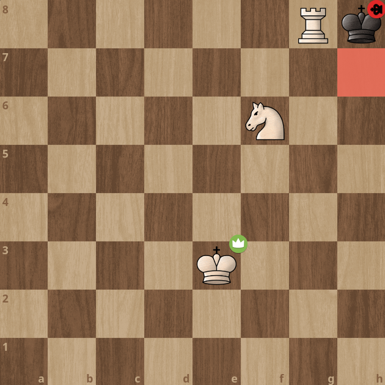
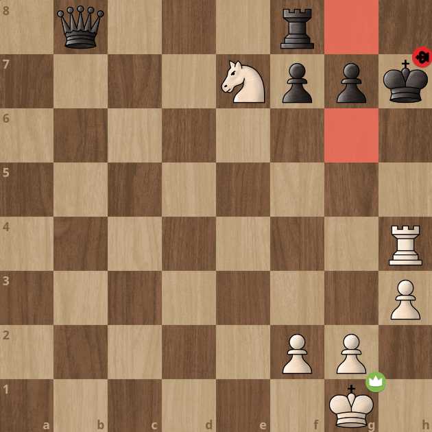
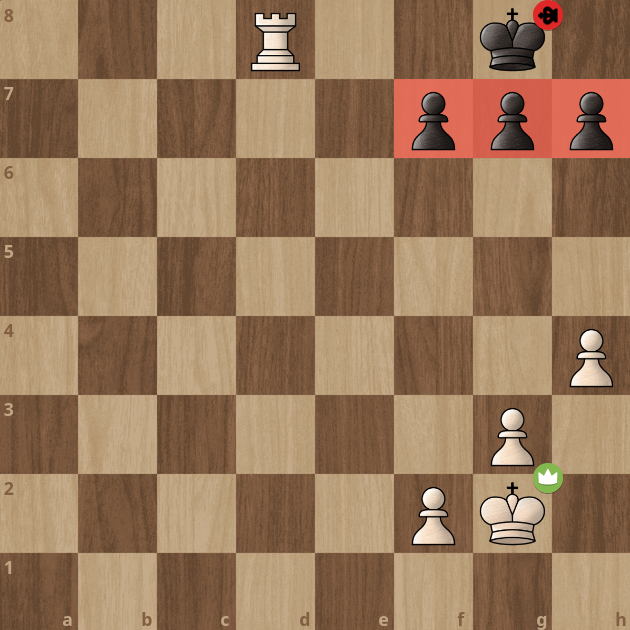
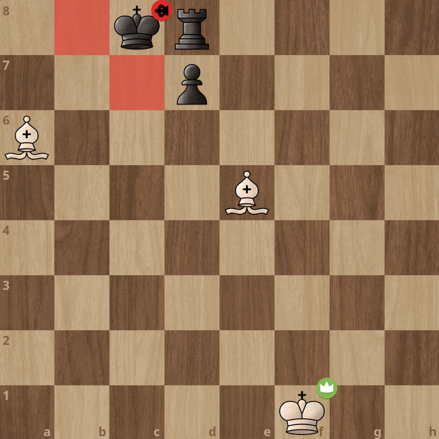

import ChessCom from '../../../components/chess/ChessCom.astro';

> Juara dunia catur ke-3, [Jose Raul Capablanca](https://www.chess.com/players/jose-raul-capablanca) pernah berkata, "***In order to improve your game, you must study the endgame before everything else.***"

## What is Checkmate Patterns?

Apa itu Pola Skakmat?

*Checkmate Patterns* atau Pola Skakmat adalah model yang dapat digunakan untuk melakukan skakmat pada lawan. Setiap pola memerlukan kombinasi bidak catur tertentu, baik kombinasi dari bidak kita sebagai penyerang, maupun memanfaatkan penempatan atau posisi bidak lawan. Semakin baik kita memahami pola skakmat, kita tidak hanya akan menjadi lebih baik dalam menyerang (melakukan skakmat), tetapi juga menjadi lebih baik dalam bertahan (menghindari skakmat).[^1] Ada banyak pola skakmat yang dapat dipelajari (sekurang-kurangnya ada 20 pola skakmat berdasarkan situs [chess.com](https://www.chess.com/terms/checkmate-chess)), tapi, biarkan saya mengulas salah empatnya di artikel ini: **Arabian Mate**,  **Anastasia's Mate**, **Back Rank Mate**, dan **Boden's Mate**. 

### Arabian Mate

Pola **Arabian Mate** tercapai melalui kombinasi sebuah Kuda dan Benteng, dimana Kuda berperan sebagai penjaga Benteng dan penghalang petak kabur Raja, sementara Benteng berperan sebagai perwira yang melakukan skakmat. Biasanya, pola skakmat ini terjadi di ujung papan.[^1]

:::info[Arabian Mate] 

1. Putih jalan, skakmat dengan **Arabian Mate**.

<ChessCom id="13242082" url="//www.chess.com/emboard?id=13242082"/>

2. Hitam jalan, skakmat dengan **Arabian Mate**.

<ChessCom id="13242092" url="//www.chess.com/emboard?id=13242092"/>

3. Hitam jalan, skakmat dengan **Arabian Mate**.

<ChessCom id="13242110" url="//www.chess.com/emboard?id=13242110"/>

:::

### Anastasia's Mate

Pola **Anastasia's Mate** tercapai melalui kombinasi sebuah Kuda dan Benteng, dimana Kuda dalam pola ini berperan menjaga 2 petak kabur raja dan Benteng berperan sebagai perwira yang melakukan skakmat. Biasanya pola ini terjadi ketika Raja lawan sudah rokade.[^1]

:::info[Anastasia's Mate] 

1. Hitam jalan, skakmat dengan **Anastasia's Mate**.

<ChessCom id="13242138" url="//www.chess.com/emboard?id=13242138"/>

2. Hitam jalan, skakmat dengan **Anastasia's Mate**.

<ChessCom id="13242158" url="//www.chess.com/emboard?id=13242158"/>

3. Hitam jalan, skakmat dengan **Anastasia's Mate**.

<ChessCom id="13242174" url="//www.chess.com/emboard?id=13242174"/>

:::

### Back Rank Mate

Pola **Back Rank Mate** tercapai jika Raja lawan yang berada di baris paling belakang, terkena skakmat oleh Benteng atau Menteri dan tidak bisa kabur karena terhalang oleh tembok pionnya sendiri.[^1]

:::info[Back Rank Mate] 

1. Putih jalan, skakmat dengan **Back Rank Mate**.

<ChessCom id="13242214" url="//www.chess.com/emboard?id=13242214"/>

2. Hitam jalan, skakmat dengan **Back Rank Mate**.

<ChessCom id="13242222" url="//www.chess.com/emboard?id=13242222"/>

3. Hitam jalan, skakmat dengan **Back Rank Mate**.

<ChessCom id="13242238" url="//www.chess.com/emboard?id=13242238"/>

:::

### Boden's Mate

Pola **Boden's Mate** tercapai melalui kombinasi dua Gajah, dimana Gajah yang satu melakukan pemblokiran pada petak kabur Raja, sementara Gajah yang lain melakukan skakmat. Pola skakmat ini juga memanfaatkan kondisi Benteng dan pion lawan (atau bidak lain) yang berada di sebelah Rajanya, sehingga menghalangi Raja untuk kabur.[^1]

:::info[Boden's Rank Mate] 

1. Putih jalan, skakmat dengan **Boden's Mate**.

<ChessCom id="13242278" url="//www.chess.com/emboard?id=13242278"/>

2. Putih jalan, skakmat dengan **Boden's Mate**.

<ChessCom id="13242292" url="//www.chess.com/emboard?id=13242292"/>

3. Hitam jalan, skakmat dengan **Boden's Mate**.

<ChessCom id="13242304" url="//www.chess.com/emboard?id=13242304"/>

:::

[^1]: https://www.chess.com/terms/checkmate-chess

