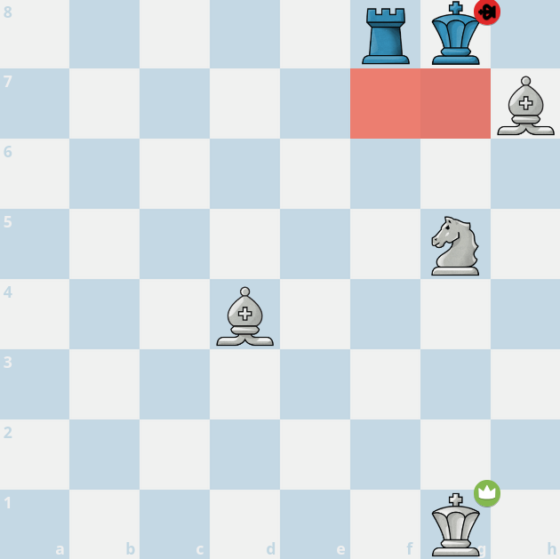
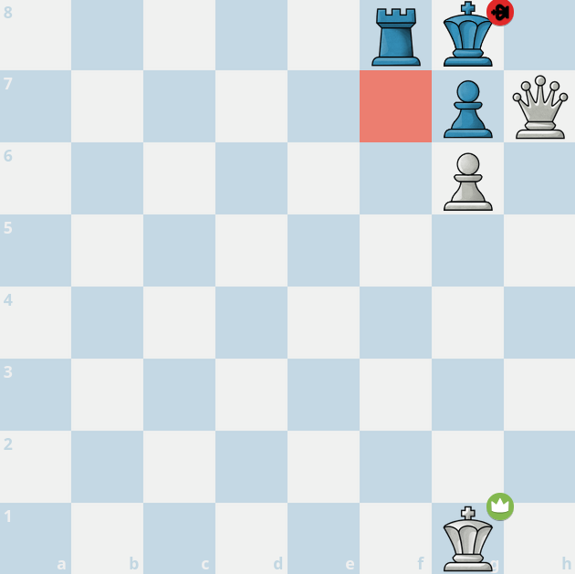
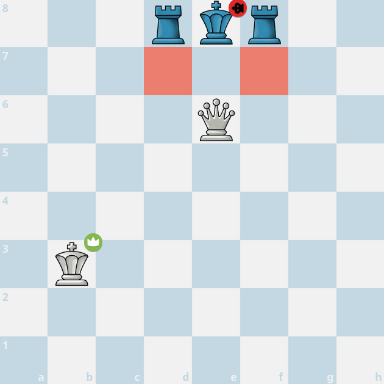
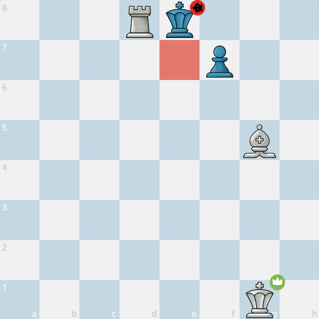

import ChessCom from '../../../components/chess/ChessCom.astro';

> Juara dunia catur ke-3, [Jose Raul Capablanca](https://www.chess.com/players/jose-raul-capablanca) pernah berkata, "***In order to improve your game, you must study the endgame before everything else.***"

## What is Checkmate Patterns?

Apa itu Pola Skakmat?

*Checkmate Patterns* atau Pola Skakmat adalah model yang dapat digunakan untuk melakukan skakmat pada lawan. Setiap pola memerlukan kombinasi bidak catur tertentu, baik kombinasi dari bidak kita sebagai penyerang, maupun memanfaatkan penempatan atau posisi bidak lawan. Semakin baik kita memahami pola skakmat, kita tidak hanya akan menjadi lebih baik dalam menyerang (melakukan skakmat), tetapi juga menjadi lebih baik dalam bertahan (menghindari skakmat).[^1] Ada banyak pola skakmat yang dapat dipelajari (sekurang-kurangnya ada 20 pola skakmat berdasarkan situs [chess.com](https://www.chess.com/terms/checkmate-chess)), tapi, biarkan saya mengulas salah empatnya di artikel ini: **Blackburne's Mate**, **Damiano's Mate**, **Epaulette Mate**, dan **Opera Mate**. 

### Blackburne's Mate

**Blackburne's Mate** terjadi melalui kombinasi Kuda dan Dua Gajah pada Raja lawan yang sudah rokade. Oleh karena itu, pola skakmat ini biasanya terjadi di pojok papan.[^1]

:::info[Blackburne's Mate] 

1. Hitam jalan, skakmat dengan **Blackburne's Mate**.

<ChessCom id="13243024" url="//www.chess.com/emboard?id=13243024"/>

2. Hitam jalan, skakmat dengan **Blackburne's Mate**.

<ChessCom id="13243040" url="//www.chess.com/emboard?id=13243040"/>

3. Hitam jalan, skakmat dengan **Blackburne's Mate**.

<ChessCom id="13243058" url="//www.chess.com/emboard?id=13243058"/>

:::

### Damiano's Mate

**Damiano's Mate** terjadi melalui kombinasi Menteri dan sebuah Pion atau Gajah.[^1]

:::info[Damiano's Mate] 

1. Hitam jalan, skakmat dengan **Damiano's Mate**.

<ChessCom id="13243122" url="//www.chess.com/emboard?id=13243122"/>

2. Putih jalan, skakmat dengan **Damiano's Mate**.

<ChessCom id="13243138" url="//www.chess.com/emboard?id=13243138"/>

3. Hitam jalan, skakmat dengan **Damiano's Mate**.

<ChessCom id="13243176" url="//www.chess.com/emboard?id=13243176"/>

:::

### Epaulette Mate

**Epaulette Mate** terjadi jika Raja lawan diapit oleh dua perwiranya di sebelah kanan dan kirinya, kemudian Menteri melakukan skakmat persis di depan Raja. Istilah "Epaulette" berasal dari Perancis yang berarti "tanda pangkat" yang dikenakan di bahu, terutama pada seragam militer. Pola skakmat ini disebut "Epaulette" karena menyerupai tanda pangkat tersebut.[^1]

:::info[Epaulette Mate] 

1. Putih jalan, skakmat dengan **Epaulette Mate**.

<ChessCom id="13243222" url="//www.chess.com/emboard?id=13243222"/>

2. Putih jalan, skakmat dengan **Epaulette Mate**.

<ChessCom id="13243246" url="//www.chess.com/emboard?id=13243246"/>

3. Putih jalan, skakmat dengan **Epaulette Mate**.

<ChessCom id="13243260" url="//www.chess.com/emboard?id=13243260"/>

:::

### Opera Mate

**Opera Mate** terjadi melalui kombinasi sebuah Gajah dan Benteng, dimana Gajah berperan untuk menjaga petak kabur Raja lawan sekaligus menjaga Benteng, sementara Benteng melakukan skakmat. Pola skakmat ini disebut sebagai "Opera Mate" karena dulu, skakmat ini dimainkan oleh [Paul Morphy](https://en.wikipedia.org/wiki/Opera_Game) di Opera.[^1]

:::info[Opera Mate] 

1. Hitam jalan, skakmat dengan **Opera Mate**.

<ChessCom id="13243398" url="//www.chess.com/emboard?id=13243398"/>

2. Hitam jalan, skakmat dengan **Opera Mate**.

<ChessCom id="13243422" url="//www.chess.com/emboard?id=13243422"/>

3. Putih jalan, skakmat dengan **Opera Mate**.

<ChessCom id="13243436" url="//www.chess.com/emboard?id=13243436"/>

:::

[^1]: https://www.chess.com/terms/checkmate-chess