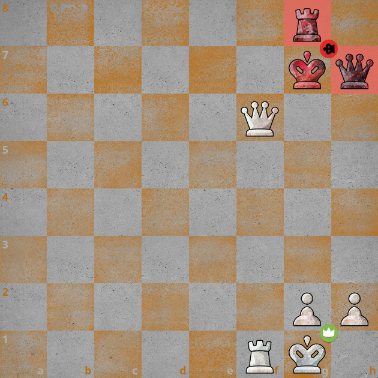
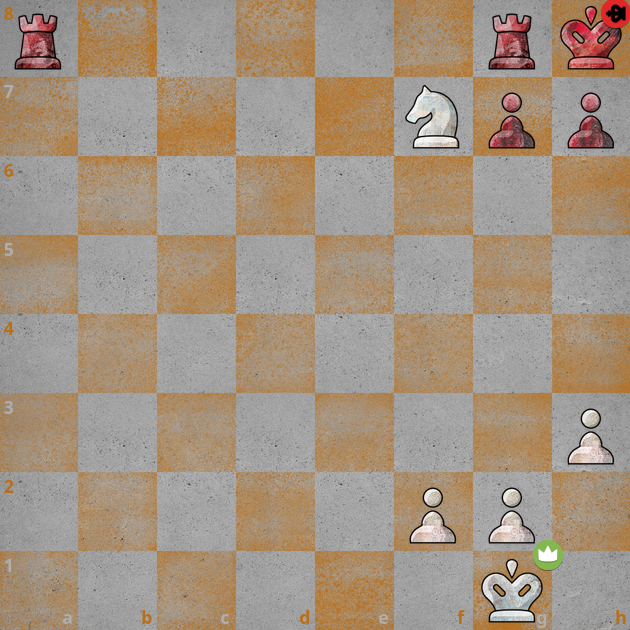
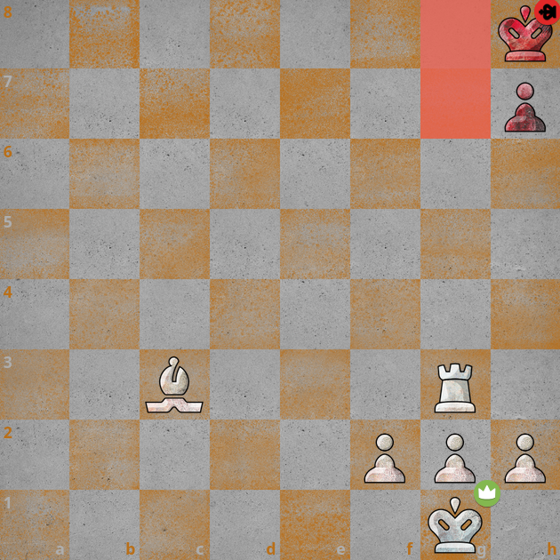
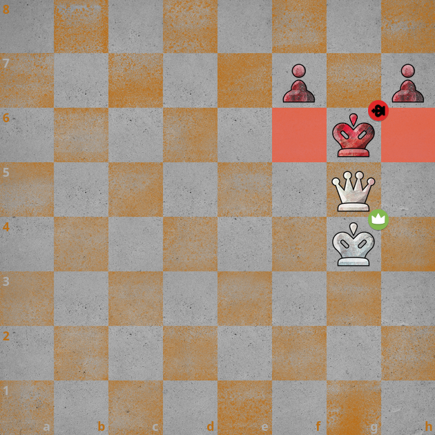

import ChessCom from '../../../components/chess/ChessCom.astro';

> Juara dunia catur ke-3, [Jose Raul Capablanca](https://www.chess.com/players/jose-raul-capablanca) pernah berkata, "***In order to improve your game, you must study the endgame before everything else.***"

## What is Checkmate Patterns?

Apa itu Pola Skakmat? 

*Checkmate Patterns* atau Pola Skakmat adalah model yang dapat digunakan untuk melakukan skakmat pada lawan. Setiap pola memerlukan kombinasi bidak catur tertentu, baik kombinasi dari bidak kita sebagai penyerang, maupun memanfaatkan penempatan atau posisi bidak lawan. Semakin baik kita memahami pola skakmat, kita tidak hanya akan menjadi lebih baik dalam menyerang (melakukan skakmat), tetapi juga menjadi lebih baik dalam bertahan (menghindari skakmat).[^1] Ada banyak pola skakmat yang dapat dipelajari (sekurang-kurangnya ada 20 pola skakmat berdasarkan situs [chess.com](https://www.chess.com/terms/checkmate-chess)), tapi, biarkan saya mengulas salah empatnya di artikel ini: **Dovetail Mate**, **Smothered Mate**, **Morphy's Mate**, dan **Swallow's Tail Mate**.

### Dovetail Mate

**Dovetail Mate** atau yang juga dikenal sebagai Cozio's Mate (seorang pecatur Italia di abad 18 yang "menemukannya"), terjadi ketika Menteri melakukan skakmat pada Raja lawan yang tidak dapat kabur karena terhalang oleh buah caturnya sendiri. Skakmat ini dinamakan _"dovetail"_ karena polanya yang mirip dengan bentuk ekor merpati.[^1]

:::info[Dovetail Mate] 

1. Putih jalan, skakmat dengan **Dovetail Mate**.

<ChessCom id="13313822" url="//www.chess.com/emboard?id=13313822"/>

2. Hitam jalan, skakmat dengan **Dovetail Mate**.

<ChessCom id="13313846" url="//www.chess.com/emboard?id=13313846"/>

3. Putih jalan, skakmat dengan **Dovetail Mate**.

<ChessCom id="13313856" url="//www.chess.com/emboard?id=13313856"/>

:::

### Smothered Mate

**Smothered Mate** terjadi ketika Kuda melakukan skak dengan memanfaatkan kondisi Raja lawan yang tidak memiliki ruang pelarian. Biasanya, _smothered mate_ terjadi di pojok papan catur. Oleh karena Raja tidak memiliki ruang bergerak, maka skakmat ini dinamakan skakmat _"smothered"_. [^1]

:::info[Smothered Mate] 

1. Putih jalan, skakmat dengan **Smothered Mate**.

<ChessCom id="13313886" url="//www.chess.com/emboard?id=13313886"/>

2. Putih jalan, skakmat dengan **Smothered Mate**.

<ChessCom id="13313894" url="//www.chess.com/emboard?id=13313894"/>

3. Putih jalan, skakmat dengan **Smothered Mate**.

<ChessCom id="13313902" url="//www.chess.com/emboard?id=13313902"/>

:::

### Morphy's Mate

**Morphy's Mate** adalah skakmat dengan kombinasi Benteng dan Gajah, dimana Benteng menghlangi petak kabur Raja lawan, sementara Gajah melakukan skakmat. Penamaan skakmat ini tentu diinspirasi dari [Paul Morphy](https://www.chess.com/players/paul-morphy), seorang pecatur Amerika dan dianggap sebagai juara dunia tidak resmi. [^1]

:::info[Morphy's Mate] 

1. Putih jalan, skakmat dengan **Morphy's Mate**.

<ChessCom id="13313932" url="//www.chess.com/emboard?id=13313932"/>

2. Putih jalan, skakmat dengan **Morphy's Mate**.

<ChessCom id="13313942" url="//www.chess.com/emboard?id=13313942"/>

3. Putih jalan, skakmat dengan **Morphy's Mate**.

<ChessCom id="13313956" url="//www.chess.com/emboard?id=13313956"/>

:::

### Swallow Tail Mate

**Swallow Tail Mate** atau Guerion Mate adalah skakmat dengan pola bentuk huruf V sehingga menyerupai ekor burung walet. Skakmat ini sendiri dilakukan oleh Menteri yang didukung oleh buah catur yang lain.[^1] Pola skakmat ini mirip, namun tidak sama, dengan pola **"Epaulette Checkmate"**, yang juga sudah saya ulas di artikel berikut ini:

[[/chess/checkmate2/]]

:::info[Swallow Tail Mate] 

1. Putih jalan, skakmat dengan **Swallow Tail Mate**.

<ChessCom id="13313988" url="//www.chess.com/emboard?id=13313988"/>

2. Putih jalan, skakmat dengan **Swallow Tail Mate**.

<ChessCom id="13314014" url="//www.chess.com/emboard?id=13314014"/>

3. Putih jalan, skakmat dengan **Swallow Tail Mate**.

<ChessCom id="13314058" url="//www.chess.com/emboard?id=13314058"/>

:::

[^1]: https://www.chess.com/terms/checkmate-chess