import ChessCom from '../../../components/chess/ChessCom.astro';

> Seorang master catur Jerman kelahiran tahun 1868, [Richard Teichmann](https://chesspuzzle.net/Player/Richard_Teichmann) pernah berkata, "***chess is 99% tactics***".

## What is Chess Tactics?

Apa itu taktik catur?  
Pada dasarnya, taktik catur adalah gerakan / langkah (atau serangkaian langkah) yang memberikan keuntungan bagi pemainnya. Keuntungan yang dimaksud dapat berupa keuntungan material, yaitu dengan memenangkan buah catur, atau bahkan skakmat.[^1] Ada banyak taktik yang dapat dipelajari dan digunakan dalam bermain catur, tapi biarkan saya mengulas salah tiga taktik catur yang paling populer, yaitu **Fork**, **Pin**, dan **Skewer**.

### Fork

Sebagaimana namanya, ***Fork*** atau serangan garpuan adalah salah satu taktik catur dengan menyerang dua buah catur sekaligus dengan satu buah catur. Pihak lawan yang terkena taktik ***fork*** biasanya akan kesulitan untuk mempertahankan kedua buah catur yang terserang sehingga pihak penyerang akan mendapatkan salah satu buah catur yang terkena ***fork*** tersebut. 
Serangan ***fork*** pada Raja dan Menteri juga biasa disebut sebagai ***Royal Fork***. 

Berikut adalah contoh taktik *fork*:

[grid]
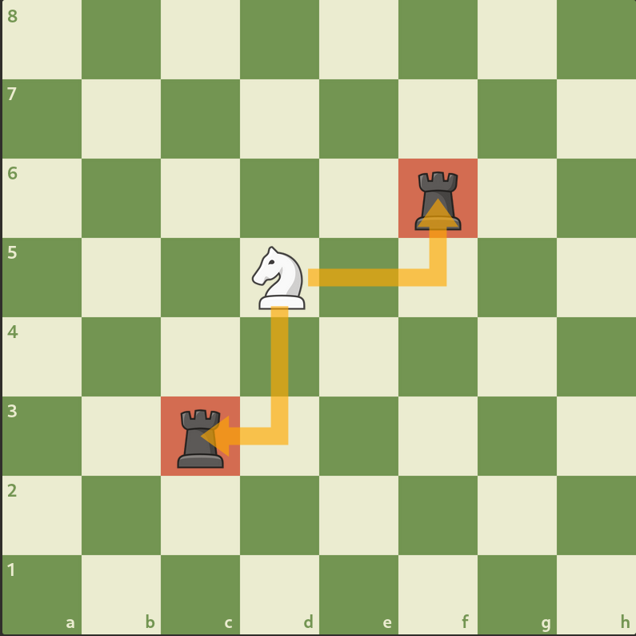
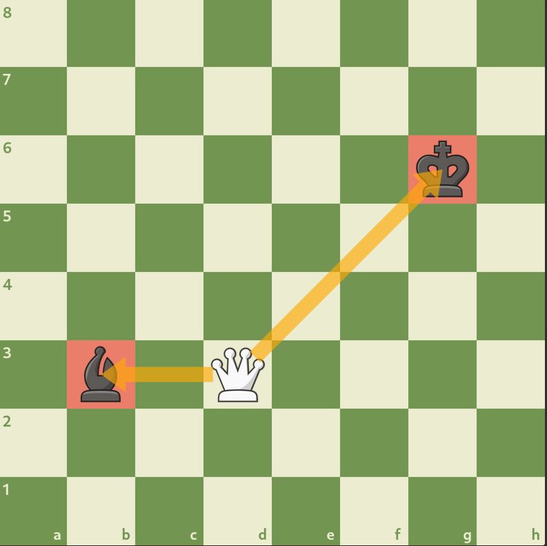
[/grid]

[grid]
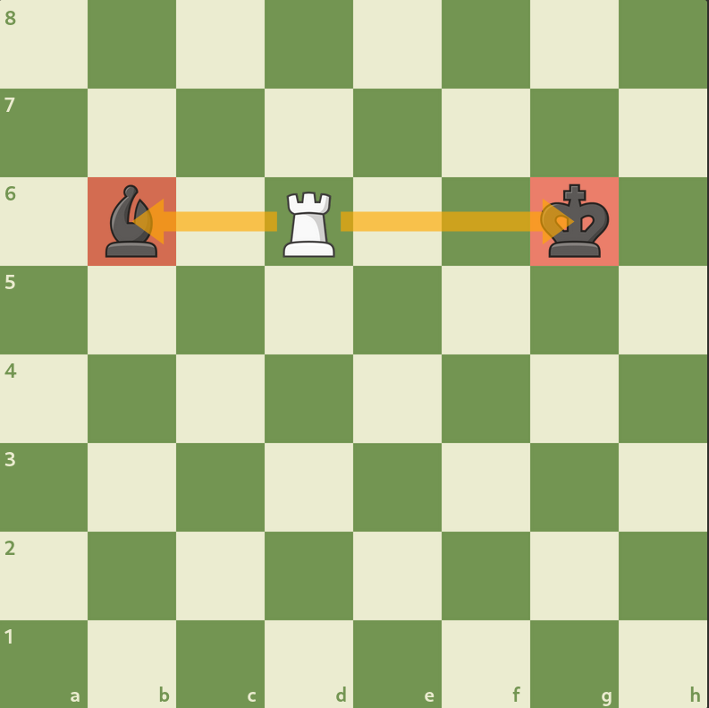
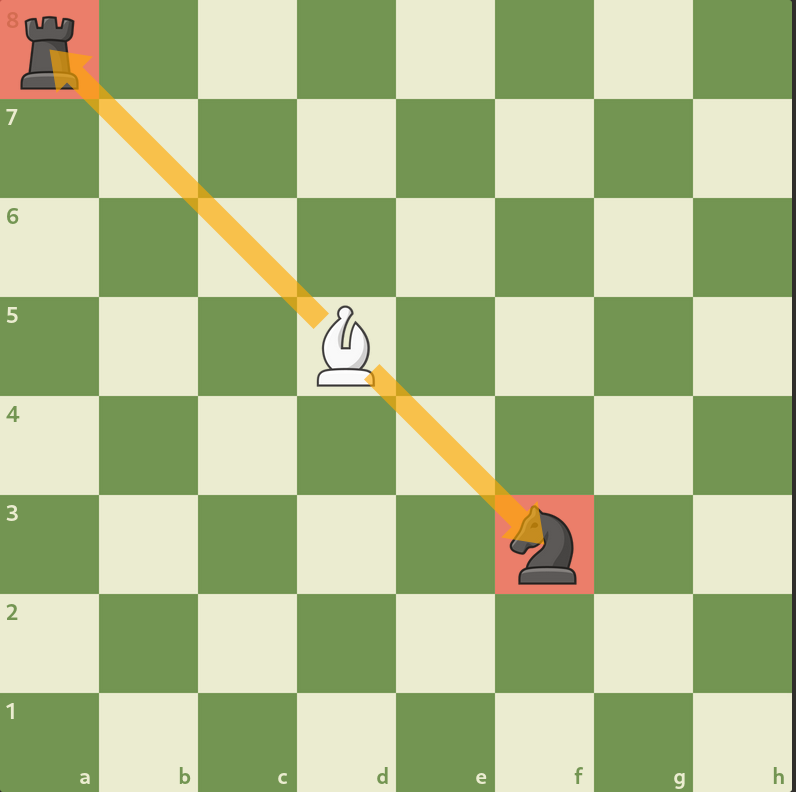
[/grid]

[grid]
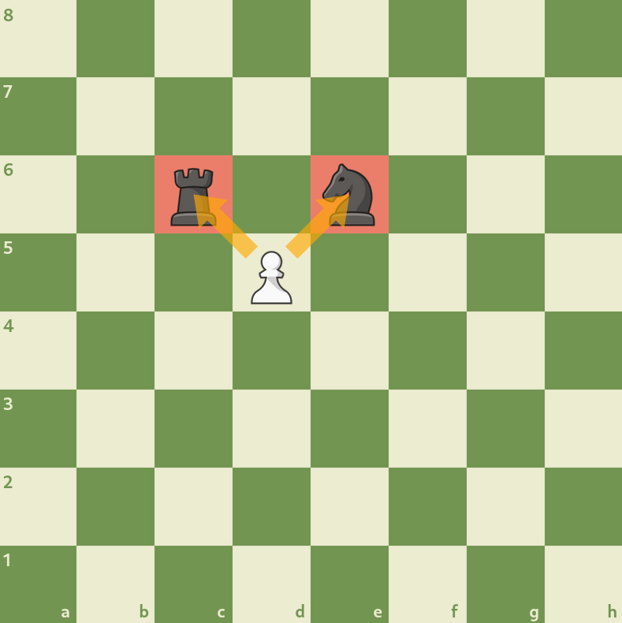
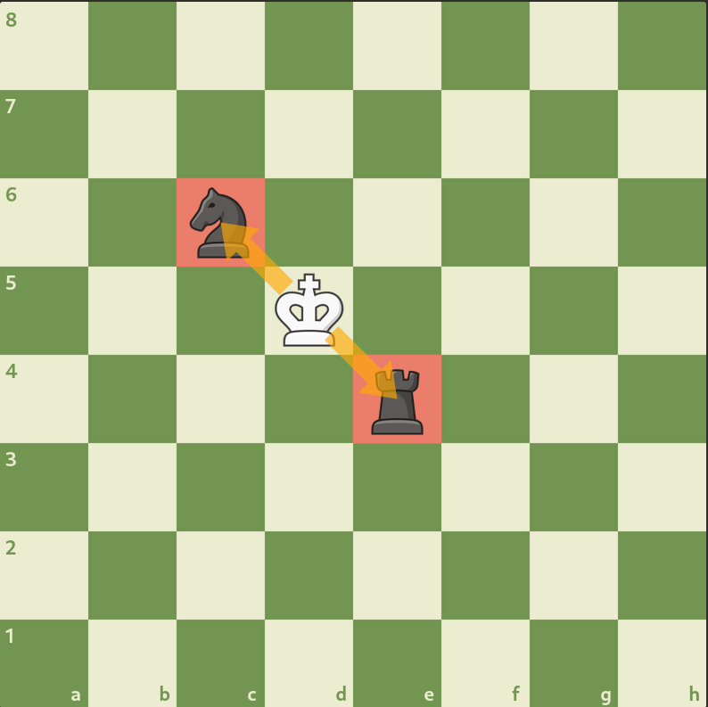
[/grid]

:::tip 

Kalau gambar terlalu kecil, silakan tampilkan gambar di tab baru dengan cara **klik kanan pada gambar, lalu pilih "open image in new tab"**

:::

<iframe width="100%" height="468"
  src="https://www.youtube.com/embed/mgAbXPBeVEI"
  frameborder="0" allowfullscreen>
</iframe>

:::info[Fork Puzzle] 

1. Putih jalan, ***royal fork***, dan mendapatkan Menteri.

<ChessCom id="12081181" url="//www.chess.com/emboard?id=12081181"/>

2. Putih jalan dan mendapatkan Kuda.

<ChessCom id="12081199" url="//www.chess.com/emboard?id=12081199"/>

3. Hitam jalan dan mendapatkan Kuda.

<ChessCom id="12081217" url="//www.chess.com/emboard?id=12081217"/>

:::

### Pin

Juga seperti namanya, taktik ***Pin*** adalah teknik catur yang digunakan untuk memberikan pin pada buah catur yang sedang melindungi buah catur lain yang lebih tinggi nilainya sehingga tidak boleh berpindah kecuali dia akan kehilangan buah catur yang lebih bernilai.
Teknik ***pinning*** ini hanya dapat dilakukan oleh perwira yang memiliki jarak serang jauh seperti Menteri, Benteng, dan Gajah. Taktik **pin** yang absolut dapat terjadi jika buah catur yang di-***pin*** melindungi Raja sehingga buah catur tersebut tidak bisa bergerak.

Berikut adalah contoh taktik ***pin***:

[grid]
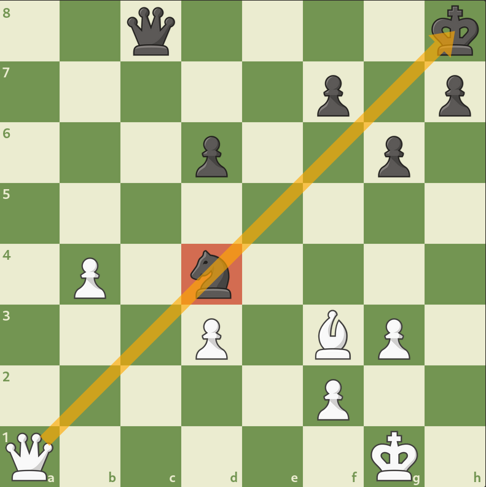
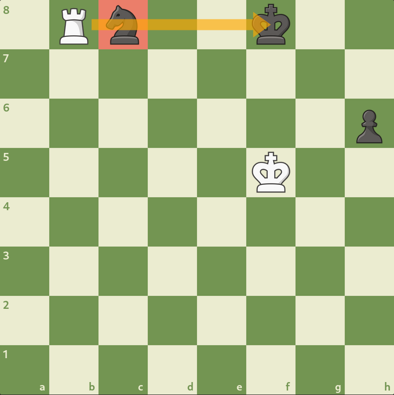
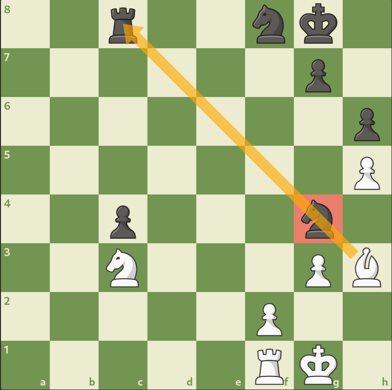
[/grid]

<iframe width="100%" height="468"
  src="https://www.youtube.com/embed/sjpKC9SMvKs"
  frameborder="0" allowfullscreen>
</iframe>

:::info[Pin Puzzle]

1. Putih jalan dan mendapatkan Gajah.

<ChessCom id="12081601" url="//www.chess.com/emboard?id=12081601"/>

2. Putih jalan dan mendapatkan Menteri.

<ChessCom id="12081607" url="//www.chess.com/emboard?id=12081607"/>

3. Putih jalan dan mendapatkan Benteng.

<ChessCom id="12081615" url="//www.chess.com/emboard?id=12081615"/>

:::

### Skewer

Kebalikan dari pin, taktik ***Skewer*** menyerang buah catur yang lebih bernilai sehingga memaksanya untuk berpindah dan menyerahkan buah catur yang nilainya lebih rendah yang ada di belakangnya. Jadi, taktik ***skewer*** ini pada dasarnya mirip dengan  taktik pin, perbedaannya hanya pada urutan buah catur yang diserang. Jika pada taktik pin, buah catur yang berada di depan adalah buah catur yang memiliki nilai lebih rendah sehingga tidak boleh bergerak demi melindungi buah catur yang nilainya lebih tinggi di belakangnya, maka pada taktik skewer, buah catur yang berada di depan adalah buah catur yang memiliki nilai lebih tinggi sehingga harus bergerak/berpindah dan rela kehilangan buah catur di belakangnya yang nilainya lebih rendah. Oleh karena itu, taktik skewer biasanya juga dilakukan oleh perwira dengan jarak serang jauh seperti Menteri, Benteng, dan Gajah.

Berikut adalah contoh taktik ***skewer***:

[grid]
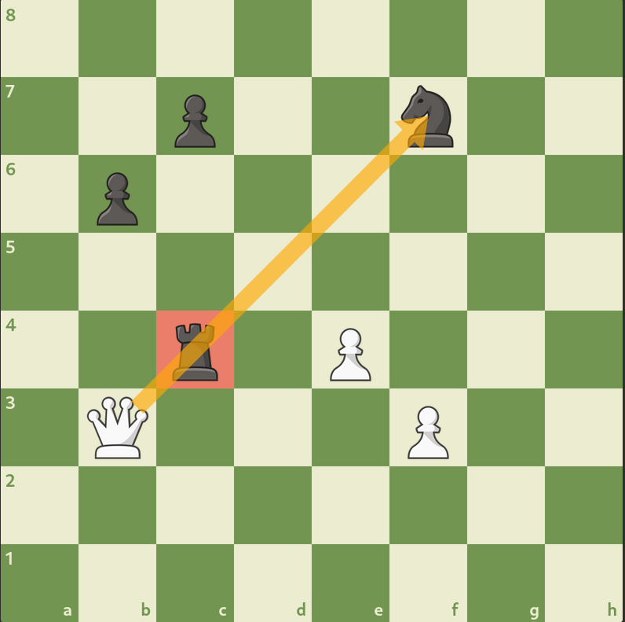
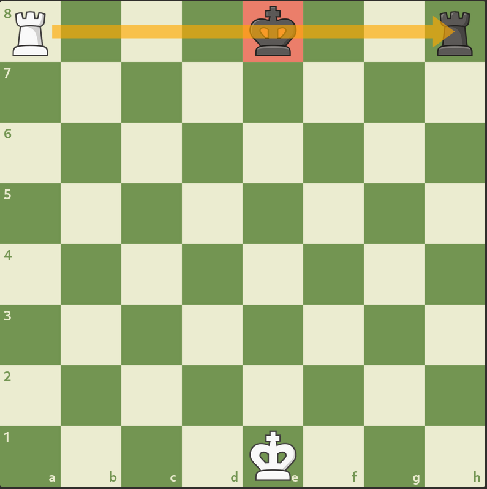
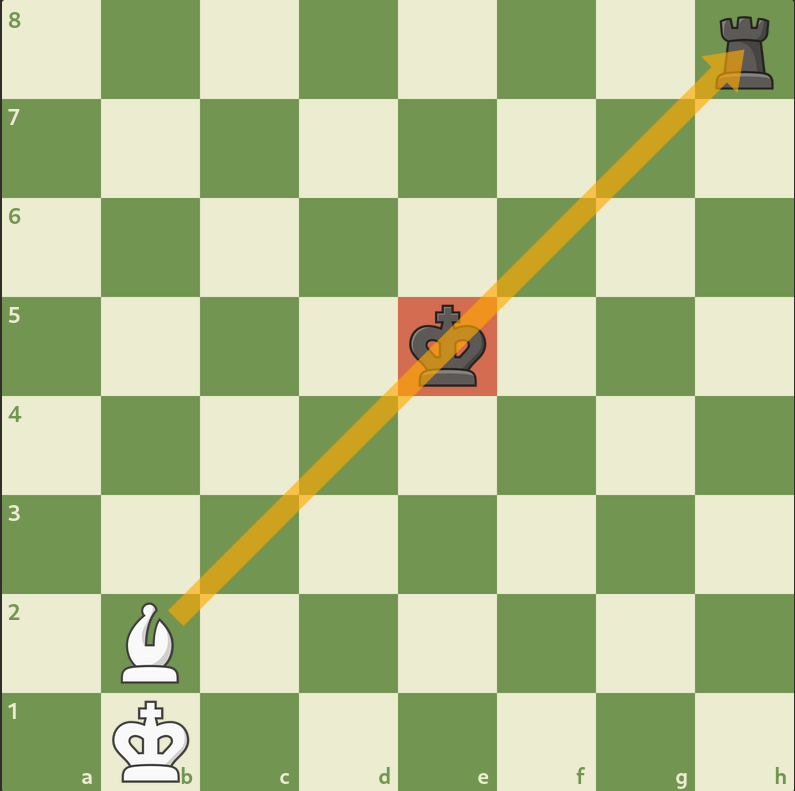
[/grid]

<iframe width="100%" height="468"
  src="https://www.youtube.com/embed/2KlDixnZMhM"
  frameborder="0" allowfullscreen>
</iframe>

:::info[Skewer Puzzle]

1. Putih jalan dan mendapatkan Gajah.

<ChessCom id="12081783" url="//www.chess.com/emboard?id=12081783"/>

2. Putih jalan dan mendapatkan Benteng.

<ChessCom id="12081799" url="//www.chess.com/emboard?id=12081799"/>

3. Putih jalan dan mendapatkan Kuda.

<ChessCom id="12081805" url="//www.chess.com/emboard?id=12081805"/>

:::

[^1]: https://www.chess.com/article/view/chess-tactics#endgametactic