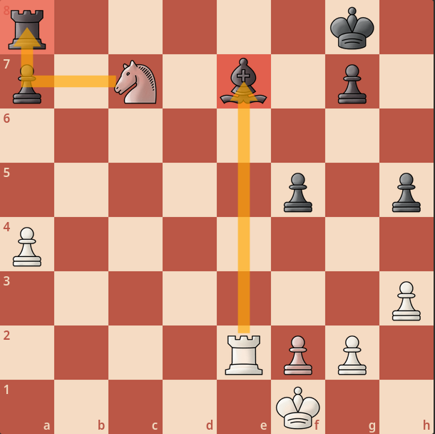
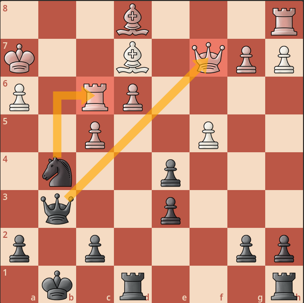
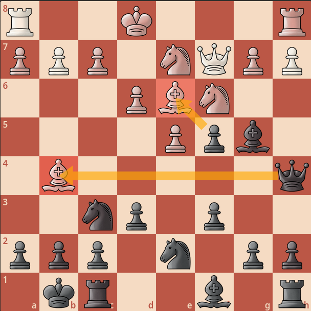
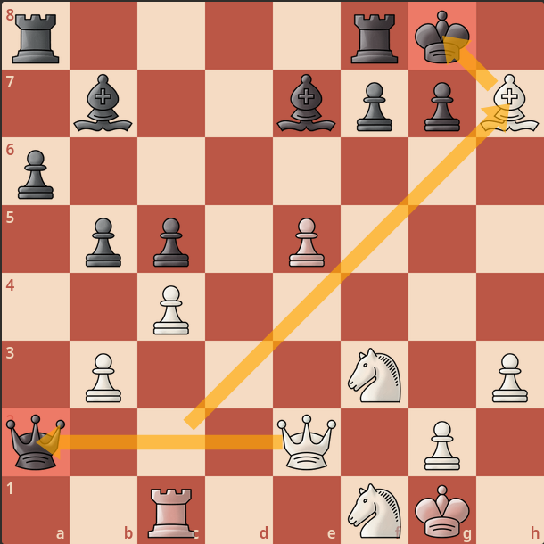
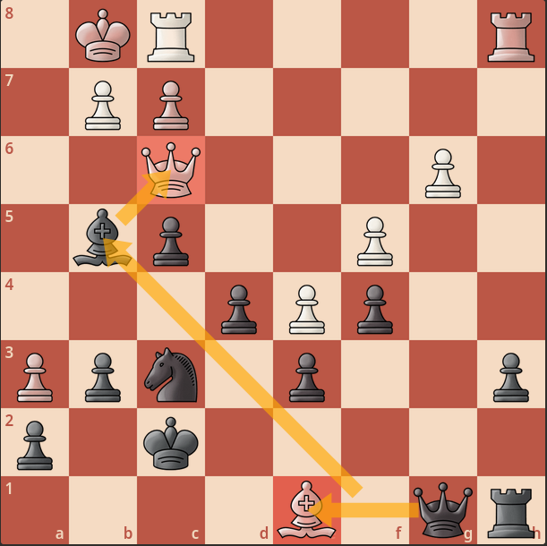
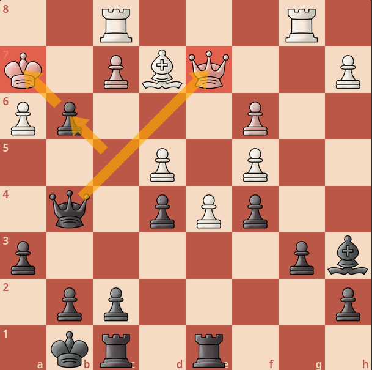
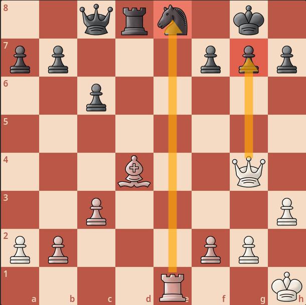
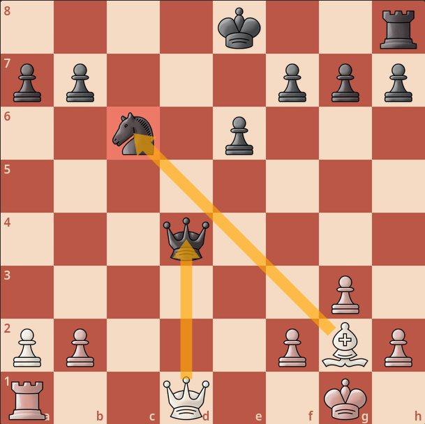
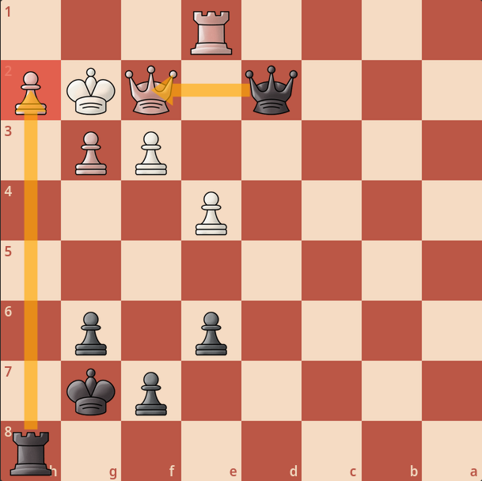

import ChessCom from '../../../components/chess/ChessCom.astro';

> Seorang master catur Jerman kelahiran tahun 1868, [Richard Teichmann](https://chesspuzzle.net/Player/Richard_Teichmann) pernah berkata, "***chess is 99% tactics***".

## What is Chess Tactics?

Apa itu taktik catur?  
Pada dasarnya, taktik catur adalah gerakan / langkah (atau serangkaian langkah) yang memberikan keuntungan bagi pemainnya. Keuntungan yang dimaksud dapat berupa keuntungan material, yaitu dengan memenangkan buah catur, atau bahkan skakmat.[^1] Ada banyak taktik yang dapat dipelajari dan digunakan dalam bermain catur, tapi biarkan saya mengulas salah tiga diantaranya, yaitu **Double Attack** , **Discovered Attack**, dan **Removing The Defender**.

### Double Attack

Serangan ***double attack*** atau serangan ganda terjadi ketika dua atau lebih buah catur kita memberikan dua ancaman sekaligus dalam satu langkah.[^2] ***Double attack*** juga banyak disamakan dengan taktik ***fork***. Meskipun demikian, menurut saya, ada perbedaan antara taktik ***double attack*** dan ***fork***. Perbebaannya terletak pada buah catur yang melakukan serangan ganda. Jika di ***fork*** hanya 1 buah catur saja yang melakukan serangan ganda, maka di ***double attack*** ada 2 buah catur yang melakukan serangan atau ancaman ganda. Meskipun demikian, terkadang, taktik ***double attack*** juga melibatkan taktik lainnya seperti ***fork***, ***pin***, dan ***discovered attack*** dalam serangannya.

:::note

Saya sudah pernah membahas taktik ***fork*** atau garpuan di tautan berikut:  

[[/chess/pop-tactics/]] 

:::

Berikut adalah contoh taktik ***double attack***:

[grid]

[/grid]

<iframe width="100%" height="468"
  src="https://www.youtube.com/embed/_2CBlNGLwUw"
  frameborder="0" allowfullscreen>
</iframe>

:::info[Double Attack Puzzle] 

1. Putih jalan dan memenangkan Benteng.

<ChessCom id="12392899" url="//www.chess.com/emboard?id=12392899"/>

2. Putih jalan dan memenangkan Menteri.

<ChessCom id="12392917" url="//www.chess.com/emboard?id=12392917"/>

3. Putih jalan, memenangkan Benteng, dan skakmat.

<ChessCom id="12392941" url="//www.chess.com/emboard?id=12392941"/>

:::

### Discovered Attack

Serangan ***discoverd attack*** atau terkadang juga disebut serangan ***discovery*** oleh beberapa orang (Indonesia) terjadi ketika kita menggerakan buah catur yang berakibat pada munculnya ancaman dari bidak catur lain yang berada di belakangnya. Taktik ini juga beririsan dengan taktik ***double attack*** karena umumnya taktik ***discovered attack*** dilakukan berbarengan dengan ***double attack***.

Berikut adalah contoh taktik ***discoverd attack***:

[grid]

[/grid]

<iframe width="100%" height="468"
  src="https://www.youtube.com/embed/dpuK-ft7yPI"
  frameborder="0" allowfullscreen>
</iframe>

:::info[Discovered Attack Puzzle] 

1. Putih jalan dan memenangkan Benteng.

<ChessCom id="12392965" url="//www.chess.com/emboard?id=12392965"/>

2. Putih jalan dan memenangkan Menteri.

<ChessCom id="12393081" url="//www.chess.com/emboard?id=12393081"/>

3. Putih jalan, memenangkan Benteng, dan skakmat.

<ChessCom id="12393093" url="//www.chess.com/emboard?id=12393093"/>

:::

### Removing The Guard / Defender

Seperti namanya, ***removing the guard*** adalah taktik untuk menghilangkan buah catur yang menjaga buah catur lainnya untuk mendapatkan keuntungan, baik keuntungan material atau bahkan skakmat[^1]. Sesederhana itu. Terkadang, taktik ini juga sering disamakan dengan taktik ***Deflection***, meskipun menurut saya taktik ***removing the guard*** memiliki perbedaan dengan taktik ***deflection***. Tapi, kita akan bahas ***deflection*** di artikel yang lain. Sekarang, mari kita langsung ke contoh taktik ***removing the guard*** saja...

Berikut adalah contoh taktik ***removing the guard***:

[grid]

[/grid]

<iframe width="100%" height="468"
  src="https://www.youtube.com/embed/hoNzyPVHgOo"
  frameborder="0" allowfullscreen>
</iframe>

:::info[Removing The Defender Puzzle] 

1. Putih jalan dan memenangkan Benteng.

<ChessCom id="12393169" url="//www.chess.com/emboard?id=12393169"/>

2. Putih jalan dan memenangkan Menteri.

<ChessCom id="12393195" url="//www.chess.com/emboard?id=12393195"/>

3. Putih jalan, memenangkan Benteng, dan skakmat.

<ChessCom id="12393223" url="//www.chess.com/emboard?id=12393223"/>

:::

[^1]: https://www.chess.com/article/view/chess-tactics#endgametactic
[^2]: https://chessfox.com/chess-tactics-list/

