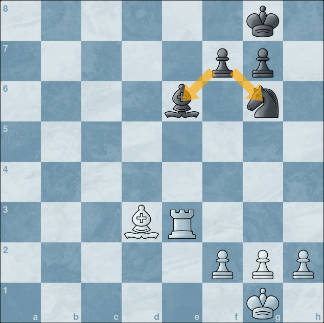
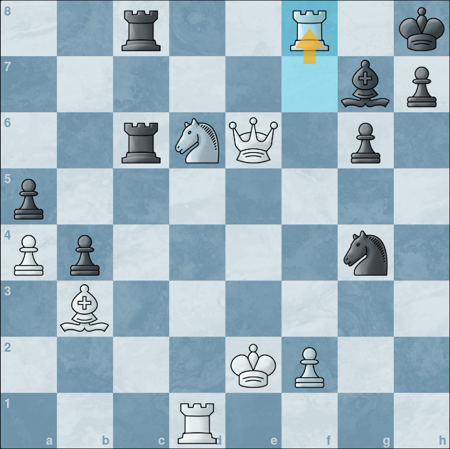
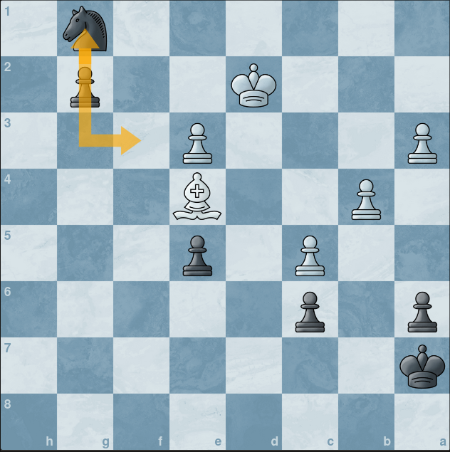
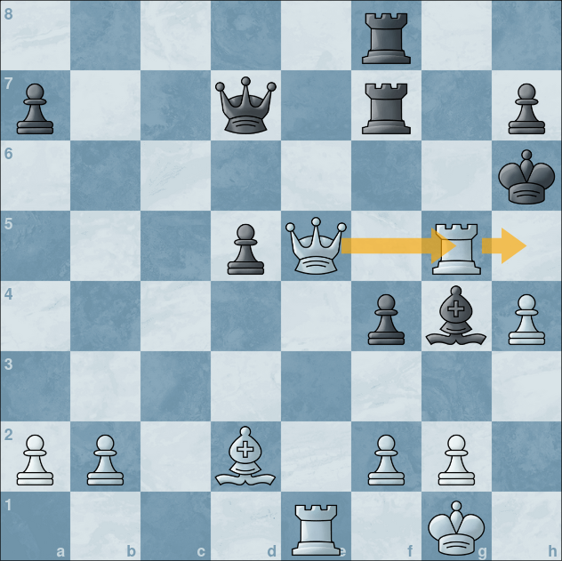
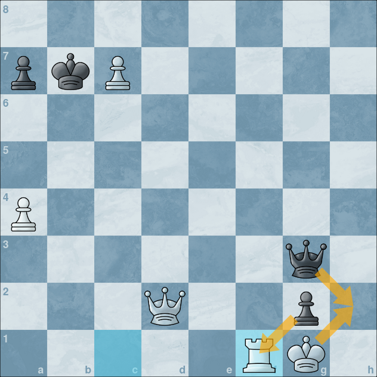
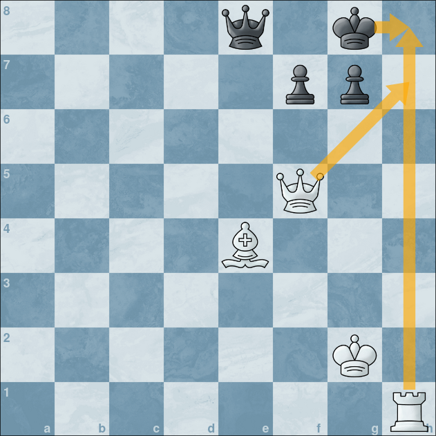
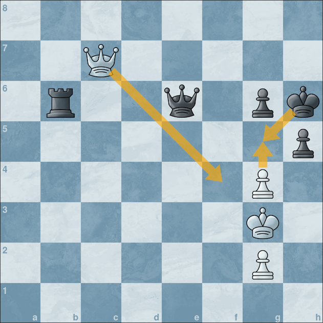

import ChessCom from '../../../components/chess/ChessCom.astro';

> Seorang master catur Jerman kelahiran tahun 1868, [Richard Teichmann](https://chesspuzzle.net/Player/Richard_Teichmann) pernah berkata, "***chess is 99% tactics***".

## What is Chess Tactics?

Apa itu taktik catur?  
Pada dasarnya, taktik catur adalah gerakan / langkah (atau serangkaian langkah) yang memberikan keuntungan bagipemainnya. Keuntungan yang dimaksud dapat berupa keuntungan material, yaitu dengan memenangkan buah catur, ataubahkan skakmat.[^1] Ada banyak taktik yang dapat dipelajari dan digunakan dalam bermain catur, tapi biarkan saya mengulas salah tiga diantaranya, yaitu <mark>**Overloading** </mark>, <mark> **Clearance** </mark>,dan <mark> **Decoy or Deflection** </mark>.

### Overloading

***Overloading*** adalah taktik yang memanfaatkan kelemahan buah catur lawan (umumnya perwira) yang sedang mengalami ***overloading*** karena harus menjaga banyak hal sekaligus. Dengan memanfaatkan kelemahan ini, kita bisa mendapatkan keunggulan material.

Berikut adalah contoh taktik *overloading*:

[grid]

[/grid]

<iframe width="100%" height="468"
  src="https://www.youtube.com/embed/oQQPRaSO9Eg"
  frameborder="0" allowfullscreen>
</iframe>

:::info[Overloading Puzzle] 

1. Putih jalan dan unggul satu perwira.

<ChessCom id="13034283" url="//www.chess.com/emboard?id=13034283"/>

2. Putih jalan dan unggul satu perwira.

<ChessCom id="13034321" url="//www.chess.com/emboard?id=13034321"/>

3. Hitam jalan dan unggul satu perwira.

<ChessCom id="13034329" url="//www.chess.com/emboard?id=13034329"/>

:::

### Clearance 

Clearance sacrifice atau yang biasa disebut **Clearance** adalah taktik pengorbanan buah catur untuk membuka jalan/lajur/file bagi buah catur lainnya sehingga mendapatkan keuntungan yang lebih besar dari pengorbanan sebelumnya. 

Berikut adalah contoh taktik *clearance*:

[grid]

[/grid]

<iframe width="100%" height="468"
  src="https://www.youtube.com/embed/uz-CpSlUEbY"
  frameborder="0" allowfullscreen>
</iframe>

:::info[Clearance Puzzle] 

1. Putih jalan dan unggul satu perwira.

<ChessCom id="13038103" url="//www.chess.com/emboard?id=13038103"/>

2. Putih jalan dan unggul satu perwira.

<ChessCom id="13038109" url="//www.chess.com/emboard?id=13038109"/>

3. Hitam jalan dan unggul satu perwira.

<ChessCom id="13038129" url="//www.chess.com/emboard?id=13038129"/>

:::

### Decoy/Deflection

**Decoy/Deflection** dilakukan untuk mengecoh dan mendistraksi buah catur lawan yang sedang melakukan tugasnya, seperti menjaga petak penting, menutup file yang terbuka, atau sedang melakukan *pinning*. Taktik ini umumnya juga melibatkan pengorbanan buah catur atau memaksa lawan untuk menggerakkan buah caturnya sesuai dengan keinginan atau tujuan kita.

Berikut adalah contoh taktik *decoy/deflection*:

[grid]

[/grid]

<iframe width="100%" height="468"
  src="https://www.youtube.com/embed/UdI2WjxGQU4"
  frameborder="0" allowfullscreen>
</iframe>

:::info[Decoy/Deflection Puzzle] 

1. Putih jalan dan unggul kualitas.

<ChessCom id="13038211" url="//www.chess.com/emboard?id=13038211"/>

2. Putih jalan dan unggul kualitas.

<ChessCom id="13038223" url="//www.chess.com/emboard?id=13038223"/>

3. Hitam jalan dan skakmat.

<ChessCom id="13038237" url="//www.chess.com/emboard?id=13038237"/>

:::

 