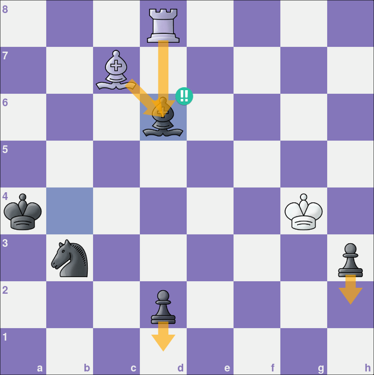
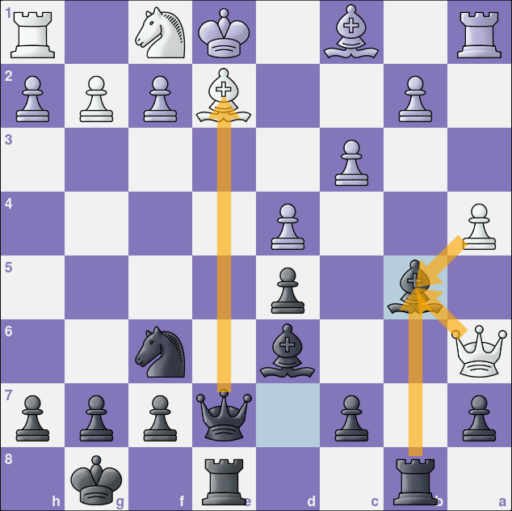
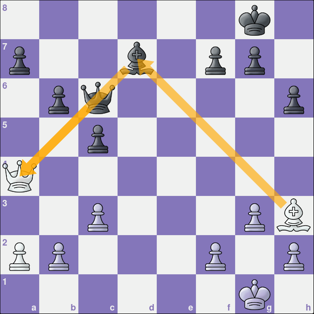
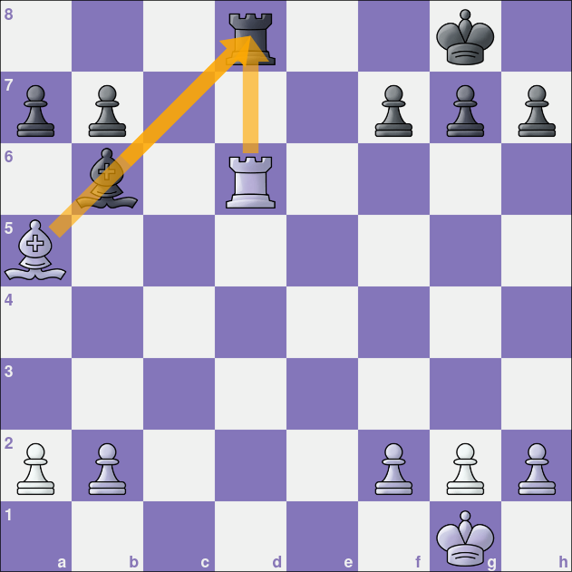
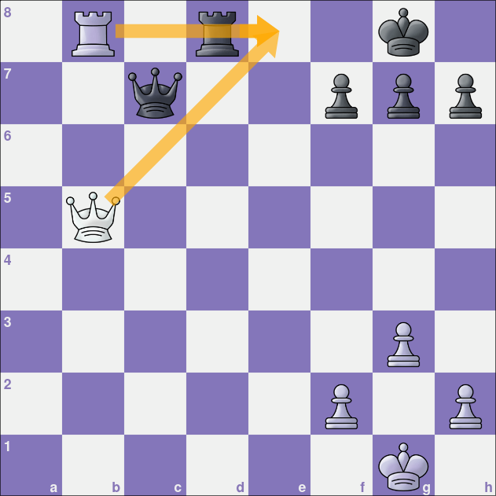
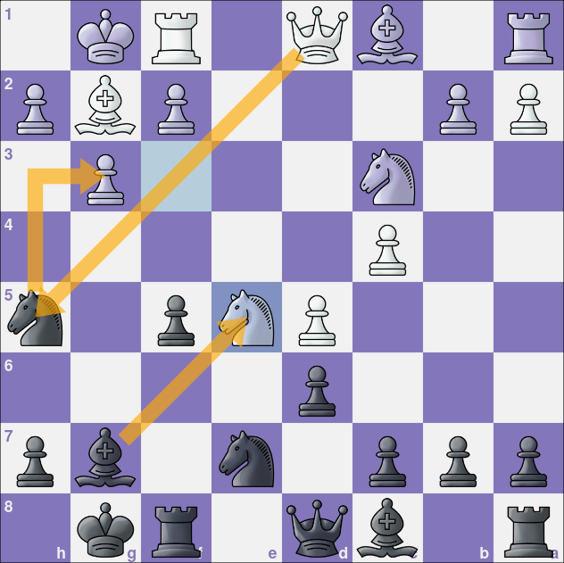
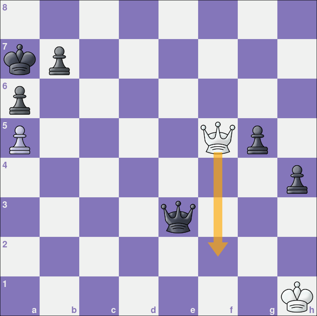
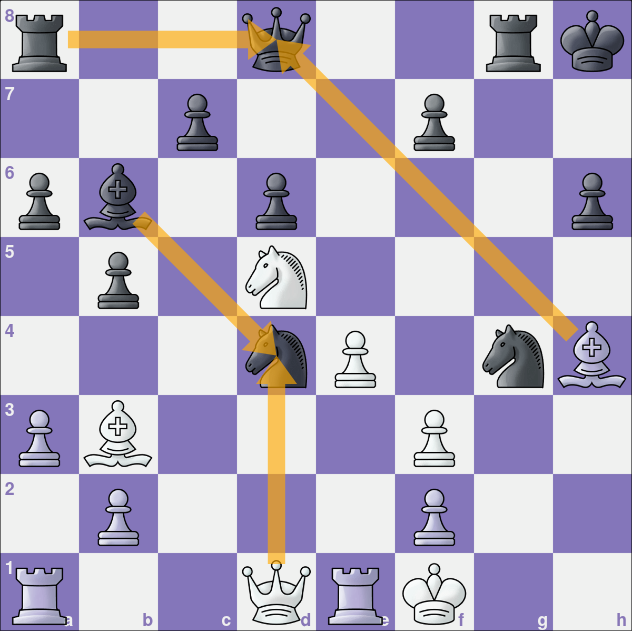

import ChessCom from '../../../components/chess/ChessCom.astro';

> Seorang master catur Jerman kelahiran tahun 1868, [Richard Teichmann](https://chesspuzzle.net/Player/Richard_Teichmann) pernah berkata, "***chess is 99% tactics***".

## What is Chess Tactics?

Apa itu taktik catur?
Pada dasarnya, taktik catur adalah gerakan / langkah (atau serangkaian langkah) yang memberikan keuntungan bagipemainnya. Keuntungan yang dimaksud dapat berupa keuntungan material, yaitu dengan memenangkan buah catur, ataubahkan skakmat.[^1] Ada banyak taktik yang dapat dipelajari dan digunakan dalam bermain catur, tapi biarkan saya mengulas salah tiga diantaranya, yaitu **Interference**, **X-Ray Attack**,dan **Desperado**.

### Interference

Taktik **Interference** terjadi ketika kita menempatkan buah catur kita diantara dua buah catur lainnya yang sedang saling terhubung. Tujuan dari taktik ini adalah mengganggu atau memutus jalur koordinasi diantara dua buah catur tersebut.[^1] Terkadang, taktik ini juga dapat mengakibatkan lawan mengalami *overloading*. Dengan demikian, kita mendapatkan keuntungan berupa keunggulan kualitas perwira maupun skakmat.	

> Saya sempat membahas mengenai taktik **overloading** di artikel berikut:

[[/chess/pop-tactics3/]]

Berikut adalah contoh taktik *interference*:

[grid]

[/grid]

<iframe width="100%" height="468"
  src="https://www.youtube.com/embed/ZowotLVyEXY"
  frameborder="0" allowfullscreen>
</iframe>

:::info[Interference Puzzle] 

1. Hitam jalan dan unggul satu perwira.

<ChessCom id="13043299" url="//www.chess.com/emboard?id=13043299"/>

2. Putih jalan dan unggul kualitas.

<ChessCom id="13043313" url="//www.chess.com/emboard?id=13043313"/>

3. Putih jalan dan skakmat.

<ChessCom id="13043365" url="//www.chess.com/emboard?id=13043365"/>

:::

### X-Ray Attack

Taktik **X-Ray Attack** terjadi ketika perwira jarak jauh (seperti Benteng, Gajah, atau Menteri) menyerang "melalui" salah satu buah catur lawan untuk kemudian mendapatkan keunggulan tertentu, seperti keunggulan perwira atau bahkan skakmat. Biasanya, **X-Ray Attack** dapat memberikan skakmat dengan tema *back-rank mate*.

Berikut adalah contoh *x-ray attack*:

[grid]

[/grid]

<iframe width="100%" height="468"
  src="https://www.youtube.com/embed/18e4AgaSrU8"
  frameborder="0" allowfullscreen>
</iframe>

:::info[X-Ray Puzzle] 

1. Hitam jalan dan unggul satu perwira.

<ChessCom id="13044983" url="//www.chess.com/emboard?id=13044983"/>

2. Hitam jalan dan skakmat.

<ChessCom id="13045023" url="//www.chess.com/emboard?id=13045023"/>

3. Putih jalan dan skakmat.

<ChessCom id="13045041" url="//www.chess.com/emboard?id=13045041"/>

:::

### Desperado

Taktik **Desperado** terjadi ketika buah catur kita terserang, kita melakukan pertukaran pengorbanan sebagai kompensasi agar tidak mengalami kerugian yang signifikan. 

Berikut adalah contoh taktik *desperado*:

[grid]

[/grid]

<iframe width="100%" height="468"
  src="https://www.youtube.com/embed/mcXv9M_ZNHc"
  frameborder="0" allowfullscreen>
</iframe>

:::info[Desperado Puzzle] 

1. Hitam jalan dan melakukan taktik desperado.

<ChessCom id="13045717" url="//www.chess.com/emboard?id=13045717"/>

2. Putih jalan dan melakukan taktik desperado.

<ChessCom id="13045735" url="//www.chess.com/emboard?id=13045735"/>

3. Hitam jalan dan melakukan taktik desperado.

<ChessCom id="13045759" url="//www.chess.com/emboard?id=13045759"/>

:::

[^1]: Chatgpt, 2025