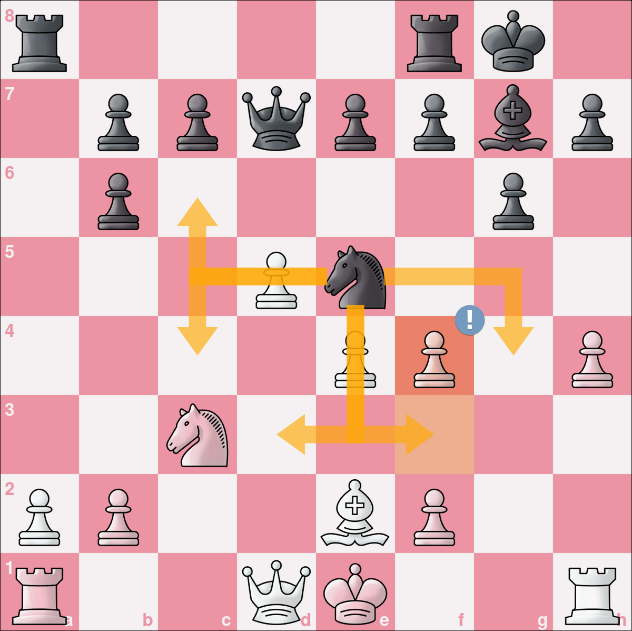
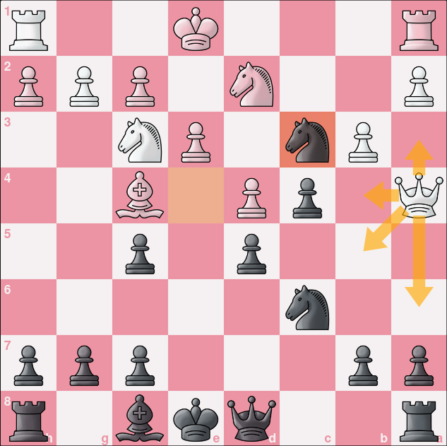
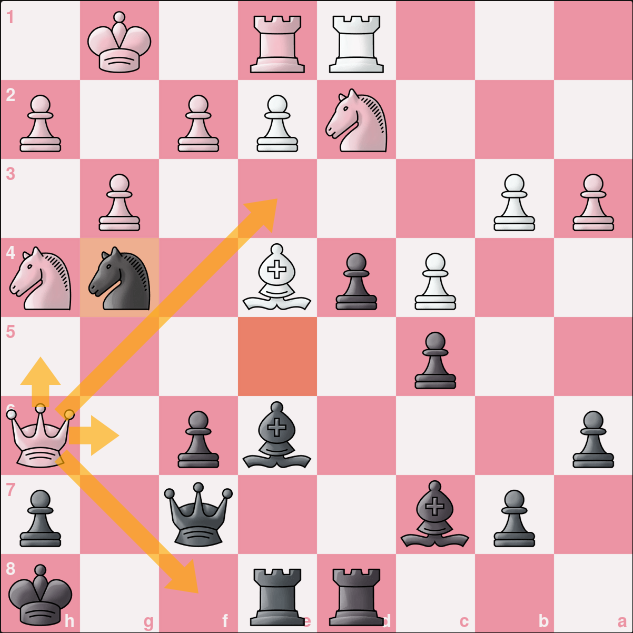
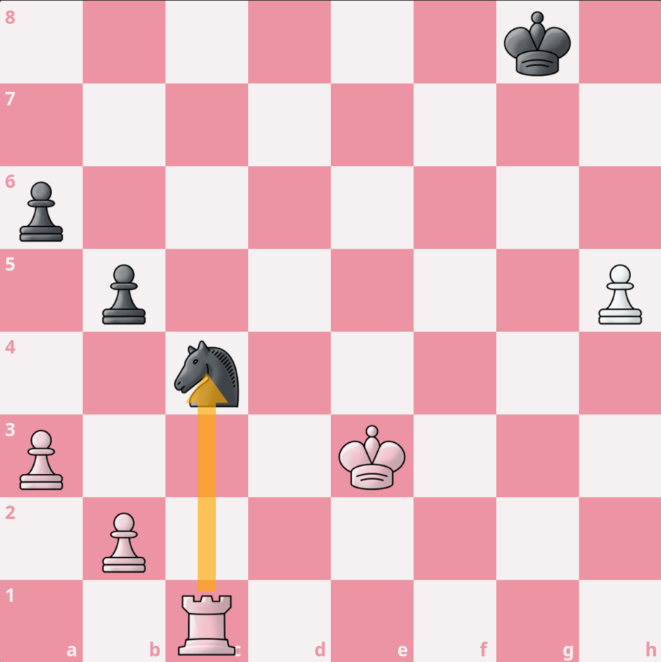
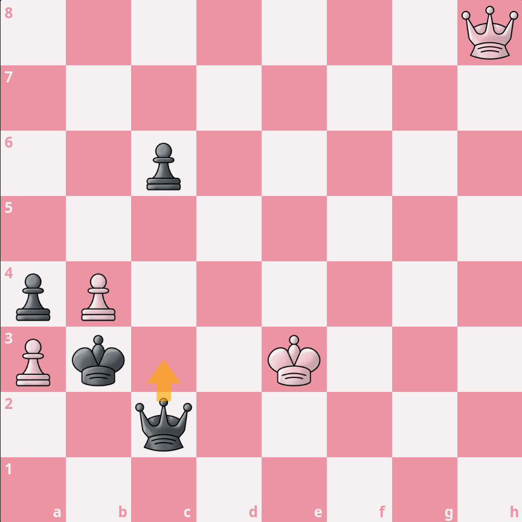
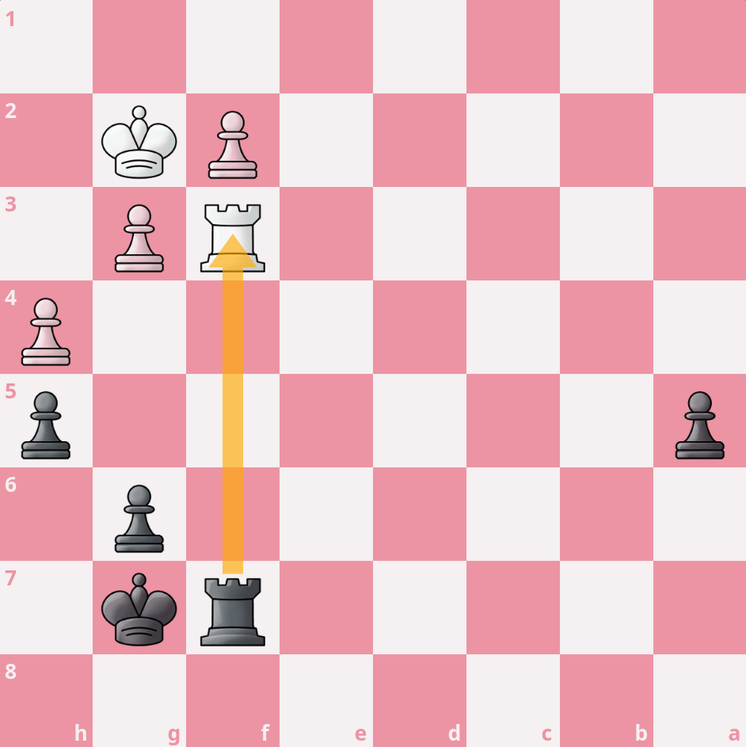

import ChessCom from '../../../components/chess/ChessCom.astro';

> Seorang master catur Jerman kelahiran tahun 1868, [Richard Teichmann](https://chesspuzzle.net/Player/Richard_Teichmann) pernah berkata, "***chess is 99% tactics***".

## What is Chess Tactics?

Apa itu taktik catur?

Pada dasarnya, taktik catur adalah gerakan / langkah (atau serangkaian langkah) yang memberikan keuntungan bagipemainnya. Keuntungan yang dimaksud dapat berupa keuntungan material, yaitu dengan memenangkan buah catur, ataubahkan skakmat.[^1] Ada banyak taktik yang dapat dipelajari dan digunakan dalam bermain catur, tapi biarkan saya mengulas salah tiga diantaranya, yaitu **Trapped Piece**, **Simplification**,dan **Zugzwang**.

### Trapped Piece

Seperti namanya, taktik **Trapped Piece** adalah taktik yang ditujukan untuk menjebak perwira lawan sehingga kita mendapatkan keunggulan material atau keunggulan kualitas.[^1]

Berikut adalah contoh taktik *trapped piece*:

[grid]

[/grid]

<iframe width="100%" height="468"
  src="https://www.youtube.com/embed/Oaz_UhxTCts"
  frameborder="0" allowfullscreen>
</iframe>

:::info[Trapped Piece Puzzle] 

1. Putih jalan dan unggul kualitas.

<ChessCom id="13049081" url="//www.chess.com/emboard?id=13049081"/>

2. Hitam jalan dan unggul kualitas.

<ChessCom id="13049111" url="//www.chess.com/emboard?id=13049111"/>

3. Putih jalan dan skakmat.

<ChessCom id="13049121" url="//www.chess.com/emboard?id=13049121"/>

:::

### Simplification

Seperti namanya, **Simplification** adalah taktik penyederhaan permainan dengan menawarkan pertukaran buah catur kepada lawan. Tujuan taktik **Simplification** juga sudah sangat jelas, yaitu untuk mengurangi kompleksitas permainan di atas papan. Biasanya, taktik ini dilakukan apabila kita sudah memiliki keunggulan tertentu, baik keunggulan material maupun keunggulan kualitas. Oleh sebab itu pula, jika kita berada pada posisi yang berlawanan (tidak unggul/rugi), sebaiknya kita menolak ajakan pertukaran buah catur (**Simplification**) ini.

Berikut adalah contoh taktik *simplification*:

[grid]

[/grid]

<iframe width="100%" height="468"
  src="https://www.youtube.com/embed/tF2gmJ7YzAI"
  frameborder="0" allowfullscreen>
</iframe>

:::info[Simplification Puzzle] 

1. Hitam jalan dan unggul perwira.

<ChessCom id="13058295" url="//www.chess.com/emboard?id=13058295"/>

2. Hitam jalan dan unggul jumlah pion.

<ChessCom id="13058311" url="//www.chess.com/emboard?id=13058311"/>

3. Hitam jalan dan unggul jumlah perwira.

<ChessCom id="13058329" url="//www.chess.com/emboard?id=13058329"/>

:::

### Zugzwang 

**Zugzwang** adalah *term* bahasa Jerman yang berarti "*a compulstion to move*" atua paksaan untuk bergerak. Tujuan dari taktik **Zugzwang** ini adalah untuk memaksa lawan menggerakkan buah caturnya sehingga ketika kita mendapatkan giliran melangkah, kita akan mendapatkan keunggulan. Dengan kata lain, melalui taktik ini, apapun langkah yang dimainkan oleh lawan, dia akan tetap kalah.

Berikut adalah contoh taktik *zugzwang*:

[grid]

[/grid]

<iframe width="100%" height="468"
  src="https://www.youtube.com/embed/UCmsBHz5jU0"
  frameborder="0" allowfullscreen>
</iframe>

:::info[Zugzwang Puzzle] 

1. Putih jalan dan menang.

<ChessCom id="13058435" url="//www.chess.com/emboard?id=13058435"/>

2. Putih jalan dan menang.

<ChessCom id="13058449" url="//www.chess.com/emboard?id=13058449"/>

3. Hitam jalan dan menang.

<ChessCom id="13058467" url="//www.chess.com/emboard?id=13058467"/>

:::

[^1]: https://www.chess.com/article/view/chess-tactics#trappedpiece

