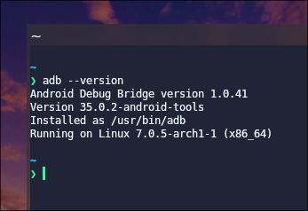
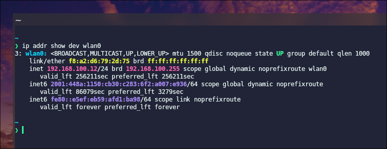
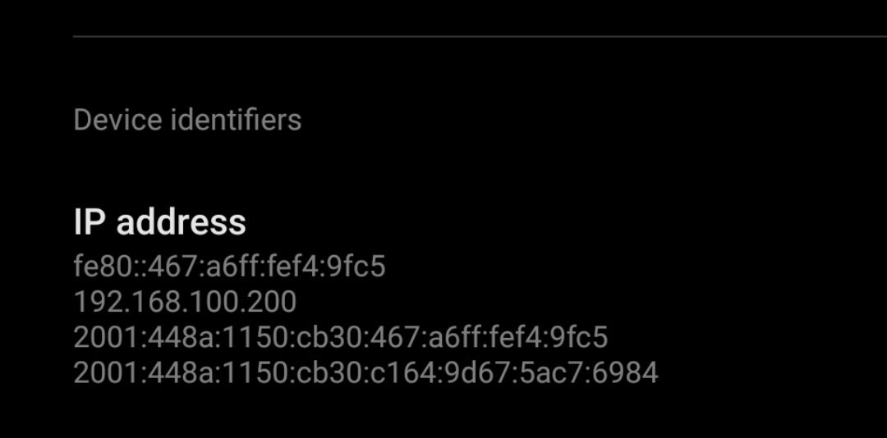
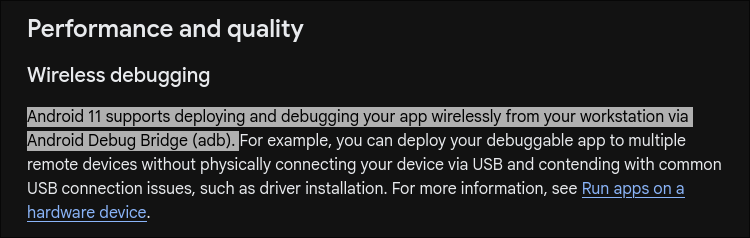
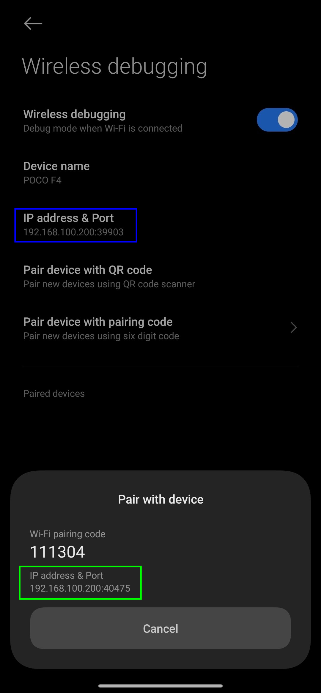
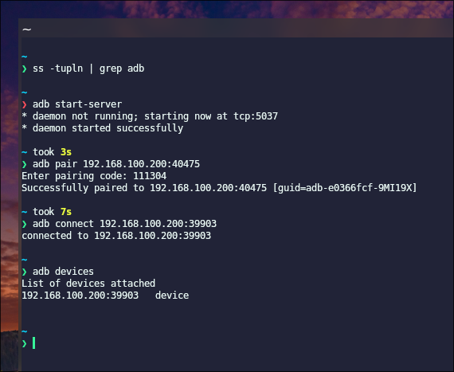
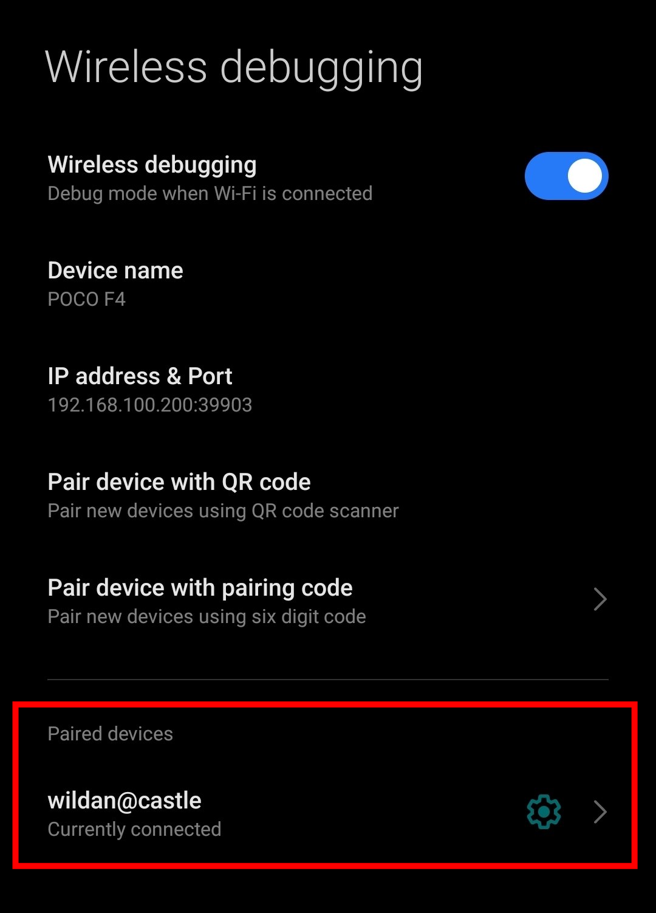
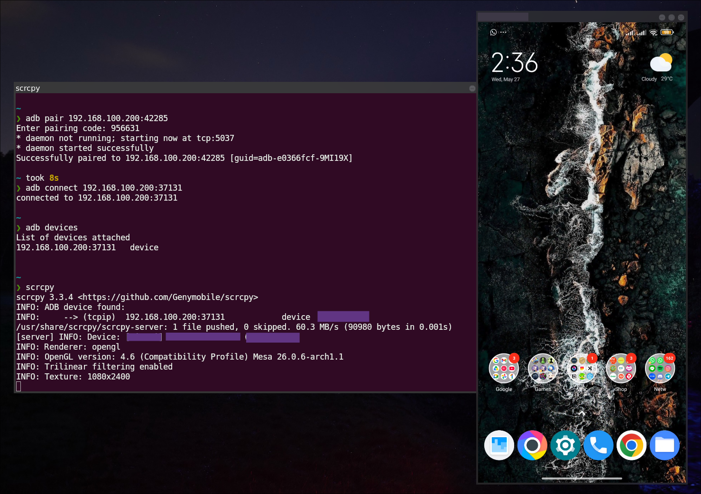

## Intro

Di beberapa artikel saya yang lain, terutama yang terkait dengan cara menghubungkan perangkat android ke linux, seperti via `scrcpy` atau MTP, keduanya masih sangat bergantung pada kabel USB. Meskipun pada `scrcpy` kita juga bisa melakukan _wireless connection_, tapi, koneksi awalnya tetap harus menghubungkan kabel USB terlebih dahulu. 

Tutorial menghubungkan android ke linux via MTP:

[[/tech/android-mtp/]]

Tutorial menghubungkan android ke linux via `scrcpy`:

[[/tech/scrcpy/]]

Nah, di artikel ini, saya akan berbagi cara menghubungkan android ke linux hanya dengan _wireless connection_ saja, sehingga kita tidak tergantung sama sekali dengan kabel USB.

## The Essence

Saya akan tunjukkan langsung caranya, mulai dari instalasi hingga penggunaannya.

### Installation

Berikut adalah paket yang perlu di-_install_ di sistem linux kita terlebih dahulu:

|       Distro      |                  Command                    |
|       ---         |                   ---                       |
| **Debian/Ubuntu** | **`sudo apt install -y android-tools-adb`** |
| **Arch Linux**    | **`sudo pacman -Sy android-tools`**         |
| **Fedora**        | **`sudo dnf install android-tools`**        |
| **Opensuse**      | **`sudo zypper install android-tools`**     |

:::note

**NixOS:**  
Masukkan baris berikut di file konfigurasi (`/etc/nixos/configuration.nix`):

```nix title="configuration.nix"
  environment.systemPackages = [
    pkgs.android-tools
  ];
```

Atau jika menggunakan `nix-shell`:

```shell
nix-shell -p android-tools
```

:::

Pastikan `adb` sudah ter-_install_ dengan baik dengan perintah:

```shell
adb --version
```



### Usage

Berikut adalah langkah-langkah untuk menggunakan fitur `adb` _wireless_:

#### 1. In the same network.

Pastikan perangkat linux dan android kalian berada di jaringan yang sama.

Untuk melihat ip address di linux, gunakan perintah:

```shell
ip a # untuk menampilkan semua interface
ip addr show dev wlan0 # untuk menampilkan interface `wlan0` saja
```



Untuk melihat ip address di android, pergi ke "**Setting**" > "**About phone**" > "**Detailed info and specs**". Cari informasi yang menampilkan ip address perangkat android kalian.



Pastikan juga android bisa di-`ping` dengan baik oleh linux (atau sebaliknya):


#### 2. Android set up.

Aktifkan fitur "**Wireless debugging**" di android dengan cara:

:::info

Berdasarkan informasi dari website resmi Android, fitur **"_Wireless debugging_"** ini hanya ada di android versi 11 atau yang lebih baru.

[](https://developer.android.com/about/versions/11/features)

:::

1. Pergi ke **Setting**.
2. Pilih "**Additional settings**".
3. Pilih "**Developer options**".
4. Pilih dan aktifkan mode "**Wireless debugging**".
5. Catat ip address & port (untuk **connect**).
6. Buka "**Pair device with pairing code**", perhatikan 2 hal (untuk **pair**):  
- IP address & port.  
- Wi-Fi pairing code (6 digit).  

> **Note:**  
> Ketika mengaktifkan mode "**_Wireless debugging_**", akan ada _pop-up_ konfirmasi untuk selalu menyalakan mode _wireless debugging_ ini ketika diaktifkan, ceklis dan OK-kan.



:::note

Perhatikan, ada 2 ip address & port yang saya tekankan di sana:
1. Yang berwana **hijau** adalah yang pertama digunakan untuk **pairing**.
2. Yang berwarna **biru** adalah yang digunakan untuk **connecting** setelah _pairing_.

:::

#### 3. Linux set up.

1. Aktifkan `adb` dengan perintah:

```shell
adb start-server
```

Untuk melihat status `adb`, apakah sudah berjalan atau masih mati:

```shell
ss -tupln | grep adb
```

Untuk mematikan `adb`:

```shell
adb kill-server
```

2. Jika `adb` sudah _running_, pasangkan linux dengan android:

```shell
adb pair <ip_address:port> 
```

Akan ada _prompt_ yang meminta _pairing code_. Masukkan 6 digit _pairing code_ tadi.

3. Jika berhasil dipasangkan, hubungkan linux dengan android dengan perintah:

```shell
adb connect <ip_address:port>
```

Untuk memastikan perangkat android sudah terhubung ke linux:

```shell
adb devices
```



Selain itu, di android, kita juga akan melihat nama device yang berhasil terhubung:



4. Untuk mendapatkan _shell_ android:

```shell
adb shell
```

Untuk keluar sesi dari shell android:

```shell
exit
```

5. Untuk men-_download_ / mengambil file dari android:

```shell
adb pull <full_path>/<filename.ext>
```


6. Untuk meng-_upload_ / mengunggah file dari linux ke android:

```shell
adb push 
```

7. Untuk menampilkan display Android:

```shell
scrcpy
```



> Silakan baca artikel saya terkait `scrcpy` untuk tau cara instalasi dan penggunaan lebih lanjutnya.

Perintah-perintah fungsional `adb` lainnya dapat dipelajari di `adb --help` atau `man adb`.

Sekian.  
Semoga bermanfaat.

