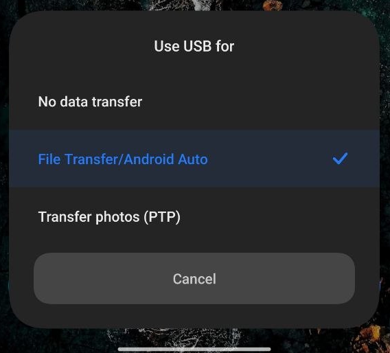
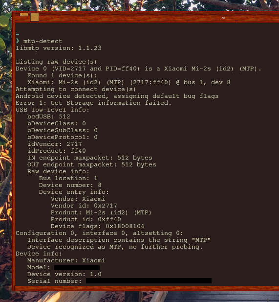
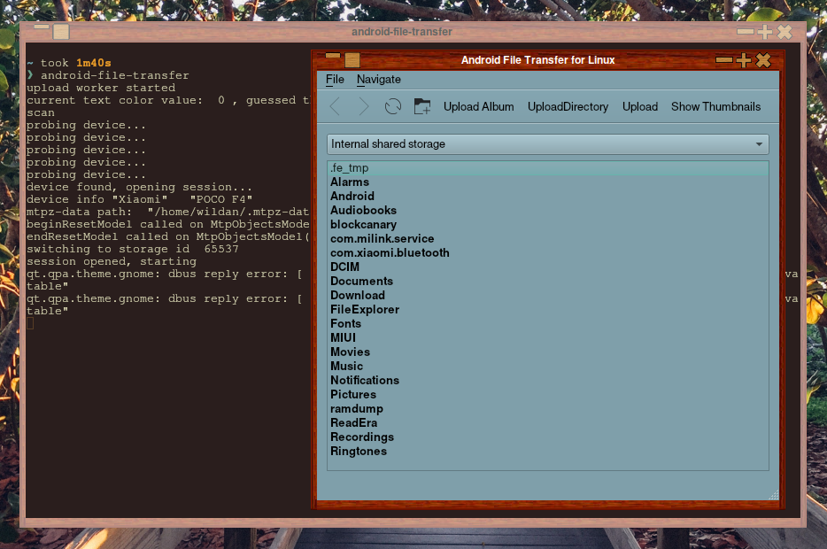
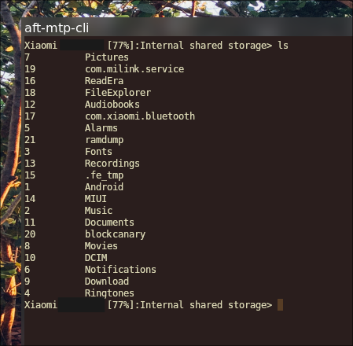

## Preambul

Beberapa hari lalu, saya ingin memindahkan file yang ada di _smartphone_ Android ke Laptop saya yang kebetulan ter-_install_ [Archlinux](https://archlinux.org/). Jadi, saya coba pasangkan kabel USB, dan colokkan ke komputer saya. Tapi, satu masalah muncul: "Android saya tidak terdeteksi di Archlinux saya". Beberapa kali saya coba colok-pasang, tidak muncul. Bahkan, sudah saya coba pastikan tidak hanya via _file manager_, tapi juga via terminal dengan perintah `lsblk`, tetap nihil.

Akhirnya, saya coba cari tau penyebab berikut dengan solusinya di Google dan ChatGPT. Ternyata, memang Archlinux tidak meng-_install_ paket-paket yang diperlukan untuk menghubungkan Android secara default ketika instalasi pertama kali. Jadi, saya perlu memasang beberapa paket yang pada akhirnya menyelesaikan permasalahan tersebut.

## Method

Berikut adalah paket-paket yang perlu di-_install_:

```shell
sudo pacman -Sy libmtp mtpfs android-file-transfer
```

:::note

**Keterangan:**

- **`libmtp`**: adalah _library implementation_ MTP (Media Transfer Protocol)
- **`mtpfs`**: adalah _FUSE system_ untuk membaca dan menulis dari perangkat MTP
- **`android-file-transfer`**: adalah client untuk Android MTP dengan tampilan (UI) yang sederhana

:::

Berikutnya, kita bisa mencolokkan kabel USB dari Android ke Archlinux. Pastikan untuk mengganti mode ke **"File Transfer/Android Auto"**, bukan opsi lainnya.



Untuk menge-cek koneksi Android-nya, apakah sudah tersambung atau belum, gunakan perintah:

```shell
mtp-detect
```

Jika berhasil, maka output-nya akan menampilkan informasi _device_ yang terhubung, Kira-kia seperti ini:



Jika USB belum dicolok, maka perintah `mtp-detect` hanya akan menampilkan _output_ kosong, seperti ini:


### GUI 

Sekarang, jika sudah dipastikan bahwa USB terhubung dengan baik dan Archlinux sudah bisa mendeteksinya, maka kita bisa lihat buka direktori Android kita dengan perintah:

```shell
android-file-transfer
```

Tangkapan layar keberhasilannya:



### CLI

Gunakan perintah berikut untuk tersambung ke Android via USB di CLI (_Command Line Interface_):[^1]

```shell
aft-mtp-cli
```



> **Notes:**  
> Pastikan smartphone dalam keadaan hidup layarnya dan tidak terkunci.

Selesai!  
Semudah itu!


[^1]: https://wiki.archlinux.org/title/Media_Transfer_Protocol