Siapa yang tidak pernah dengar Archlinux?

Archlinux adalah sebuah distro linux (legendaris) yang terkenal dengan **komunitasnya yang besar** dari seluruh dunia dan **dokumentasi distronya yang lengkap**. Hal lain yang menjadikan
Archlinux sebagai distro yang digemari banyak orang adalah karena filosofinya, yaitu **`Keep It Simple`**[^1]. Ya, sesuai filosofinya, Archlinux memang di-design untuk memberikan kemudahan, baik
untuk penggunanya maupun untuk *hardware* atau mesin host-nya[^2].

Meskipun demikian, dulu Archlinux memiliki reputasi sebagai distro untuk "linux senior" atau "sepuh linux" alias tidak ramah pengguna linux pemula. Pendapat tersebut muncul setidaknya karena proses install-nya
yang terbilang cukup rumit dibandingkan dengan distro-distro lain, sebut saja Debian (yang juga merupakan distro legend) misalnya. Dibandingkan Debian yang proses instalasinya 
memanjakan pengguna dengan tampilan GUI (*Graphical User Interface*)-nya dan langkah-langkah instalasinya yang relatif sederhana, proses instalasi Archlinux justru berbasis CLI (*CommandLine Interface*)
dan menggunakan *command* atau perintah-perintah yang tidak familiar. Intinya, Archlinux memang bukan sembarang distro karena diperlukan jam terbang untuk bisa menguasainya, bahkan sekadar untuk instalasinya.

**Tapi itu dulu...**

Sekarang, Archlinux sudah mulai memberikan *concern* pada proses instalasi yang bisa menghabiskan waktu yang lama tersebut sehingga (saya lupa persisnya tahun berapa, mungkin sekitar 2022 / 2023)
Archlinux menyediakan *script* instalasi di ISO resminya, yaitu `archinstall`. Nah, dengan hadirnya *script* ini, Archlinux bukan lagi distro yang menakutkan karena kita dapat menginstall
sang distro dengan mudah di komputer kita.

## Pra-instalasi

Unduh ISO Archlinux di sini: https://archlinux.org/download/

Btw, saya akan menginstall Archlinux sebagai VM (*Virtual Machine*) di [Virtualbox](https://www.google.com/search?client=firefox-b-e&q=virtualbox). Jadi, untuk proses membuat VM dan 
konfigurasinya di Virtualbox (bagi kalian yang belum tau), bisa menyimak tulisan saya sebelumnya tentang instalasi Debian pada sub **"Membuat VM di Virtualbox"** 
[di sini](https://abwildan.github.io/post/debian-installation/).

## Instalasi Archlinux via `archinstall` Script

Saat pertama kali mulai, kita akan melihat tampilan berikut:
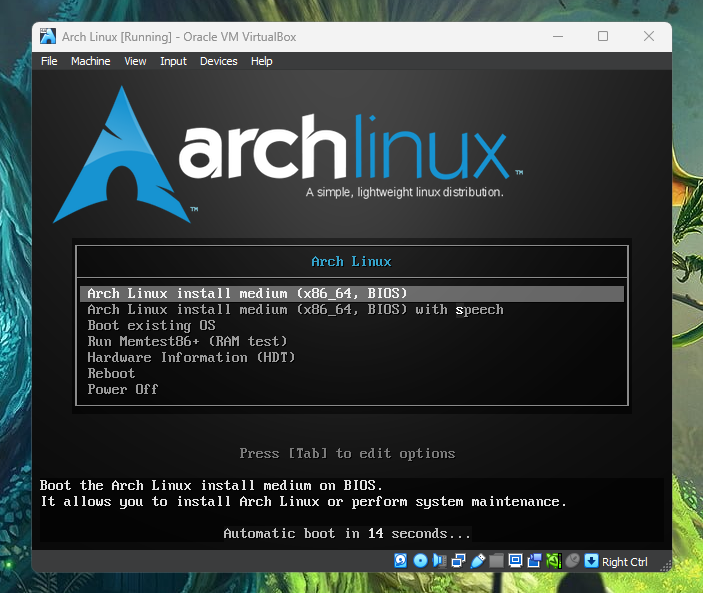

Kita boleh menekan Enter pada pilihan yang pertama, **"Arch Linux Install medium (x86_64, BIOS)"** atau membiarkannya saja juga tidak mengapa.

Archlinux sudah siap diinstall ketika kita sudah masuk ke mode berikut:
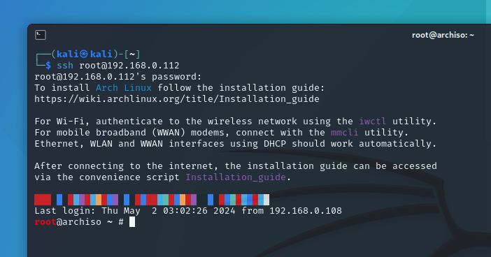

Untuk memastikan kita sudah terhubung ke internet, kita bisa mengetikkan perintah

```bash
ip a
```

atau mencoba ping ke Google

```bash
ping google.com
```

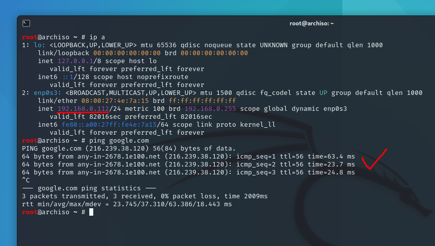

Jika *ip address*-nya sudah muncul atau ping ke google berjalan dengan lancar, itu tandanya kita siap untuk menginstall Archlinux.

Untuk mulai menjalankan *script*, kita cukup mengetikkan perintah 

```bash
archinstall
```
Tunggu beberapa saat hingga muncul tampilan berikut
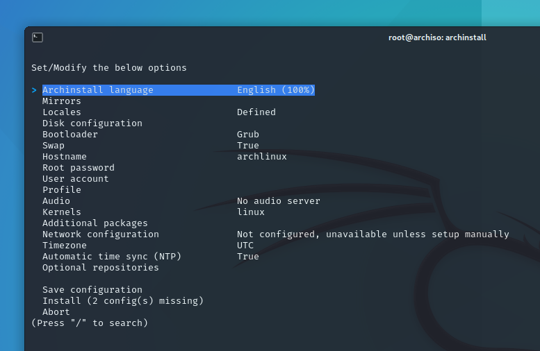

Sekarang, kita perlu men-*setting* beberapa hal...

### 1. Mirrors

Mirrors sederhananya adalah server repository Archlinux yang ada di seluruh dunia. Tentu, kita harus memilih server repo yang terdekat (yang ada di Indonesia) supaya nanti proses install
*package* atau proses *update software*-nya dapat berjalan lebih cepat.

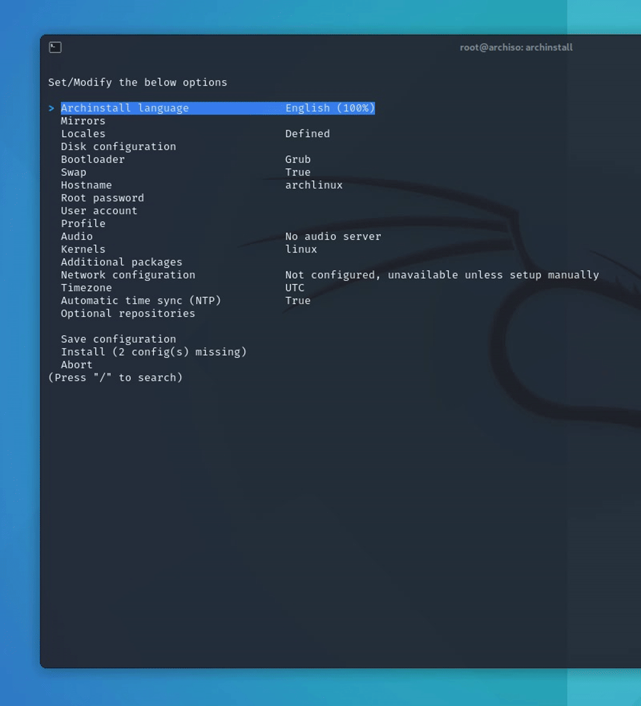 

- Silakan pilih bagian **Mirrors*, untuk mengarahkan bisa menggunakan ***arrow keys*** di keyboard. 
- Kemudian pilih **Mirror Region** dan tunggu beberapa saat hingga menampilkan list negara. 
- Untuk mempercepat pencarian, kita bisa mengetikkan garis miring atau *slash* ( **/** ) dan ketikkan indo.
- Untuk menceklis pilihan negara kita (Indonesia), pencet "Tab" di keyboard.

### 2. Disk Configuration

Disk configuration adalah opsi untuk mengkonfigurasi partisi hardisk kita. 

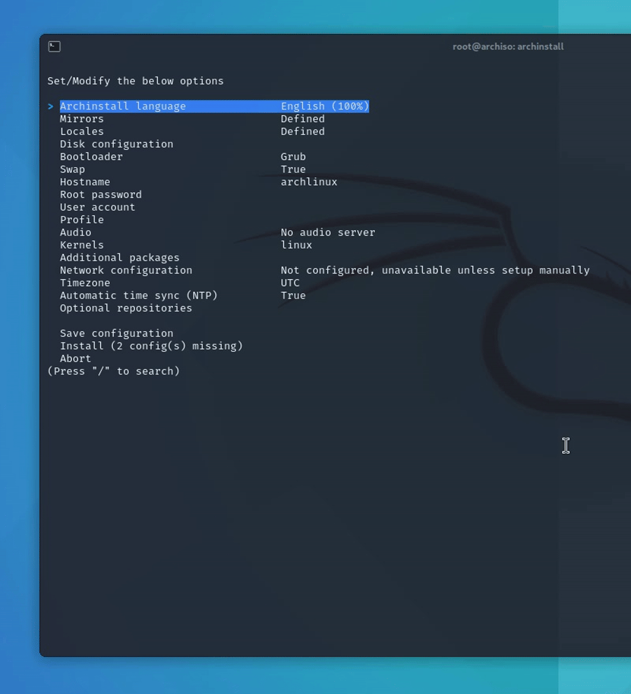

- Silakan pilih bagian **Disk Configuration**
- Pilih **Use a best-effort default partition layout**
- Ceklis pada kolom path /dev/sda
- Pilih format filesystem **ext4**

### 3. Hostname (Optional)

Hostname adalah nama dari komputer yang "meng-*hosting*" Archlinux kita. Kita bisa membiarkannya default dengan nama "archlinux" atau boleh juga diganti sesuai dengan selera kita.

Saya akan menggantinya ke **castle**.

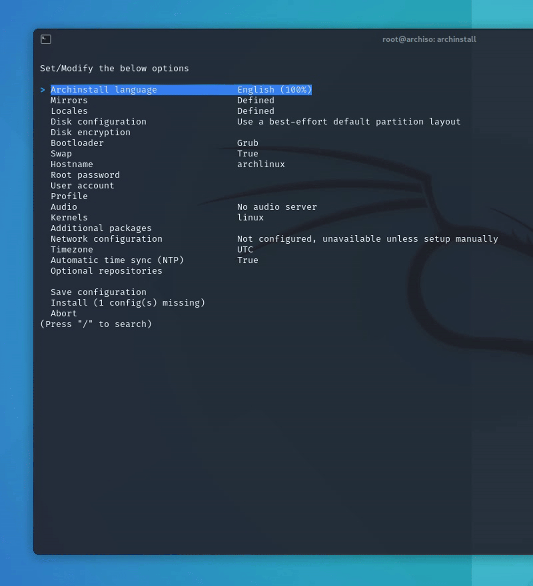

- Silakan pilih bagian **Hostname**
- Hapus "archlinux" dan ganti ke preferensi hostname kalian (saya ubah ke "castle")

### 4. Root Password

Root Password adalah bagian untuk memberikan password kepada user **root** (atau kalau di Windows adalah user **Administrator**). User root adalah user dengan *privilege* yang paling tinggi
dalam hirarki user di linux. Jadi, saya sarankan kalian nanti akan menginputkan password yang tidak mudah dibobol.

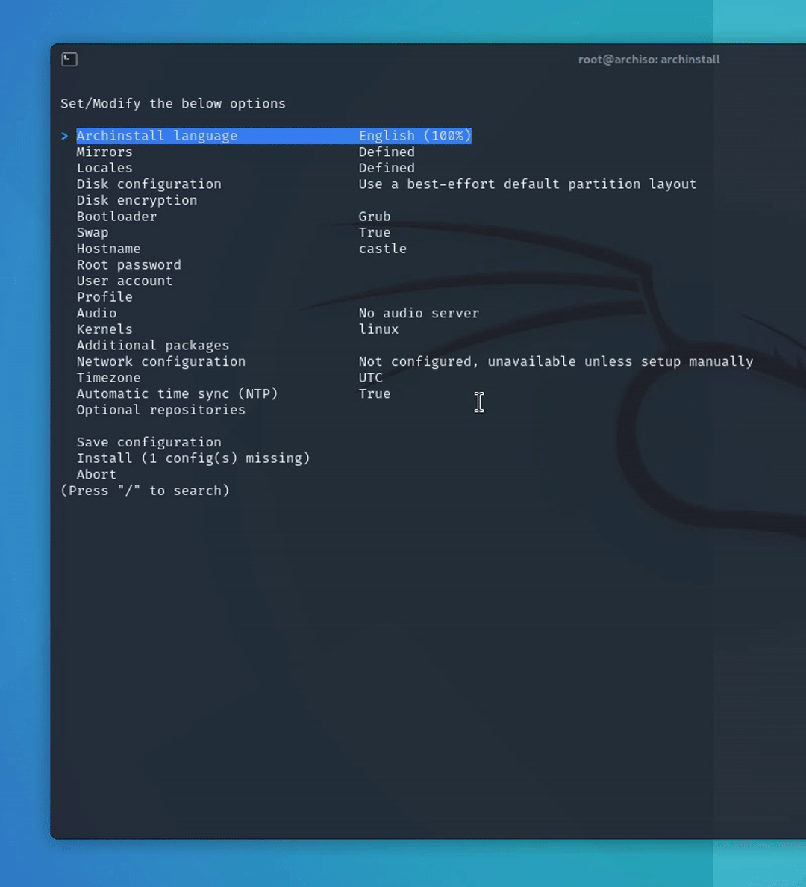

- Silakan pilih **Root Password**
- Ketikkan password yang kalian kehendaki (memang tidak akan tampil di layar)
- Setelah selesai, ketik Enter, dan masukkan kembali password yang sama sebagai verifikasi, dan Enter

### 5. User Account

Kita akan memasukkan akun user normal kita di bagian User Account ini, berikut juga password akunnya tentu saja.

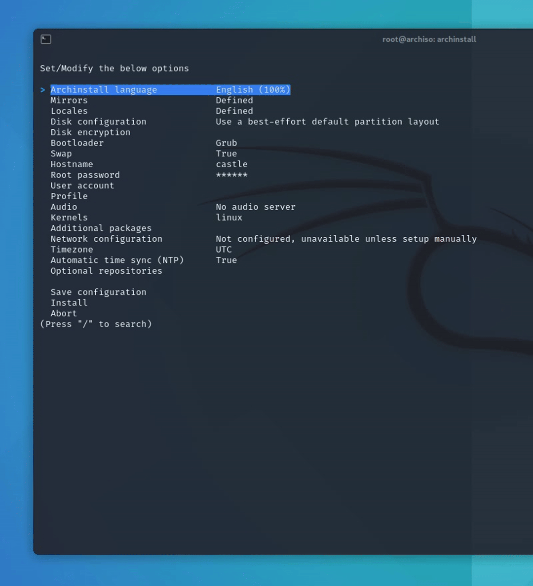 

- Silakan pilih **User Account**
- Pilih **Add a user**
- Ketikkan nama user yang kalian inginkan (saya pilih nama saya sendiri, **wildan**)
- Ketikkan password untuk user yang sudah dibuat tadi (memang tidak akan tampil di layar)
- Ketikkan kembali password yang sama sebagai verifikasi
- Pilih **yes (default)** pada pertanyaan '*Should "wildan" be a super user (sudo)?*', supaya user kita dimasukkan ke dalam grup sudo (*sudoers*)
- Kemudian, pilih **Confirm and exit**

### 6. Profile

Profile adalah bagian untuk kita mengkonfigurasi tipe Archlinux yang akan kita gunakan. Apakah Archlinux kita akan berjalan sebagai Desktop, Server, atau lainnya? Tapi, di sini, saya 
akan menginstall Archlinux sebagai Deskop dengan DE (*Desktop Environment*) KDE Plasma.


- Pilih **Profile** -> **Type** -> **Desktop**
- Ceklis di Kde, Enter

### 7. Audio 

Kita selanjutnya akan memilih audio server pada bagian Audio ini.


- Pilih **Audio**
- Pilih **Pulseaudio**

### 8. Additional packages

Additional packages adalah paket-paket tambahan yang perlu kita install karena tidak terinstall secara default. Biasanya, firefox adalah salah satu dari paket yang tidak terinstall
secara default pada *script* archinstall ini. Jadi, kita akan menginstallnya dengan menambahkannya pada bagian ini.

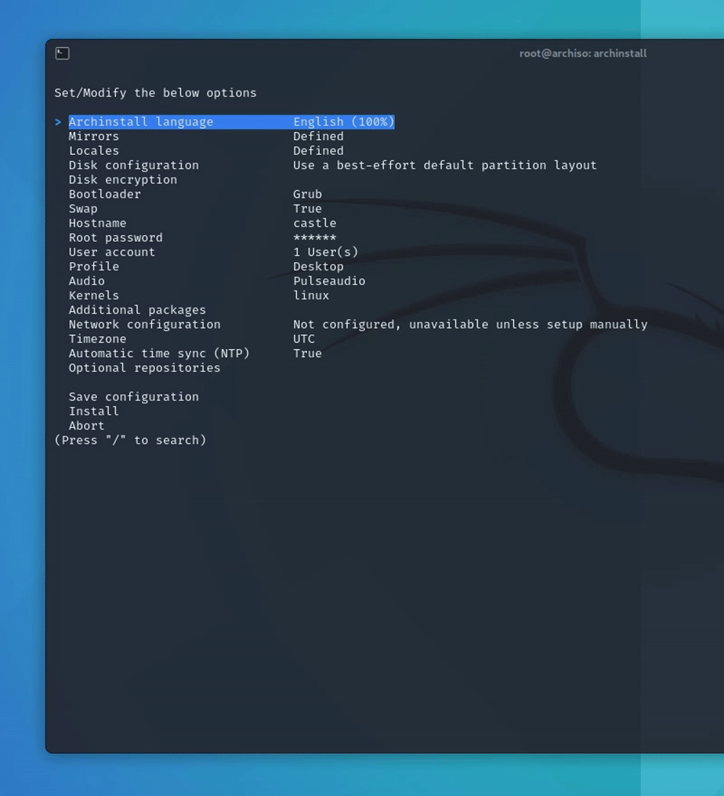

- Pilih **Additional Packages**
- Ketikkan **firefox**

Jika tidak ada *return* error, berarti package tersebut ada di repository (penulisannya sudah benar dan sesuai) dan siap diinstall.

### 9. Network configuration

Network configuration adalah opsi untuk mengkonfigurasi jaringan internet yang akan digunakan oleh OS Archlinux kita.

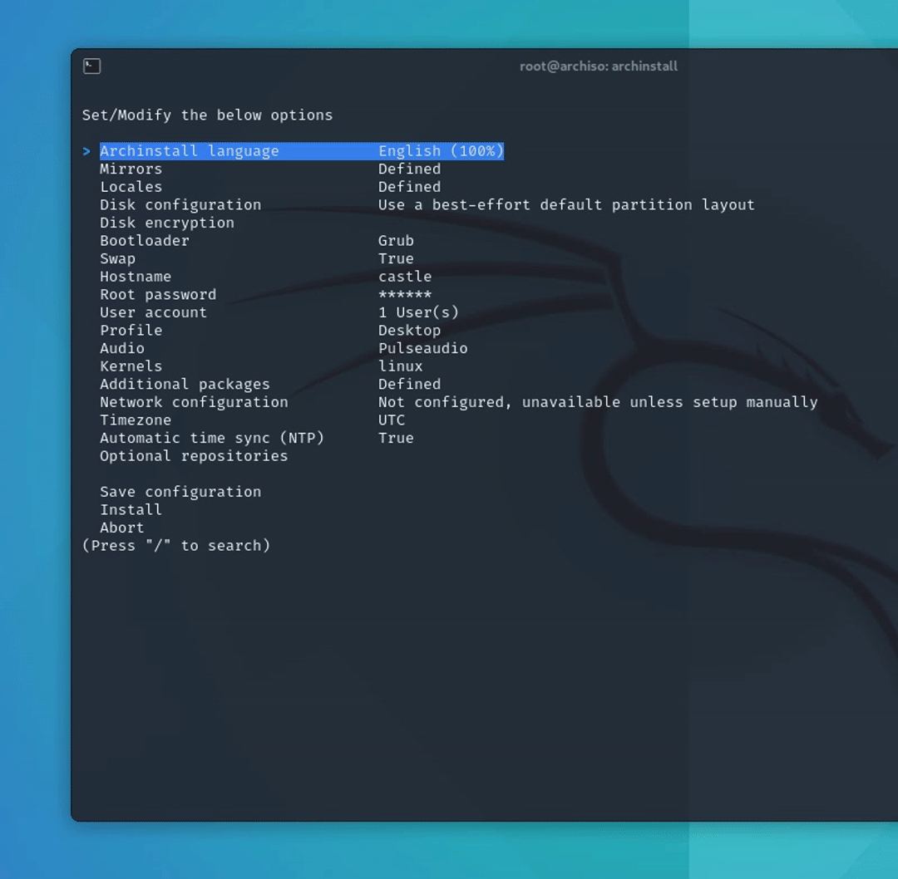

Setelah selesai mengisi semua opsi install-nya, berikutnya kita harus memilih **Install** untuk memulai instalasi...

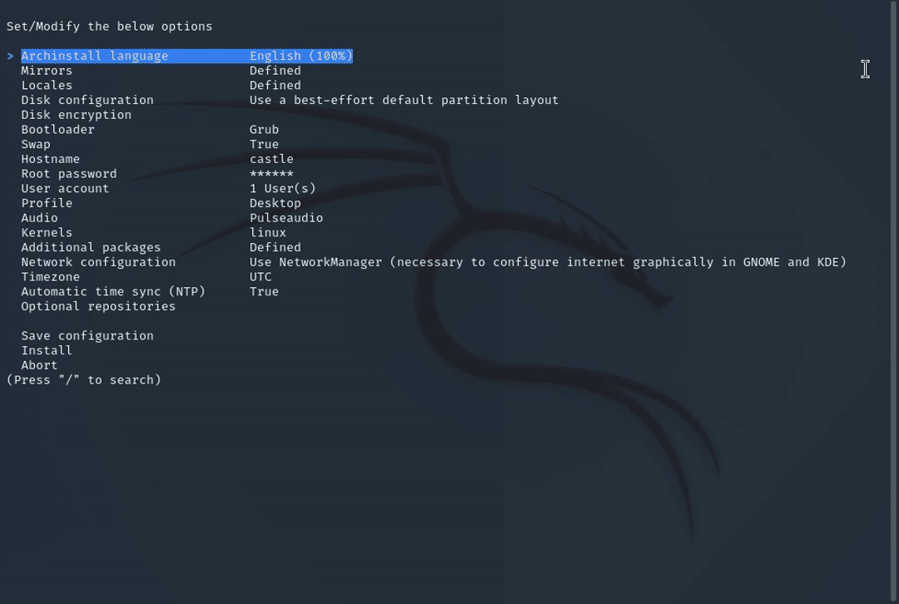

Nanti ada pesan permintaan menekan Enter untuk melanjutkan proses instalasi, kita tinggal menekan Enter dan proses instalasi pun berjalan...

Silakan mandi dulu, kemudian seduh kopi, goreng telur, dan cuci baju, karena proses ini bisa dibilang proses yang memakan waktu (bergantung dari kecepatan internet kalian)...

Tunggu proses instalasinya berjalan hingga muncul tampilan berikut
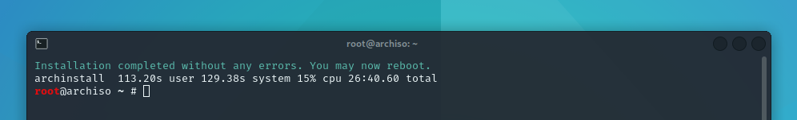

**Installation completed without any errors. You may now reboot.** Artinya proses instalasi berjalan dengan baik tanpa ada error dan kita bisa me-*restart* laptop kita.

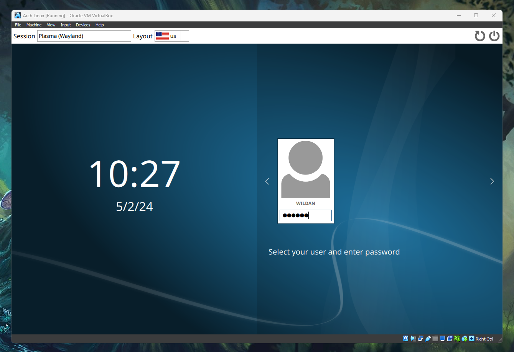

Kita berhasil masuk ke display manager untuk login, dan...

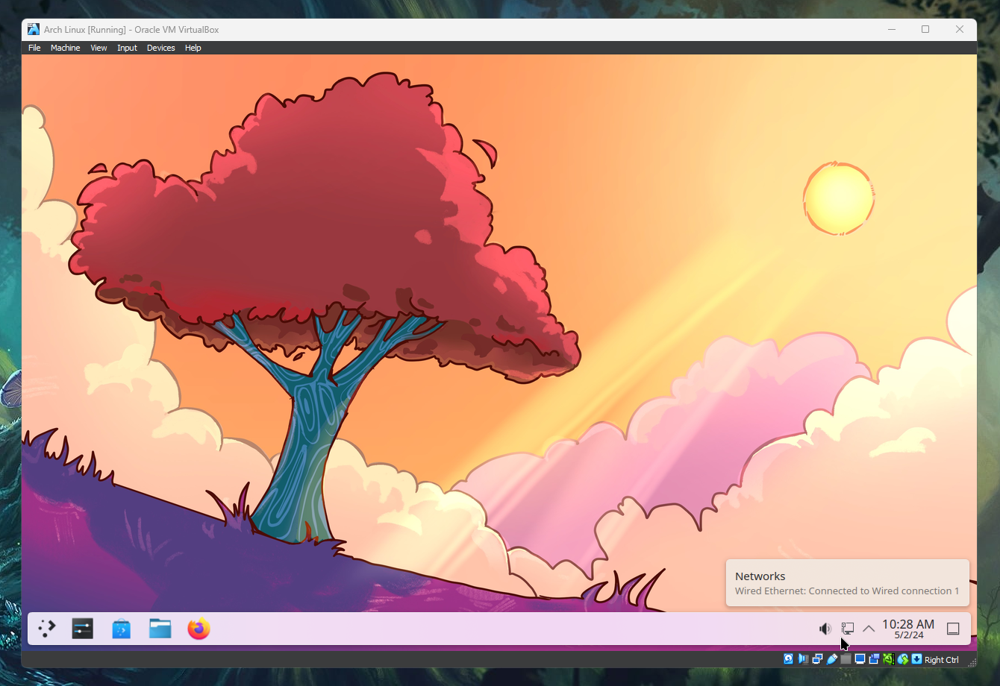

Ini dia desktop KDE dari Archlinux kita...

Selamat!

Okeee, sekian dulu tutorial instalasi Archlinux via `archinstall` *script* kali ini.

Sampai jumpa lagi di artikel saya yang lain!!

Byee~


[^1]: https://archlinux.org/ 
[^2]: https://id.wikipedia.org/wiki/Arch_Linux
