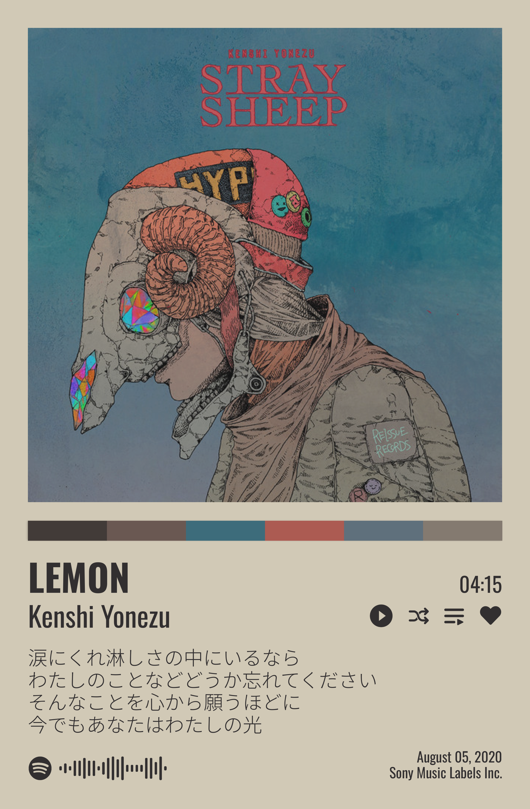
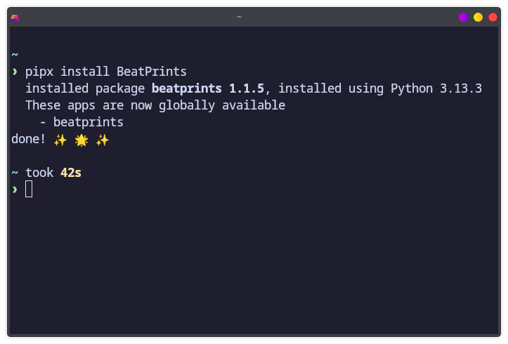
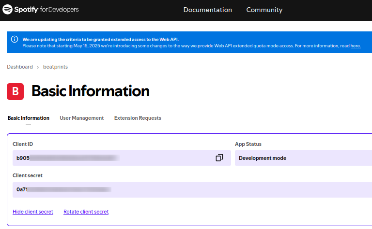

Beberapa hari lalu, saya menemukan salah postingan tangkapan layar desktop sebuah mesin Linux di [r/unixporn](https://reddit.com/r/unixporn). Yang menarik dari tangkapan layar tersebut adalah sebuah poster musik dari Spotify seperti ini:



<iframe style="border-radius:12px" src="https://open.spotify.com/embed/track/04TshWXkhV1qkqHzf31Hn6?utm_source=generator" width="100%" height="352" frameBorder="0" allowfullscreen="" allow="autoplay; clipboard-write; encrypted-media; fullscreen; picture-in-picture" loading="lazy"></iframe>

Keren, bukan?

Setelah mencari tahu, ternyata, poster seperti itu dibuat dengan sebuah program (gratis) bernama **"BeatPrints"**. Program tersebut juga di-_maintain_ secara _open source_ di Github.

> Berikut tautan ke repositorinya: https://github.com/TrueMyst/BeatPrints

Nah, di artikel ini, saya akan membahas cara membuat poster Spotify tersebut dengan BeatPrints.

## Instalasi BeatPrints

Merujuk pada dokumentasinya, kita mula-mula perlu melakukan instalasi BeatPrints terlebih dahulu. Berhubung BeatPrints adalah aplikasi python, kita dapat meng-_install_nya melalui **`pipx`**.[^1]

> **`pipx`** adalah _package manager_ untuk _packages_ atau aplikasi yang dibuat dengan bahasa Python.[^2] Jadi, seperti `apt`-nya Debian, `pacman`-nya Archlinux, atau `brew`-nya MacOS.

Oleh karena itu, sebelum meng-_install_ BeatPrints, kita perlu meng-_install_ `pipx` terlebih dahulu:   

|       Distro      |                  Command                      |
|       ---         |                   ---                         |
| **Debian/Ubuntu** | **`sudo apt install pipx`**                   |
| **Arch Linux**    | **`sudo pacman -Sy python-pipx`**             |
| **Opensuse**      | **`sudo zypper install python-pipx`**         |
| **Fedora**        | **`sudo dnf install pipx`**                   |

Sekarang, kita dapat meng-_install_ BeatPrints dengan `pipx`:

```python
pipx install BeatPrints
```

Biarkan proses instalasinya berjalan hingga selesai seperti berikut:



File _binary_ BeatPrints akan tersimpan di `/home/$username/.local/bin`. Jika PATH tersebut tidak masuk dalam PATH, kita dapat memasukkannya dengan perintah:

```python
pipx ensurepath
```

Dengan demikian, kita dapat menjalankan `beatprints` langsung dari terminal tanpa harus ke lokasi _binary_-nya terlebih dahulu.

## Cara Pakai BeatPrints

Sebelum menggunakan BeatPrints untuk mencetak poster, ada beberapa konfigurasi yang perlu kita buat terlebih dahulu.

### Buat File `config.toml`

Pertama, kita perlu membuat file **`config.toml`** di:[^3]
- Windows: `C:\Users\<YourUsername>\AppData\Roaming\`
- Linux: `~/.config/BeatPrints/`

Berikut adalah isi file konfigurasi tersebut:

```toml
[general]
search_limit = 7
output_directory = "<path-to-save-your-posters>"

[credentials]
client_id = "<your-client-id>"
client_secret = "<your-client-secret>"
```

:::info

**[general]**
1. *search_limit* adalah jumlah hasil pencarian lagu yang akan ditampilkan.
2. *output_directory* adalah direktori tempat menyimpan poster yang sudah jadi.

**[credentials]**
1. *client_id* adalah *client_id* yang kita dapatkan setelah membuat aplikasi di Spotify.
2. *client_secret* adalah *client_secret* yang kita peroleh setelah membuat aplikasi di Spotify.

:::

### Buat Spotify App

Untuk mendapatkan *client_id* dan *client_secret*, kita harus membuat aplikasi di Spotify agar bisa membuat Web API-nya. Berikut adalah langkah-langkahnya.

1. Buat akun Spotify (jika belum punya).
2. Kunjungi [Spotify Developer Dashboard](https://developer.spotify.com/dashboard) dan *log in* dengan akun Spotify yang sudah dibuat sebelumnya.
3. Klik tombol **Create app** yang terdapat di bagian pojok atas kanan.
4. Isi semua form yang diperlukan, kemudian klik **Save** jika sudah selesai.

Sekarang, kita sudah memiliki _Client ID_ & _Client Secret_-nya:



Jangan lupa, masukkan _Client ID_ & _Client Secret_ tersebut ke file konfigurasi BeatPrints.

### Buat Poster

Persiapan sudah selesai. Sekarang, kita akan membuat poster dari Spotify menggunakan BeatPrints. 

Caranya _simple_: jalankan BeatPrints dari terminal dengan perintah: 
```shell
beatprints
```

Kemudian, ikuti _flow_-nya dan silakan bereksplorasi sendiri!

<iframe
  src="https://player.cloudinary.com/embed/?cloud_name=dpvtbnqf7&public_id=beatprints_h1fziz"
  width="640"
  height="360" 
  style="height: auto; width: 100%; aspect-ratio: 640 / 360;"
  allow="autoplay; fullscreen; encrypted-media; picture-in-picture"
  allowfullscreen
  frameborder="0"
></iframe>

<script src="https://fast.wistia.com/player.js" async></script><script src="https://fast.wistia.com/embed/2tdzuyfo5j.js" async type="module"></script><style>wistia-player[media-id='2tdzuyfo5j']:not(:defined) { background: center / contain no-repeat url('https://fast.wistia.com/embed/medias/2tdzuyfo5j/swatch'); display: block; filter: blur(5px); padding-top:71.56%; }</style> <wistia-player media-id="2tdzuyfo5j" seo="false" aspect="1.3973799126637554"></wistia-player>


[^1]: https://beatprints.readthedocs.io/en/latest/
[^2]: https://github.com/pypa/pipx
[^3]: https://beatprints.readthedocs.io/en/latest/guidebook/cli.html
