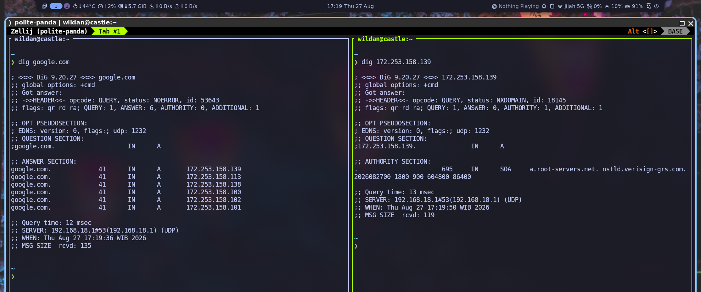

:::warning[Disclaimer]

Sebagian konten artikel ini "diisi dengan informasi dari AI (Google Gemini)".

:::


## About `dig`

`dig` adalah _utility_ berbasis CLI (_Command Line Interface_) yang dapat digunakan untuk "menginterogasi" DNS name server.[^1] `dig` umumnya digunakan untuk melakukan _troubleshoot_ masalah DNS. 

### How `dig` works

:::info[How DNS works]

Cara kerja `dig` akan lebih mudah dipahami jika kita sudah tahu cara kerja DNS. Kebetulan, saya pernah menulis artikel tentang cara kerja DNS di artikel berikut:

[[tech/changedns]]

:::

Ketika pertama kali mengetikkan perintah `dig google.com` misalnya, _by default_ `dig` akan menggunakan jaringan lokal atau DNS server milik ISP (_Internet Service Provider_) untuk mencari _ip address_ domain tersebut. Meskipun, kita bisa saja menargetkan server DNS publik tertentu (akan dibahas di bagian penggunaan `dig`) untuk mem-_bypass_ **cache lokal**. Server kemudian akan mengirimkan paket-paket berisi informasi yang di-_request_ sebelumnya.[^2] 

## Installation

Berikut adalah cara instalasi `dig` di beberapa sistem operasi linux dan unix:

::: code-group labels=[debian/ubuntu, archlinux, fedora, opensuse, freebsd]

```shell
sudo apt install -y dnsutils
```

```shell
sudo pacman -Sy bind
```

```shell
sudo dnf install bind-utils
```

```shell
sudo zypper install bind-utils
```

```shell
sudo pkg install bind-tools
```

:::
 
:::note

**NixOS:**  
Masukkan baris berikut di file konfigurasi (`/etc/nixos/configuration.nix`):

```nix title="nix"
environment.systemPackages = [
  pkgs.bind
];
```

Atau jika menggunakan `nix-shell`:

```shell
nix-shell -p bind
```

:::

## Usage

### 1. Basic usage

#### General structure

Berikut adalah struktur penggunaan perintah `dig`:

```shell
dig [@server] [domain] [type] [options]
```

Kita bisa mulai menggunakan `dig` sesimpel dengan mengetikkan perintah `dig` yang disusul dengan nama domain atau _ip address_:[^3]

```shell
# dengan nama domain
dig google.com

# atau dengan ip address
dig 172.253.158.139
```



### 2. With certain DNS server

Untuk me-_request_ informasi dari DNS server publik:

```shell
# mencari IP dari DNS Cloudflare (1.1.1.1)
dig @1.1.1.1 google.com 

# mencari domain dari DNS Google (8.8.8.8)
dig @8.8.8.8 172.253.158.139
```

### 3. Reverse DNS lookup

Kalau mencari _ip address_ dari nama domain (seperti yang sudah kita lakukan) disebut _forward lookup_, maka mencari nama domain dari _ip address_ disebut _reverse lookup_.[^4] Kita dapat mengetahui domain apa yang terhubung ke suatu _ip address_ dengan _reverse DNS lookup_ ini.

```shell
dig -x 172.253.158.139
```

### 4. Mail server

Untuk me-request informasi mail server:

```shell
ig google.com mx 
```

### 5. Name Server 

Jika kita ingin tahu sebuah "**name server**" (server yang memegang sebuah domain) sebuah alamat domain:

```shell
dig google.com ns
```

> **Keterangan:**  
> `+noall`: tidak menampilkan apapun (menghapus semua jawaban `dig`)  
> `+answer`: hanya tampilkan bagian answer

### 6. SOA records

_Request_ SOA (_The Start of Authority_), berisi informasi terkait zona (lokasi), seperti name server utama dan alamat email administrator:

```shell
dig google.com soa
```

### Display only the answer

Kalau kita tidak ingin ada "_header_" di _reply_ `dig` sehingga hanya informasi terkait yang kita butuhkan saja yang akan tampil:

```shell
dig google.com +noall +answer
```

### etc

Selebihnya tentang `dig` dan cara penggunaanya:

```shell
dig -h 

# atau
man dig
```


---

## Homework

Sebagai PR, coba kalian cari jawaban dari beberapa soal berikut:

1. Apa saja _ip address_ domain blog ini?
2. Dimana blog ini di-_hosting_?
3. Sebutkan mail server domain blog ini!
4. Sebutkan name server domain blog ini!


[^1]: https://man.archlinux.org/man/dig.1
[^2]: https://gemini.google.com
[^3]: https://contabo.com/blog/linux-dig-command-tutorial/
[^4]: https://idwebhost.com/blog/apa-itu-reverse-dns-lookup/
