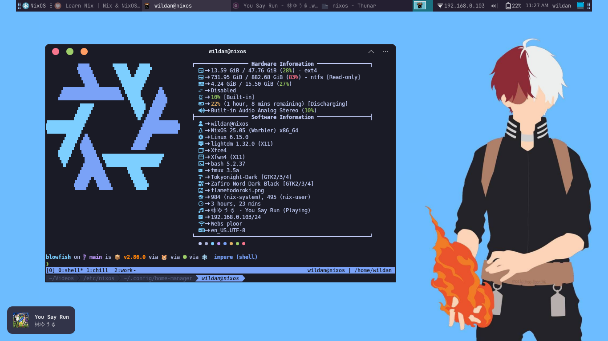

:::warning

Artikel ini tidak sedang mengajari cara membuat website Hugo, tapi menggunakan salah satu tema Hugo, yaitu [**blowfish**](https://blowfish.page/). Cara membuat website dengan Hugo ada di sini:

:::



> References:
 Semua referensi pada artikel ini merujuk pada blog dan github resmi **blowfish**:  
 https://blowfish.page  
 https://github.com/nunocoracao/blowfish

::github{repo="nunocoracao/blowfish"}

## Installation

Ada banyak cara meng-_install_ tema **blowfish** untuk Hugo, tapi yang biasa saya lakukan adalah meng-_install_-nya menggunakan **`git`** sebagai _submodule_:[^1]

```shell
cd mywebsite # masuk ke direktori website kita
git submodule add -b main https://github.com/nunocoracao/blowfish.git themes/blowfish
```

Kemudian, kita *copy* direktori `config` dari folder tema blowfish ke root *directory*:

```shell
cp themes/blowfish/config .
```

Sehingga, nanti struktur direktori kita menjadi seperti ini:

```
mywebsite
├── achetypes
├── assets
├── config
│   └── _default
│       ├── hugo.toml
│       ├── languages.en.toml
│       ├── markup.toml
│       ├── menus.en.toml
│       ├── module.toml
│       └── params.toml
├── content
├── data
├── il8n
├── layouts
├── public
└── themes
    └── blowfish
```

Sampai sini, proses instalasi telah selesai.

### Installing updates

Jika ingin meng-_update_nya suatu saat nanti:

```shell
git submodule update --remote --merge
```

Apa yang perlu dilakukan setelah berhasil update?

#### Ganti `/config`

Ganti direktori `config` di root project dengan direktori `config` dari folder `themes/blowfish/config`. Pastikan stukturnya lengkap seperti ini:

```
themes/blowfish
└── config
    └── _default
        ├── hugo.toml
        ├── languages.en.toml
        ├── markup.toml
        ├── menus.en.toml
        ├── module.toml
        └── params.toml
```

Selain itu, pastikan juga parameter-parameter yang ada di dalam filenya sudah disesuaikan dengan website kita. Jadi, jangan asal _copy-paste_.

#### Ganti `/layouts`

Ganti juga direktori `layouts` yang ada di root project dengan direktori `layouts` dari folder `themes/blowfish/layouts`. Pastikan strukturnya lengkap seperti ini:

```
themes/blowfish
└── layouts
      ├── 404.html
      ├── _default
      ├── index.html
      ├── partials
      ├── robots.txt
      └── shortcodes
```

Pastikan juga semua file yang ada di sub-direktori seperti `layouts/partials` dan `layouts/shortcodes` sudah di-copy dari folder lama ke folder baru yang akan menggantikannya.

#### Ganti `/assets`

Ganti juga direktori `assets` di root project dengan direktori `assets` dari folder `themes/blowfish/assets`, sebab dari sanalah hugo akan membaca file **CSS** dan **JS** untuk men-build website kita. Pastikan strukturnya lengkap seperti ini:

```
themes/blowfish
└── layouts
      ├── css
      ├── icons
      ├── img
      ├── js
      └── libs
```

Pastikan juga di setiap sub-direktori, kita sudah meng-_copy-paste_ aset kita sendiri untuk dipindahkan ke direktori `assets` yang baru. Dan perhatikan juga jika kita menambahkan folder baru di direktori `assets` yang lama, maka direktori itu juga perlu diikutsertakan dalam migrasi ke direktori `assets` yang baru.

:::note

Pastikan juga jika sudah meng-update versi hugo yang digunakan untuk men-deploy static site ini, kalian juga perlu meng-update versi-nya di `.github/workflow/hugo.yaml` agar Github Pages tetap bisa men-deploy-nya dengan normal.

:::

## Basic Configuration

Semua file konfigurasi dapat diubah/disesuaikan di direktori `config/_default/`.

### 1. `hugo.toml`

Di file ini, kita perlu menyesuaikan beberapa hal, diantaranya:

```toml title="hugo.toml"
theme = "blowfish" # UNCOMMENT THIS LINE
baseURL = "https://your_domain.com/" # Diganti dengan domain website-nya
```

### 2. `languages.en.toml`

Di file ini, kita dapat mengganti beberapa hal berikut:

```toml title="languages.en.toml"
title = "Blowfish" # Yang muncul di pojok kiri atas
logo = "img/logo.png" # Menampilkan logo di sebelah title 

[params.author] # Untuk menambahkan informasi tentang author
  name = "Wildan"
  email = "emailkalian@server.com"
  image = "author.png" # gambar / foto author
  imageQuality = 96
  headline = "An Ordinary Human Being"
  bio = "An Ordinary Human Being"
  links = [
    { discord = "https://discord.gg/invitecode" }, # Menambahkan media sosial 
    { github = "https://github.com/username" },
  ] 
```

### 3. `menus.en.toml`

Konfigurasi menu yang akan muncul di sebelah kanan atas website:

```toml title="menus.en.toml"
[[main]]
  name = "Blog"
  pageRef = "posts" # Case-sensitive, merujuk pada direktori-direktori di bawah `content/`
  weight = 10 # Mengatur urutan menu dari kiri ke kanan

  [[main]]
  pre = "article" # Menambahkan icon di samping menu (logo diambil dari `assets/icons`)
  name = "Tech"
  pageRef = "tech"
  weight = 20

  [[main]] # Menambahkan menu dengan icon service tertentu (Github)
  identifier = "github"
  pre = "github"
  url = "https://github.com/namagithubnya"
  weight = 35
```

### 4. `params.toml`

Ada banyak parameter yang dapat kita ganti di file ini:

```toml title="params.toml"
# Silakan di-comment (#) bagian yang tidak ingin diaktifkan

colorScheme = "blowfish" # Ada 14 colorscheme yang disediakan
defaultAppearance = "light" # valid options: light or dark

enableSearch = true # Mengaktifkan fitur "search"

defaultBackgroundImage = "IMAGE.jpg" # used as default for background images

highlightCurrentMenuArea = true # Meng-highlight menu saat ini
smartTOC = true # Meng-highlight daftar isi yang sedang dibaca saat ini
smartTOCHideUnfocusedChildren = true # Menyembunyikan daftar isi yang sedang tidak dibaca 

[header] # Pengaturan header
  layout = "basic" # valid options: basic, fixed, fixed-fill, fixed-gradient, fixed-fill-blur

[footer] # Pengaturan footer, tipe data: boolean (true/false)
  showMenu = true
  showCopyright = true
  showThemeAttribution = true
  showAppearanceSwitcher = true
  showScrollToTop = true

[homepage] # Pengaturan homepage
  layout = "profile" # valid options: page, profile, hero, card, background, custom
  #homepageImage = "IMAGE.jpg" # used in: hero, and card
  showRecent = false 
  showRecentItems = 5 
  showMoreLink = false
  showMoreLinkDest = "/posts/"
  cardView = false
  cardViewScreenWidth = false
  layoutBackgroundBlur = false # only used when layout equals background

[article] # Pengaturan untuk setiap artikel
  showDate = true 
  showViews = false
  showLikes = false
  showDateOnlyInArticle = false
  showDateUpdated = false
  showAuthor = true
  # showAuthorBottom = false
  showHero = false
  # heroStyle = "basic" # valid options: basic, big, background, thumbAndBackground
  layoutBackgroundBlur = true # only used when heroStyle equals background or thumbAndBackground
  layoutBackgroundHeaderSpace = true # only used when heroStyle equals background
  showBreadcrumbs = false
  showDraftLabel = true
  showEdit = false
  # editURL = "https://github.com/username/repo/"
  editAppendPath = true
  seriesOpened = false
  showHeadingAnchors = true
  showPagination = true
  invertPagination = false
  showReadingTime = true
  showTableOfContents = false
  # showRelatedContent = false
  # relatedContentLimit = 3
  showTaxonomies = false # use showTaxonomies OR showCategoryOnly, not both
  showCategoryOnly = false # use showTaxonomies OR showCategoryOnly, not both
  showAuthorsBadges = false
  showWordCount = true
  # sharingLinks = [ "linkedin", "twitter", "bluesky", "mastodon", "reddit", "pinterest", "facebook", "email", "whatsapp", "telegram"]
  showZenMode = false

[list] # Pengaturan untuk daftar artikel di setiap menu
  showHero = true
  heroStyle = "background" # valid options: basic, big, background, thumbAndBackground
  layoutBackgroundBlur = true # only used when heroStyle equals background or thumbAndBackground
  layoutBackgroundHeaderSpace = false # only used when heroStyle equals background
  showBreadcrumbs = true
  showSummary = true
  showViews = false
  showLikes = false
  showTableOfContents = false
  showCards = false
  orderByWeight = false
  groupByYear = false
  cardView = true
  cardViewScreenWidth = false
  constrainItemsWidth = false

[term] # Pengaturan untuk tags & categories
  showHero = true
  heroStyle = "background" # valid options: basic, big, background, thumbAndBackground
  showBreadcrumbs = true
  showViews = false
  showLikes = false
  showTableOfContents = false
  groupByYear = false
  cardView = false
  cardViewScreenWidth = false
```

:::note

1. **Header Layout**

Bagian header layout memiliki 5 template tema, yaitu:
- basic
- fixed
- fixed-fill
- fixed-gradient
- fixed-fill-blur

Silakan merujuk ke website blowfish untuk melihat langsung perbedaannya:

2. **ColorScheme**

Ada 14 ***colorscheme*** yang disediakan oleh blowfish, diantaranya:


- blowfish (default)
- avocado
- fire
- ocean
- forest
- princess
- neon
- bloody
- terminal
- marvel
- noir
- autumn
- congo
- slate 



Silakan merujuk ke websitenya langsung untuk melihat & memilih. Selain dapat memilih _template_ ***colorscheme***, kita juga dapat membuat ***colorscheme*** kita sendiri yang juga dijelaskan caranya di websitenya:

> Tautan: https://blowfish.page/docs/getting-started/#colour-schemes

3. **Homepage Layout**

Ada 6 ***homepage layout*** yang disediakan, yaitu:
- page
- profile
- hero
- card
- background
- custom

Pengaturan ***homepage layout*** juga lebih baik dilihat langsung ke websitenya, supaya lebih mudah membandingkan dan melihat perbedaannya:

> Tautan: https://blowfish.page/docs/homepage-layout/

4. **HeroStyle**

Pengaturan ***heroStyle*** ada di bagian "article", "list", "taxonomy", dan "term". Terdapat 4 ***heroStyle*** yang dapat dipilih, yaitu 
- basic
- big
- background
- thumbAndBackground

Untuk bagian ini, silakan dicoba manual sendiri untuk mencari ***heroStyle*** yang cocok.

:::

## Blowfish vs Kayal



Sebetulnya, sudah lama dari artikel ini dibuat sejak saya berganti tema Hugo dari [Kayal](https://mnjm.github.io/kayal/) ke [Blowfish](https://blowfish.page/). Saya berpindah tentu bukan tanpa alasan. Beberapa fitur yang saya perlukan dan saya cari-cari sejak awal membuat _static-site_ ini akhirnya terpenuhi di [Blowfish](https://blowfish.page/). Berikut adalah beberapa perbandingan [Blowfish](https://blowfish.page/) & [Kayal](https://mnjm.github.io/kayal/) versi saya:

| Aspek           | Blowfish                       | Kayal                     |
| ---             | ---                            | ---                       |
| Desain          | Modern                         | Sederhana                 |
| Fitur & Kustomisasi     | [Berlimpah](https://blowfish.page/docs/shortcodes/)  | [Terbatas](https://mnjm.github.io/kayal/docs/shortcodes/)  |
| Dokumentasi     | [Cukup lengkap](https://blowfish.page/docs/)  | [Kurang](https://mnjm.github.io/kayal/docs/)  |
| Komunitas       | [Ramai](https://blowfish.page/users/) | Tidak ada          |
| Ukuran          | 500-an MB                      | <10 MB                    |

Itulah tadi beberapa keunggulan Blowfish dibandingkan Kayal yang pada akhirnya membuat saya memutuskan untuk mengganti tema Hugo saya. 😎

---

Btw, artikel ini dibuat di distro linux yang baru saja saya coba: [**NixOS**](https://nixos.org/)




[^1]: https://blowfish.page/docs/installation/
[^2]: https://blowfish.page/docs/getting-started/#colour-schemes