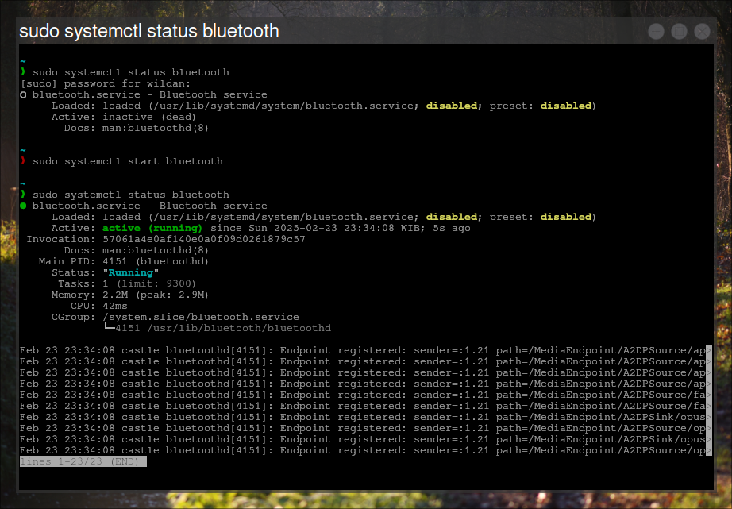
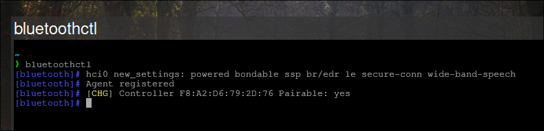
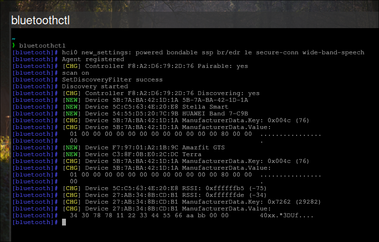
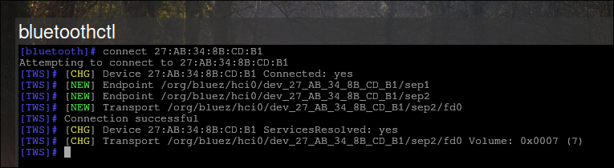
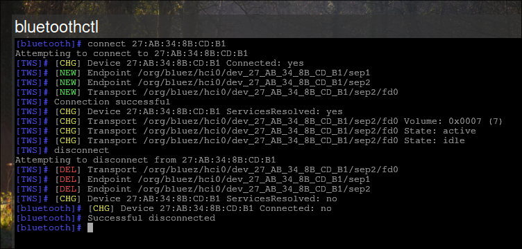
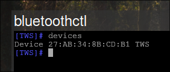
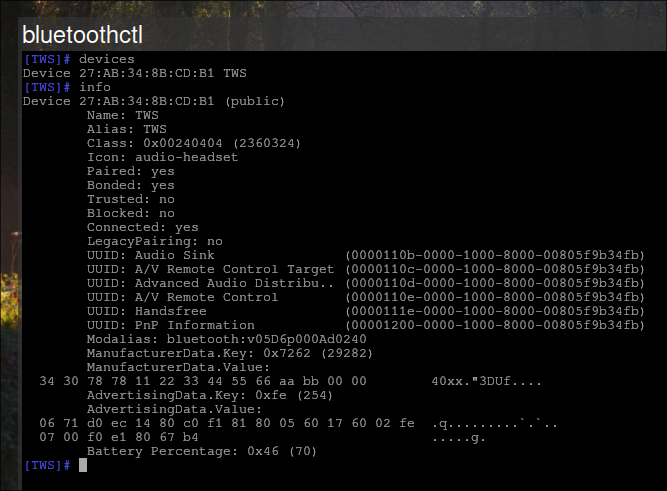

**`bluetoothctl`** adalah _utility_ yang digunakan untuk mengontrol perangkat wireless berbasis bluetooth via terminal[^1]. Oleh karena _tool_ ini berbasis CLI (_Command Line Interface_) alias tidak memerlukan GUI (_Graphical User Interface_) untuk dijalankan, maka **`bluetoothctl`** memberikan kemudahan kepada kita (Linux user) dalam me-_manage_ perangkat bluetooth.

:::note

**Catatan:**  
Mengapa saya (dan mungkin teman-teman pengguna Linux serta para professional Linux) lebih menyukai aplikasi berbasis terminal? Tentu saja alasannya sederhana:
**Karena aplikasi berbasis CLI adalah aplikasi yang tidak bergantung pada GUI**, maka itu berarti bahwa _tool_ tersebut dapat dijalankan pada _interface_ yang paling sederhana, misalnya ketika mode TTY seperti yang lumrah kita dapatkan, apalagi jika bekerja di server Linux. 

:::

Saya pernah menulis sedikit mengenai TTY, btw, berikut tautan artikelnya:

[[/tech/tty/]]

## Prerequisites:

Beberapa hal yang perlu dipersiapkan sebelum mengoperasikan **`bluetoothctl`**[^2]:

### 1. Meng-_install_ paket yang diperlukan (`bluez`)

Pertama-tama, tentu saja kita perlu meng-_install_ paket `bluez` karena **`bluetoothctl`** ada di dalamnya:

|       Distro      |                  Command                      |
|       ---         |                   ---                         |
| **Debian/Ubuntu** | **`sudo apt install bluez`**                  |
| **Arch Linux**    | **`sudo pacman -Sy bluez`**                   |
| **Opensuse**      | **`sudo zypper install bluez`**               |
| **Fedora**        | **`sudo dnf install bluez`**                  |

Selesai.

### 2. Pastikan **bluetoothd** sudah _running_

**bluetoothd** adalah daemon bluetooth, semacam server yang meng-_handle_ per-bluetooth-an:

```bash
# Menjalankan bluetooth hanya untuk session saat ini:
sudo systemctl start bluetooth 

# Menjalankan bluetooth setiap kali login:
sudo systemctl enable bluetooth
```

Untuk melihat statusnya:

```bash
sudo systemctl status bluetooth
```

Jika **bluetoothd** sudah _running_, berikut statusnya:




## **`bluetoothctl`** Tutorial:

Berikut adalah langkah-langkah penggunaan **`bluetoothctl`**:

### 1. Masuk ke shell **`bluetoothctl`**

```bash
bluetoothctl
```



Ketika masuk ke **`bluetoothctl`**, kita dapat melihat controller-nya juga.

### 2. _Scanning_ perangkat

```bash
scan on
```



Tampak beberapa perangkat bluetooth ter-_scan_. Namun, perangkat yang akan saya hubungkan adalah TWS atau headset bluetooth dengan MAC **27:AB:34:8B:CD:B1**.

### 3. _Connecting_ perangkat

```bash
connect 27:AB:34:8B:CD:B1
```



Jika perangkat sudah terhubung dengan baik, maka seperti terlihat pada tangkapan layar, **`bluetoothctl`** akan memberikan notifikasi **"Connection Succesful"**. Selain itu, terlihat **prompt**-nya juga berubah menyesuaikan dengan nama perangkat yang berhasil terhubung (di saya berubah menjadi **TWS**).

### 4. _Disconnecting_ perangkat

```bash
disconnect
```



Jika sudah selesai menggunakannya, kita dapat men-_disconnect_ perangkat tersebut dengan mengetikkan perintah `disconnect`, dan bila berhasil, **`bluetoothctl`** akan menampilkan status **Succesful disconnected**. Selain itu, **prompt**-nya juga akan kembali seperti semula.

### 5. _Remove_ perangkat

```shell
remove 27:AB:34:8B:CD:B1
```

Perintah di atas digunakan untuk menghapus perangkat yang sudah pernah kita _pair_ sebelumnya. Ini dapat dilakukan terutama untuk _troubleshooting_ masalah yang mungkin saja bisa terjadi pada koneksi antara perangkat dengan bluetooth laptop/komputer kita. Jadi, untuk mengatasi masalah (misalnya, perangkat headset sudah terhubung ke bluetooth komputer, tapi suara tidak masuk), kita bisa terlebih dahulu menhapus perangkat terkait, kemudian menghubungkannya kembali. 


## Additional Notes:

Beberapa catatan tambahan:

### 1. _Pairing_ perangkat

Perlu dicatat, tutorial ini saya tulis ketika saya sudah biasa menggunakan perangkat TWS sehingga baik-baik saja jika saya tidak memasukkan proses _pairing_ (alias setelah _scan_ langsung _connect_). Mungkin, beberapa perangkat perlu dilakukan _pairing_ terlebih dahulu sebelum _connect_, berikut perintahnya:

```bash
pair 27:AB:34:8B:CD:B1
``` 

### 2. _Listing_ perangkat

Kita juga dapat melihat perangkat apa saja yang pernah terhubung, atau jika perintah ini dilakukan setelah *scanning*, maka akan terlihat perangkat-perangkat yang berhasil ter-*scan*:

```bash
devices
```



### 3. _Device info_

Kita juga dapat melihat info rinci mengenai _device_ yang terhubung:

```bash
info
```



---

Btw, saya membuat artikel ini di [**Wayfire**](https://wayfire.org/)-nya Archlinux.

[grid]


[/grid]


[^1]: https://wiki.archlinux.org/title/Bluetooth
[^2]: https://bandithijo.dev/blog/mudah-menggunakan-bluetoothctl


