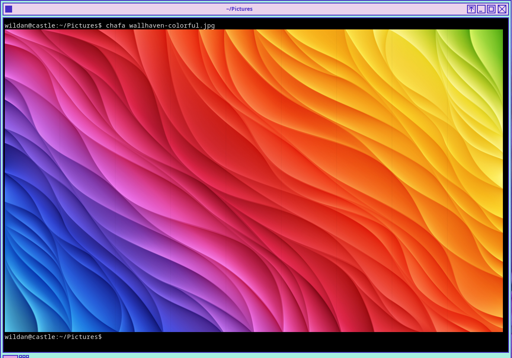
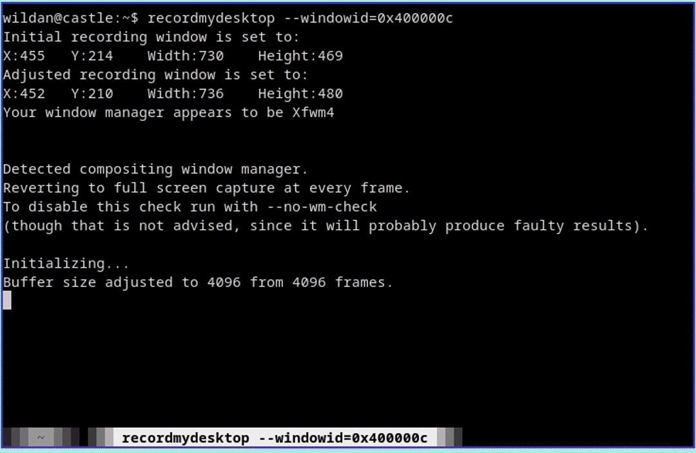

Sejak dahulu kala saya mencari program yang bisa menge-*print* gambar di dalam terminal. Tapi, saya tak kunjung menemukannya hingga beberapa saat lalu, saya menjumpainya dari suatu video Youtube [Eric Murphy](https://www.youtube.com/@EricMurphyxyz) yang berjudul **"Ueberzug is dead. Now What? (Terminal image previews without Ueberzug)"**:

<iframe width="100%" height="468"
  src="https://www.youtube.com/embed/nTQWI0OalVk"
  title="How to Install Windows Vista + Aero on VMWare"
  frameborder="0" allowfullscreen>
</iframe>

Alasan saya mencari program yang bisa menampilkan gambar di dalam terminal adalah karena salah satu kriteria terminal yang bagus bagi saya adalah kemampuannya untuk me-*render* gambar. Dulu, saya hanya kenal [ueberzug](https://github.com/seebye/ueberzug), sementara program tersebut (sependek pengetahuan saya) tidak bisa digunakan sebagai perintah di terminal. Jadi, hanya sebatas program "pasif" untuk menampilkan gambar di file manager berbasis CLI seperti [ranger](https://github.com/ranger/ranger).

> Link repo official github Chafa:
> ::github{repo="hpjansson/chafa"}

Seperti yang tampil pada *summary* artikel ini, <mark> chafa adalah program berbasis CLI untuk menampilkan data gambar (termasuk GIF! wow~) di dalam sebuah terminal. </mark>

Instalasinya cukup mudah, via official repo setiap distro:

|       Distro      |                  Command                  |
|       ---         |                   ---                     |
| **Debian**        | **`sudo apt install chafa`**              |
| **Arch Linux**    | **`sudo pacman -Sy chafa`**               |
| **Fedora**        | **`sudo dnf install chafa`**              |
| **Opensuse**      | **`sudo zypper install chafa`**           |

```bash
chafa Picture/location-of-your-pic.jpg
```

Boom!



GIF-nya jangan lupa!!



Keren banget, bukan? 

Tapi, kalau dilihat di *official* repo github-nya, program **chafa** ini memang relatif baru rilis, sekitar 2 tahun lalu. Jadi, saat itu (ketika saya mencari-cari program seperti chafa) saya mungkin saja belum menjumpai chafa karena program ini (mungkin) belum lahir. 

Wkwkwk~


