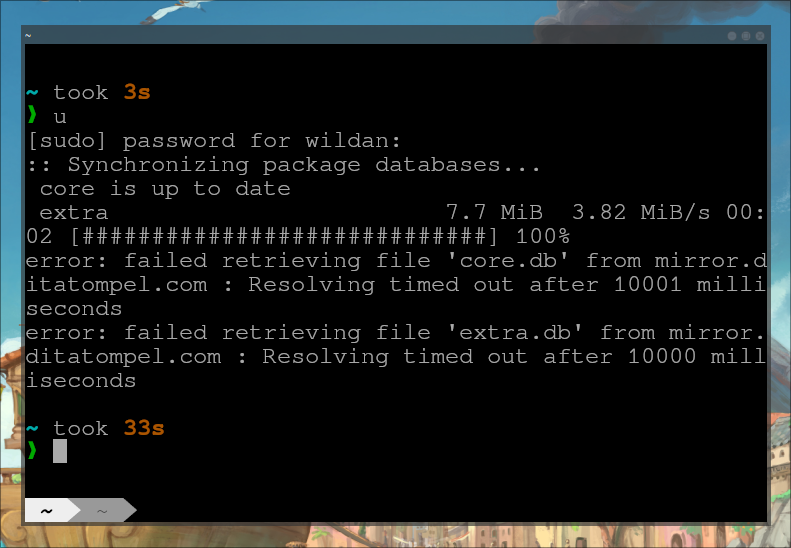
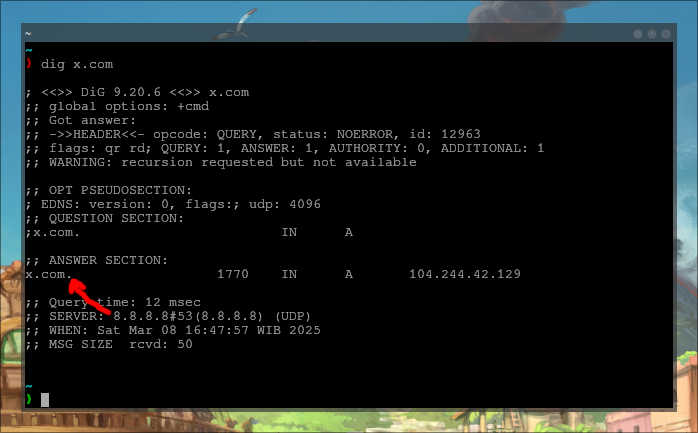
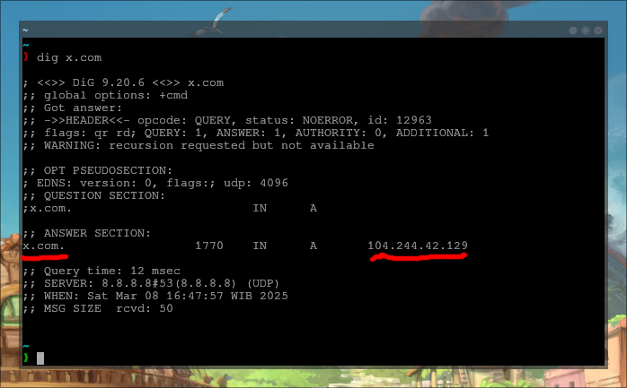
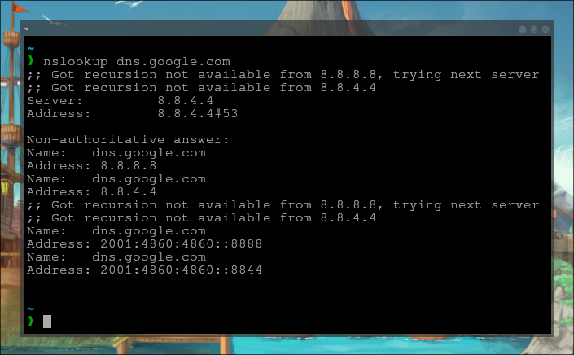
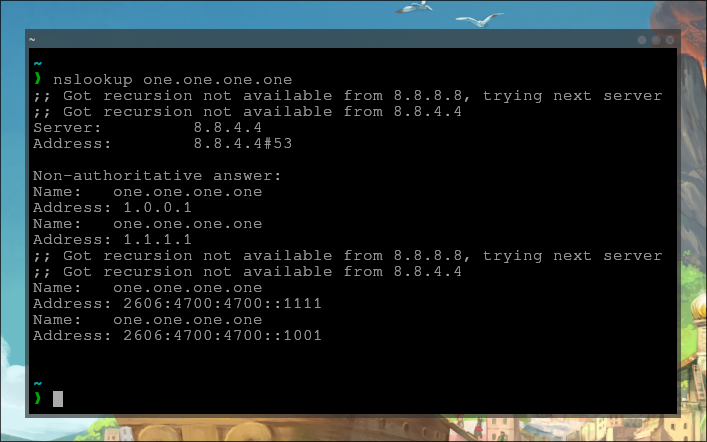
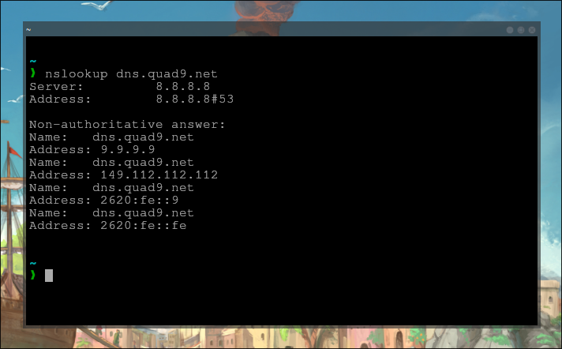
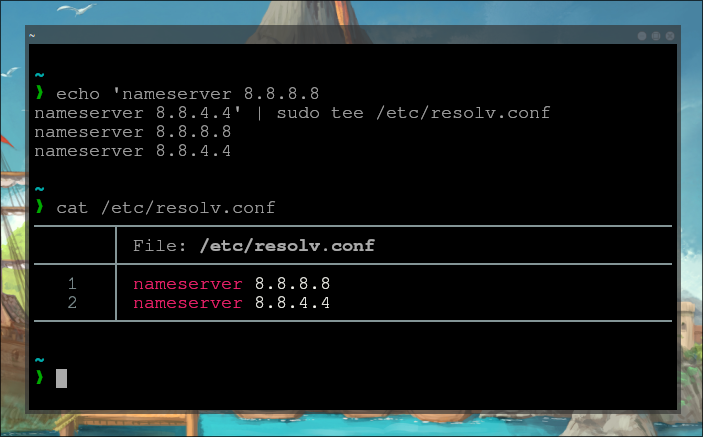

## The "WHY"

Pembuatan artikel berjudul **"The Power of DNS"** ini dilatarbelakangi oleh beberapa masalah yang dahulu kala sempat melanda saya dan cukup membuat frustasi mengingat saya sangat awam tentang jaringan internet semacam ini. Beberapa tantangan yang relatif sering saya hadapi, diantaranya:
- Sangat lamban untuk terhubung ke internet, bahkan hanya untuk *Google-ing* atau Youtube.
- Sulit mengakses repo distro untuk meng-*update* paket-paket.
- Tidak bisa meng-*cloning* repo di Github.
- Reddit (dan sub-reddit seperti r/unixporn) diblokir.

Berikut salah satu buktinya:


Jadi, jelas, artikel ini dimaksudkan untuk menyelesaikan permasalahan-permasalahan tersebut dengan satu solusi sederhana saja, yaitu mengganti DNS.

## The "WHAT"

*The problem has been defined, now it is our turn to solve it.*

Tapi, sebelum masuk ke inti solusi, mari kita ulas sedikit tentang apa itu DNS terlebih dahulu.

> **DNS** yang merupakan singkatan dari **Domain Name System** adalah sistem yang memudahkan kita (atau perangkat/*devices* secara teknis) untuk terhubung ke website tanpa menggunakan *ip address*, tapi menggunakan nama domain.[^1]

Cara kerja DNS seringkali diibaratkan sebagai buku telpon atau kalau sekarang mungkin boleh diibaratkan sebagai aplikasi *Contact* yang ada di *smartphone*. Setiap smartphone memiliki nomor telepon (contoh: 0822-1234-4321), namun, agar kita sebagai pengguna hape tidak perlu mengingat setiap nomor orang, maka aplikasi *Contact* tersebut memfasilitasi kolom nama yang dapat kita isi untuk memudahkan kita untuk mencari dan menghubungi nomor-nomor tersebut.

Begitu juga dengan cara kerja di internet, setiap website memiliki nomor *ip address* (contoh: 216.239.38.120). Kita tidak mungkin harus mengetikkan nomor-nomor tersebut di *search bar* di browser setiap kali ingin membuka Google. Jadi, dibuatklah sistem untuk mewakilkan *ip address* dalam sebuah nama, yaitu ***Domain Name System (DNS)***.

Ya, memang sesederhana itu definisi dan cara kerja DNS...

## The "WHO"

Siapa yang membuat DNS?

DNS ditemukan oleh *scientist* Amerika bernama **Paul Mockapetris** pada tahun 1983.[^2] Sebelum ditemukannya DNS, sistem pencarian situs atau website di internet masih menggunakan *ip address*. Kemudian, atas usul dari Mockapetris, dibuatlah sistem tabel yang mereferensikan *ip address* ke sistem penamaan yang dinamis yang sekarang disebut sebagai DNS.

Siapa yang mengatur DNS saat ini?

Saat ini, lalu lintas dan alamat setiap perangkat atau website di internet diatur dan dikelola oleh sebuah perusahaan di California, Amerika Serikat bernama **Internet Corporation for Assigned Names and Numbers (ICANN)**.[^3]

## The "HOW"

Meskipun secara garis besar kita sudah paham cara kerja DNS, namun, jika melihat lebih detail, DNS bekerja dalam beberapa tahapan atau level. Untuk memahami cara kerja DNS secara spesifik, kita perlu mengetahui setidaknya 4[^4] jenis server DNS terlebih dahulu.[^1]

[](https://www.youtube.com/@PowerCertAnimatedVideos)

1. **DNS recursor / DNS resolver**

DNS recursor / DNS resolver adalah server DNS yang bertanggung jawab untuk merespon *request* *ip address* suatu website dari perangkat kita. 

Misalnya, kita ingin membuka **`google.com`** di browser di laptop, maka laptop kita pertama-tama akan menghubugi DNS recursor tersebut untuk meminta *ip address* dari **`google.com`**. Server DNS recursor / DNS resolver biasanya terdapat di ISP (*Internet Service Provider*) yang kita gunakan, misalnya seperti indih[.]m, bizn[.]t, dan lainnya.

DNS recursor / DNS resolver juga dapat diibaratkan sebagai [pegawai perpustakaan (pustakawan)](https://kbbi.kemdikbud.go.id/entri/pustakawan) yang pertama kali kita tanya jika ingin mencari buku.

2. **Root nameserver**

Root nameserver adalah server DNS yang bertanggung jawab untuk merespon *request* *ip address* dari DNS recursor / DNS resolver. Alamat dari Root nameserver adalah simbol titik **[.]** yang berada paling di akhir setiap domain. Misalnya:

```shell
www.google.com.
```

> Perhatikan bahwa di akhir setelah .com ada titik yang mereferensikan Root server.

Root nameserver juga dapat diibaratkan sebagai sebuah indeks di perpustakaan yang merujuk ke setiap rak buku.



3. **TLD nameserver**

TLD (*Top Level Domain*) server adalah server DNS yang bertaggung jawab untuk membantu mencarikan *ip address* yang diminta oleh Root nameserver dengan memberikan bagian akhir dari sebuah domain atau disebut sebagai *Top Level Domain* (TLD). Misalnya, dalam domain `www.google.com`, bagian **com** adalah TLD-nya.

:::info

Ada banyak TLD (*Top Level Domain*) di internet, diantaranya:
- **.com** ([google.com](https://www.google.com/), [tokopedia.com](https://www.tokopedia.com/), [github.com](https://github.com/), etc)
- **.org** ([archlinux.org](https://archlinux.org/), [virtualbox.org](https://www.virtualbox.org/), [wikipedia.org](https://www.wikipedia.org/), etc)
- **.net** ([ankiweb.net](https://ankiweb.net/), [speedtest.net](https://www.speedtest.net/), [minecraft.net](https://www.minecraft.net/en-us), etc)
- **.gov** ([nasa.gov](https://www.nasa.gov/), [usa.gov](https://www.usa.gov/), [gov.sg](https://www.gov.sg/), etc)
- etc.

Untuk referensi lebih lanjut, silakan merujuk ke:  
https://en.wikipedia.org/wiki/List_of_Internet_top-level_domains

:::

TLD nameserver juga dapat diibaratkan sebagai rak buku spesifik di perpustakaan yang merujuk pada kategori buku tertentu.

 

4. **Authoritative nameserver**

Authoritative nameserver adalah server DNS yang bertanggung jawab untuk memberikan *ip address* dari nama domain yang diminta oleh TLD nameserver. Server DNS ini adalah server terakhir yang diakses oleh server-server ketika mencari nomor *ip address* dari suatu nama domain. Jadi, jika misalnya DNS recursor / DNS resolver tadi di awal meminta *ip address* `www.google.com`, maka Authoritative nameserver sebagai DNS server terakhir akan memberikan alamat ip tersebut ke DNS recursor / DNS resolver.

Begitupula jika diibaratkan di perpustakaan, Authoritative nameserver adalah alamat/nomor/buku spesifik yang diberikan ke pustakawan (DNS recursor / DNS resolver).

Dan semua proses tersebut tentu saja berlangsung *behind the scene* alias tanpa campur tangan kita sebagai user.



Video penjelasan cara kerja DNS di Youtube:

<iframe width="100%" height="468"
  src="https://www.youtube.com/embed/mpQZVYPuDGU"
  title="How to Install Windows Vista + Aero on VMWare"
  frameborder="0" allowfullscreen>
</iframe>

## The "WHEN"

Sekarang, kita paham cara kerja DNS. 

Namun, pertanyaan yang perlu kita cari solusinya masih belum secara gamblang terjawab:  
- Mengapa terkadang internet kita terasa lamban untuk mengakses website?  
- Mengapa kita sulit mengakses repo distro linux untuk update packages?  
- Mengapa cloning repo dari Github tidak bisa dilakukan?  
- Mengapa situs terblokir (seperti Reddit) tidak bisa diakses?

> **Jawaban sederhananya, bisa jadi semua *problem* tersebut disebabkan karena kita menggunakan DNS resolver yang tidak tepat.**

Secara default, perangkat kita (komputer, laptop, smartphone) merujuk pada DNS resolver dari ISP (*Internet Service Provider*) yang digunakan ketika berselancar di internet. Jadi, *device* kita akan minta *ip address* dari website-website yang kita kunjungi ke DNS resolver yang dikelola oleh ISP. Nah, beberapa diagnosa masalah dapat muncul karena kita menggunakan DNS resolver milik ISP-ISP lokal tersebut, setidaknya karena satu hal yang pasti: **"ISP lokal pasti mengikuti regulasi pemerintah."** Jadi, beberapa website tidak dapat diakses mungkin karena memang tidak didaftarkan pada DNS resolver-nya atau memang sengaja diblokir oleh ISP agar tidak dapat diakses (tentu dengan tujuan yang baik, misalnya untuk menghindari judi online, pornografi, *phishing*, dan lain-lain).

Solusinya? Gunakan DNS Resolver non-ISP lokal.

Ada beberapa perusahaan penyedia DNS resolver, seperti:[^5]
- **Google:** [8.8.8.8, 8.8.4.4](https://developers.google.com/speed/public-dns/docs/using)


- **Cloudflare:** [1.1.1.1, 1.0.0.1](https://developers.cloudflare.com/1.1.1.1/ip-addresses/)


- **Quad9:** [9.9.9.9, 149.112.112.112](https://www.quad9.net/)


- etc

*So*, kapan waktu yang tepat untuk mengganti DNS? Saat diperlukan...

:::note

Perhatikan bahwa setiap DNS resolver dibuat dengan tujuannya masing-masing. 
Ada yang dibuat khusus untuk publik, alias akan menampilkan semua pencarian tanpa filter seperti DNS milik Google. Namun, ada juga yang dibuat untuk membuat filter konten tertentu pada hasil pencarian, seperti DNS milik Quad9 dan NextDNS. 

:::

## The "WHERE"

Sekarang, untuk mengatur agar perangkat kita (terutama Archlinux) merujuk ke DNS resolver yang kita inginkan, satu file yang perlu kita perhatikan, yaitu:  
**`/etc/resolv.conf`**

Kita hanya perlu mengisi file tersebut dengan *nameserver* dan *ip address* dari DNS resolver yang ingin kita gunakan. Misalnya, jika saya ingin menggunakan DNS resolver dari Google, maka isi file-nya adalah sebagai berikut:

```
nameserver 8.8.8.8
nameserver 8.8.4.4
``` 

Atau jika ingin menggantinya langsung di terminal, kita dapat menggunakan perintah:

```shell
echo 'nameserver 8.8.8.8
nameserver 8.8.4.4' | sudo tee /etc/resolv.conf
```



Dengan demikian, sekarang Archlinux saya akan me-*request* *ip address* ke DNS resolver Google.

> Jika ingin berganti DNS resolver, kita cukup mengganti *ip address*-nya saja sehingga formatnya tetap sama: **`nameserver ip-address`**.


Semoga bermanfaat!  
Harap digunakan dengan sebaik-baiknya ya! 😊


[^1]: https://www.cloudflare.com/learning/dns/what-is-dns/
[^2]: https://www.internethalloffame.org/inductee/paul-mockapetris/
[^3]: https://wikijuris.net/cyberlaw/dns/
[^4]: https://www.youtube.com/watch?v=mpQZVYPuDGU&ab_channel=PowerCertAnimatedVideos
[^5]: https://www.techradar.com/news/best-dns-server


