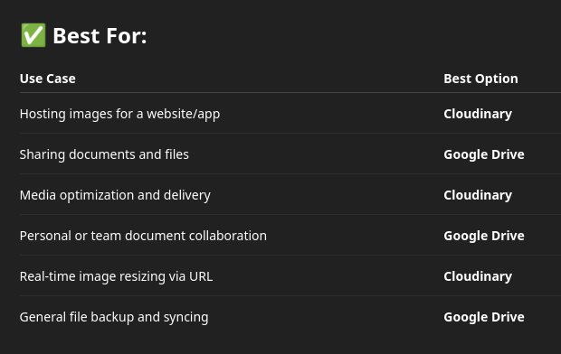
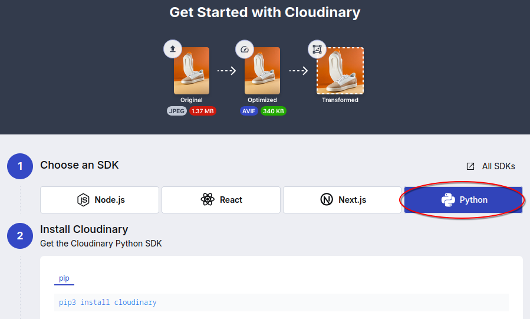
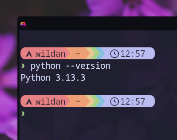
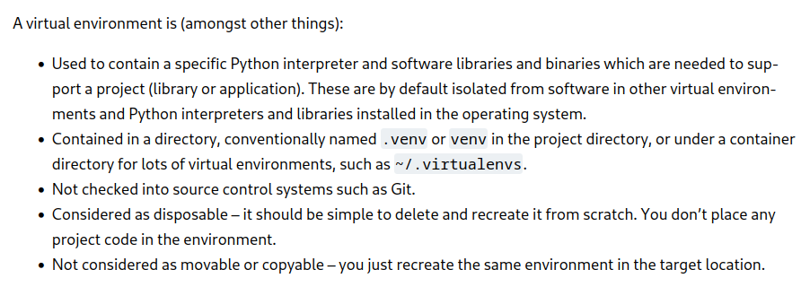
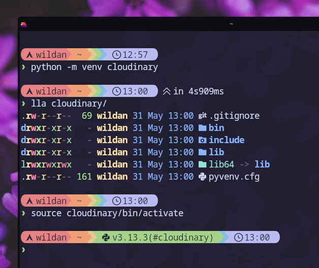
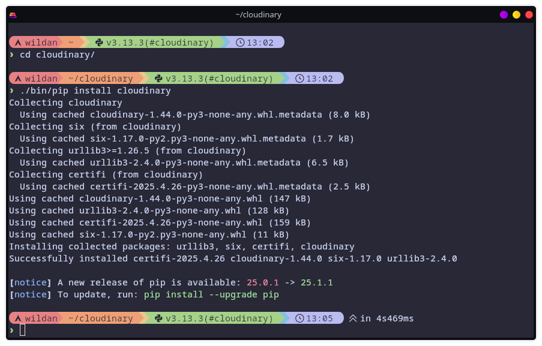
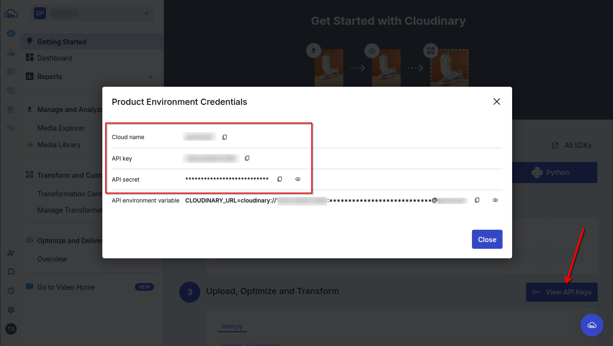
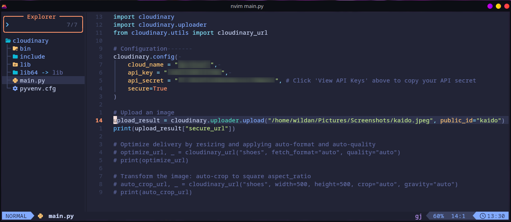
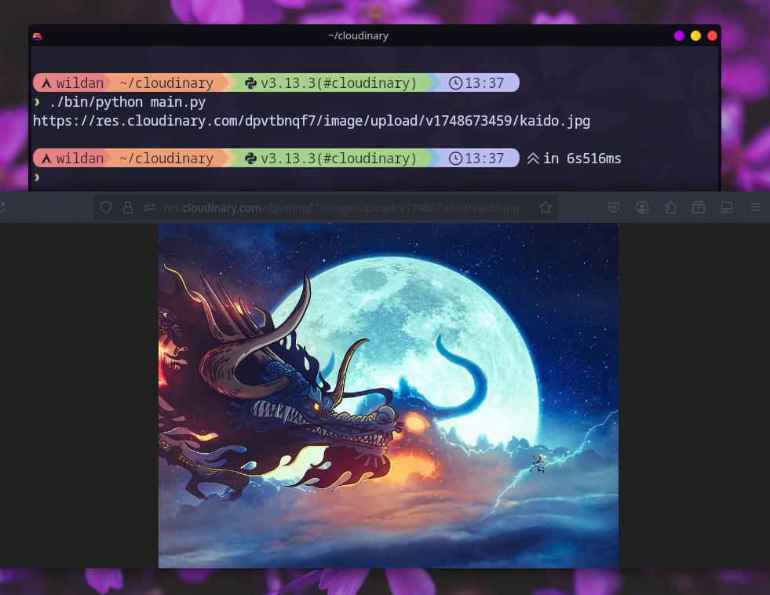
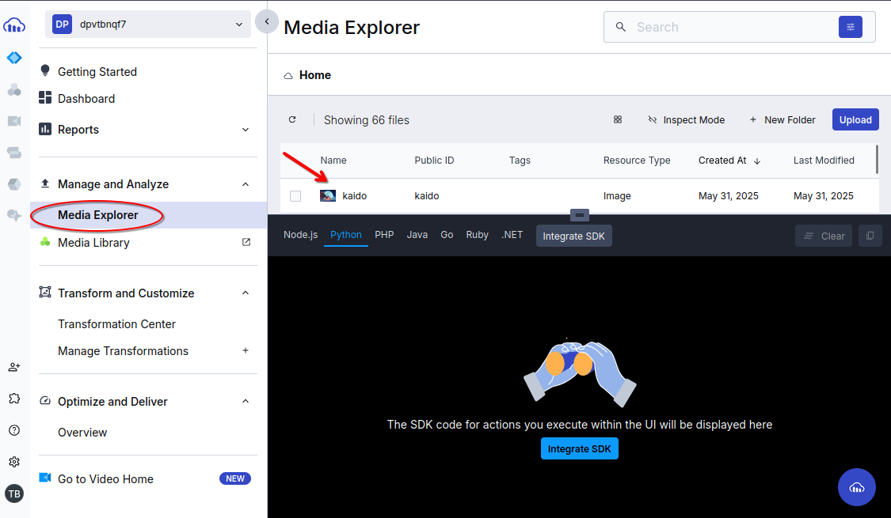

## About Cloudinary

Cloudinary adalah _platform_ penyedia jasa untuk meng-_upload_, me-_manage_, dan men-_deliver_ file gambar dan video.[^1] Ya, singkatnya, Cloudinary adalah platform untuk _hosting_ file gambar dan video.

### Cloudinary vs Google Drive

Mungkin ada yang bertanya-tanya,  

_"Apa bedanya cloudinary dengan Google Drive?"_  
_"Bukankah Google Drive lebih familiar?"_

Nah, sebetulnya, secara fungsi dasar, keduanya sama-sama berfungsi untuk menyimpan file gambar dan video (walaupun Google Drive tidak terbatas itu saja) secara daring di [cloud](https://www.cloudflare.com/learning/cloud/what-is-the-cloud/), namun, secara fungsi spesifiknya, Google Drive dan Cloudinary memiliki perbedaan yang cukup siginifikan. 

Google Drive didesain untuk ***"backup"*** file (gambar, video, etc).  
Cloudinary didesain untuk ***"hosting"*** file (gambar & video).

Satu kata kunci lagi untuk menjelaskan perbedaan keduanya, yaitu **CDN (*Content Delivery Network*)** yang bertugas untuk mengurusi masalah performa. Cloudinary dengan tujuannya sebagai tempat *hosting*, menggunakan CDN, sementara Google Drive tidak.

> Artikel ini tidak membahas tentang CDN sehingga jika ingin tahu lebih banyak tentang CDN dapat mengunjungi artikel berikut:  
https://www.cloudflare.com/learning/cdn/what-is-a-cdn/

Poin minusnya adalah untuk yang non-bayar (alias gratis), ukuran maksimal file yang dapat di-_upload_ adalah 10 MB untuk file gambar & 100 MB untuk file video.[^2]

Jadi, mana yang lebih baik? Google Drive atau Cloudinary?  
Tentu saja, **Yang Sesuai Kebutuhan**. 😊



## Uploading File

Sekarang, kita akan mulai mencoba mengunggah file ke Cloudinary. Berikut adalah _step by step_-nya.

### 1. Login

Kita perlu masuk terlebih dahulu ke Cloudinary terlebih dahulu sebelum dapat menggunakannya. Jika belum memiliki akun, kita harus membuatnya terlebih dahulu. Saya tidak akan membahas secara detail cara membuat & login ke akun di artikel ini karena saya kira cukup mudah untuk dilakukan.

Setelah berhasil login, kira-kira, seperti inilah tampilan _interface_-nya:


### 2. Running Python Script

Pada tampilan tersebut, klik bagian **Python**.



Dan kita akan disajikan tahapan-tahapan membuat otomatisasi manajemen file gambar dan video melalui Python di sana, termasuk diantaranya adalah meng-_install_ **`pip`** dan bahkan *source code* Python-nya.

Berikut adalah langkah-langkahnya:

#### 1. Installing `python3`.

Kita perlu meng-_install_ Python3 terlebih dahulu jika belum memilikinya.

|       Distro      |                  Command                      |
|       ---         |                   ---                         |
| **Debian/Ubuntu** | **`sudo apt install python3`**                |
| **Arch Linux**    | **`sudo pacman -Sy python`**                  |
| **Opensuse**      | **`sudo zypper install python3`**             |
| **Fedora**        | **`sudo dnf install pyton3`**     			|

Untuk memastikan Python3 sudah terpasang, gunakan perintah:

```shell
python --version
```



#### 2. Creating python venv.

:::info

Apa itu *virtual environment* (venv)?

[](https://docs.python.org/3/library/venv.html)

Sederhananya, *virtual environment* dalam Python adalah lingkungan khusus (virtual) yang menyediakan paket-paket penting (python *interpreter*, *libraries*, dan *binaries*) yang dapat mendukung pembuatan suatu *project* (*library* atau aplikasi). Disebut lingkungan khusus (virtual) karena lingkungan ini (atau kita sebut saja folder / direktori) terisolasi dari *software*/paket yang ter-_install_ di sistem operasi.

:::

Untuk membuat Python *virtual environment* untuk Cloudinary kita sekaligus mengaktifkannya, gunakan perintah:

```shell
python -m venv cloudinary # membuat virtual environment
source cloudinary/bin/activate # mengaktifkan virtual environment
```

> **Keterangan:**  
 Bagian "cloudinary" tersebut adalah nama folder yang akan dibuat oleh Python. Jadi, bagian tersebut dapat diganti dengan preferensi nama yang diinginkan.



#### 3. Installing `cloudinary` via `pip`

Kita masuk ke dalam direktori "cloudinary" yang tadi sudah berhasil dibuat, kemudian, kita akan meng-_install_ `cloudinary` melalui *binary* `pip` yang terdapat dalam *virtual environment* tersebut.

```shell
cd cloudinary
./bin/pip install cloudinary
```



#### 4. Creating a script

Sekarang, kita akan membuat *script* Python yang akan mengotomatisasi proses *upload* filenya.

Berikut adalah *script* Python yang sudah disediakan oleh Cloudinary:

```python title="python"
import cloudinary
import cloudinary.uploader
from cloudinary.utils import cloudinary_url

# Configuration       
cloudinary.config( 
    cloud_name = "<your_cloud_name>", 
    api_key = "<your_api_key>", 
    api_secret = "<your_api_secret>", # Click 'View API Keys' above to copy your API secret
    secure=True
)

# Upload an image
upload_result = cloudinary.uploader.upload("https://res.cloudinary.com/demo/image/upload/getting-started/shoes.jpg",public_id="shoes")
print(upload_result["secure_url"])

# Optimize delivery by resizing and applying auto-format and auto-quality
optimize_url, _ = cloudinary_url("shoes", fetch_format="auto", quality="auto")
print(optimize_url)

# Transform the image: auto-crop to square aspect_ratio
auto_crop_url, _ = cloudinary_url("shoes", width=500, height=500, crop="auto", gravity="auto")
print(auto_crop_url)
```

Yang perlu kita perhatikan dari kode di atas adalah bagian API *credentials*-nya, yaitu:
- **cloud_name**
- **api_key**
- **api_secret**

Dan tentu saja:
- **upload_result**

> APIs are mechanisms that enable two software components to communicate with each other using a set of definitions and protocols. For example, the weather bureau’s software system contains daily weather data. The weather app on your phone “talks” to this system via APIs and shows you daily weather updates on your phone.[^3]

Kita perlu mengisi API creds-nya dengan *value* yang benar. Untuk mengetahuinya, kita hanya perlu mengklik bagian **"View API keys"** di bagian bawah:



Sebelum menjalankan *script*-nya, biasanya saya juga meng-_comment_ bagian "Optimize delivery ..." dan "Transform the image..." karena tidak memerlukannya.

Sehingga, kurang lebih, *final script*-nya nanti akan seperti ini:



#### Running the script

Kita coba jalankan...

```python
./bin/python main.py
```



Berhasil! 

Kita juga dapat melihat file yang berhasil terunggah tersebut di akun Cloudinary kita, pada bagian **"Media Explorer"**:



:::note

1. Kita tidak hanya dapat meng-_upload_ file dari komputer kita saja, tetapi juga file yang ada di internet (Google, Google Drive, etc). Kita hanya perlu mengganti bagian ***upload_file***-nya dengan URL yang diinginkan.
2. Cloudinary versi gratis ini tidak mengizinkan kita untuk meng-_upload_ banyak file sekaligus, sehingga, kalau kita perlu melakukannya satu persatu jika ingin meng-_upload_ banyak file.

:::


[^1]: https://cloudinary.com/about
[^2]: https://cloudinary.com/pricing/compare-plans
[^3]: https://aws.amazon.com/what-is/api/
[^4]: https://www.youtube.com/watch?v=0ZZSNJm7VpI


