## Tentang

Conky, meskipun terdengar seperti singkatan "Pocong Pinky", sebetulnya adalah program monitor sistem untuk linux desktop[^1]. Kalau merujuk pada repositori resminya di Github, Conky dinyatakan sebagai berikut:

> **Conky** *is a free, light-weight system monitor for X, that displays any kind of information on your desktop[^2].*

Jadi, dapat disimpulkan bahwa Conky pada dasarnya adalah sebuah program untuk menampilkan monitoring sistem di layar desktop. Apa saja "sistem" yang bisa ditampilkan oleh Conky? *Well*, menurut definisi di atas, "*...that display any kind of information...*", artinya, informasi apapun dapat ditampilkan via Conky, mulai dari info terkait CPU, RAM, Disk, Date/Time, Weather, dan lain-lain.

Gambar pada cover artikel ini juga sebetulnya merupakan output dari program Conky yang menampilkan info tentang:  
- Tahun
- Hari
- Tanggal
- Bulan
- Jam
- Kota 
- Cuaca (suhu dan kelembaban)
- Musik
- Sistem (CPU, RAM, DISK)

Daripada penasaran terus, kita langsung ke praktik saja ya...

## Instalasi

Kita dapat memasang Conky langsung dari repo resmi di Github atau dari repo distro masing-masing. Kalau memasang Conky dari repo distro, silakan disesuaikan dengan *package manager* masing-masing distro-nya ya. Di sini, saya hanya akan memberikan cara instalasi Conky via repo distro.

| No  |           Distro                                                                  |             Install              |
|----:|:----------------------------------------------------------------------------------|:--------------------------------:|
|  1  |   [**Debian**](https://packages.debian.org/bookworm/conky-all)                    |  `sudo apt install conky-all`    |
|  2  |   [**Arch**](https://archlinux.org/packages/extra/x86_64../images/conky/)                  |  `sudo pacman -S conky-all`      |
|  3  |   [**OpenSuse**](https://software.opensuse.org/package/conky)                     |  `sudo zypper in conky-all`      |
|  4  |   [**Fedora**](https://packages.fedoraproject.org/pkgs../images/conky/conky/)              |  `sudo dnf install conky-all`    |

> **Note:**  
> Sebagai info, saya meng-*install* Conky di Debian 12 (Bookworm).

Berikutnya, setelah proses instalasi selesai, kita hanya perlu menjalankan perintah berikut untuk menampilkan Conky pada layar desktop linux kita:
```shell
conky
```

Di bawah ini adalah Conky yang sedang berjalan dengan konfigurasi default:
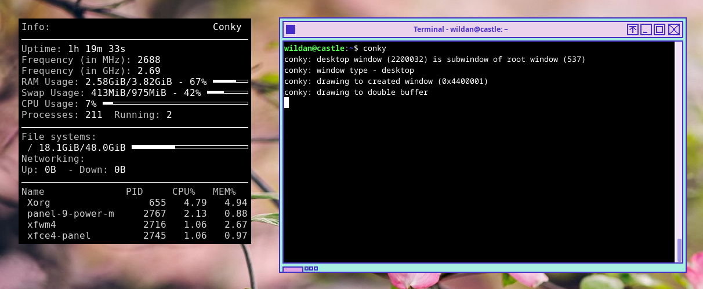

Dan kita hanya perlu menekan `Ctrl+c` untuk me-non-aktifkan Conky.

## Konfigurasi Sederhana

Sebetulnya, konfigurasi default Conky tersebut sudah bisa dibilang cukup untuk menampilkan info-info tentang sistem yang relevan. Misalnya, config tersebut sudah menampilkan penggunaan CPU, Memory (RAM), dan Penyimpanan (Disk) komputer kita. Jadi, kalau kalian hanya memerlukan fungsi saja, maka menurut config default Conky tersebut sudah sangat cukup.

Tapi, jika kita ternyata hanya membutuhkan beberapa info spesifik saja, misalnya info tentang CPU, RAM, dan Disk, tentu kita bisa melakukan modifikasi konfigurasi agar info yang ditampilkan oleh Conky hanya apa yang kita butuhkan tadi saja. Oleh karena itu, pada dasarnya, modifikasi konfigurasi Conky menyesuaikan dengan kebutuhan atau keinginan dari masing-masing penggunanya.

Sekarang, kita akan mencoba melakukan modifikasi sederhana pada konfigurasi Conky. Kita bisa mencari file config-nya dengan perintah:
```shell
whereis conky
cd /etc/conky
```
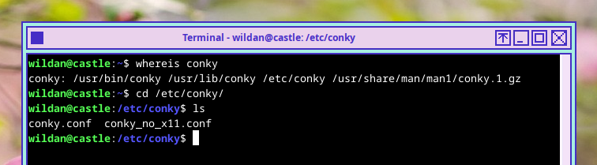

Yup, file konfigurasi Conky terletak di `/etc/conky/conky.conf`. Berikut isi filenya:
```shell
-- Conky, a system monitor https://github.com/brndnmtthws/conky
--
-- This configuration file is Lua code. You can write code in here, and it will
-- execute when Conky loads. You can use it to generate your own advanced
-- configurations.
--
-- Try this (remove the `--`):
--
--   print("Loading Conky config")
--
-- For more on Lua, see:
-- https://www.lua.org/pil/contents.html

conky.config = {
    alignment = 'top_left',
    background = false,
    border_width = 1,
    cpu_avg_samples = 2,
    default_color = 'white',
    default_outline_color = 'white',
    default_shade_color = 'white',
    double_buffer = true,
    draw_borders = false,
    draw_graph_borders = true,
    draw_outline = false,
    draw_shades = false,
    extra_newline = false,
    font = 'DejaVu Sans Mono:size=12',
    gap_x = 60,
    gap_y = 60,
    minimum_height = 5,
    minimum_width = 5,
    net_avg_samples = 2,
    no_buffers = true,
    out_to_console = false,
    out_to_ncurses = false,
    out_to_stderr = false,
    out_to_x = true,
    own_window = true,
    own_window_class = 'Conky',
    own_window_type = 'desktop',
    show_graph_range = false,
    show_graph_scale = false,
    stippled_borders = 0,
    update_interval = 1.0,
    uppercase = false,
    use_spacer = 'none',
    use_xft = true,
}

conky.text = [[
${color grey}Info:$color ${scroll 32 Conky $conky_version - $sysname $nodename $kernel $machine}
$hr
${color grey}Uptime:$color $uptime
${color grey}Frequency (in MHz):$color $freq
${color grey}Frequency (in GHz):$color $freq_g
${color grey}RAM Usage:$color $mem/$memmax - $memperc% ${membar 4}
${color grey}Swap Usage:$color $swap/$swapmax - $swapperc% ${swapbar 4}
${color grey}CPU Usage:$color $cpu% ${cpubar 4}
${color grey}Processes:$color $processes  ${color grey}Running:$color $running_processes
$hr
${color grey}File systems:
 / $color${fs_used /}/${fs_size /} ${fs_bar 6 /}
${color grey}Networking:
Up:$color ${upspeed} ${color grey} - Down:$color ${downspeed}
$hr
${color grey}Name              PID     CPU%   MEM%
${color lightgrey} ${top name 1} ${top pid 1} ${top cpu 1} ${top mem 1}
${color lightgrey} ${top name 2} ${top pid 2} ${top cpu 2} ${top mem 2}
${color lightgrey} ${top name 3} ${top pid 3} ${top cpu 3} ${top mem 3}
${color lightgrey} ${top name 4} ${top pid 4} ${top cpu 4} ${top mem 4}
]]

```

Pada tutorial ini, saya hanya akan menunjukkan beberapa modifikasi sederhana, yaitu
1. Membuat background Conky menjadi transparan.
2. Menampilkan info username@hostname.
3. Menampilkan info RAM, CPU, dan Disk
4. Menampilkan Tanggal & Jam

Namun, sebelum memulainya, ada baiknya kita meng-*copy* file konfigurasi tersebut ke direktori user agar tidak mengubah isi file defaultnya sehingga jika nanti kita memerlukan file backup, kita bisa mengambilnya lagi dari `/etc../images/conky/conky.conf`. So, markicop (mari kita *copy*, wkwkwk)...

```shell
mkdir ~/.config/conky
cp /etc../images/conky/conky.conf ~/.config/conky
```

Kemudian, saya akan edit hingga hanya tersisa beberapa baris kode saja. Berikut adalah isi file konfigurasinya:
```shell
conky.config = {
    alignment = 'top_left', # mengatur posisi Conky di layar

    gap_x = 60, 
    gap_y = 60,

    minimum_height = 5, # mengatur ukuran window Conky
    minimum_width = 5,

    font = 'DejaVu Sans Mono:size=16', # mengatur font

    own_window = true, # mengatur transparansi
    own_window_argb_visual = true,
    own_window_argb_value = 100,

    own_window_type = 'desktop', # mengatur tipe window
    update_interval = 1.0, # mengatur update conky perdetik
    use_xft = true, 
}

conky.text = [[
${alignc}${color white}${exec whoami}@${nodename}

${color white}RAM Usage:$color $memperc% ${membar 9}
${color white}CPU Usage:$color $cpu% ${cpubar 9}
${color white}Disk Usage:$color $fs_used_perc% ${fs_bar 9}

${alignc}${color white}${time %A, %d %B %Y}
${alignc}${color white}${time %H:%M}
]]
```

Hasilnya:
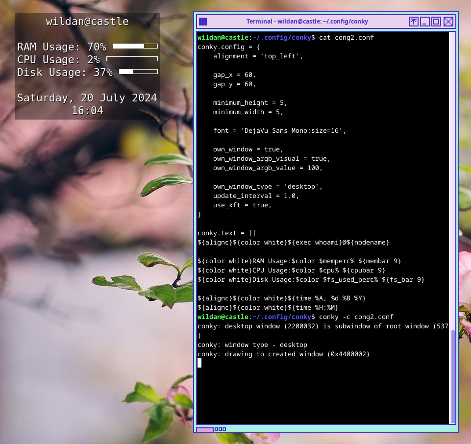

Sangat mudah, bukan?

## Theme-ing

Sekarang, kita akan sedikit menaburkan beberapa tema pada Conky kita. Beberapa tema yang bagus sebetulnya bisa kita dapatkan di internet, misalnya dari tautan berikut:  
https://www.gnome-look.org/browse?cat=124&order=latest

Kemudian, kita bisa memilih tema yang ingin kita gunakan. Kebetulan saya juga mengunduh dan menggunakan salah satu tema dari sana, yaitu tema [**Sargas**](https://www.gnome-look.org/p/2092022). Kita akan gunakan yang MPD.
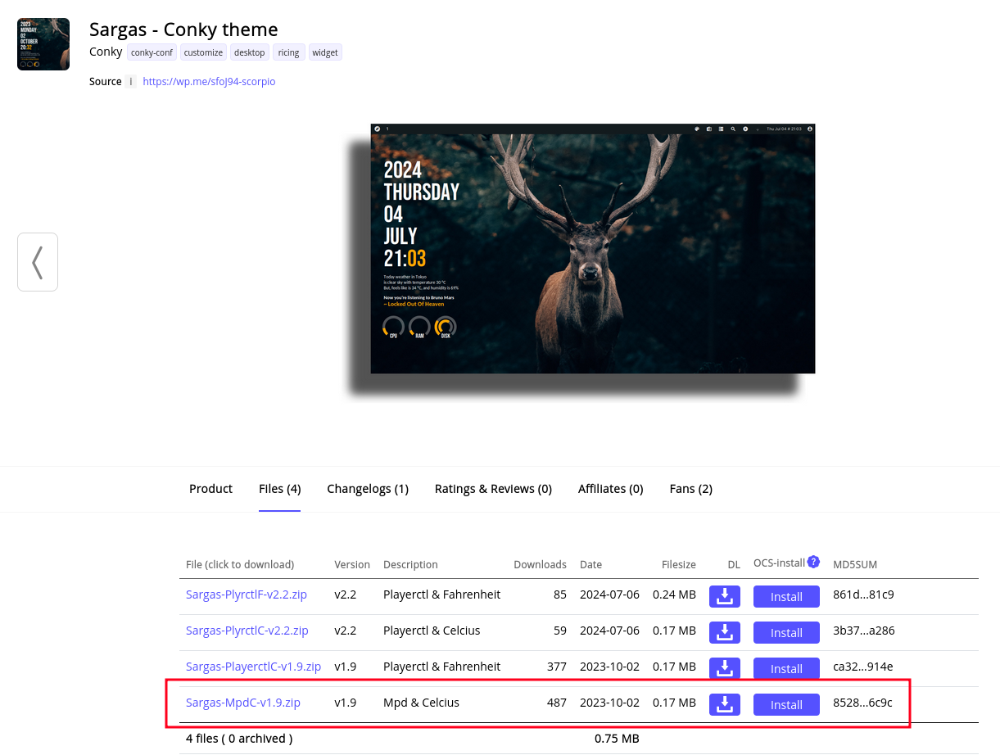

Unzip, kemudian pindahkan folder Sargas-nya ke `~/.config/conky/`:
```shell
unzip Sargas-MpdC-v1.9.zip
cp -R Sargas ~/.config/conky
```

Kalau saya coba jalankan...
```shell
cd Sargas
conky -c Sargas.conf
```
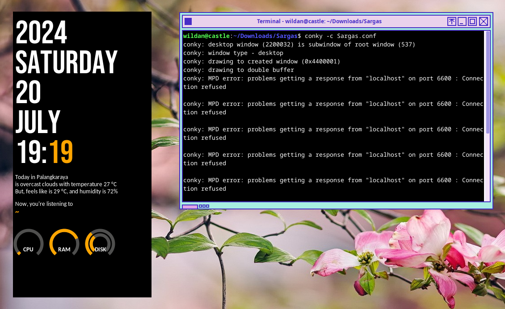

Masih perlu sedikit polesan.

Apa saja yang masih perlu kita lakukan?
1. Menginstall font
2. Mengubah background (transparan)
3. Menyesuaikan kota & cuaca
4. Menginstall & mengaktifkan MPD 
5. Mewarnai (Opsional)

### 1. Menginstall Font

Setidaknya, kita akan menginstall 2 fonts: **Bebas Neue** & **Carlito**.  
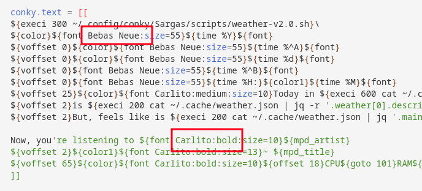

Kalian bisa mengunduhnya di sini:  
**Bebas Neue Font:** https://www.dafont.com/bebas-neue.font  
**Carlito Font:** https://www.1001fonts.com/carlito-font.html

Setelah terunduh, pindahkan ke direktori `~/.fonts`:
```shell
unzip bebas_neue.zip

mkdir ~/.fonts

cp BebasNeue-Regular.ttf carlito.bold.ttf ~/.fonts
```

### 2. Mengubah background (transparan)

Kembali ke file config-nya di `~/.config/conky/Sargas/Sargas.conf`, kemudian ubah nilai `false` dari variabel ***own_window_argb_visual*** ke `true`:
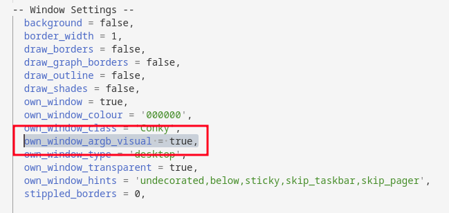

### 3. Menyesuaikan kota & cuaca

Untuk menyesuaikan kota dan cuaca, kita beralih ke file config berikutnya, yaitu `~/.config/conky/Sargas/scripts/weather-v2.0.sh`. Kita bisa mengganti nilai dari variabel `city` ke kota yang kita inginkan. 
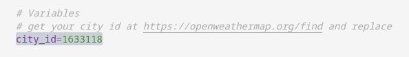

Kode kota-nya bisa kita peroleh dari website:  
https://openweathermap.org/find  

Misalnya, saya mau mengganti kota ke Bali. Ketika melakukan pencarian "Bali", akan muncul beberapa saran. Tentu saja kita akan pilih Bali yang di Indonesia:
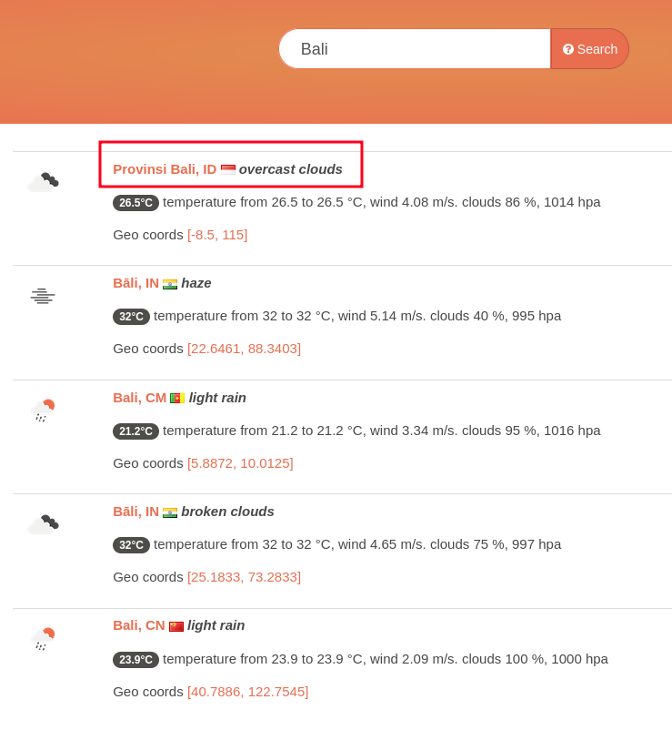

Nah, kode kotanya akan muncul pada url-nya:
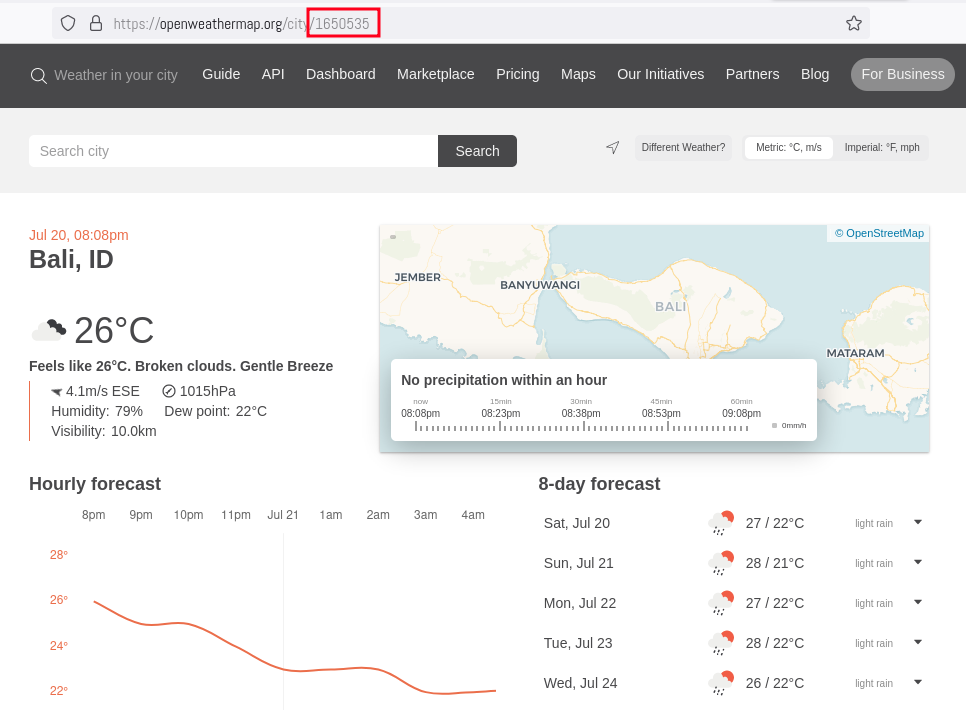

Kode kota tersebutlah yang kita inputkan pada variabel `city` di script `~/.config/conky/Sargas/scripts/weather-v2.0.sh`.

### 4. Menginstall & mengaktifkan MPD

MPD alias *Music Player Daemon* adalah server untuk menjalankan musik di localhost. Informasi yang tersimpan di MPD-lah (terutama info tentang Artist & Music-nya) yang akan kita gunakan untuk ditampilkan di Conky. 

Instalasinya cukup mudah:
```
sudo apt install mpd mpc -> Debian-based distro
sudo pacman -Sy mpd mpc -> Arch-based distro
sudo zipper in mpd mpc -> Opensuse distro
sudo dnf install mpd mpc -> Fedora-based distro 
```

Setelah ter-*install*, aktivasinya pun cukup mudah:
```shell
mpd
```

Selesai.

Nanti, apapun *music player*-nya, jika terhubung ke MPD (misalnya seperti ncmpcpp), lagu yang sedang diputar akan muncul di Conky. Btw, saya juga menulis artikel khusus yang membahas ncmpcpp lho. Cek [di sini](https://abwildan.github.io/post/ncmpcpp/)!

### 5. Mewarnai (Opsional)

Pewarnaan yang saya maksud di sini adalah pewarnaan untuk teks-teks yang tampil di Conky. Jadi, kalau kalian sudah menyukai default warnanya, atau kalian ingin menggantinya sesuai selera, tentu tidak ada larangannya.

Tapi, kali ini, saya akan mengganti warna default tema-nya ke warna seperti yang ada di cover artikel ini. Jadi, saya akan menggunakan kombinasi warna **Pink**, **Hijau**, dan **Biru Muda**.

Kita akan kembali meng-*edit* file konfigurasi `Sargas.conf`. 

Pertama-tama, saya akan mengganti nilai variavel `color1` ke warna hijau, kemudian membuat variabel warna baru, yaitu `color2` untuk warna pink:
```shell
  color1 = '#00ff21', 
  color2 = '#ff5ce6', 
```
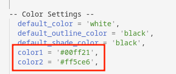

Kemudian menambahkan parameter warna tersebut ke conky teks:
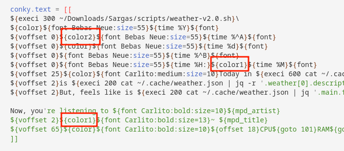

Terakhir, untuk mengganti warna pada indikator CPU, RAM, dan Disk, kita akan beralih ke file config lainnya, yaitu `~/.config/conky/Sargas/scripts/lua/rings-v1.2.1.lua`, lalu ganti setiap nilai dari variabel `fg_colour` ke warna biru muda:
```shell
fg_colour=0x00ffff
```

> **Note:**  
> Pastikan variabel `fg_colour`-nya ada 4, menyesuaikan dengan jumlah lingkarannya juga :v.

Sekarang, saya akan putar musik dari Quod Libet dan beginilah hasil Congky-nya!!!
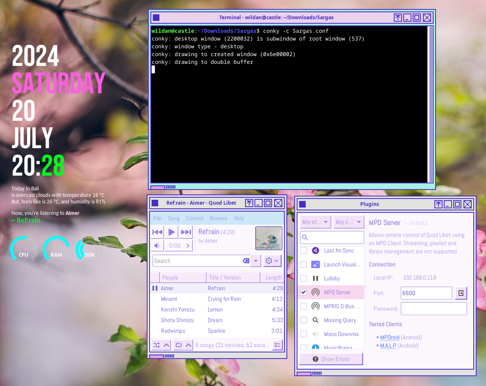

## Finishing

Sebagai penutup, kalau kita ingin menjalankan Conky dengan tema Sargas tersebut di *background*, kita bisa mengetikkan perintah berikut di terminal:
```shell
conky -c ~/.config/conky/Sargas/Sargas.conf &
```

Tapi, jika kita ingin agar Conky bisa langsung berjalan tepat setelah login, kita tentu akan sangat malas jika harus mengetikkan perintah di atas berulang-ulang setiap login di komputer. Oleh karena itu, kita bisa mengaturnya (pada artikel ini saya hanya tunjukkan di XFCE).

Pertama, pergi ke setting **Session and Startup** -> **Application Autostart** -> **Add**, kemudian masukkan nama, deskripsi (opsional), dan *command*-nya. Pastikan memasukkan command conky yang langsung mengarah ke file config Sargas, `conky -c ~/.config/conky/Sargas/Sargas.conf`.
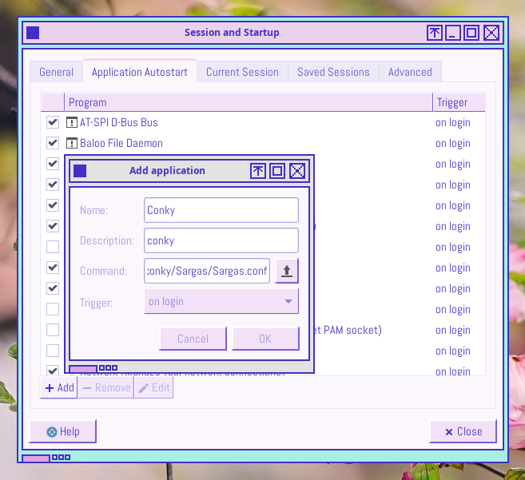

Klik **Ok**.

Pastikan pengaturan Autostart Conky-nya sudah terceklis.
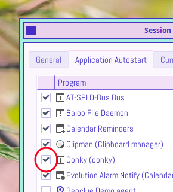

SELESAIII!!

Mudah? Bukan main mudahnya dong~

Dengan modal Conky + tema yang sudah dibuatkan orang lain, desktop linux kita menjadi tidak hambar! Superrbbbb!!

Sipp, sekian dulu artikel kali ini.  
Sampai berjumpa di artikel saya yang lain ya!  
Byee~~

---
Btw, saya mau pamer desktop yang saya gunakan untuk menulis artikel ini.  
Berikut spek dan tangkapan layarnya:  
**Distro:** Debian 12 (Bookworm)  
**DE:** XFCE  
**Tema:** Needy Girl Overdose  
**Icon:** Tela Circle  

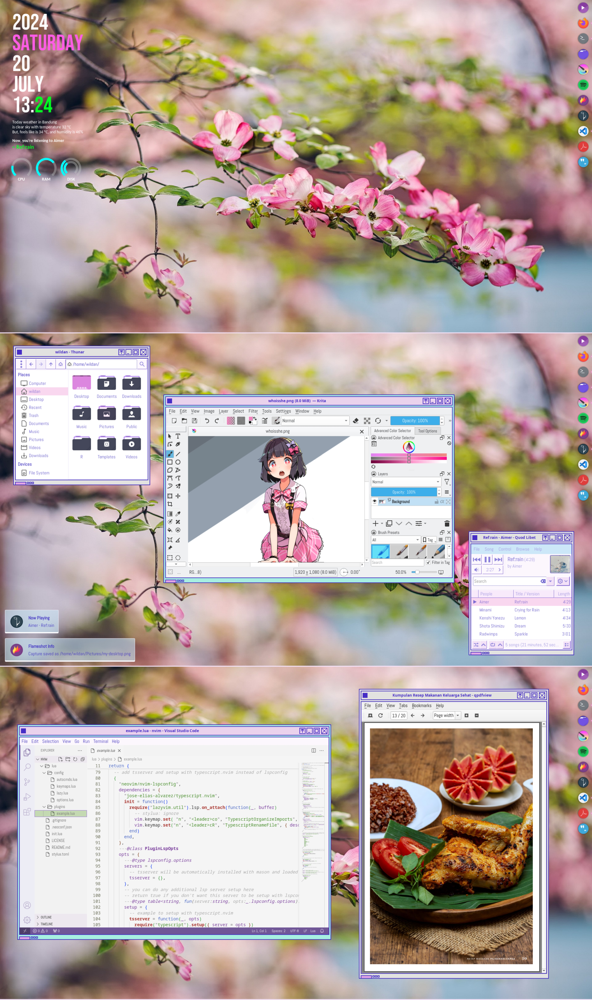

Tipikal desktop emak-emak muda yang demen masak dan nulis wkwkwk.

[^1]: https://en.wikipedia.org/wiki/Conky_(software)
[^2]: https://github.com/brndnmtthws/conky

