Yoo, jumpa lagi!

Saya mau berbagi sejumlah *tools* terminal yang sayang jika dilewatkan, apalagi bagi kalian guys, linux nerds. Sebagian besar (atau mungkin semuanya) *tools* yang akan saya *share* di artikel ini murni ***for fun***. Jadi, memang fungsinya hanya untuk *show off* kecantikan terminal. But, anyway, berikut adalah 9 terminal *tools* keren yang bisa kalian coba:

### 1. cava

Cava adalah *cross-platform audio visualizer*.

::github{repo="karlstav/cava"}

Instalasi (Archlinux) via repositori komunitas (AUR - *Arch User Repository*):
```shell
yay -Sy cava
```

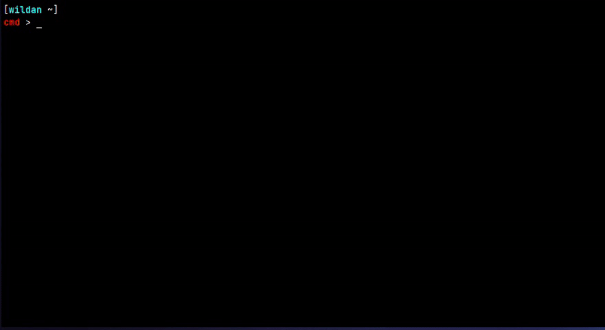

Untuk mengganti ukuran bar-nya, kita bisa menggunakan *arrow key* di keybord: *`arrow left`* untuk memperbesar dan *`arrow right`* untuk memperkecil.  
Untuk mengganti warnanya, kita bisa menekan huruf **`f`** di keyboard.

Baca-baca `help`-nya di:
```shell
cava --help
```

### 2. pipes

Pipes adalah *animated pipes terminal screensaver*.

::github{repo="pipeseroni/pipes.sh"}

Instalasi (Archlinux) via repositori komunitas (AUR - *Arch User Repository*):
```shell
yay -Sy pipes.sh
```

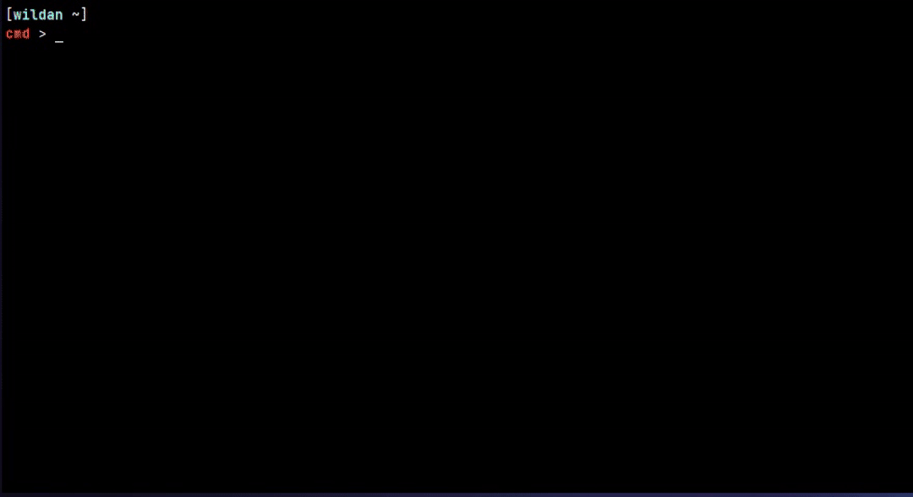

Baca-baca `help`-nya di:
```shell
pipes.sh --help
```

### 3. cowsay

Cowsay adalah *a configurable talking cow*.

::github{repo="piuccio/cowsay"}

Instalasinya (Archlinux) bisa merujuk ke repositori official:
```shell
sudo pacman -Sy cowsay
```
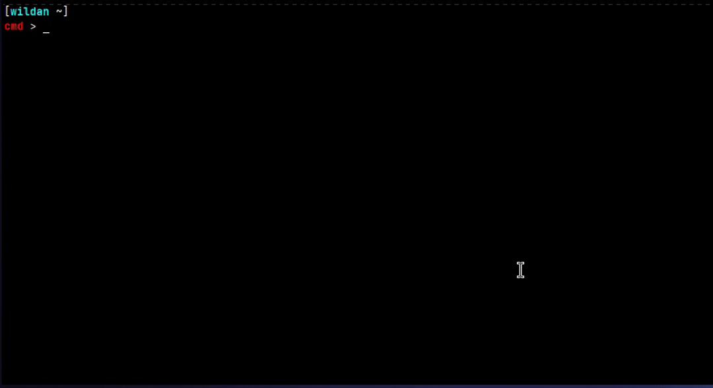

File config untuk menampilkan berbagai objeknya tersimpan di direktori `/usr/share/cows/`.

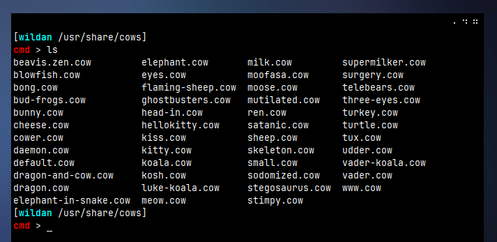

Baca-baca `help`-nya di:
```shell
cowsay --help
```

### 4. cbonsay

Cbonsai adalah *a bonsai tree generator*.

::github{repo="mhzawadi/homebrew-cbonsai"}

Instalasi (Archlinux) via repositori komunitas (AUR - *Arch User Repository*):
```shell
yay -Sy cbonsai
```

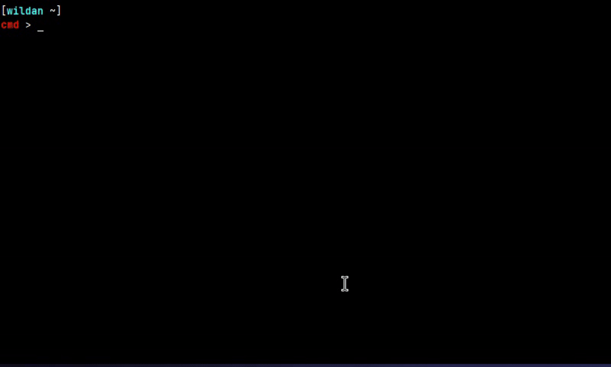

Baca-baca `help`-nya di:
```shell
cbonsai --help
```

### 5. cmatrix

Cmatrix adalah *terminal based "The Matrix"-like implementation*.

::github{repo="abishekvashok/cmatrix"}

Instalasinya (Archlinux) bisa merujuk ke repositori official:
```shell
sudo pacman -Sy cmatrix
```


Baca-baca `help`-nya di:
```shell
cmatrix --help
```

### 6. figlet

Figlet? *Claudia's FIGlet tree*.

::github{repo="cmatsuoka/figlet"}

Instalasinya (Archlinux) bisa merujuk ke repositori official:
```shell
sudo pacman -Sy figlet
```
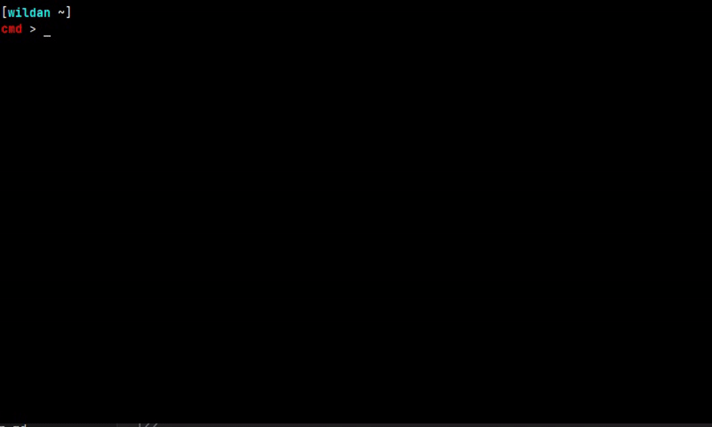

File font-nya tersimpan di direktori `/usr/share/figlet/fonts`:
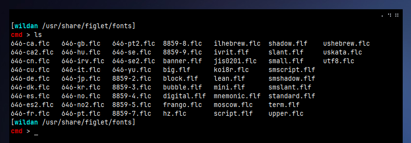

Baca-baca `help`-nya di:
```shell
figlet --help
```

### 7. lolcat

Lolcat: *rainbow and unicorns*!

::github{repo="busyloop/lolcat"}

Instalasinya (Archlinux) bisa merujuk ke repositori official:
```shell
sudo pacman -Sy lolcat
```

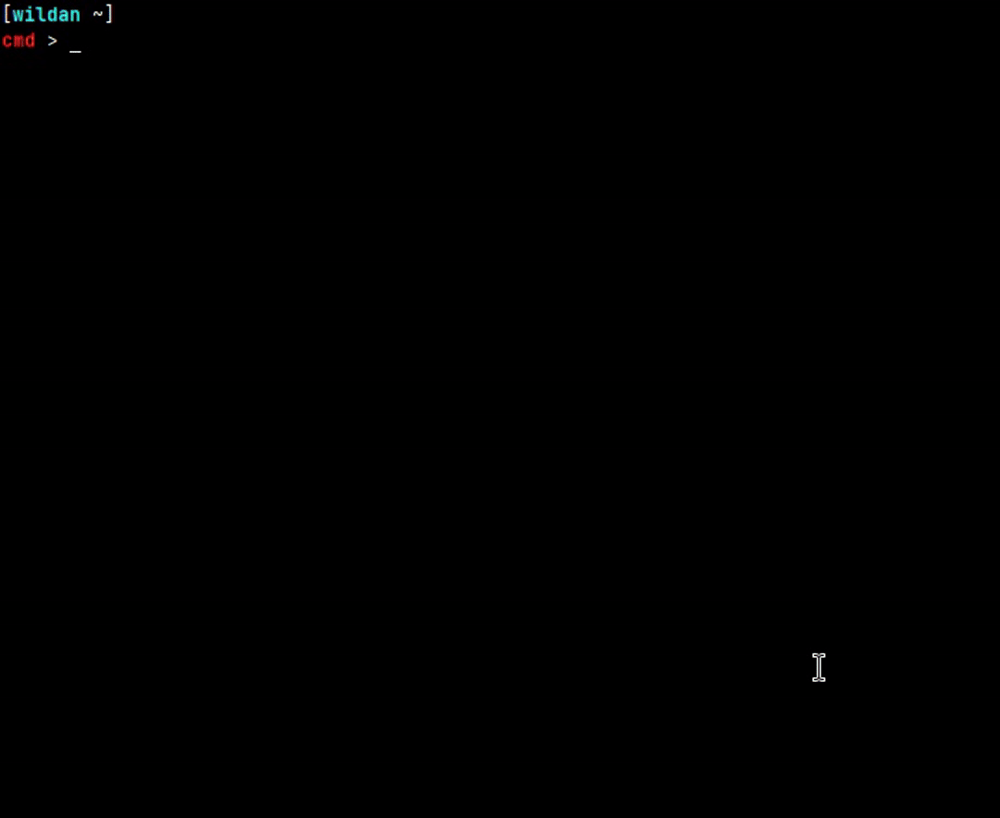

Baca-baca `help`-nya di:
```shell
lolcat --help
```

### 8. asciiquarium

Asciiquairum: *Ascii aquarium in terminal*!

::github{repo="cmatsuoka/asciiquarium"}

Instalasinya (Archlinux) bisa merujuk ke repositori official:
```shell
sudo pacman -Sy asciiquarium
```

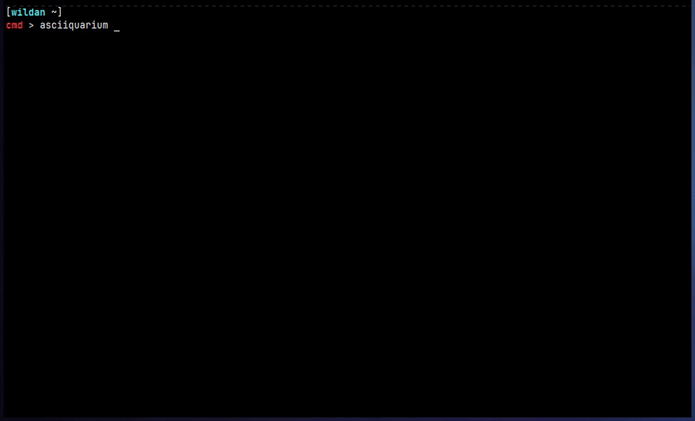

### 9. mapscii

Mapscii adalah *a Braille & ASCII world map renderer for your console*.

::github{repo="rastapasta/mapscii"}


### 10. hollywood

Hollywood adalah *a technical melodrama*.

::github{repo="dustinkirkland/hollywood"}

Instalasi (Archlinux) via repositori komunitas (AUR - Arch User Repository):
```shell
yay -Sy hollywood
```

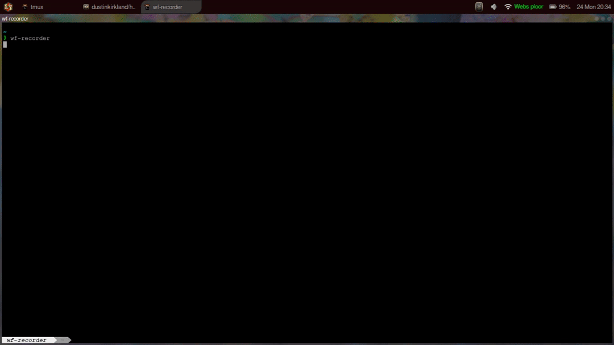

:::note

`hollywood` sangat memakan _resource_ (terutama CPU) jika dijalankan. Jadi, jika komputer kalian memiliki _resource_ yang terbatas, jangan jalankan program ini terlalu lama.

:::

### 10. freechess

Kita dapat memainkan catur di CLI melalui layanan `ftp` dari [FreeChess](https://www.freechess.org).

Karena ini adalah layanan `telnet`, maka kita tidak perlu melakukan instalasi apapun, karena biasanya paket `telnet` sendiri di linux sudah terpasang secara default.

Untuk mengaksesnya, gunakan perintah berikut di terminal:

```shell
telnet freechess.org
```

atau via port 5000

```shell
telnet freechess.org 5000
```

atau dengan `nc`: 

```shell
nc -vv freechess.org 23
```

<video width="100%" controls autoplay loop muted>
  <source src="../images/cooltools/freechess.mp4" type="video/mp4">
</video>

:::note
 
Untuk perintah-perintah yang dapat digunakan, misalnya bagaimana memulai game dan sebagainya silakan dibaca-baca sendiri di servernya. Oiya, satu lagi, karena di sini kita bermain catur via CLI, jadi, kita akan menuliskan notasi untuk menggerakkan buah-buah catur alih-alih menggesernya dengan mouse atau kursor. Sungguh menarik, bukan? Wkwkwk

:::

### 11. starwars

Mirip seperti freechess, starwars adalah program yang dapat kita jalankan setelah terhubung ke sebuah server (towel.blinkenlights.nl) menggunakan telnet. Program ini lebih dilihat sebagai "for fun" program.

Untuk mengaksesnya:

```shell
telnet towel.blinkenlights.nl
```

<video width="100%" controls autoplay loop muted>
  <source src="../images/cooltools/starwars.mkv" type="video/mp4">
</video>

### 12. wttr

`wttr` juga adalah _tool_ terminal yang dapat berjalan jika kita terhubung ke servernya. Tool ini sedikit lebih memiliki fungsi dibandingkan _tool-tool_ sebelumnya, yaitu memantau kondisi cuaca di suatu kota yang ada di negara tertentu.

Untuk mengaksesnya:

```shell
curl wttr.in
```

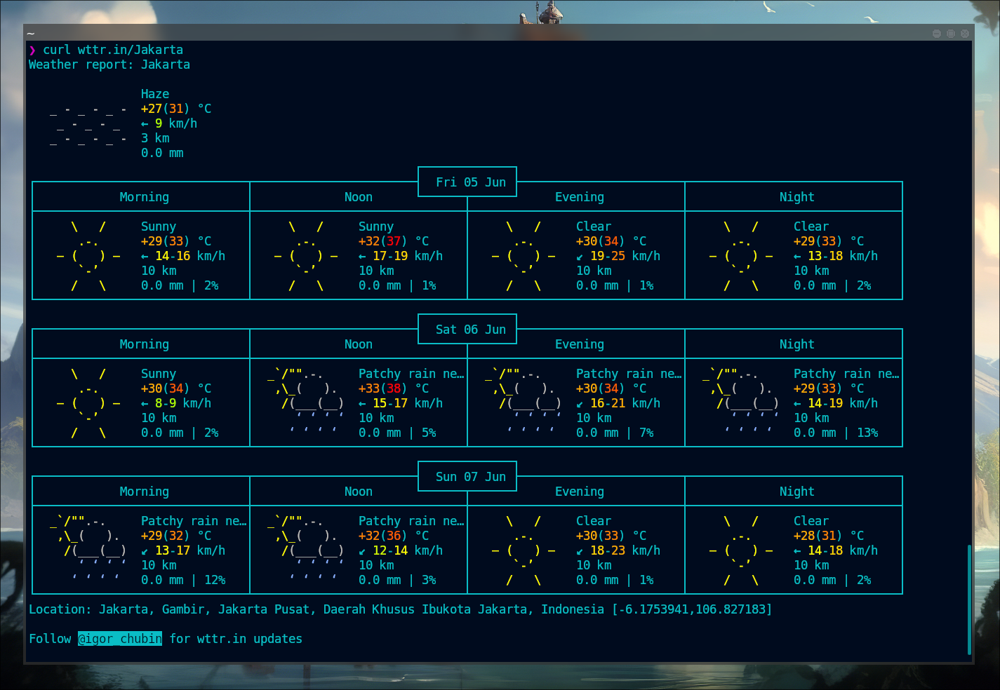

### 13. rate

`rate` adalah _tool_ terminal berbasis server (kita perlu akses internet) yang berfungsi untuk melihat grafik cryptocurrency, seperti Bitcoin (BTC), dan lain sebagainya.

Untuk mengaksesnya:

```shell
curl rate.sx
```

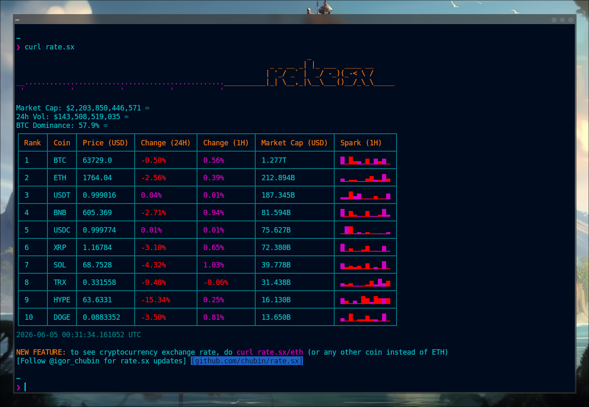

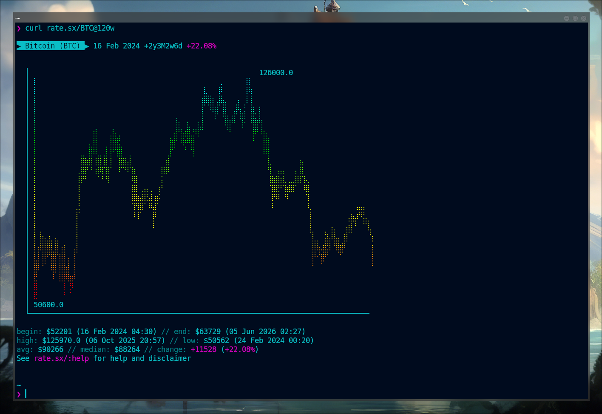

### 14. ascii.live

`ascii.live` adalah _tool_ terminal yang mengharuskan kita terhubung ke internet. Tidak ada fungsi secara spesifik seperti 2 _tools_ sebelumnya.

Kita bisa melihat ascii live apa saja yang disupport dengan perintah:

```shell
curl ascii.live/list
```

<video width="100%" controls autoplay loop muted>
  <source src="../images/cooltools/asciilive.mkv" type="video/mp4">
</video>


Artikel ini akan saya perbarui jika ada *tools* baru yang belum sempat ditulis.

