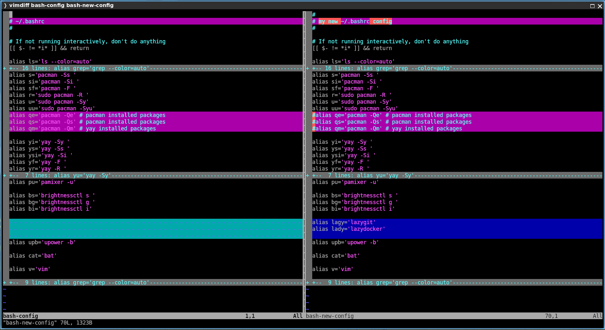
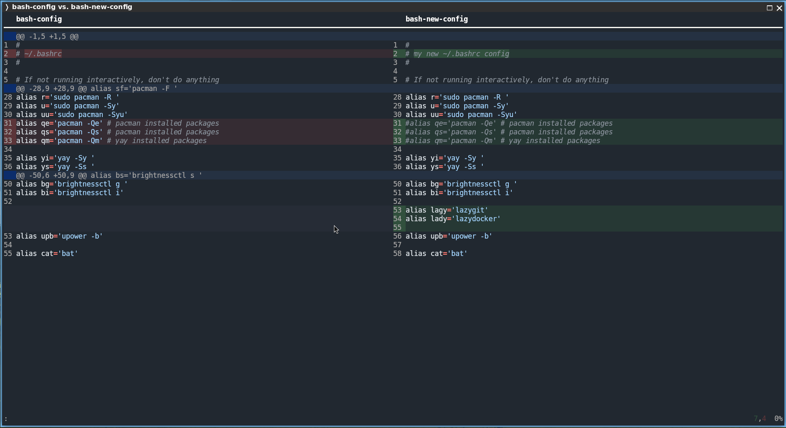
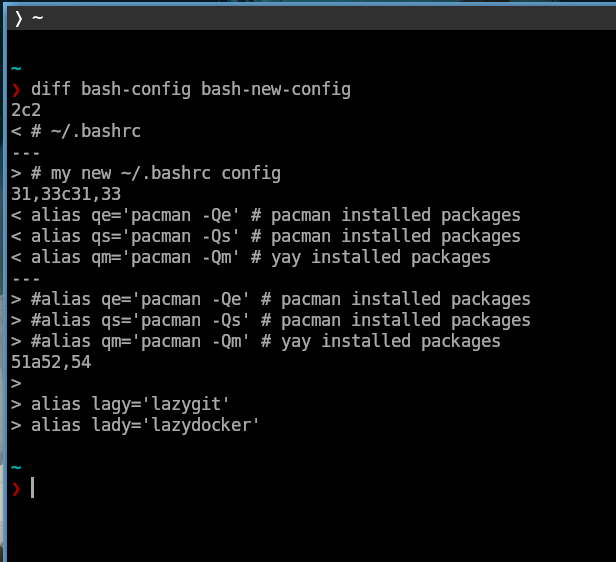
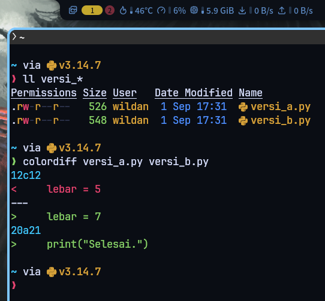

## Preface

_Tools_ _comparison_ ini akan terasa sekali manfaatnya, terutama jika kita ingin membandinkan isi file yang berbasis teks seperti logs. Jadi, "file" yang dimaksud di sini adalah file yang dapat dibaca dengan terminal (berbasis teks), bukan file dokumen seperti Word atau PDF.

## The Tools

Berikut adalah _tools_ yang pernah saya gunakan untuk membandingkan file-file. Sebagai _disclaimer_, tools di bawah ini semuanya adalah terminal-based _tools_, jadi tidak ada GUI-nya. 

### 1. `vimdiff`

`vimdiff` adalah _tool_ yang terintegrasi langsung dengan `vim` (teks editor).



#### Installation

Berikut adalah cara meng-_install_ `vim` di beberapa sistem operasi UNIX/Linux:

::: code-group labels=[debian/ubuntu, archlinux, fedora, opensuse, freebsd]

```shell
sudo apt install -y vim
```

```shell
sudo pacman -Sy vim
```

```shell
sudo dnf install vim
```

```shell
sudo zypper install vim
```

```shell
sudo pkg install vim
```

:::
 
:::note

**NixOS:**  
Masukkan baris berikut di file konfigurasi (`/etc/nixos/configuration.nix`):

```nix title="nix"
environment.systemPackages = [
  pkgs.vim
];
```

Atau jika menggunakan `nix-shell`:

```shell
nix-shell -p vim
```

:::

#### Usage

```shell
vimdiff file1 file2 file3 file4
```

> **Notes:** `vimdiff` dapat membandingkan 2 hingga 4 file sekaligus.


### 2. `kitten diff`

`kitten diff` adalah _tool_ yang terintegrasi langsung dengan `kitty` (terminal).



#### Installation

Berikut adalah cara meng-_install_ `kitty` di beberapa sistem operasi UNIX/Linux:

::: code-group labels=[debian/ubuntu, archlinux, fedora, opensuse, freebsd]

```shell
sudo apt install -y kitty
```

```shell
sudo pacman -Sy kitty
```

```shell
sudo dnf install kitty
```

```shell
sudo zypper install kitty
```

```shell
sudo pkg install kitty
```

:::

:::note

**NixOS:**  
Masukkan baris berikut di file konfigurasi (`/etc/nixos/configuration.nix`):

```nix title="nix"
environment.systemPackages = [
  pkgs.kitty
];
```

Atau jika menggunakan `nix-shell`:

```shell
nix-shell -p kitty
```

:::

#### Usage

```shell
kitten diff file1 file2
```

> **Notes:** `kitten diff` hanya dapat membandingkan maksimal 2 file.

### 3. `diff`



#### Installation

Sebelum dapat menggunakan `diff`, kita perlu meng-_install_ paket `diffutils`.

Berikut adalah cara meng-_install_ `diffutils` di beberapa sistem operasi UNIX/Linux:

::: code-group labels=[debian/ubuntu, archlinux, fedora, opensuse, freebsd]

```shell
sudo apt install -y diffutils
```

```shell
sudo pacman -Sy diffutils
```

```shell
sudo dnf install diffutils
```

```shell
sudo zypper install diffutils
```

```shell
sudo pkg install diffutils
```

:::

:::note

**NixOS:**  
Masukkan baris berikut di file konfigurasi (`/etc/nixos/configuration.nix`):

```nix title="nix"
environment.systemPackages = [
  pkgs.diffutils
];
```

Atau jika menggunakan `nix-shell`:

```shell
nix-shell -p diffutils
```

:::

#### Usage

```shell
diff file1 file2
```

> **Notes:** `diff` hanya dapat membandingkan maksimal 2 file.

`diff` juga dapat digunakan untuk membandingkan isi file dari dua direktori:

```shell
diff -qr direktori1 direktori2
```

### 4. `colordiff`



#### Installation

Sebelum dapat menggunakan `colordiff`, kita perlu meng-_install_ paket `colordiff`.

Berikut adalah cara meng-_install_ `colordiff` di beberapa sistem operasi UNIX/Linux:

::: code-group labels=[debian/ubuntu, archlinux, fedora, opensuse, freebsd]

```shell
sudo apt install -y colordiff
```

```shell
sudo pacman -Sy colordiff
```

```shell
sudo dnf install colordiff
```

```shell
sudo zypper install colordiff
```

```shell
sudo pkg install colordiff
```

:::

:::note

**NixOS:**  
Masukkan baris berikut di file konfigurasi (`/etc/nixos/configuration.nix`):

```nix title="nix"
environment.systemPackages = [
  pkgs.colordiff
];
```

Atau jika menggunakan `nix-shell`:

```shell
nix-shell -p colordiff
```

:::

#### Usage

```shell
colordiff file1 file2
```

Seperti `diff`, `colordiff` juga dapat digunakan untuk membandingkan isi file di dua folder berbeda:

```shell
colordiff direktori1 direktori2

```


