## Docker

### At A Glance

Pernahkah kalian mendengar [**Docker**](https://www.docker.com/)? 

Jika kalian adalah _software developer_ atau minimal seorang _tech-enthusiast_ seperti saya, sudah dipastikan kalian tau Docker. Tapi, biarkan saya tetap menjelaskan Docker di artikel ini.

#### What is Docker?

Docker adalah sebuah layanan _open-source_ yang menyediakan kemampuan untuk mengemas dan menjalankan sebuah aplikasi dalam lingkungan terisolasi yang disebut sebagai "_container_".[^1] Docker memungkinkan kita untuk menjalankan _software_ yang tidak bergantung pada dependensi yang terpasang di host.[^2] Dengan demikian, proses pengembangan _software_ menjadi lebih cepat. 

Sejarahnya, Docker pertama kali diperkenalkan ke publik pada acara PyCon di tahun 2013 oleh pembuatnya, yaitu Solomon Hykes.[^3] Di tahun-tahun berikutnya, perkembangan Docker di banyak sistem operasi mulai masif. Misalnya, di tahun 2016, Docker untuk Mac dan Windows rilis ke publik. 

Apa itu _container_? Kita akan lihat apa itu container sambil membandingkannya dengan _Virtual Machine_ (VM) di bawah ini.

#### Container vs Virtual Machine (VM)

_Container_ adalah _software_ yang mengemas/membungkus kode berikut dengan dependensinya sehingga sebuah aplikasi dapat berjalan dengan cepat dan dapat diandalkan (_reliable_) meskipun di _environment_ yang berbeda.[^4] Selain Docker, Podman adalah salah satu platform kontainerisasi juga.  

:::info

Salah satu permasalahan di dunia _software development_ adalah ketidak-_compatible_-an sebuah aplikasi dengan lingkungan barunya. 

Contohnya, ketika saya mengembangkan (re: membuat) sebuah aplikasi _online chatting_, saya tentu membuatnya di komputer atau laptop pribadi saya (intinya satu komputer). Akan tetapi, ketika saya ingin agar aplikasi tersebut di-test atau bahkan diproduksi (dirilis), aplikasi tersebut akan berpindah lingkungan (komputer) yang berbeda-beda, mulai dari sistem operasinya, arsitekturnya, versinya, dan lain sebagainya. Dengan demikian, aplikasi saya tersebut memiliki kemungkinan tidak berjalan dengan baik di lingkungan barunya tersebut. Solusi konvensionalnya adalah, saya sebagai _developer_-nya, perlu membuat banyak versi dari aplikasi _online chatting_ tersebut agar dapat berjalan dengan baik di lingkungannya masing-masing. Misalnya, aplikasi versi Linux, aplikasi versi Mac, dan aplikasi versi Windows.

Nah, dengan adanya _containerization_ (sistem kontainer) ini, saya tidak perlu mengkhawatirkan permasalahan di atas dan dapat membuat satu aplikasi saja. Sebab, saya dapat meng-kontainerisasi (membuat image container) aplikasi saya tersebut ketika akan di-test atau di-_deploy_ ke produksi (dirilis). Dengan adanya sistem containerization ini, semua orang di sistem yang berbeda akan tetap dapat menjalankan aplikasi _online chatting_ saya itu tanpa harus terkendala sistem operasi yang berbeda, arsitektur yang berbeda, versi yang berbeda, dan lain sebagainya.

:::

_Virtual Machine_ di sisi lain adalah sebuah virtualisasi atau emulasi dari komputer fisik.[^5] _Virtual machine_ memungkinkan kita untuk menjalankan banyak sistem operasi dalam satu sistem operasi saja. _Software_ yang meng-_handle_ proses virtualisasi ini disebut **Hypervisor**. Beberapa _hypervisor_ yang populer ada Virtualbox, VMWare, dan Virt-Manager.[^6]

Berikut adalah perbandingan _Container_ & _Virtual Machine_:

[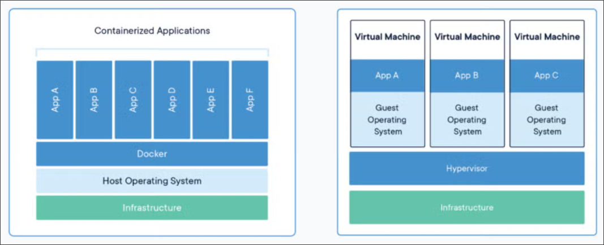](https://www.docker.com/resources/what-container/)


| Aspek                | Container                                      | Virtual Machine (VM)                          |
|---------------------|-----------------------------------------------|-----------------------------------------------|
| Arsitektur          | Berbagi kernel host OS                         | Menggunakan hypervisor + guest OS             |
| Ukuran              | Ringan (MB)                                    | Lebih besar (GB)                              |
| Waktu startup       | Sangat cepat (detik)                           | Lebih lambat (menit)                          |
| Isolasi             | Isolasi proses (lebih ringan)                  | Isolasi penuh (lebih kuat)                    |
| Kinerja             | Mendekati native (lebih efisien)               | Ada overhead dari hypervisor                  |
| Portabilitas        | Sangat tinggi (mudah dipindahkan)              | Lebih kompleks                                |
| Resource usage      | Lebih hemat resource                           | Lebih boros resource                          |
| Sistem operasi      | Berbagi OS host                                | Bisa menjalankan OS berbeda                   |
| Keamanan            | Lebih rendah dibanding VM                      | Lebih tinggi karena isolasi penuh             |
| Deployment          | Mudah & cepat (CI/CD friendly)                 | Lebih kompleks                                |
| Use case utama      | Microservices, aplikasi cloud-native           | Aplikasi legacy, isolasi penuh                |
| Contoh teknologi    | Docker, Kubernetes                             | VMware, VirtualBox, Hyper-V                   |


### Installation

Berikut adalah cara meng-_install_ `docker` di beberapa sistem operasi Linux:

|       Distro      |                  Command                           |
|       ---         |                   ---                              |
| **Debian/Ubuntu** | **`sudo apt install -y docker`**                   |
| **Arch Linux**    | **`sudo pacman -Sy docker`**                       |
| **Fedora**        | **`sudo dnf install docker`**                      |
| **Opensuse**      | **`sudo zypper install docker`**                   |

:::note

**NixOS:**  
Masukkan baris berikut di file konfigurasi (`/etc/nixos/configuration.nix`):

```nix title="nix"
  environment.systemPackages = [
    pkgs.docker
  ];
```

Atau jika menggunakan `nix-shell`:

```shell
nix-shell -p docker
```

:::

Untuk memastikan docker sudah ter-install:

```shell
docker -v
docker version
```

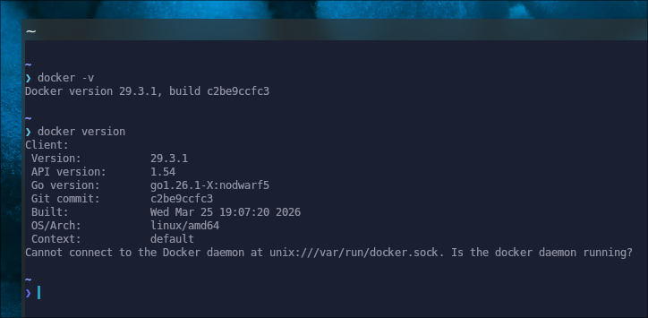


Berikut adalah tautan official Docker:

**Website:** https://www.docker.com/   
**Github:** https://github.com/docker

### Set Up 

#### 1. Starting `docker`

Untuk memulai Docker daemon, gunakan perintah:

```shell
sudo docker systemctl start docker
```

Untuk memastikan Docker daemon berjalan otomatis setelah login:

```shell
sudo systemctl enable docker
```

#### 2. Stopping `docker`

Untuk mematikan Docker daemon, gunakan perintah:

```shell
sudo systemctl stop docker
sudo systemctl stop docker.socket
```

Untuk me-non-aktifkan Docker daemon dari berjalan otomatis setiap login:

```shell
sudo systemctl disable docker
sudo systemctl disable docker.socket
```

#### 3. Adding `docker` group

Secara _default_, Docker daemon berjalan sebagai `root` user sehingga setiap kali _user_ non-root mengeksekusi perintah `docker`, perintah `sudo` diperlukan. Jika kita ingin agar perintah `docker` dapat dieksekusi tanpa perlu `sudo`, berikut caranya:[^9]

1. Buat grup `docker`

```shell
sudo groupadd docker
```

2. Tambahkan _user_ kita ke grup `docker`.

```shell
sudo usermod -aG docker $USER
```

3. _Logout_ & _login_ kembali agar perubahan bisa teraktivasi.

4. Jika malas _logut_, aktivasi perubahan tersebut dengan perintah:

```shell
newgrp docker
```

5. Konfirmasi

```shell
docker run hello-world
```

### Essential Commands

Berikut adalah perintah-perintah penting untuk melakukan manajemen _container_ di Docker.[^7][^8]

#### docker search

Mencari docker image dari [Docker Registry](https://www.geeksforgeeks.org/devops/what-is-docker-registry/), seperti [DockerHub](https://hub.docker.com/):

```shell
docker search <image_name>
```

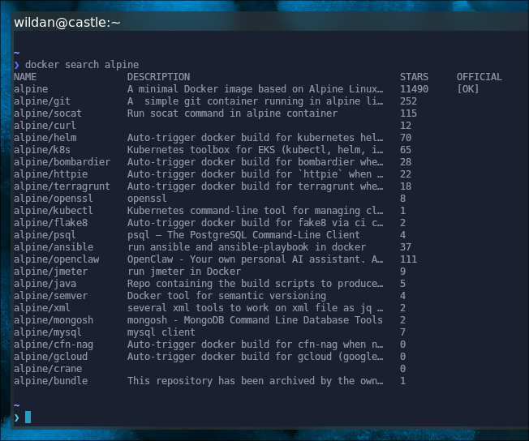

#### docker pull

Mengambil (men-_download_) docker image: 

```shell
docker pull <image_name>
```

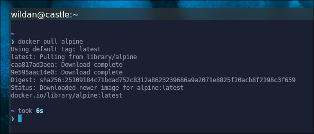

#### docker images

Melihat daftar docker image yang ada di komputer:

```shell
sudo docker images
```

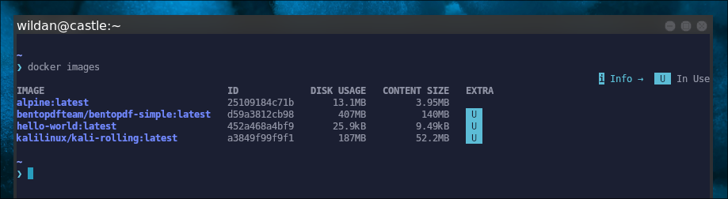

#### docker login

Perintah ini selain akan me-_login_-kan kita ke Docker.  
Kredensial `docker` disimpan di komputer lokal (`/home/$USER/.docker/config.json`).

Login ke docker:

```shell
docker login -u <username>
```

:::note

Jika belum punya akun, maka kita perlu membuat akun (register) terlebih dahulu di website official Docker: https://www.docker.com/

:::

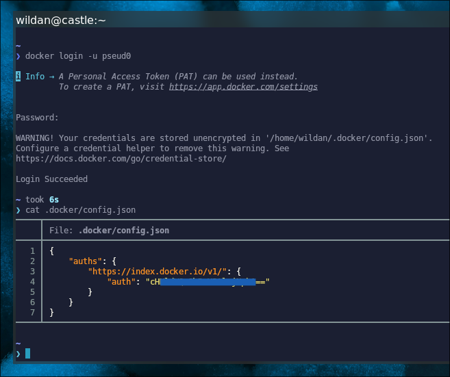

#### docker logout

Perintah ini selain akan me-_logout_-kan kita ke Docker.  
Kredensial `docker` dihapus di komputer lokal (`/home/$USER/.docker/config.json`).

```shell
docker logout
```

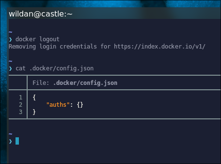

#### docker build

Membuat docker image dari Dockerfile di _current directory_:

```shell
docker build -t <image_name> .
```

Membuat docker image tanpa cache:

```shell
docker build --no-cache -t <image_name>
```

Misalnya, saya ingin membuat sebuah docker image dari file `app.py` berikut menggunakan Dockerfile:

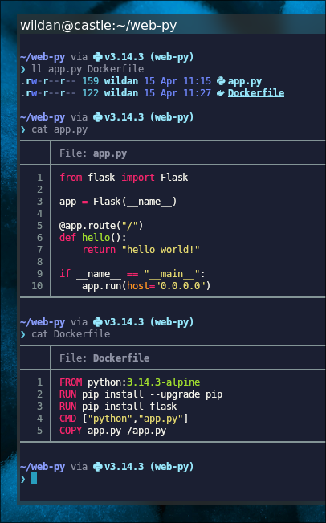

Tinggal jalankan perintah `docker build` tanpa _cache_ tersebut, dia akan mengunduh dependensi yang diperlukan dan membuat docker image-nya:

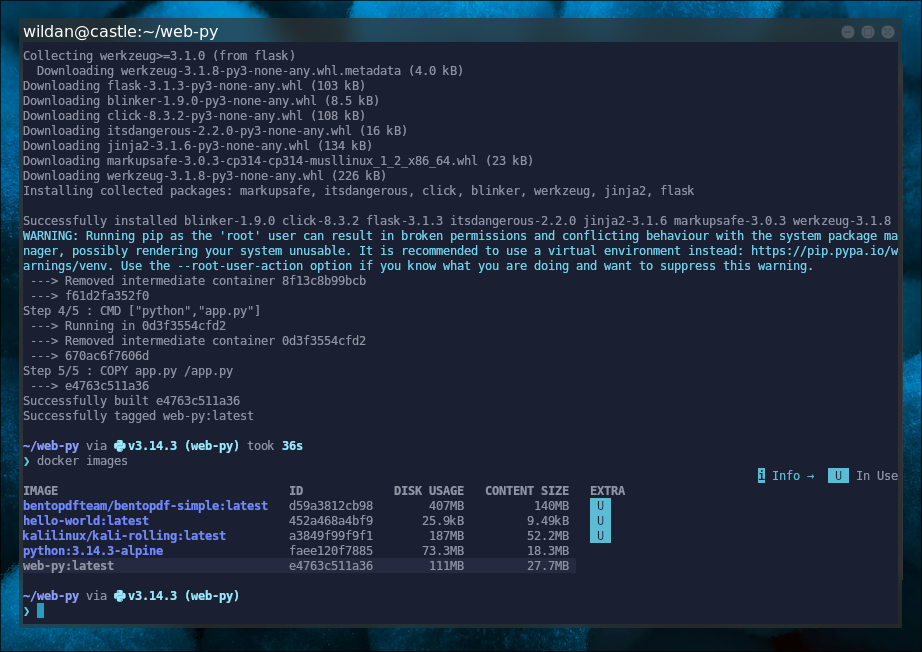

:::info

Berikut adalah isi file `app.py`:

```py title="app.py"
from flask import Flask

app = Flask(__name__)

@app.route("/")
def hello():
    return "hello world!"

if __name__ == "__main__":
    app.run(host="0.0.0.0")
```

Dan isi file `Dockerfile`-nya:

```docker title="Dockerfile"
FROM python:3.14.3-alpine
RUN pip install --upgrade pip
RUN pip install flask
CMD ["python","app.py"]
COPY app.py /app.py
```

**Sumber:** [congnitiveclass.ai/courses/docker-essentials](https://cognitiveclass.ai/courses/docker-essentials)

:::

#### docker push

Menambahkan (meng-_upload_) docker image: 

```shell
docker tag <local-image>:<tagname> <username>/<new-repo>:<tagname>
docker push <username>/<new-repo>:<tagname>
```

:::note

Jika belum punya repository, kita perlu membuatnya terlebih dahulu.

:::

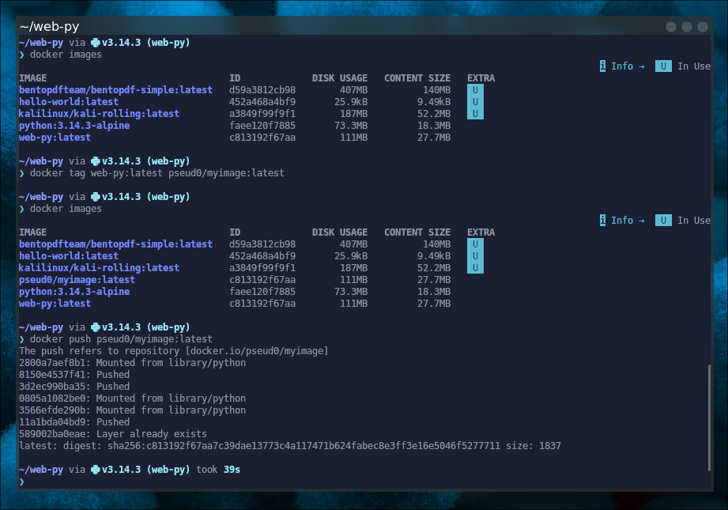

Docker image-nya akan muncul di repository kita:

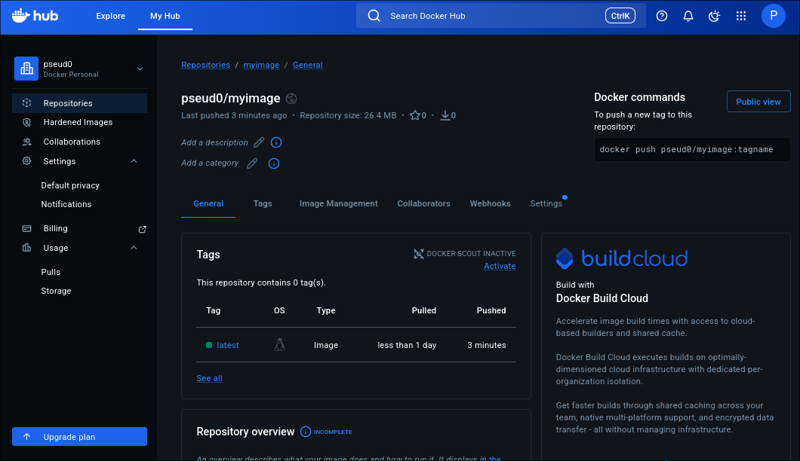

#### docker ps

Melihat container yang sedang berjalan:

```shell
docker ps 
```

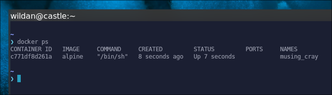

Melihat semua container, termasuk yang sedang tidak berjalan:

```shell
docker ps -a
```

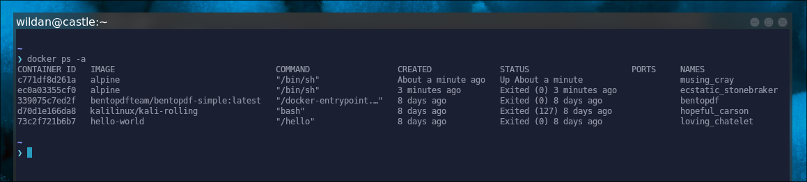

#### docker rm

Menghapus satu atau lebih container:

```shell
docker rm -f <container_name / container_id>
```

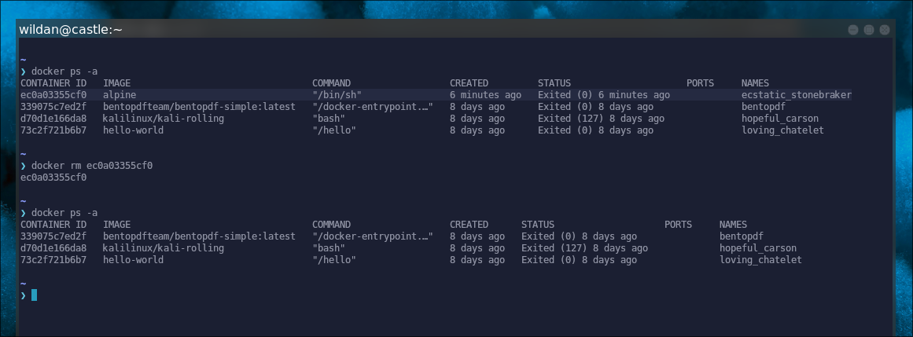

#### docker rmi

Menghapus satu atau lebih docker image:

```shell
docker rmi -f <image_name>
```

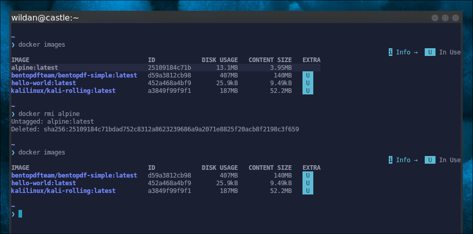


#### docker run

Menjalankan docker image sebagai container:  

```shell
docker run <image_name>
```

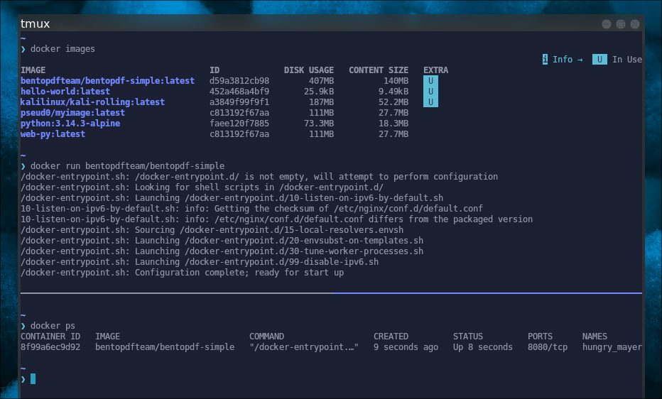

Kita bisa lihat, _container_-nya sudah berjalan:

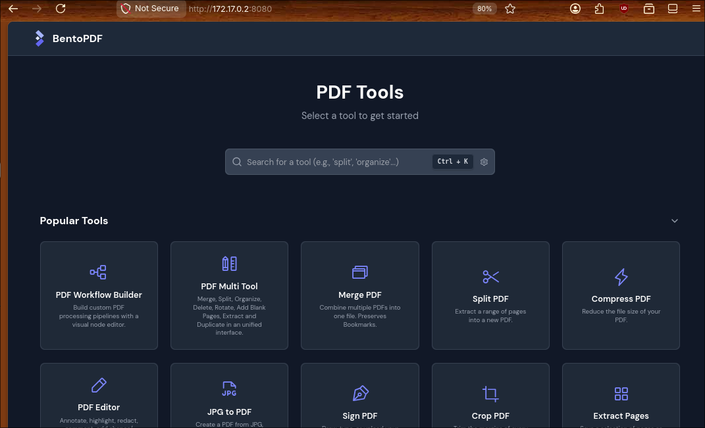

#### docker start

Menjalankan container:

```shell
docker start <container_id>
```

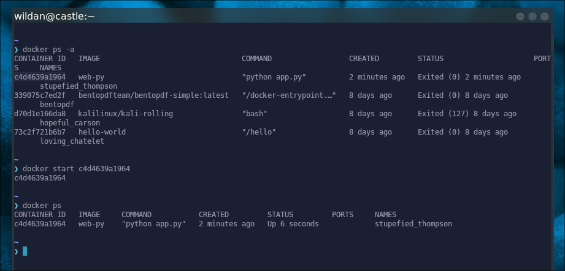

#### docker restart

Me-restart container:

```shell
docker restart <container_id>
```

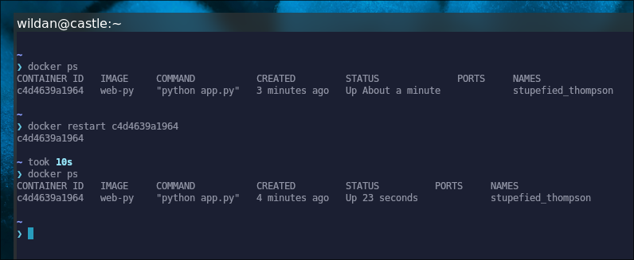

#### docker stop

Menghentikan container:

```shell
docker stop <container_id>
```

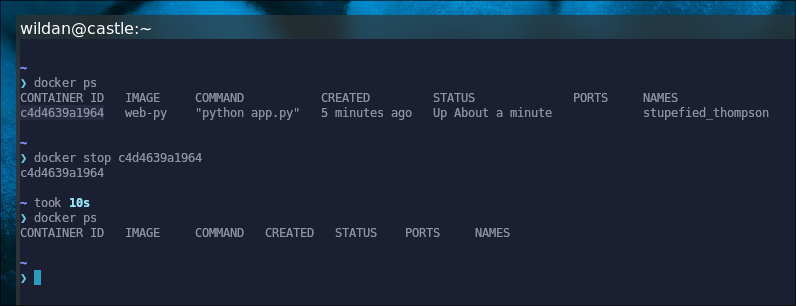

#### docker logs

Melihat log dari sebuah container:

```shell
docker logs <container_id>
```

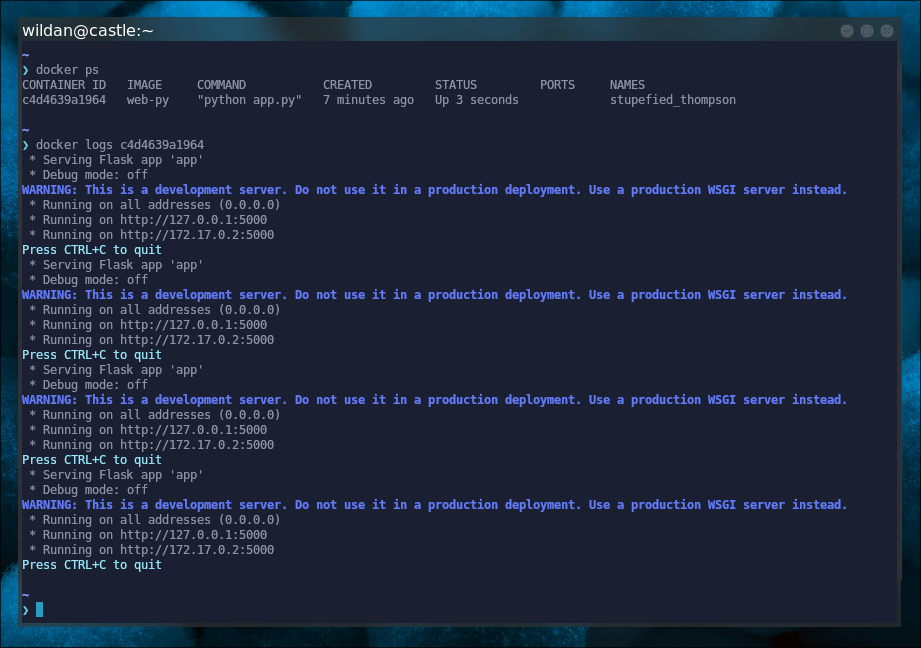

#### docker stats

Melihat alokasi _resource_ yang dipakai oleh container:

```shell
docker stats
```

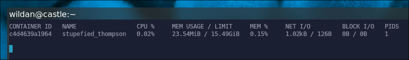

#### docker inspect

Melihat informasi detail sebuah container:

```shell
docker inspect <container_id>
```

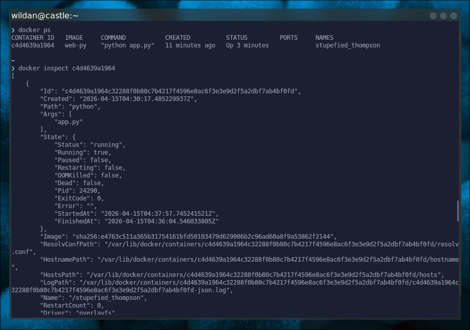

#### docker network

Melihat daftar network:

```shell
docker network ls
```

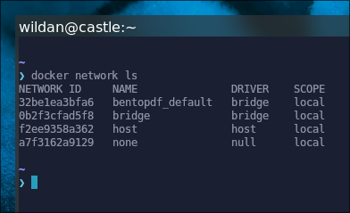

Melihat detail sebuah network:

```shell
docker network inspect <network_name>
```

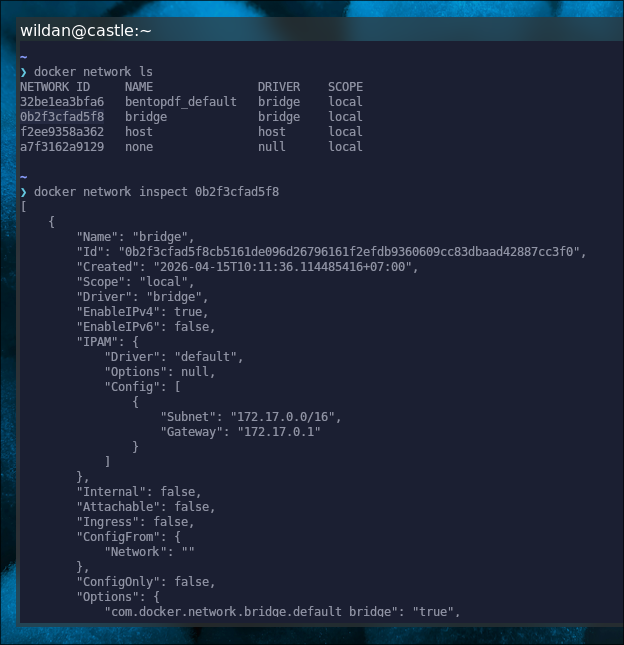

#### docker volume

Volume Docker secara default berada di `/var/lib/docker/volumes`.  

Untuk membuat volume baru:

```shell
docker volume create <volume_name>
```

Untuk melihat daftar volume yang tersedia:

```shell
docker volume ls
```

Untuk melihat informasi detail suatu volume:

```shell
docker volume inspect <volume_name>
```

Untuk menghapus volume:

```shell
docker volume rm <volume_name>
```

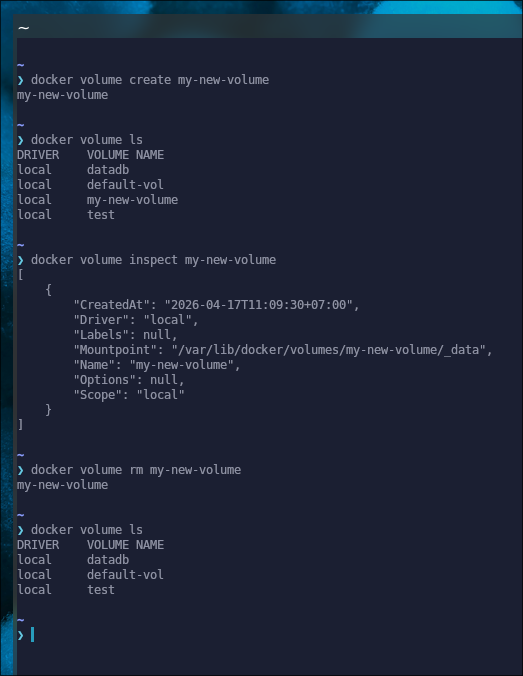

#### docker help

Masih banyak lagi perintah-perintah _docker_ lainnya yang belum dibahas di artikel ini. Tapi, kalian dapat mengeksplorasinya sendiri dengan perintah:

```shell
docker help # atau
docker -h
```

Saya coba lampirkan juga video Youtube tutorial untuk pemula.  
_Worth watching_.

<iframe width="100%" height="468"
  src="https://www.youtube.com/embed/dLQEb3vYyKY"
  title="How to Install Windows Vista + Aero on VMWare"
  frameborder="0" allowfullscreen>
</iframe>

## Docker Compose

Docker Compose adalah sebuah alat dari Docker untuk mendefinisikan dan menjalankan banyak container dengan satu file konfigurasi.[^10] Jadi, melalui Docker Compose, jika kita ingin menjalankan banyak container, kita gak perlu membuat perintah `docker run ...` atau `docker start ...` satu persatu, tapi cukup dengan satu perintah Docker Compose aja.

### At A Glance

Pada prakteknya, kita hanya perlu sebuah file konfigurasi (YAML file) yang dijalankan dengan Docker Compose, seperti ini:

```shell
docker compose docker-compose.yml
```

Apa saja yang perlu "dideklarasikan" atau "didefinisikan" dalam file konfigurasi tersebut?  Berikut adalah **3 komponen utama** yang ada di dalam file konfigurasi Docker Compose:[^11][^12]

1. **Services**

Bagian `services` digunakan untuk mendefinisikan setiap kontainer yang akan menjadi bagian dari aplikasi kita. Inilah _the pith of the configuration file_ alias bagian yang paling penting dalam file konfigurasi Docker Compose kita. Oleh kaerna karena itu, tanpa bagian `services` ini, Docker Compose belum bisa berjalan.

2. **Networks**

Bagian `networks` digunakan untuk mendefinisikan jaringan Docker yang akan digunakan. Jika kita tidak mendefinisikan `networks` di file konfigurasi, Docker akan otomatis menggunakan jaringan default-nya (bridge).

3. **Volumes**

Bagian `networks` digunakan untuk mendefinisikan penyimpanan aplikasi yang tidak bergantung pada container. Artinya, data aplikasi tidak akan hilang meski kontainernya berhenti atau di-_restart_.

Sehingga, nanti, secara umum, seperti inilah isi file `docker-compose.yml` kalian:

```yaml
services:
  service1:
    image: ...
    ports: ...
    volumes: ...
    environment: ...

  service2:
    build: ...
    depends_on: ...

networks:
  ...

volumes:
  ...
```

Sampai sini, kita tidak perlu khawatir jika masih belum memahami secara utuh komponen-komponen tersebut. Kita akan lihat secara langsung implementasinya di bagian-bagian berikutnya pada artikel ini.


### Installation

Berikut adalah cara meng-_install_ `docker compose` di beberapa sistem operasi Linux:

|       Distro      |                  Command                           |
|       ---         |                   ---                              |
| **Debian/Ubuntu** | **`sudo apt install -y docker-compose`**           |
| **Arch Linux**    | **`sudo pacman -Sy docker-compose`**               |
| **Fedora**        | **`sudo dnf install docker-compose`**              |
| **Opensuse**      | **`sudo zypper install docker-compose`**           |

:::note

**NixOS:**  
Masukkan baris berikut di file konfigurasi (`/etc/nixos/configuration.nix`):

```nix title="nix"
  environment.systemPackages = [
    pkgs.docker-compose
  ];
```

Atau jika menggunakan `nix-shell`:

```shell
nix-shell -p docker-compose
```

:::

Untuk memastikan `docker-compose` sudah ter-_install_:

```shell
docker-compose -v # atau
docker compose version 
```

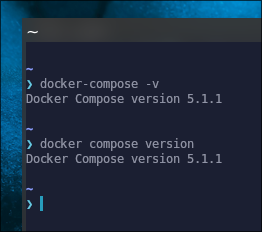

Docker Compose juga bisa dilihat di _repository_ Github milik Docker:

::github{repo="docker/compose"}

### Essential Commands

Sebelum menjalankan perintah-perintah di bawah ini, kita perlu membuat sebuah skema untuk Docker Compose kita. Skemanya sederhana, saya akan menjalankan _container_ `nginx` yang akan menampilkan halaman web berisi sebuah sapaan.[^13]

Berikut adalah struktur direktori skema ini:

```shell
.
├── app
│   └── index.html
└── docker-compose.yml
```

Berikut file konfigurasinya (`docker-compose.yml`):

```yaml
services:
  web:
    image: nginx:alpine
    ports:
      - "8000:80"
    volumes:
      - ./app:/usr/share/nginx/html
```

:::note

**Keterangan:**

- **images: nginx: alpine**  
Bagian ini artinya, kita akan membuat sebuah container bernama "web" yang akan menggunakan image "nginx" versi alpine (sehingga ukurannya kecil dan ringan).
- **ports: "8000:80"**  
Bagian ini artinya, kita akan _mapping_ port 80 di container ke port 8000 di host. Artinya, kalau saya buka http://localhost:8000 di browser, sebenarnya saya sedang mengakses nginx di dalam container di port 80.
- **volumes: ./app:/usr/share/nginx/html**  
Bagian ini artinya, kita akan me-_mounting_ (memasang) folder/direktori `./app` di komputer saya ke folder/direktori `/usr/share/nginx/html` di dalam _container_. Artinya, semua isi folder/direktori `./app` akan langsung disajikan oleh `nginx`, tanpa perlu _rebuild_ _container_-nya.

:::

Seperti terlihat, file konfigurasi Docker Compose ini hanya memiliki 1 dari 3 komponen utama yang sudah dijelaskan sebelumnya, yaitu `services`. Meskipun demikian, Docker Compose sudah dapat berjalan karena bagian `services` adalah bagian paling penting dalam file konfigurasi Docker Compose.

Berikut adalah file webnya (`app/index.html`):

```html title="index.html"
<!doctype html>
<html lang="en">
<head>
    <meta charset="utf-8">
    <title>Docker Compose Demo</title>
    <link rel="stylesheet" href="https://cdn.jsdelivr.net/gh/kognise/water.css@latest/dist/dark.min.css">
</head>
<body>

    <h1>This is a Docker Compose Demo Page.</h1>
    <p>This content is being served by an Nginx container.</p>

</body>
</html>
```

Berikut adalah perintah-perintah penting di Docker Compose:[^10]

#### docker compose up

Menjalankan container dari sebuah file konfigurasi:

```shell
docker compose up 
```

Jika ingin berjalan di _background_:

```shell
docker compose up -d
```

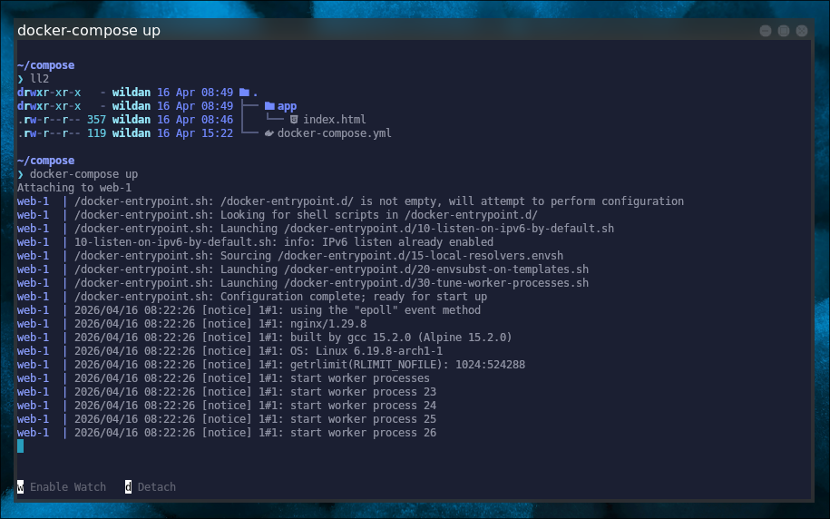

Berjalan dengan baik di port 8000:

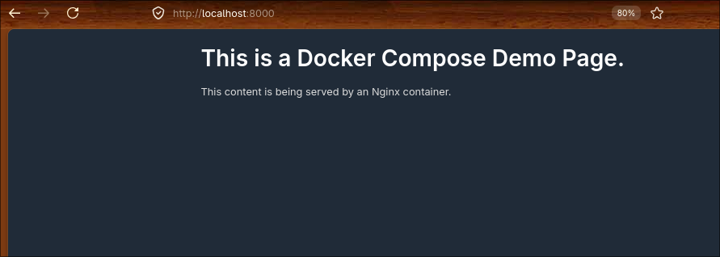

#### docker compose down

Untuk menghentikan kontainer yang sedang berjalan:

```shell
docker compose down
```

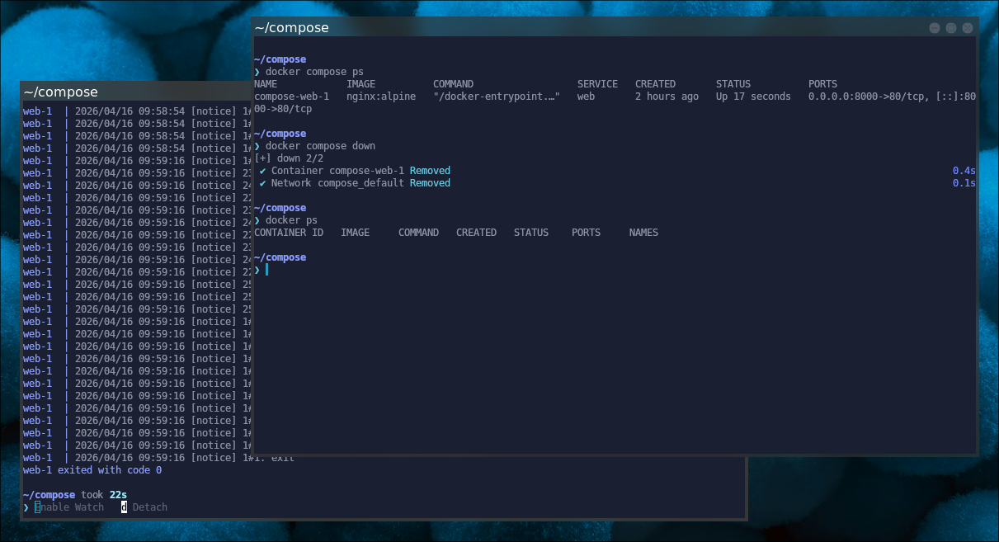

#### docker compose ps

Melihat proses yang sedang berjalan:

```shell
docker compose ps
```

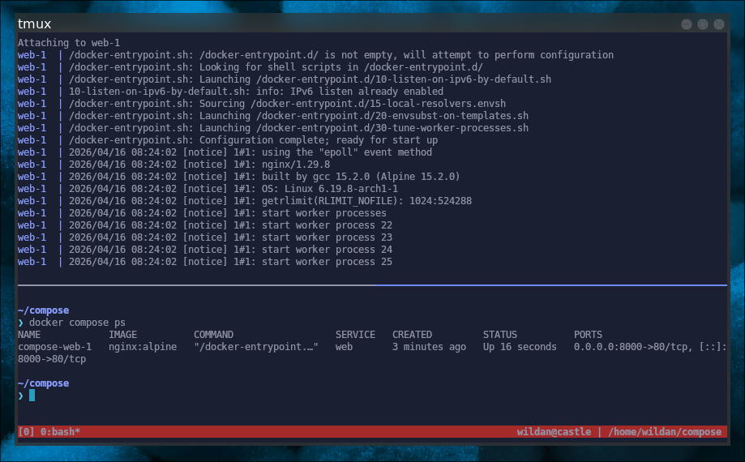

#### docker compose logs

Melihat log:

```shell
docker compose logs
```

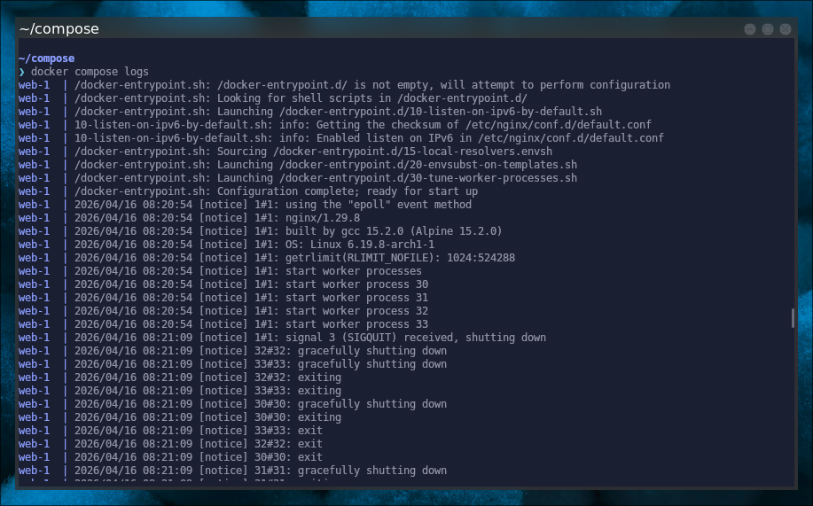


:::note

Sampai artikel ini ditulis, perintah-perintah Docker Compose di atas hanya dapat berjalan di direktori yang terdapat file konfigurasinya. Artinya, jika file konfigurasi (`docker-compose.yml`)-nya ada di direktori atau folder `~/Documents` misalnya, sementara kalian menjalankan perintah-perintah Docker Compose tersebut di direktori lain seperti `~/Downloads`, maka akan muncul _error_. 

:::

#### docker compose help

Masih banyak perintah-perintah Docker Compose lainnya yang tidak di-_cover_ di artikel ini. Tapi, kalian dapat mengeksplorasinya sendiri di:

```shell
docker compose -h # atau
docker compose help
```

## Lazydocker

Pernah mendengar `lazygit`?  
Saya pernah menulis tentang `lazygit` di website ini lho:



### At A Glance

Mirip seperti `lazygit`, `lazydocker` adalah program terpisah (_non-official_) berbasis CLI yang dibuat untuk "para pemalas" yang enggan mengetikkan perintah-perintah **Docker** dan **Docker Compose** di terminal. Program ini juga merupakan tool _open source_ yang juga dibuat oleh orang yang sama yang membuat `lazygit`. Dengan adanya `lazydocker`, kita dapat memantau _container_ kita hanya dengan satu _interface_ sederhana ini.


### Installation

Berikut adalah cara meng-_install_ `lazydocker` di beberapa sistem operasi Linux:

|       Distro      |                  Command                       |
|       ---         |                   ---                          |
| **Arch Linux**    | **`sudo pacman -Sy lazydocker`**               |
| **Opensuse**      | **`sudo zypper install lazydocker`**           |

:::note

**NixOS:**  
Masukkan baris berikut di file konfigurasi (`/etc/nixos/configuration.nix`):

```nix
  environment.systemPackages = [
    pkgs.lazydocker
  ];
```

Atau jika menggunakan `nix-shell`:

```shell
nix-shell -p lazydocker
```

:::

Karena distro **Debian/Ubuntu** dan **Fedora** tidak menyediakan `lazydocker` di repository-nya, jadi, kalian yang menggunakan distro tersebut dapat mengambil _binary_-nya atau meng-_compile_-nya langsung dari repository Github `lazydocker` di sini:

::github{repo="jesseduffield/lazydocker"}

Website official `lazydocker`: https://lazydocker.com/ 

### `lazydocker` UI

Berikut adalah tampilan (UI / _User Interface_) `lazydocker` ketika pertama kali dijalankan:

```shell
lazydocker
```

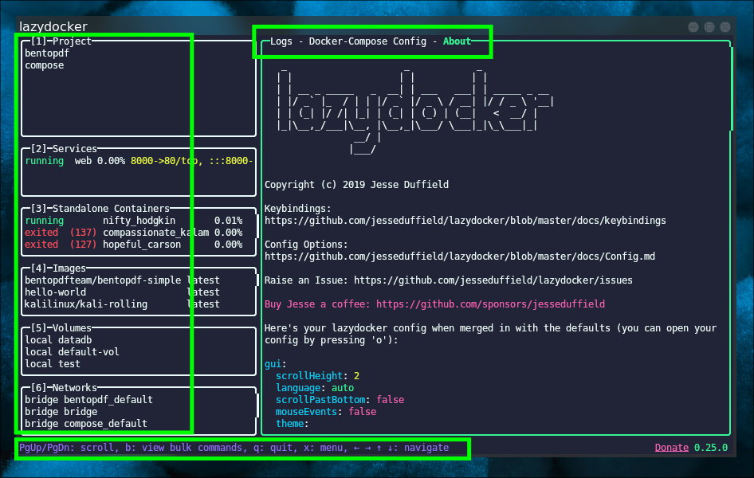

Perhatikan 3 bagian yang saya _highlight_ tersebut: ada 2 window utama, yaitu window di sebelah kiri dan di sebelah kanan, ditambah satu bagian _keybinding_ (_shortcut_) di bagian bawah.

1. **Window Kiri**

Window di bagian kiri menunjukkan informasi terkait 6 hal:
- **Project:** Berisi informasi tentang "Docker Project" yang ada di komputer kita, baik _project_ yang diambil dari Docker Registry (seperti dockerhub) maupun dari Docker Compose.  
- **Services:** Berisi informasi tentang Services yang ada di komputer kita, berikut statusnya (_running_ / _exited_).  
- **Containers:** Berisi informasi tentang Container yang ada di komputer kita, berikut statusnya (_running_ / _exited_).
- **Images:** Berisi informasi tentang Images yang ada di komputer kita, berikut dengan Tag-nya.  
- **Volumes:** Berisi informasi tentang Volumes yang ada di komputer kita (lokasinya di `/var/lib/docker/volumes`).  
- **Networks:** Berisi informasi tentang Networks yang ada di komputer kita.

2. **Windows Kanan**

Window di bagian kanan menunjukkan informasi detail dari objek yang kita lihat di Window Kiri. Kita bisa melihat ada beberapa sub-menu-nya juga, dan sub-menu ini berbeda-beda tergantung bagian mana dari 6 bagian yang ada di Window Kiri yang sedang kita buka. Untuk berpindah sub-menu, kita bisa gunakan _keybinding_ (_shortcut_): **`[`** untuk ke kiri, dan **`]`** untuk ke kanan.

3. **Keybind di Bawah**

Bagian ini menunjukkan informasi praktis tentang cara mengoperasikan `lazydocker` ini, mulai dari cara melakukan _scrolling_, keluar dari `lazydocker`, melihat menu atau daftar _keybinding_ yang tersedia, dan bernavigasi dari satu Window ke Window lainnya.

:::info

**Pro Tip:**

Kita juga bisa menekan tombol `Shift+?` di keyboard untuk melihat daftar _keybinding_ (_shortcut_) yang tersedia dan dapat digunakan.

:::


### How to use

#### docker ps, docker logs, docker stats, docker inspect

Keempat perintah tersebut (`docker ps`, `docker logs`, `docker stats`, `docker inspect`) saya gabung karena memang kita dapat melakukannya dengan (sangat) mudah di `lazydocker` hanya dengan bernavigasi dari satu Window ke Window lainnya, dari satu sub-menu ke sub-menu lainnya. Semua itu dapat saya lakukan hanya dengan 6 buah tombol di keyboard: _arrow up, arrow down, arrow right, arrow left, opening square bracket, closing square bracket_.

**Perhatikan** tombol keyboard yang muncul di bagian bawah video!

<video width="100%" controls autoplay loop muted>
  <source src="../images/docker/vid1.mkv" type="video/mp4">
</video>

> **Notes:** Saya menggunakan `showmethekey` untuk melihat _keystrokes_ keyboard di Wayland. 

#### docker run, docker start, docker restart, docker stop 

Lagi-lagi, keempat perintah tersebut (`docker run`, `docker start`, `docker restart`, `docker stop`) akan saya tunjukkan dalam satu demonstrasi berikut. Sebab, memang akan sangat mudah menjalankan, menghentikan, maupaun menjalankan ulang sebuah container melalui `lazydocker` ini. Semua itu dapat saya lakukan hanya dengan menekan tombol capital S, s, dan r.

**Perhatikan** tombol keyboard yang muncul di bagian bawah video!

<video width="100%" controls autoplay loop muted>
  <source src="../images/docker/vid2.mkv" type="video/mp4">
</video>

Untuk bagian **Images**, **Volumes**, dan **Networks** tidak saya bahas di sini, selain karena tidak banyak yang dapat ditunjukkan selain menghapus-hapus Images/Volumes/Networks, juga karena membuat video demonstrasi ini memakan storage yang lumayan besar (1 video berkisar 1 menit bisa berukuran 3-4 MB!). Oleh karena itu, jika kalian sudah paham dasar-dasar pengoperasian `lazydocker`, kalian bisa mencoba mengeksplorasi bagian-bagian tersebut sendiri! 

Oiya, beberapa kekurangan `lazydocker` yang saya jumpai, terutama terkait dengan perintah-peritah dasar Docker, rupanya, ada beberapa perintah dasar Docker yang belum bisa dilakukan di `lazydocker`, misalnya seperti:
- men-_download_ image: `docker pull`  
- login ke Docker Registry: `docker login`  
- membuat volumes & networks: `docker volume create` & `docker network create`

Sehingga, kita masih memerlukan perintah-perintah manual Docker untuk melakukan operasi tersebut. 

Sekian dulu totorial `docker` dan `lazydocker` ini.  
Terima kasih.
Sampai jumpa di artikel saya yang lain!


[^1]: https://www.dicoding.com/blog/apa-itu-docker/
[^2]: https://docs.docker.com/get-started/docker-overview/
[^3]: https://en.wikipedia.org/wiki/Docker_(software)
[^4]: https://www.docker.com/resources/what-container/
[^5]: https://en.wikipedia.org/wiki/Virtual_machine
[^6]: https://www.ibm.com/think/topics/containers
[^7]: https://www.geeksforgeeks.org/devops/docker-instruction-commands/
[^8]: https://www.coursera.org/collections/docker-cheat-sheet
[^9]: https://docs.docker.com/engine/install/linux-postinstall/
[^10]: https://docs.docker.com/compose/
[^11]: https://dev.to/alexmercedcoder/a-deep-dive-into-docker-compose-27h5
[^12]: https://strapi.io/blog/what-is-docker-compose-all-you-need-to-know
[^13]: https://www.digitalocean.com/community/tutorials/how-to-install-and-use-docker-compose-on-ubuntu-20-04