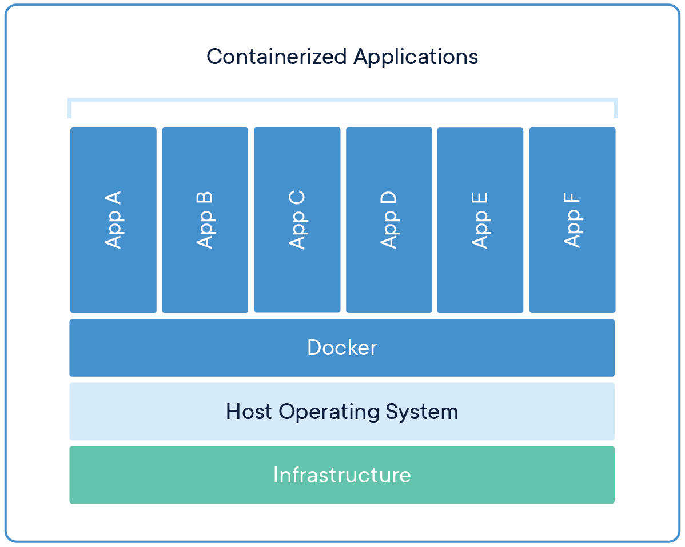
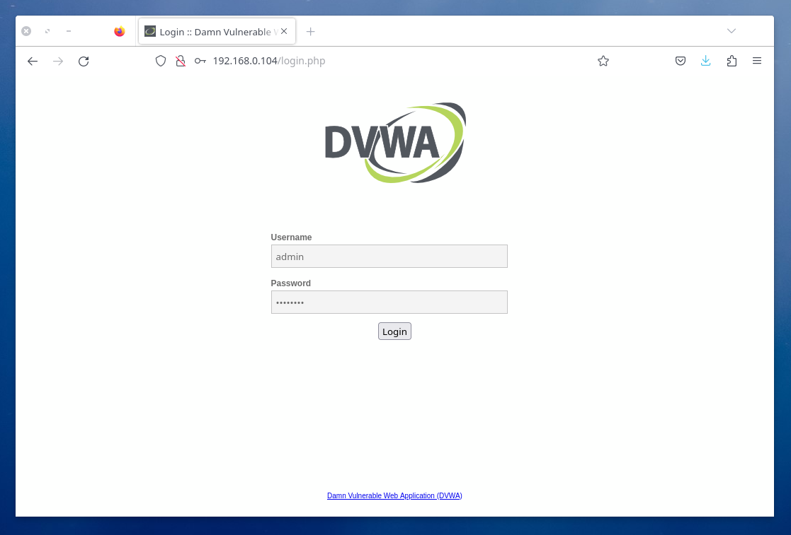
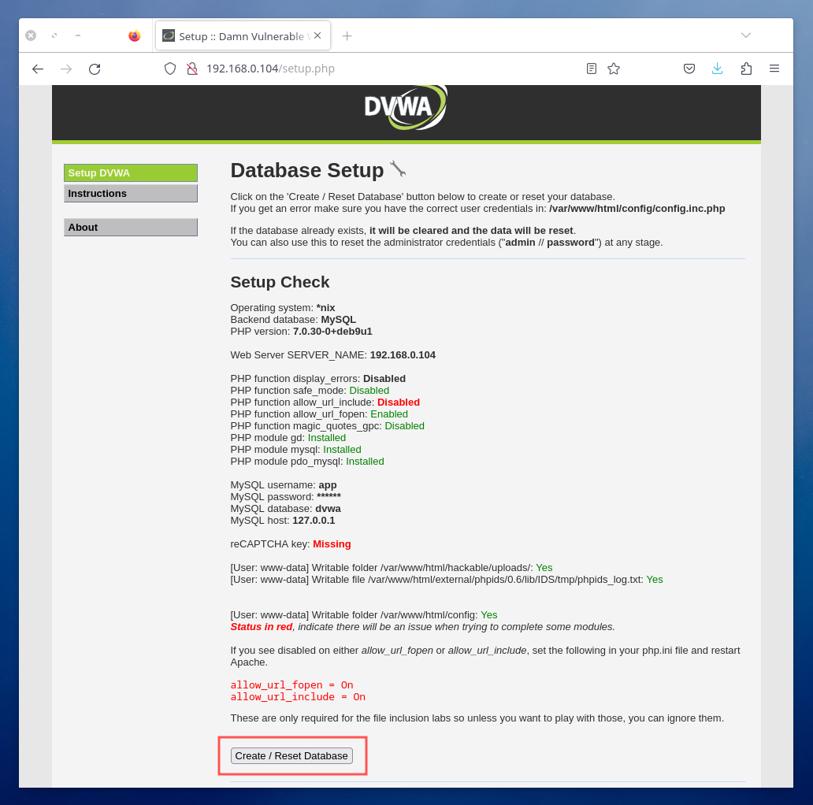
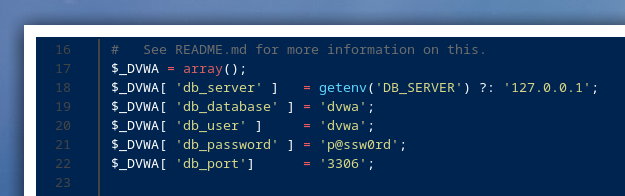
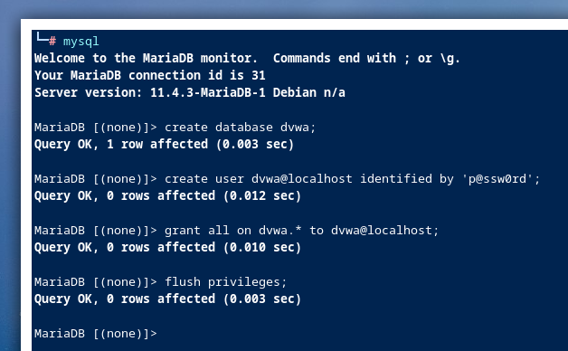
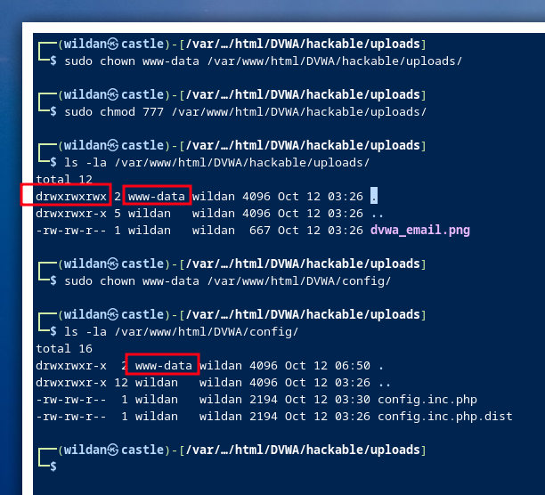

## Intro

Saya akan meng-*install* **DVWA (*Damn Vulnerable Web Apps*)** sebagai tempat berlatih *hacking* website. DVWA memang didesain untuk melakukan uji penetrasi (*penetration testing*) dan eksploitasi beberapa kerentanan yang umumnya banyak ditemukan di aplikasi web, seperti **Command Injection**, **SQL Injection**, **XSS** atau **Cross Site Scripting**, dan lain sebagainya. Jadi, DVWA adalah aplikasi web yang sengaja dirancang agar rentan terhadap serangan-serangan yang saya sebutkan sebelumnya tadi.

Nah, di artikel ini, saya akan meng-*install* DVWA via Docker & manual dari repo Github.

## Instalasi DVWA via Docker

Apa itu Docker?  
Docker adalah platform *open source* untuk meng-*create*, me-*manage*, dan men-*deploy* aplikasi dalam sebuah *container*. <mark> Sederhananya, docker adalah sebuah *container*</mark>. Berikut adalah ilustrasi dari *container* dan docker.




> **Note:**  
> Lebih lanjut tentang docker dan container: https://www.docker.com/resources/what-container/

Berikut adalah langkah-langkah pemasangan DVWA via docker:[^1]  
*1. Install docker.*  
*2. Pull DVWA's docker image.*  
*3. Run DVWA's docker image.*  
*4. Login with default creds.*  
*5. Create database.*  
*6. Set difficulty level.*   
*7. Play and have fun!*  

:::warning

*This image is vulnerable to several kinds of attacks, please don't deploy it to any public servers*.

:::

### 1. Install Docker

```shell
sudo apt -y update && 
sudo apt -y install docker.io &&

sudo systemctl start docker && sudo systemctl status docker
```

> **Credit to** [digininja](https://github.com/digininja) sebagai *maintainer* [DVWA di Github](https://github.com/digininja/DVWA).

### 2. Pull DVWA's docker image

```shell
sudo docker pull vulnerables/web-dvwa
```

### 3. Run DVWA's docker image

```shell
sudo docker run --rm -it -p 80:80 vulnerables/web-dvwa
```

### 4. Login with default creds

**admin:password**




### 5. Create database



### 6. Set difficulty level

Silakan atur *difficulty level*-nya sesuai kebutuhan, bisa diatur mulai dari **low**, **medium**, **high**, hingga **impossible**. Low artinya *security* web-nya sangat rendah alias website sangat rentan, sebaliknya impossible artinya security-nya sangat tinggi sehingga sangat sulit untuk diretas.

Saya akan atur ke **low**.

<div style="display: flex; justify-content: center;">
  <video width="80%" controls autoplay loop muted>
    <source src="../images/dvwa-docker/vid1.mp4" type="video/mp4">
  </video>
</div>

### 7. Play and have fun!

Selesai!

Kita berhasil meng-install DVWA via docker. Nantikan artikel-artikel saya berikutnya terkait *web hacking* ya!

> <mark> **Default DVWA Login Creds:**</mark>  
> username: admin  
> password: password

## Instalasi DVWA via Github

Berikut adalah langkah-langkah pemasangan DVWA via Github:[^2,^3]  

*1. Install required packages.*
*2. Clone repo.*
*3. Move DVWA directory to **`/var/www/html`**.*
*4. Copy **`config.inc.php.dist`** to **`config.inc.php`**.*
*5. Create new database user.*
*6. Edit some PHP configs.*
*7. Change permission to **writable** to some dirs.*

### 1. Install required packages

Kita perlu meng-*install* (atau meng-*update*) beberapa packages:

> **Note:** Langkah-langkah ini diasumsikan dilakukan di Debian-Ubuntu based distro, jadi, kalau kalian menggunakan distro linux yang lain, silakan disesuaikan.

```shell
sudo apt update &&
sudo apt install -y apache2 mariadb-server mariadb-client php php-mysqli php-gd libapache2-mod-php
```

### 2. Clone repo

Berikut adalah repository Github resmi DVWA: https://github.com/digininja/DVWA

```shell
git clone https://github.com/digininja/DVWA.git
```

### 3. Move DVWA directory to **`/var/www/html`**

Kita pindahkan direktori DVWA yang sudah berhasil di-*clone* dari Github ke direktori Apache2:

```shell
mv DVWA/ /var/www/html/
```

### 4. Copy **`config.inc.php.dist`** to **`config.inc.php`**

```shell
cd DVWA;
cd config; 

cp config.inc.php.dist config.inc.php
```

### 5. Create new database user

Sekarang, kita perlu membuat database baru untuk DVWA:

Log in dulu ke MariaDB:

```shell
sudo systemctl start mysql && sudo systemctl status mysql

sudo su -
mysql
```

Tambahkan user dan password baru untuk DVWA, pastikan sesuai dengan konfigurasi yang ada di **`/var/www/html/DVWA/config/config.inc.php`**:



```sql
create database dvwa;
create user dvwa@localhost identified by 'p@ssw0rd';
grant all on dvwa.* to dvwa@localhost;
flush privileges; 
```

Pastikan perintah-perintah penambahan database DVWA tersebut dilakukan satu persatu sambil memperhatikan *response* dari mysql/mariadb-nya.



### 6. Edit some PHP configs

Selanjutnya, kita akan mengedit beberapa config PHP untuk memaksimalkan fungsionalitas DVWA sebagai target kita nanti. File PHP yang perlu diedit yaitu **`/etc/php/$(PHP version)/apache2/php.ini`**:

*Enable*-kan 3 fungsi "allow_url_include":

```php
allow_url_include = Open
```

### 7. Change permission to **writable** to some dirs

Terakhir, kita perlu memberikan akses tulis (*writable*) untuk kedua direktori berikut:

1. **`/var/www/html/DVWA/hackable/uploads/`**
2. **`/var/www/html/DVWA/config/`**

```shell
sudo chown www-data /var/www/html/DVWA/hackable/uploads/
sudo chmod 777 /var/www/html/DVWA/hackable/uploads/

sudo chown www-data /var/www/html/DVWA/config/
```



Kemudian, jalankan apache2:

```shell
sudo systemctl start apache2
```

Dan DVWA kita sudah bisa diakses di url berikut: `http://$IP ADDRESS:80/DVWA`

Selanjutnya, kita sudah bisa login, melakukan *set up* database, dan menyesuaikan *difficulty level*-nya. Setelah itu, kita sudah bisa bermain dengan lab DVWA kita!!

> <mark> **Default DVWA Login Creds:**</mark>  
> username: admin  
> password: password

[^1]: https://hub.docker.com/r/vulnerables/web-dvwa
[^2]: https://www.thecybercrawler.com/post/setting-up-dvwa-a-comprehensive-installation-guide