Keberadaan buku digital / buku elektronik (*e-book*) saat ini sudah menjadi keniscayaan di era yang juga sudah digital. 
Kelebihan buku elektronik dibanding buku fisik selain murah dan mudah (atau gak mudah ya? hehe) diperoleh adalah juga tidak banyak memakan tempat (rak buku, dsb). 
Oleh karena itu, kita (apalagi akademisi, baik di sekolah ataupun perguruan tinggi) sangat memerlukan buku sebagai referensi dalam kegiatan belajar-mengajar.

Nah, kali ini saya akan memberikan tutorial mendapatkan buku digital dengan mudah karena hanya membutuhkan telegram sebagai modal utamanya.
Secara singkat, berikut adalah langkah-langkah yang perlu diikuti:
1. Menginstal Tor Browser
2. Mengakses alamat url z-library via Tor Browser
3. Membuat akun di z-library
4. Menghubungkan z-library ke telegram (dan membuat bot telegram)
5. Mengunduh *e-book* via bot telegram z-library

:::info

Buku yang ada di Z-Library sebetulnya adalah buku "illegal" karena bukan disebarkan atau di-share langsung oleh author-nya. Itulah mengapa Z-lib di-banned FBI (wkwk, ini serius) dan harus pakai Tor Browser untuk mengaksesnya sekarang.

Berapa domain Z-lib yang di-*banned*:
1. https://www.z-lib.org 
2. https://www.z-lib.se

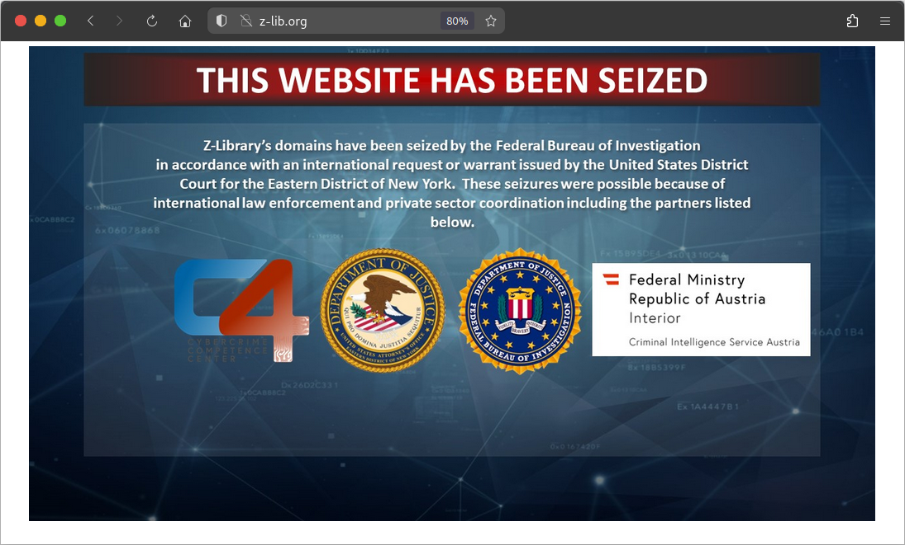

Beberapa alternatif tautan non-Tor yang official (karena ada beberapa tautan *scam*):

1. https://z-library.sk
2. https://z-lib.fm

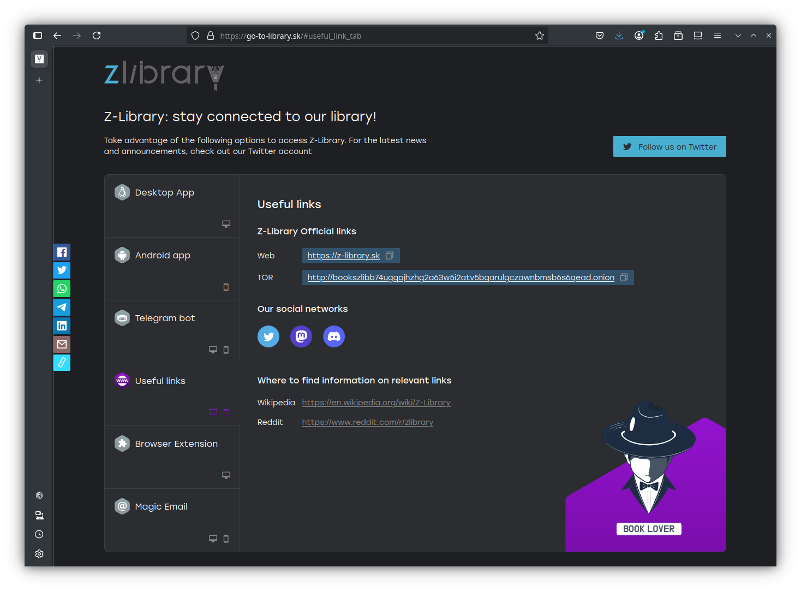

> Kita perlu login terlebih dahulu kalau ingin mengunduh buku-buku tersebut.

:::

Detail penjelasannya adalah sebagai berikut:

Jadi, kalian bisa melewati langkah 1 (Menginstall TOR Browser) & langkah 2 (Mengakses alamat url Z-Library via Tor Browser)
karena kalian dapat mengakses alamat *clone* Z-Library tersebut di browser normal.

### 1. Meginstall Tor Browser
TOR Browser perlu diinstal karena kita akan mengakses alamat tor z-library (berakhiran .union). 
Untuk menginstall Tor Browser, kita bisa mengunjungi website-nya di [sini](https://www.torproject.org/download/).
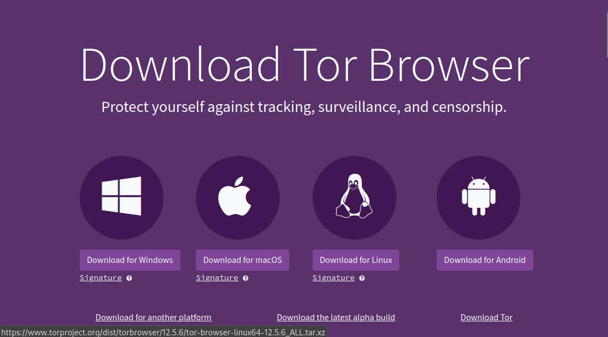

Silakan download binary installer TOR Browser sesuai sistem operasi dari laptop/komputer kalian. 
Kebetulan saya install Tor Browser di Linux dengan versi 12.5.6 yang 64 bit.
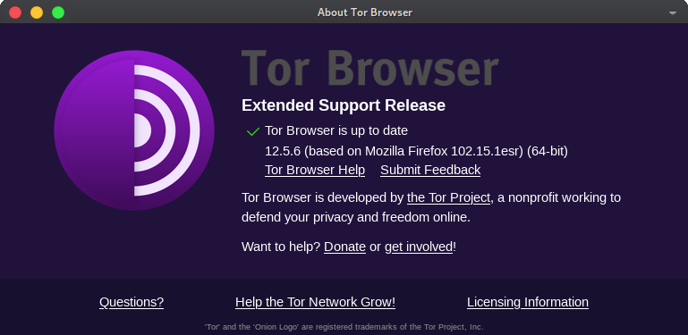

### 2. Mengakses alamat url z-library via Tor Browser
Buka Tor Browser, kemudian koneksikan dengan jaringan Tor dengan klik tombol **connect**. Tunggu beberapa saat sampai proses koneksi selesai.
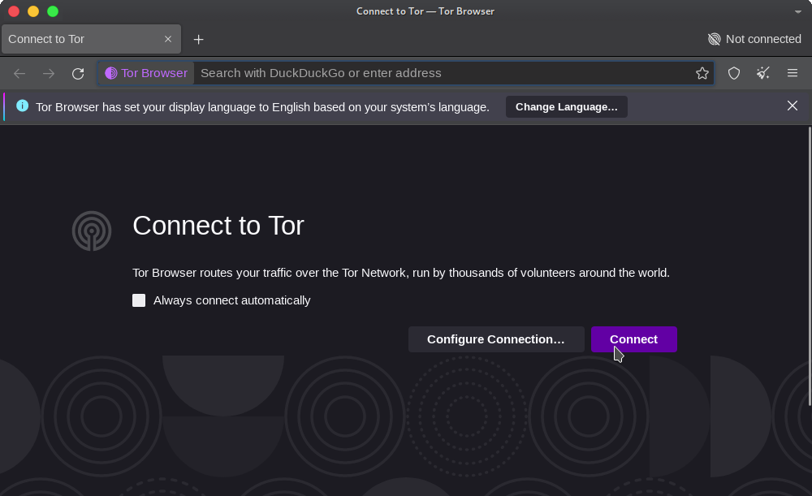
Jika sudah terkoneksi, jangan lupa untuk meng-aktifkan *bridges* di **Setting** -> **Connection** -> **Use current bridges**
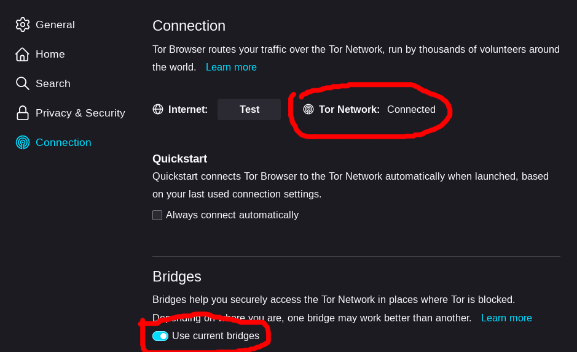

Jika sudah aman semua, tinggal *copy-paste* url tor z-library berikut di kolom pencarian.

opsi 1: :spoiler[**http://zlibrary24tuxziyiyfr7zd46ytefdqbqd2axkmxm4o5374ptpc52fad.onion**]

opsi 2: :spoiler[**http://loginzlib2vrak5zzpcocc3ouizykn6k5qecgj2tzlnab5wcbqhembyd.onion**]

opsi 3: :spoiler[**http://bookszlibb74ugqojhzhg2a63w5i2atv5bqarulgczawnbmsb6s6qead.onion**]

> **Notes:**  
> Berselancar di tor browser tidak akan semulus dan selancar berselancar di browser pada umumnya. Oleh karena itu, jika kalian mengalami koneksi yang lamban, jangan khawatir, memang seperti itulah jaringan tor.

### 3. Membuat akun di z-library
Berikutnya, silakan buat akun z-library dengan menginputkan
- *email*
- *password*, dan
- *nickname*
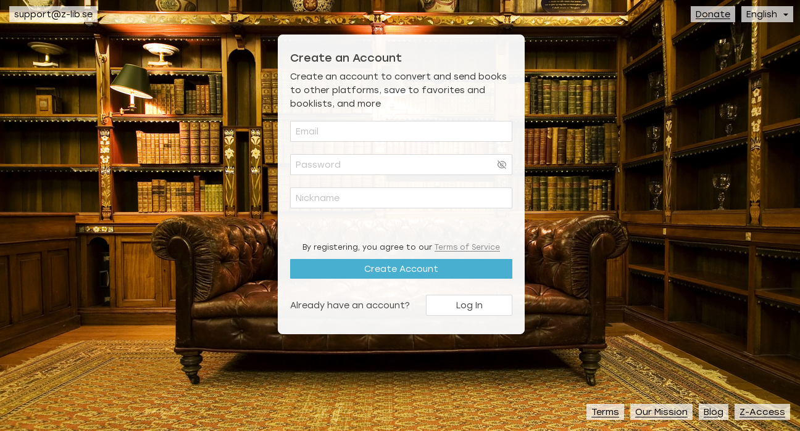

Jika sudah, silakan login menggunakan **email** dan **password** yang sudah dibuat tadi.

### 4. Menghubungkan z-library ke telegram
Berikutnya, klik ikon yang ada di pojok kanan atas, lalu pilih **Z-Access**.
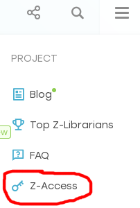
Di sana, klik sub-menu **Telegram Bot** -> **Open bot**.
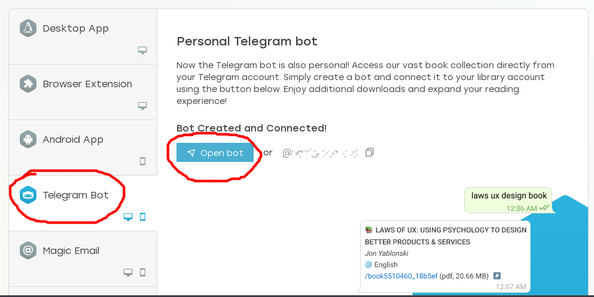

> *Asumsinya, kalian sudah punya telegram ya. Kalau belum, silakan buat akun telegram dulu. Caranya gak susah, bisa di-google-ing.*

Selanjutnya, nanti akan ada instruksi "instalasi" bot z-ibrary di telegram, dimulai dari link yang mengarah ke bot telegram @BotFather. 
Silakan buka link bot tersebut di telegram web atau aplikasi telegram desktop.

Tahap selanjutnya, kita hanya perlu mengikuti instruksi yang diberikan oleh @BotFather, mulai dari memulai bot, membuat nama bot, dan terakhir, kita diminta untuk meng-*copy-paste*-kan pesan terakhir (yang juga berisi token untuk mengakses API z-library) dari @BotFather ke kolom yang ada di halaman z-library. 

Pesan terakhir yang harus di-*copy-paste* seluruhnya:
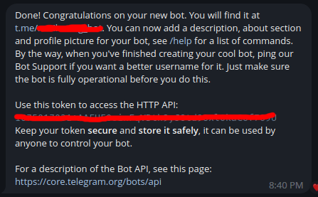

### 5. Mengunduh *e-book* via bot telegram z-library
Jika semua rangkaian proses tadi sudah selesai dilakukan, maka sejatinya kita sudah bisa mendapatkan e-book dari z-library dengan mudah, yaitu hanya via bot telegram **"t.me/nama_bot_kalian"**.

Berikut akan saya demo-kan cara mendapatkan e-book dari z-library via bot telegram. 
Misalnya, saya ingin mencari buku ensiklopedia teori komunikasi, maka saya hanya perlu mengetikkan keyword berikut:  
<mark>encyclopedia of communication theory</mark>
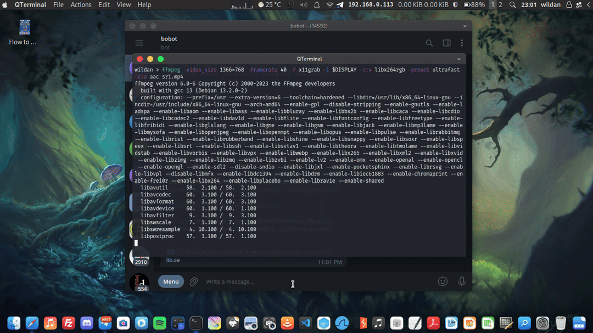

Oke, sekian dulu tutorial kali ini.

See, ya!

