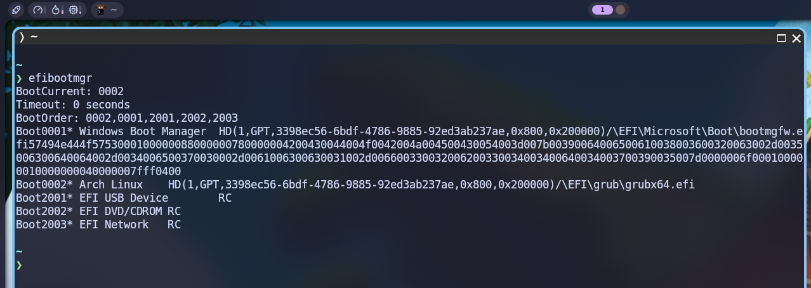

## Getting to Know 

### What is `efibootmgr`?

Menurut definisi (atau deskripsi) dari paket tersebut di repo Archlinux, `efibootmgr` adalah aplikasi [user space](https://www.redhat.com/en/blog/architecting-containers-part-1-why-understanding-user-space-vs-kernel-space-matters) di linux yang bertugas untuk melakukan modifikasi pada EFI _boot manager_.[^1]

Jadi, kalau linux kita tidak bisa _booting_ dengan normal (misalnya, opsi bootloader tidak muncul di GRUB atau bahkan boot entry tidak muncul di boot menu BIOS komputer), kita tidak perlu buru-buru khawatir dan langsung _install_ ulang seluruh sistem linux kita, tapi kita bisa cek terlebih dahulu, barangkali kita bisa memperbaiki bootloader-nya via `efibootmgr`.

### UEFI vs Legacy

:::info

Sebelum lebih dalam ke caranya, kita perlu tahu dulu bahwa _tool_ ini, seperti namanya, `efibootmgr` hanya dapat digunakan untuk melakukan manajemen bootloader berbasis **UEFI**, bukan Legacy.

:::

Apa itu UEFI dan Legacy? Apa bedanya?

#### Legacy BIOS

Legacy BIOS (_Basic Input Output System_) adalah sebuah _software_ (_firmware_) yang tersimpan di motherboard komputer kita dan bertugas untuk melakukan _booting_ dan membangkitkan sistem operasi kita.[^2] Akan tetapi, Legacy BIOS adalah software lama (sudah ada sejak 1980-an) dan hanya akan kompatibel untuk menjalankan OS (_Operating System_) lama juga.

Berikut adalah beberapa kelebihan Legacy BIOS:[^3]
1. Kompatibilitas dengan perangkat keras lama.
2. Mudah digunakan dan diatur.
3. Tidak memerlukan konfigurasi yang kompleks.

Sementara berikut ini adalah kekurangan Legacy BIOS:
1. Cara membaca disk pake MBR (_Master Boot Record_).
2. Terbatas dalam mengenali kapasitas penyimpanan (maksimal di 2TB).
3. Tidak mendukung fitur keamanan modern seperti _Secure Boot_.
4. Tidak dapat digunakan pada sistem operasi 64-bit.

#### UEFI

Seperti BIOS, UEFI (_Unified Extensible Firmware Interface_) yang sudah dikembangkan sejak tahun 2005 adalah _firmware_ modern untuk menggantikan Legacy BIOS. Seperti BIOS juga, UEFI adalah _software_ paling pertama yang akan dijalankan begitu kita menekan tombol power di komputer kita sehingga dia kemudian akan melakukan proses _booting_ dan membangunkan sistem operasi kita.[^2]

Beberapa kelebihan UEFI:[^3]
1. Cara membaca disk dengan GPT (_GUID Partition Table_).
2. Dapat mengenali kapasitas penyimpanan lebih besar dari 2TB.
3. Mendukung fitur keamanan modern seperti _Secure Boot_.
4. Dapat digunakan pada sistem operasi 64 bit.
5. Lebih cepat dan efisien dalam proses _booting_.

Namun, ada juga beberapa kekurangan UEFI:
1. Tidak kompatibel dengan perangkat keras (_hardware_) lama.
2. Memerlukan konfigurasi yang (sedikit) lebih kompleks.
3. Tidak semua sistem operasi mendukung UEFI.

Jadi, berikut adalah kesimpulan perbandingan Legacy BIOS vs UEFI.[^4]

| Aspek | Legacy BIOS | UEFI |
|---|---|---|
| Partition table | MBR | GPT |
| Limit disk | 2TB | Jauh lebih besar |
| Limit partition | 4 primary | Praktis unlimited |
| Mode CPU | 16-bit real mode | 32/64-bit |
| Lokasi bootloader | MBR (sector pertama disk) | File `.efi` di ESP |
| Data boot entry | Ga ada konsep ini | Tersimpan di NVRAM motherboard |
| Keamanan | Gak ada | Secure Boot |
| Kecepatan boot | Lebih lambat | Lebih cepat |

## Installation

Berikut adalah cara meng-_install_ `efibootmgr` di beberapa sistem operasi UNIX/Linux:

::: code-group labels=[debian/ubuntu, archlinux, fedora, opensuse]

```shell
sudo apt install -y efibootmgr
```

```shell
sudo pacman -Sy efibootmgr
```

```shell
sudo dnf install efibootmgr
```

```shell
sudo zypper install efibootmgr
```

:::

> **Notes:** FreeBSD sudah meng-_include_-kan `efibootmgr` pada saat proses instalasi FreeBSD itu sendiri. Jadi, kita bisa langsung menggunakannya jika diperlukan tanpa perlu meng-_install_ paket tersebut terlebih dahulu.

:::note

**NixOS:**  
Masukkan baris berikut di file konfigurasi (`/etc/nixos/configuration.nix`):

```nix
  environment.systemPackages = [
    pkgs.efibootmgr
  ];
```

Atau jika menggunakan `nix-shell`:

```shell
nix-shell -p efibootmgr  
```

:::

## Usage

### Prerequisites

Sebelum menggunakannya, pastikan kita sudah memenuhi beberapa persyaratan berikut:
1. Bootable USB (saya sarankan Archlinux).
2. Di menu BIOS komputer, boot ke USB tersebut.
3. Mount partisi sistem yang ingin diperbaiki bootloader-nya.

```shell
mount /dev/sdXn /mnt # mount partisi root
mount /dev/sdXm /mnt/boot # mount partisi boot yang terdapat EFI di dalamnya
```

4. Chroot ke sistem tersebut.

```shell
arch-chroot /mnt
```

Berikut adalah beberapa kasus yang memungkinkan kita menggunakan `efibootmgr`:

### Check bootloader

Langkah paling pertama setelah berhasil melakukan chroot ke sistem adalah melihat apakah bootloader-nya masih ada di ESP (EFI System Partition):

```shell
ls -l /boot/EFI/    # atau /efi/EFI/ tergantung mount point lo
```

Dari sini, muncul 2 kemungkinan:
1. File bootloader (grub/systemd-boot) masih ada.
2. File bootloader (grub/systemd-boot) hilang.

Kita bahas satu persatu.

#### 1. Bootloader exists.

Kalau file grub/systemd-boot masih ada di situ, berarti masalahnya hanya di entri NVRAM-nya aja, bukan bootloader-nya hilang. Solusinya, kita hanya perlu membuat ulang entrinya ke NVRAM.

Berikut adalah perintah untuk me-_reinstall_ entri ke NVRAM:

```shell
efibootmgr -c -d /dev/sdX -p Y -L "Arch Linux" -l '\EFI\grub\grubx64.efi'
```

**Keterangan:**  
`-c`: membuat entri baru (_create_).  
`-d`: men-_specify_ disk yang terdapat partisi EFI.  
`Y`: nomor urutan partisi dari ESP di disk.  
`-L`: memberikan label / nama entri.  
`-l`: men-_specify_ file loader (biasanya berekstensi `.efi`).

:::info

**Contoh penggunaan:**

```shell
# melihat daftar partisi disk
lsblk 

# output lsblk
nvme0n1     259:0    0 953.9G  0 disk 
├─nvme0n1p1 259:1    0     1G  0 part /boot
├─nvme0n1p2 259:2    0   200G  0 part /
├─nvme0n1p3 259:3    0    20G  0 part 
├─nvme0n1p4 259:4    0    16M  0 part 
└─nvme0n1p5 259:5    0   200G  0 part 

# melihat bootloader
eza -lT --level 2 /boot/EFI

# output
drwxr-xr-x    - root 27 Apr 09:41 ├──  grub
.rwxr-xr-x 160k root 17 Jun 20:07 │   └──  grubx64.efi
drwxr-xr-x    - root 16 Jun 19:06 └──  Microsoft
drwxr-xr-x    - root 16 Jun 19:06     ├──  Boot
drwxr-xr-x    - root 16 Jun 19:10     └──  Recovery

# me-reinstall entri ke NVRAM
efibootmgr -c -d /dev/nvme0n1 -p 1 -L "Arch Linux" -l '\EFI\grub\grubx64.efi'
```

:::

Kemudian, kita bisa lihat apakah entri-nya sudah terpasang atau belum:

```shell
efibootmgr
# atau
efibootmgr -v
```

Kemudian, cari entri dengan nama seperti label yang sudah kita berikan tadi (**Arch Linux**).

#### 2. Bootloader lost

Kalau file grub/systemd-boot hilang, artinya bootloader memang perlu dipasang lagi juga. Solusinya, kita _install_ bootloader-nya terlebih dahulu, baru kemudian buat entri di NVRAM.

Pertama, kita perlu meng-_install_ ulang bootloader-nya terlebih dahulu:

```shell
grub-install --target=x86_64-efi --efi-directory=/boot --bootloader-id=GRUB
grub-mkconfig -o /boot/grub/grub.cfg
```

> Btw, saya juga pernah menulis sedikit tentang modifikasi GRUB di artikel berikut:
> 

Baru kemudian kita memasang kembali entri bootloader tersebut ke NVRAM:

```shell
efibootmgr -c -d /dev/sdX -p Y -L "Arch Linux" -l '\EFI\grub\grubx64.efi'
```

**Keterangan:**  
`-c`: membuat entri baru (_create_).  
`-d`: men-_specify_ disk yang terdapat partisi EFI.  
`Y`: nomor urutan partisi dari ESP di disk.  
`-L`: memberikan label / nama entri.  
`-l`: men-_specify_ file loader (biasanya berekstensi `.efi`).

Kemudian, kita bisa lihat apakah entri-nya sudah terpasang atau belum:

```shell
efibootmgr
# atau
efibootmgr -v
```

Kemudian, cari entri dengan nama seperti label yang sudah kita berikan tadi (**Arch Linux**).

### NVRAM Entry Modif

Perhatikan bagian **BootOrder** dari _output_ perintah:

```shell
efibootmgr
# atau
efibootmgr -v
```

Sebab, kita bisa mengetahui berada di urutan berapakah entri linux kita (Arch Linux). Urutan ini penting karena UEFI akan memilih siapa yang akan dibangkitkan pertama kali berdasarkan urutan tersebut.



Misalnya, di komputer saya, entri "Arch Linux" saya berada di urutan pertama (abaikan nomornya, fokus pada urutan yang berada di **BootOrder**).

Jika kita misalnya mau menukar urutannya:

```shell
efibootmgr -o 0001,0002
```

**Keterangan:**  
`-o`: boot order (urutan _booting_)  

Maka, nanti, sistem operasi / device dengan nomor entri 0001 akan berada di urutan pertama, sementara 0002 akan berada di urutan kedua. Begitu seterusnya (jika kita memiliki lebih dari dua sistem operasi / device).

Sekian.  
Terima kasih sudah membaca.  
Sampai jumpa di artikel saya yang lain!


[^1]: https://archlinux.org/packages/core/x86_64../images/efibootmgr/
[^2]: https://www.overclockers.co.uk/blog/legacy-bios-vs-uefi-what-are-the-differences-and-which-is-better/
[^3]: https://unikma.ac.id/2025/12/15/legacy-dan-uefi-perbedaan-dan-kelebihan/
[^4]: https://claude.ai/share/e1e02fc5-8ee1-4f7a-9aa6-8381f5377631

