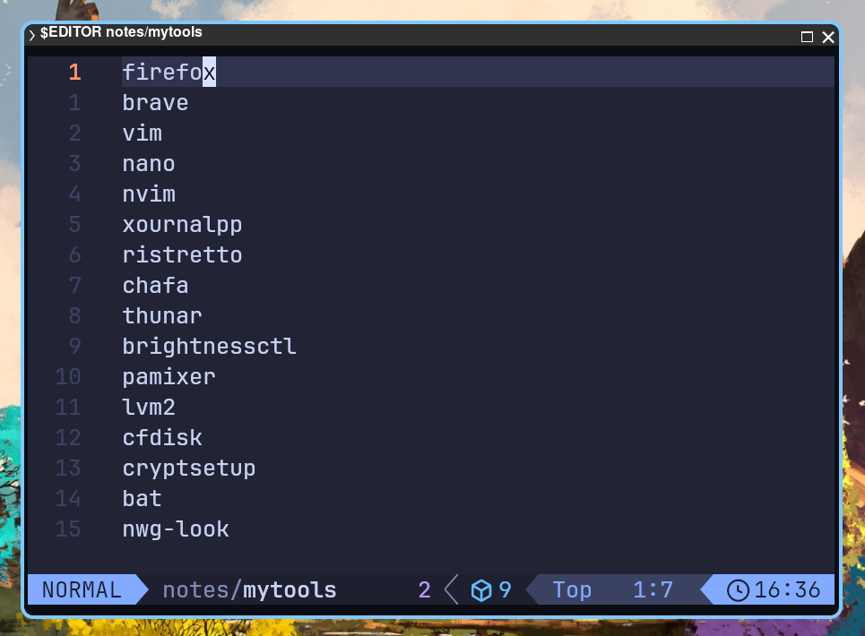
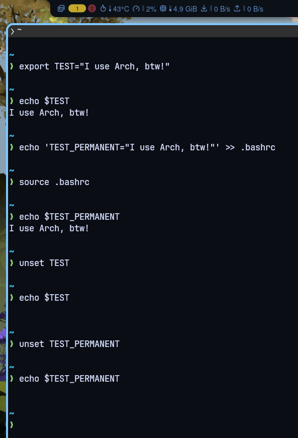

## Warming Up

Perhatikan apa yang terjadi ketika saya mengetikkan perintah berikut di terminal:

```shell
env
```

_output_-nya:

```shell
SHELL=/bin/bash
COLORTERM=truecolor
VSSCRIPT_PATH=/usr/lib/python3.14/site-packages/vapoursynth/libvsscript.so
MEMORY_PRESSURE_WRITE=c29tZSAyMDAwMDAgMjAwMDAwMAA=
KITTY_PID=6073
XCURSOR_SIZE=24
EDITOR=nvim
XDG_SEAT=seat0
PWD=/home/wildan
LOGNAME=wildan
XDG_SESSION_TYPE=wayland
SYSTEMD_EXEC_PID=628
DESKTOP_STARTUP_ID=EVhVwlzH3PgOpF8XMi3n8yRlOKTcUwel
KITTY_PUBLIC_KEY=1:M8)nOKvC@%@h_OQ|3U)}X#z>0Z;INvpL{cFgkt<9
MOTD_SHOWN=pam
HOME=/home/wildan
LANG=en_US.UTF-8
XDG_CURRENT_DESKTOP=niri
MEMORY_PRESSURE_WATCH=/sys/fs/cgroup/user.slice/user-1000.slice/user@1000.service/session.slice/niri.service/memory.pressure
STARSHIP_SHELL=bash
WAYLAND_DISPLAY=wayland-1
KITTY_WINDOW_ID=2
INVOCATION_ID=3b21282c381d401a82b7f5305672891d
NIRI_SOCKET=/run/user/1000/niri.wayland-1.628.sock
MANAGERPID=482
STARSHIP_SESSION_KEY=2880615391969817
XDG_SESSION_CLASS=user
TERMINFO=/usr/lib/kitty/terminfo
TERM=xterm-kitty
USER=wildan
VISUAL=nvim
SHLVL=3
XDG_VTNR=1
XDG_SESSION_ID=1
MANAGERPIDFDID=4235
XDG_RUNTIME_DIR=/run/user/1000
DEBUGINFOD_URLS=https://debuginfod.archlinux.org 
JOURNAL_STREAM=10:12511
XCURSOR_THEME=default
PATH=/usr/local/sbin:/usr/local/bin:/usr/bin:/usr/bin/site_perl:/usr/bin/vendor_perl:/usr/bin/core_perl:/home/wildan/.local/bin/:/home/wildan/.local/bin/
DBUS_SESSION_BUS_ADDRESS=unix:path=/run/user/1000/bus
MAIL=/var/spool/mail/wildan
KITTY_INSTALLATION_DIR=/usr/lib/kitty
_=/usr/bin/env
```

Apa itu semua?

Fungsinya apa?

Kita akan bahas..

### What is `env`?

`env` adalah akronim dari ***Environment Variable***. ***Environment Variable*** sendiri merupakan sebuah objek (variabel) yang menyimpan data yang dapat digunakan oleh satu atau lebih aplikasi. Sederhananya, ***Environment Variable*** adalah variabel dengan sebuah nama dan sebuah nilai.[^1] Variabel tersebut memiliki _embel-embel_ "_Environment_" karena memang memiliki batas lingkungan (_scope_) dimana mereka dapat diakses. 

Kita akan bahas mengenai "_scope_" ini nanti.

:::tip[About Environment Variable]

Perhatikan _Environment Variable_ berikut:

`SHELL=/bin/bash`

Keterangan:
- `SHELL`: ini adalah **nama** variabel.  
- `/bin/bash`: ini adalah **nilai (value)** variabel-nya.

Jadi, `SHELL=/bin/bash` adalah sebuah variabel, dimana namanya adalah `SHELL` dan nilai dari `SHELL` yaitu `/bin/bash`.

:::

### What is `env` used for?

Nilai-nilai (_values_) dari ***Environment Variable*** dapat berupa lokasi file binary di _file system_, default editor, hingga _system locale settings_ (pengaturan preferensi bahasa, format waktu, dan pengkodean karakter). Tujuannya adalah untuk menyediakan kemudahan untuk berbagi pengaturan konfigurasi diantara banyak aplikasi dan proses di Linux.[^1]

Sebagai ilustrasi, berikut adalah beberapa jenis _value_ ***Environment Variable***:
1. **Lokasi file binary**

```shell
SHELL=/bin/bash
```

2. **Default editor**

```shell
EDITOR=vim
```

3. ***System locale settings***

```shell
LANG=en_US.UTF-8
```

:::tip[`env` Usage]

Berikut adalah contoh konkret penggunaan ***Environment Variable*** di Linux.  
Misalkan saya ingin meng-_edit_ suatu file teks (.txt), tapi, saya tidak tahu aplikasi/_tools_ file editor apa yang ter-_install_ dan dapat saya gunakan untuk meng-_edit_ file tersebut. Saya bisa memanfaatkan **Environment Variable** untuk meng-_edit_-nya:

```shell
$EDITOR ~/notes/mytools
```

Nah, karena nilai (_value_) dari ***Environment Variable*** `EDITOR`-nya (misalnya) adalah `nvim`, maka file tersebut akan terbuka dengan program `nvim`:



:::

### Types of Environment Variable

Seperti sudah disinggung tadi di awal soal ***scope***, ada 3 jenis _Environment Variable_ berdasarkan _scope_-nya:[^2]

1. **System-wide Environment Variable**

_Environment Variable_ pada _scope_ ini adalah _Environment Variable_ yang tersedia untuk semua ***user*** dan di-_set_ oleh ***system administrator***. Variable-variabel tersebut "didefinisikan" di beberapa tempat (file) berikut:

- `/etc/environment`  
- `/etc/profile`  
- `/etc/bash.bashrc`  

2. **User-specific Environment Variable**

_Environment Variable_ pada _scope_ ini adalah _Environment Variable_ yang tersedia dan di-_set_ oleh ***user*** tertentu, di:

- `~/.bashrc`  
- `~/.profile`  
- `~/.bash_profile`  

3. **Shell Variable**

_Variable_ ini hanya tersedia di _shell_ yang sedang berjalan sehingga dapat dibuat dan dimodifikasi langsung dari _shell_ atau terminal yang sedang berjalan. Misalnya:

```shell
export EDITOR=nano
```


## The Main Part

### How to View

***Environment Variable*** dapat dilihat (atau ditampilkan) dengan beberapa cara berikut:

1. Using the `printenv`

```shell
# menampilkan semua Environment Variable
printenv

# menampilkan Environment Variable tertentu (SHELL misalnya)
printenv SHELL
echo $SHELL
```

2. Using the `env`

```shell
env
```

3. Using the `set`

```shell
set | less
```

### How to Set / Export 

Kita dapat men-_set_ ***Environment Variable*** dengan 2 cara, tergantung tujuan:

#### 1. Temporarily

Ketik perintah berikut langsung di terminal / shell prompt:

```shell
export TEST="I use Arch, btw!"

# lihat hasilnya
echo $TEST
```

:::note

Perlu diingat bahwa men-_set_ ***Environment Variable*** seperti ini hanya akan berlaku saat sesi tersebut masih aktif. Jika sesi berakhir, maka ***Environment Variable***-nya juga akan hilang.

:::

#### 2. Permanently

Kita perlu menyimpan ***Environment Variable*** di file-file yang sudah disebutkan di atas (`/etc/environment`, `/etc/profile`, dan `/etc/bash.bashrc` untuk **System-wide** & `~/.bashrc`, `~/.profile`, dan `~/.bash_profile` untuk **User Specific**) agar permanen (tidak hilang ketika sesi selesai).

> Misalnya, saya akan men-_set_ ***Environment Variable*** ke `~/.bashrc`:

```shell
echo TEST_PERMANENT="I use Arch, btw!" >> ~/.bashrc

# untuk mengaktifkan Environment Variable
source ~/.bashrc

# lihat hasilnya
echo 'TEST_PERMANENT="I use Arch, btw!"'
```

### How to Unset

Untuk menghapus sebuah ***Environment Variable***:

```shell
unset TEST

# lihat perubahannya (gak ada output)
echo $TEST
```

:::note

Jika ***Environment Variable*** di-_set_ secara permanen, maka disamping hanya mengandalkan perintah `unset`, akan lebih baik jika kita juga menghapusnya dari file yang kita gunakan untuk menyimpannya.

:::



## Real Use Case

Apa fungsi konkret dari ***Environment Variable***?   
Misalnya, kita sedang bekerja dengan _bash scripting_ untuk membuat sebuah aplikasi dan kita memerlukan sebuah _ip address_ sebagai percobaan. Namun, IP tersebut akan kita tulis berulang kali di dalam _bash script_ tersebut. Nah, daripada menulis IP yang sama berulang kali, kita dapat memanfaatkan ***Environment Variable*** ini.

Mula-mula, kita _set_ terlebih dahulu ***Environment Variable***-nya dengan menuliskan nama variabelnya berikut dengan nilainya. Misal:

```shell
export IP_ADDR="192.168.34.99"
```

Kemudian, di dalam _bash script_ tersebut, kita hanya perlu "memanggil" nama variabelnya saja alih-alih nomor-nomor IP tersebut:

```shell title="port-scanner.sh"
#!/usr/bin/env bash
# Port scanner TCP sederhana untuk percobaan di VM sendiri.
# Gunakan hanya pada sistem yang Anda miliki atau punya izin untuk diuji.
#
# Pemakaian:
#   ./port_scanner.sh [HOST] [PORTS] [TIMEOUT] [WORKERS]
#   Jika HOST dikosongkan, dipakai nilai variabel lingkungan IP_ADDR.
#
# Contoh:
#   ./port_scanner.sh
#   ./port_scanner.sh "$IP_ADDR" 1-65535
#   ./port_scanner.sh "$IP_ADDR" 22,80,443,3306 1

HOST="${1:-$IP_ADDR}"
PORTS="${2:-1-1024}"
TIMEOUT="${3:-0.5}"
WORKERS="${4:-100}"

if [[ -z "$HOST" ]]; then
    echo "Error: IP target tidak ditemukan. Set variabel lingkungan IP_ADDR atau berikan IP sebagai argumen pertama." >&2
    exit 1
fi

export HOST TIMEOUT

# Ubah "1-1024" atau "22,80,443" menjadi daftar port (satu per baris)
expand_ports() {
    local part
    IFS=',' read -ra parts <<< "$1"
    for part in "${parts[@]}"; do
        if [[ "$part" =~ ^([0-9]+)-([0-9]+)$ ]]; then
            seq "${BASH_REMATCH[1]}" "${BASH_REMATCH[2]}"
        elif [[ "$part" =~ ^[0-9]+$ ]]; then
            echo "$part"
        fi
    done | awk '$1 >= 1 && $1 <= 65535' | sort -un
}

port_list=$(expand_ports "$PORTS")
total=$(echo "$port_list" | wc -l)

echo "Memindai $HOST ($total port)..."
echo

# Pindai paralel memakai /dev/tcp bawaan bash
open_ports=$(echo "$port_list" | xargs -P "$WORKERS" -I{} bash -c '
    timeout "$TIMEOUT" bash -c "exec 3<>/dev/tcp/$HOST/$1" 2>/dev/null && echo "$1"
' _ {} | sort -n)

if [[ -n "$open_ports" ]]; then
    printf '%-8s%-8s%s\n' "PORT" "STATE" "SERVICE"
    while read -r p; do
        svc=$(getent services "$p/tcp" | awk '{print $1}')
        printf '%-8s%-8s%s\n' "$p" "open" "${svc:-unknown}"
    done <<< "$open_ports"
    count=$(echo "$open_ports" | wc -l)
else
    echo "Tidak ada port terbuka yang ditemukan."
    count=0
fi

echo
echo "Selesai. $count port terbuka."
```

:::warn[AI Usage]

Kode di atas di-generate oleh AI **[Antrophic Claude](https://claude.ai/)**

:::

[^1]: https://wiki.archlinux.org/title/Environment_variables
[^2]: https://www.verylazytech.com/linux-environment-variables


