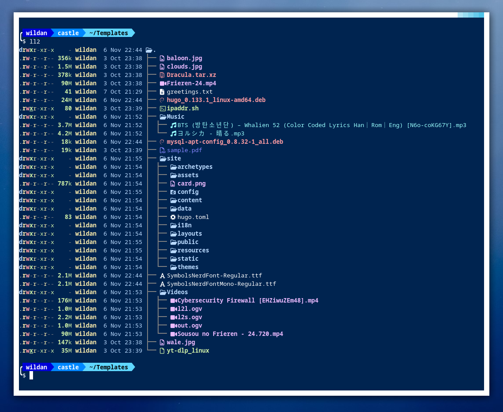
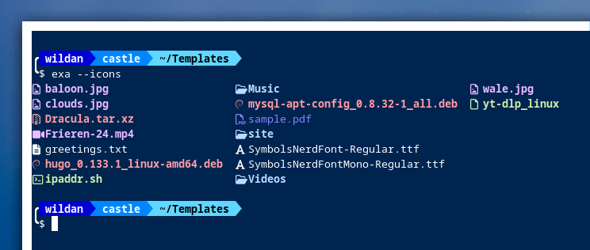
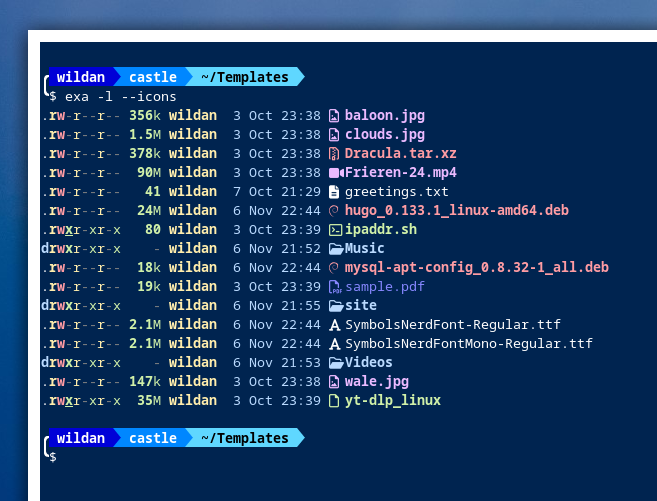
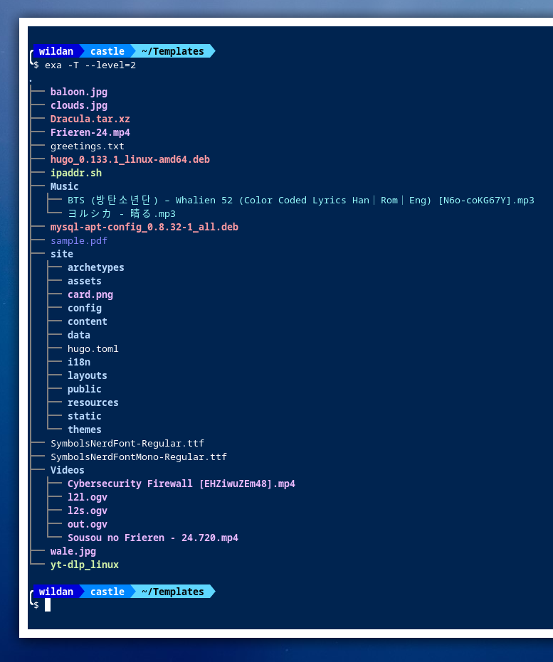
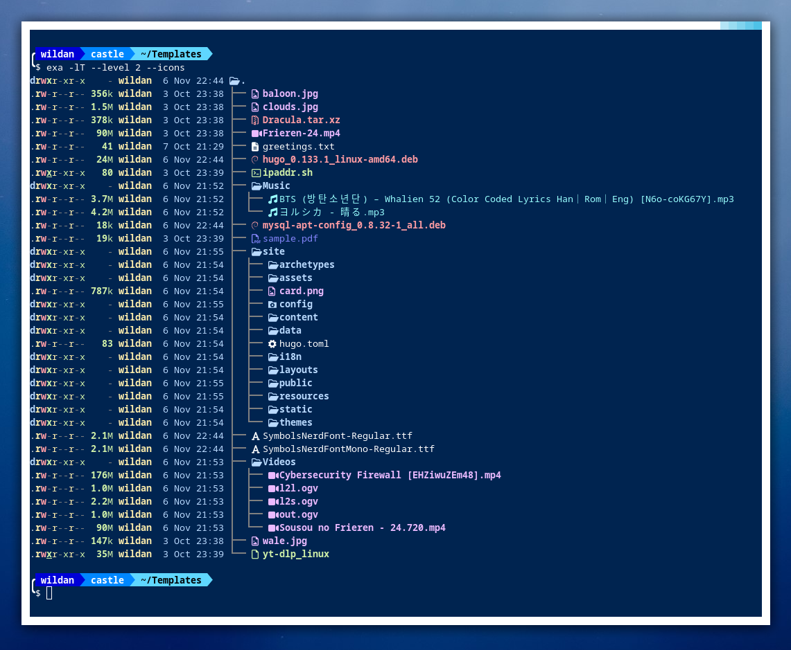

*Utility* **`ls`** adalah *command* atau perintah standard di sistem operasi seperti Linux untuk menampilkan daftar file atau direktori/folder via terminal. Tapi, seiring perkembangan zaman, orang-orang (khususnya pengguna sistem operasi Unix-*based*, seperti Linux) mulai bosan dan ingin mencari suasana baru. Akhirnya, muncullah kreativitas yang mewarnai lingkungan Linux itu sendiri, salah satunya seperti yang akan saya bahas di artikel ini, yaitu *utility* / *command* **`exa`**. 



Seperti terlihat di tangkapan layar (*screenshot*) di atas, me-*list*-ing direktori menggunakan **`exa`** memberikan kesan yang berbeda dibandingkan dengan menggunakan **`ls`**. **`exa`** memberikan kesan yang lebih modern dan *sophisticated* yang tampak dari pemberian warna yang bervariatif, tampilan icon untuk setiap jenis file dan folder, serta dapat menampilkan model *listing* dalam format cabang-cabang bergaris. 

> **Note:**  
> **`exa`** dan **`eza`** menurut saya adalah dua *utility* yang beda nama, tapi sama kegunaannya. Beberapa distro seperti Debian (yang saya gunakan untuk membuat artikel ini) tidak menyediakan **`eza`** di *official repository*-nya, tapi menyediakan **`exa`**. Sebaliknya, distro lain (seperti Archlinux) mungkin tidak menyediakan **`exa`** di *repo*-nya, tapi menyediakan **`eza`**. Jadi, silakan *install* menyesuaikan dengan ketersidaan *package*-nya di masing-masing distro Linux.

## Instalasi `exa` / `eza`

Berikut tutorial instalasi **`exa`** / **`eza`** di masing-masing distro Linux:

|       Distro      |                  Command                  |
|       ---         |                   ---                     |
| **Debian/Ubuntu** | **`sudo apt install exa`**                |
| **Arch Linux**    | **`sudo pacman -Sy eza`**                 |
| **Fedora**        | **`sudo dnf install eza`**                |
| **Opensuse**      | **`sudo zypper install exa`**             |

## Instalasi icon font

Setelah selesai meng-*install* *package* **`exa`** / **`eza`**, kita juga perlu meng-*install* font untuk menampilkan file icons di terminal. Untuk kasus ini, kita bisa meng-*install* **["Symbols Nerd Font"](https://www.nerdfonts.com/font-downloads)** melalui langkah-langkah berikut:

1. *Download* font **Symbols Nerd Font** di tautan berikut: https://www.nerdfonts.com/font-downloads  
2. *Extract* file **NerdFontsSymbolsOnly.zip** yang sudah terunduh:

```shell
unzip NerdFontsSymbolsOnly.zip 
```

3. Pindahkah kedua file font yang berhasil ter-*extract* (**SymbolsNerdFont-Regular.ttf** & **SymbolsNerdFontMono-Regular.ttf**) tersebut ke direktori **`~/.fonts`**.

```shell
mkdir ~/.fonts
mv SymbolsNerdFont-Regular.ttf SymbolsNerdFontMono-Regular.ttf ~/.fonts
```

## Fungsionalitas

Beberapa fungsionalitas **`eza`** / **`exa`** yang akan di-*cover* dalam artikel ini yaitu terkait ***file icons*** dan ***tree***.

### Icons

Perintah dasar untuk menampilkan icon setiap file dan direktori dengan **`exa`** adalah:

```shell
exa --icons
```



Selanjutnya, kita bisa menambahkannya dengan opsi lain. Misalnya, kita ingin menampilkan detail setiap file dan direktori (seperti *permissions*, *owner*, dan *modification time*) sambil tetap menampilkan icon-nya. Perintahnya:

```shell
exa -l --icons
```



### Tree

Terkadang, ada direktori atau folder yang ingin kita ketahui isinya ketika sedang melakukan *listing* file & direktori. Untuk melakukannya, gunakan perintah berikut:

```shell
exa --tree
```

atau 

```shell
exa -T
```

Dengan perintah tersebut, **`exa`** akan me-*listing* semua isi direktori yang ada, bahkan direktori di dalam direktori sekalipun akan tetap di-*listing* sampai ke file terakhir. Akibatnya, jika kita memiliki *child directory* yang banyak dan panjang berikut juga file-filenya yang bejibun, tentu ini tidak akan efektif. 

Solusi yang bisa kita gunakan untuk mengatasi hal tersebut di **`exa`** atau **`eza`** adalah dengan membatasi tingkatan cabang direktori-nya. Misal, kita hanya ingin menampilkan 2 tingkat cabang direktori saja, maka kita bisa gunakan perintah:

```shell
exa --tree --level 2
```

atau 

```shell
exa -T --level=2
```



Sekarang, kita bisa membuat variasinya. Misal, saya ingin menampilkan informasi detail file-file dan direktori yang ada hingga 2 level cabang direktori, berikut juga tampilan icon-nya, perintahnya:

```shell
exa -lT --level 2 --icons
```



## `exa` as an alias of `ls` @ `~/.bashrc`

Setelah mengetahui kedua *basic functionality* dari **`exa`**, kita bisa menggunakannya sebagai alias dari *command* di terminal. Artinya, setiap kali kita menggunakan perintah **`ls`** untuk me-*listing* file dan direktori di terminal, **`exa`**-lah yang akan dieksekusi. 

Berikut adalah **`exa`** alias yang saya *input*-kan di **`~/.bashrc`**:

```shell
alias ls='exa --icons'
alias ll='ls -l'
alias la='ls -a'
alias lla='ls -la'

alias ll2='ls -lT --level=2'
alias ll3='ls -lT --level=3'
```

> **Note:**  
> Untuk mengaktifkan konfigurasi yang baru saja di-*input*-kan di **`~/.bashrc`** di *current terminal session*, kita bisa menggunakan perintah **`source ~/.bashrc`** atau membuka terminal baru untuk membuka *terminal session* yang baru.

