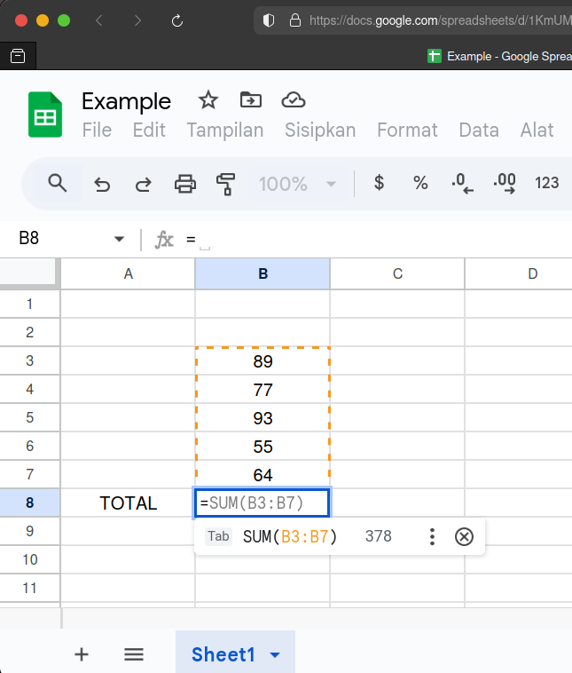
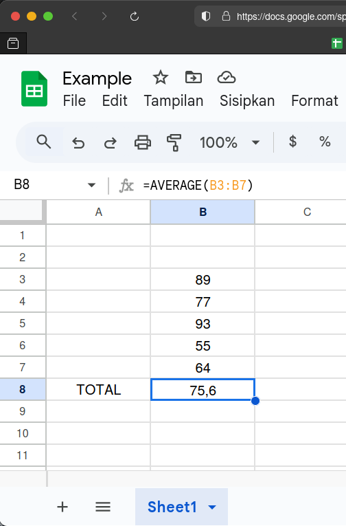
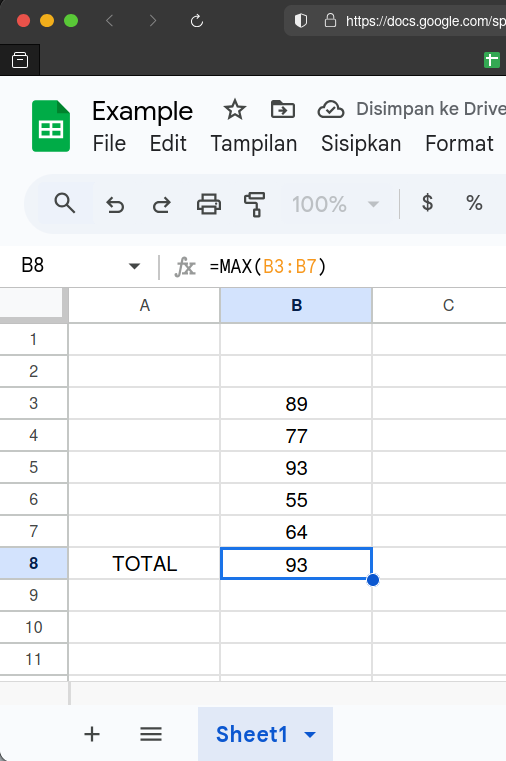
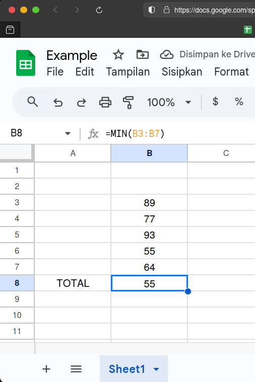
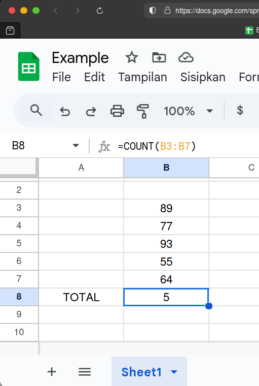
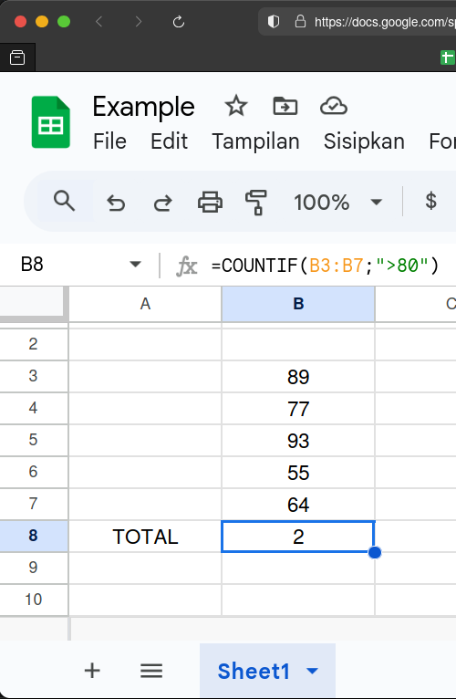

Di artikel ini, kita akan belajar menggunakan 6 fungsi dasar di Microsoft Excel atau Google Spreadsheet, yaitu **SUM**, **AVERAGE**, **MAX**, **MIN**, **COUNT**, dan **COUNTIF** [^1].

:::note

**Note:** Saya akan mendemokan rumus-rumus tersebut di Google Spreadsheet karena 2 alasan utama:
1. fungi-fungsi tersebut masih dapat berfungsi persis seperti ketika digunakan di Microsoft Excel.
2. saya tidak punya excel di linux (dan malas juga _install_ via wine). 

:::

## SUM

Fungsi **SUM** biasanya digunakan untuk menjumlahkan otomatis nilai sehingga kita tidak perlu menghitung nilainya secara manual. Rumus **SUM** ini dapat digunakan untuk menjumlahkan nilai dalam sel, baik secara vertikal atau secara horizontal.  

#### Rumus **SUM**

`SUM(A1:A10)`

Keterangan:
- Menjumlahkan semua nilai dari sel **A1** sampai **A10**.

#### Contoh:
Saya akan menjumlahkan nilai dari sel **B3** sampai **B7**.  
Jadi, rumus yang saya gunakan adalah

`=SUM(B3:B7)`

Langsung terlihat hasilnya adalah **378**.

## AVERAGE

Seperti namanya, fungsi **AVERAGE** digunakan untuk menghitung rata-rata dari kumpulan 2 nilai atau lebih sehingga kita tidak perlu menghitung rata-ratanya secara manual. Rumus ini juga dapat digunakan secara vertikal maupun horizontal.

#### Rumus **AVERAGE**

`AVERAGE(A1:A10)`

Keterangan:
- Menghitung rata-rata dari nilai yang terdapat di sel **A1** hingga **A10**.

#### Contoh: 
Saya akan menghitung rata-rata nilai dari sel **B3** sampai **B7**.  
Jadi, rumus yang saya gunakan adalah

`=AVERAGE(B3:B7)`

Langsung terlihat hasilnya adalah **75,6**.

## MAX

Fungsi **MAX** digunakan untuk mencari nilai yang paling besar sehingga kita tidak perlu mencarinya secara manual. Rumus ini juga dapat digunakan secara vertikal maupun horizontal.

#### Rumus **MAX**

`MAX(A1:A10)`

Keterangan:
- Mencari nilai terbesar yang terdapat di sel **A1** hingga **A10**.

#### Contoh: 
Saya akan mencari nilai terbesar yang terdapat pada sel **B3** sampai **B7**.  
Jadi, rumus yang saya gunakan adalah

`=MAX(B3:B7)`

Langsung terlihat hasilnya adalah **93**.

## MIN

Kebalikan dari fungsi **MAX**, fungsi **MIN** digunakan untuk mencari nilai yang paling rendah sehingga kita tidak perlu mencarinya secara manual. Rumus ini juga dapat digunakan secara vertikal maupun horizontal.

#### Rumus **MIN**

`MIN(A1:A10)`

Keterangan:
- Mencari nilai terkecil yang terdapat di sel **A1** hingga **A10**.

#### Contoh: 
Saya akan mencari nilai terkecil yang terdapat pada rentang sel **B3** sampai **B7**.  
Jadi, rumus yang saya gunakan adalah

`=MIN(B3:B7)`

Langsung terlihat hasilnya adalah **55**.

## COUNT

Fungsi **COUNT** digunakan untuk menghitung jumlah item yang memiliki nilai di rentang sel tertentu sehingga kita tidak perlu menghitungnya secara manual. Rumus ini juga dapat digunakan secara vertikal maupun horizontal.

#### Rumus **COUNT**

`COUNT(A1:A10)`

Keterangan:
- Menghitung jumlah item yang terdapat di sel **A1** hingga **A10**.

#### Contoh: 
Saya akan menghitung jumlah item yang terdapat pada rentang sel **B3** sampai **B7**.  
Jadi, rumus yang saya gunakan adalah

`=COUNT(B3:B7)`

Langsung terlihat hasilnya adalah **5**.

## COUNTIF

Mirip dengan fungsi **COUNT** sebelumnya, fungsi **COUNTIF** digunakan untuk menghitung jumlah item yang memiliki nilai di rentang sel tertentu namun dengan syarat atau kriteria tertentu sehingga kita tidak perlu menghitungnya secara manual. Rumus ini juga dapat digunakan secara vertikal maupun horizontal.

#### Rumus **COUNTIF**

`COUNTIF(A1:A10; "criteria")`

Keterangan:
- Menghitung jumlah item dengan syarat/kriteria yang terdapat di sel **A1** hingga **A10**.

#### Contoh: 
Saya akan menghitung jumlah item yang nilainya lebih dari 80 yang terdapat pada rentang sel **B3** sampai **B7**.  
Jadi, rumus yang saya gunakan adalah

`=COUNTIF(B3:B7; ">80")`

Langsung terlihat hasilnya adalah **2**, yaitu 89 dan 93.

## Latihan

Berikut adalah soal latihan yang dapat dikerjakan untuk mengasah pemahaman tentang ke 6 fungsi/formula dasar di Microsoft Excel (Google Spreadsheet):

Untuk mengakses spreadsheet-nya, [**klik tautan ini!**](https://docs.google.com/spreadsheets/d/1zE3ZFqe7pm3YXTEcZjZBay3MK_Tk5TL1TZFhM_62U0Y/edit?usp=sharing)

<iframe width="100%" height="570" src="https://docs.google.com/spreadsheets/d/e/2PACX-1vQcAP7RvWqwmBTKuvYytcH6VoNGTn6UkZ85KSQsO_7ApoSP2i-QtDm5_TySTgAuj-bpwNiQXqdK7ejC/pubhtml?gid=843779883&amp;single=true&amp;widget=true&amp;headers=false"></iframe>

[^1]: chatgpt.com

