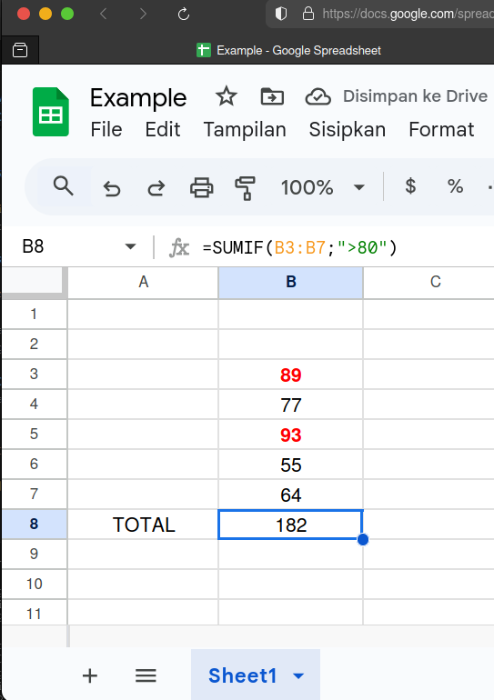
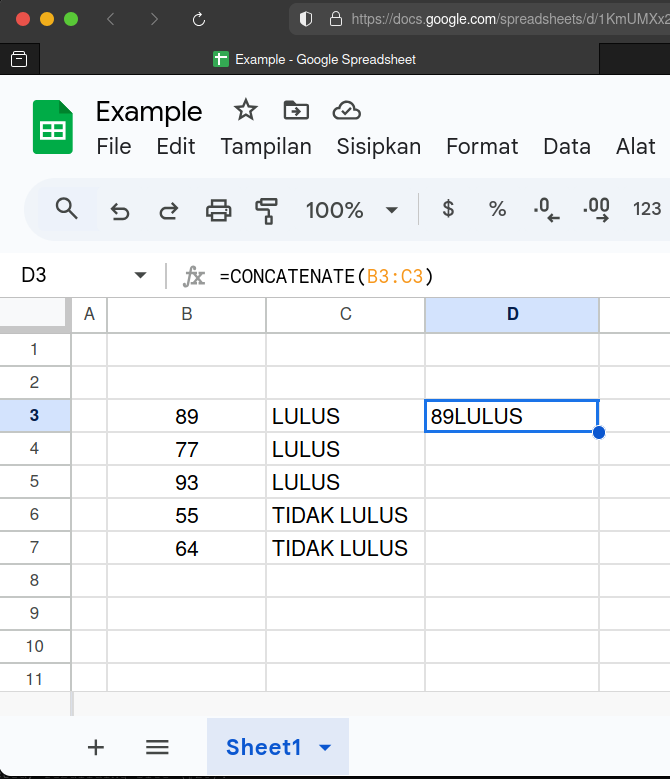
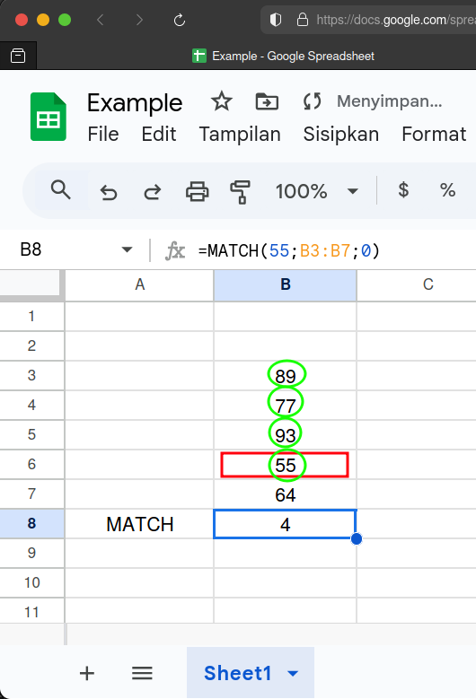
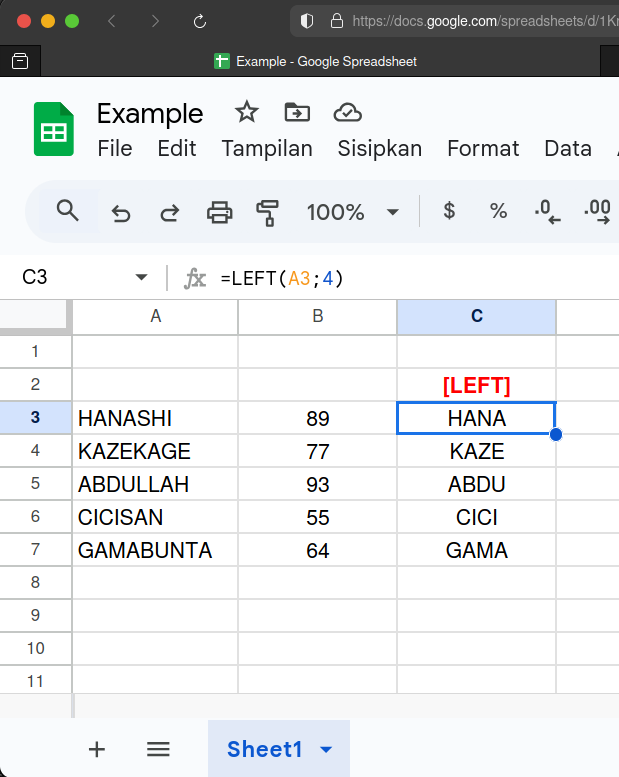
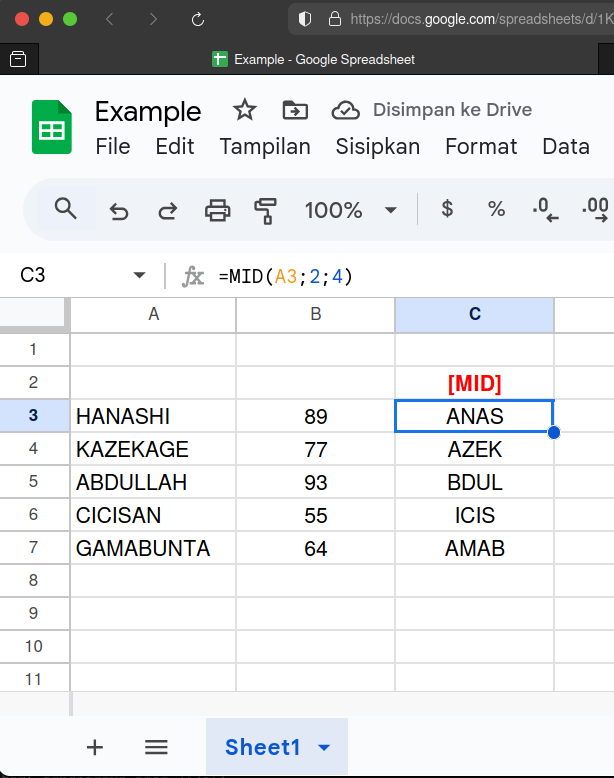
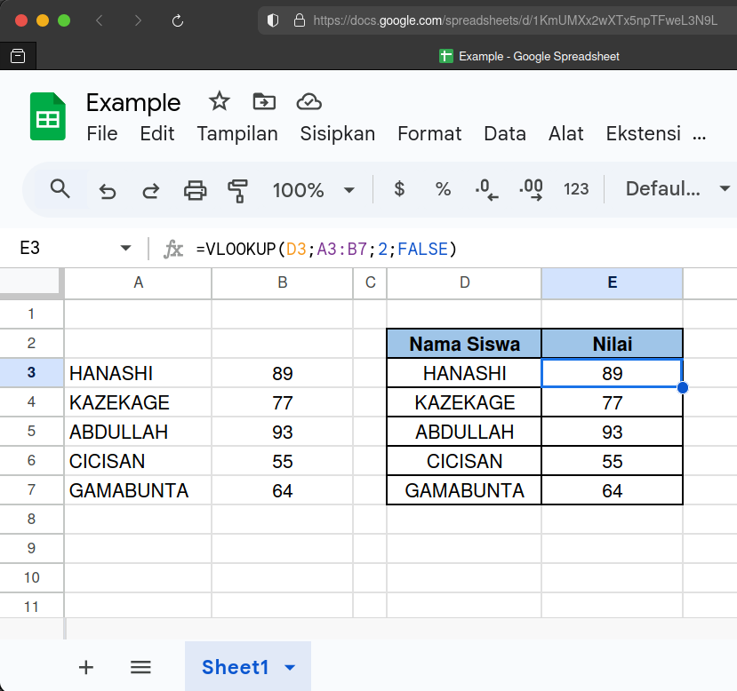
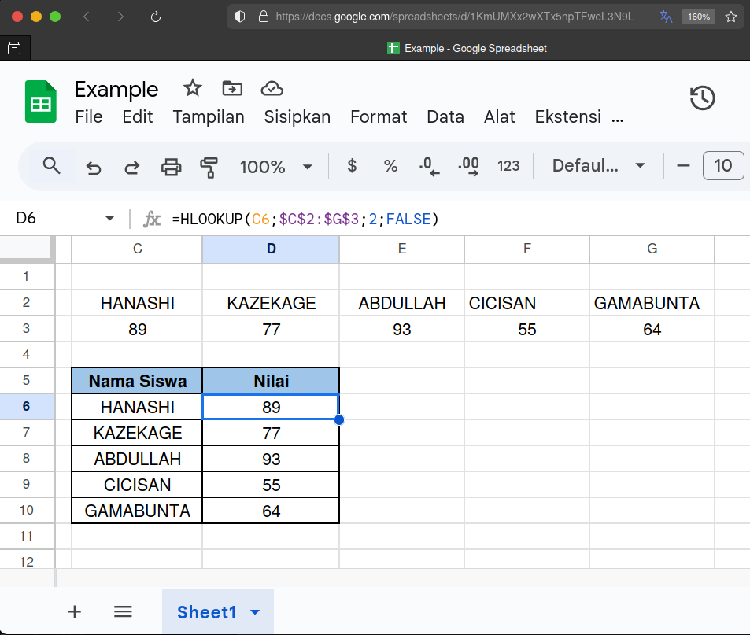
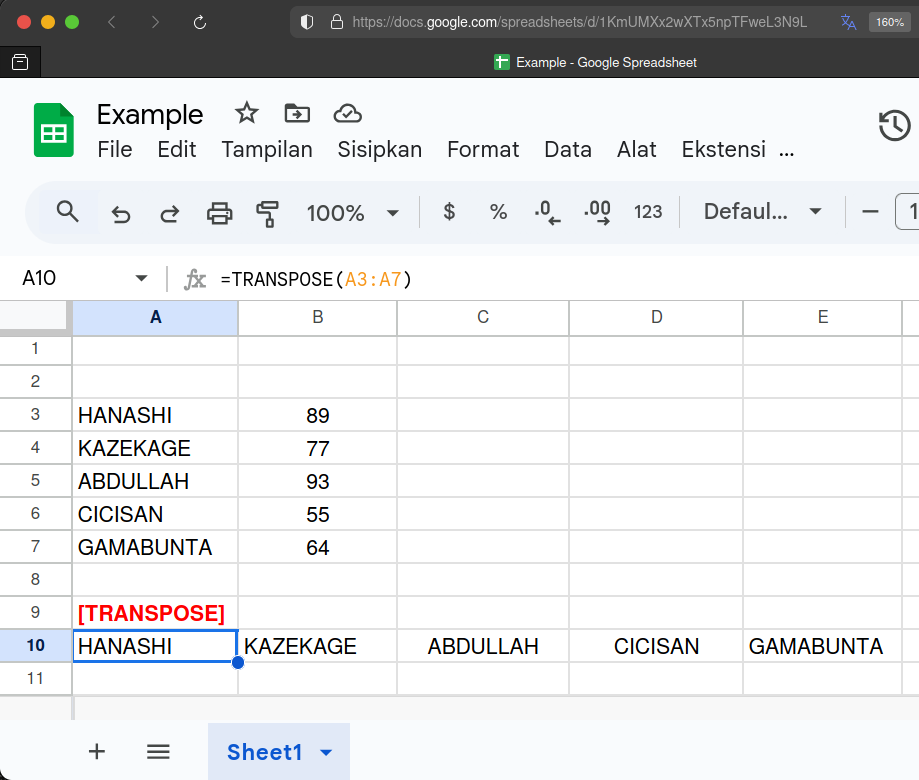

Melanjutkan series Excel sebelumnya, di artikel ini, kita akan belajar menggunakan 6 fungsi dasar di Microsoft Excel atau Google Spreadsheet, yaitu **SUMIF**, **CONCATENATE**, **MATCH**, **(LEFT, MID, RIGHT)**[^1], **(HLOOKUP & VLOOKUP)**[^2], **TRANSPOSE**.[^3]

:::note

**Note:** Saya akan mendemokan rumus-rumus tersebut di Google Spreadsheet karena 2 alasan utama:
1. fungi-fungsi tersebut masih dapat berfungsi persis seperti ketika digunakan di Microsoft Excel.
2. saya tidak punya excel di linux (dan malas juga _install_ via wine). 

:::

## SUMIF

Mirip dengan fungsi **SUM** di series sebelumnya, fungsi **SUMIF** digunakan untuk menjumlahkan otomatis nilai sehingga kita tidak perlu menghitung nilainya secara manual. Akan tetapi, penambahan ini hanya dilakukan jike memenuhi kriteria tertentu. Rumus **SUMIF** ini dapat digunakan untuk menjumlahkan nilai dalam sel, baik secara vertikal atau secara horizontal.  

#### Rumus **SUMIF**

`SUMIF(A1:A10; ">50")`

Keterangan:
- Menjumlahkan semua nilai dari sel **A1** sampai **A10** jika nilainya lebih dari 50.

#### Contoh:
Saya akan menjumlahkan nilai dari sel **B3** sampai **B7** yang lebih dari 80.  
Jadi, rumus yang saya gunakan adalah

`=SUMIF(B3:B7; ">80")`

Langsung terlihat hasilnya adalah **182**, karena hanya menjumlahkan 89 dan 93 saja.

## CONCATENATE

Fungsi **CONCATENATE** digunakan untuk menggabungkan atau merangkai satu string atau karakter dengan string atau karakter lainnya.

#### Rumus **CONCATENATE**

`CONCATENATE(A1:A10)`

Keterangan:
- Menggabungkan karakter di sel **A1** sampai **A10**.

#### Contoh:
Saya akan menjumlahkan nilai dari sel **B3** dan **C3**.  
Jadi, rumus yang saya gunakan adalah

`=CONCATENATE(B3:C3)`

## MATCH

Fungsi **MATCH** digunakan untuk mencari posisi suatu item atau nilai dalam rentang baris atau kolom tertentu. Hasil pencariannya akan menunjukkan lokasi baris atau kolom dimana item atau nilai yang dicari tersebut ditemukan.

#### Rumus **MATCH**

`MATCH(10;A1:A10;0)`

Keterangan:
- Mencari nilai 10 dari rentang baris **A1** hingga **A10** dengan tepat/presisi (0).

#### Contoh:
Saya akan nilai 55 dari sel di baris **B3** hingga **B7** dengan presisi.  
Jadi, rumus yang saya gunakan adalah

`=MATCH(55;B3:B7;0)`

Hasilnya **4** karena nilai 55 ditemukan berada di sel urutan ke-4 dari atas. 

## LEFT, MID, RIGHT

Fungsi **LEFT, MID, RIGHT** digunakan untuk mengambil sub-string atau sub-karakter dalam sebuah sel. **LEFT** berarti digunakan untuk mengambil sub-string atau sub-karakter dari kiri, **MID** digunakan untuk menambil sub-string atau sub-karakter dari tengah, dan **RIGHT** digunakan untuk mengambil sub-string dari kanan.

#### Rumus **LEFT**

`LEFT(A1;2)`

Keterangan:
- Mengambil 2 karakter dari sebelah kiri di sel **A1**.

#### Rumus **MID**

`MID(A1;4;3)`

Keterangan:
- Mengambil 3 karakter di sel **A1** mulai dari karakter ke-4.

#### Rumus **RIGHT**

`RIGHT(A1;2)`

Keterangan:
- Mengambil 2 karakter dari sebelah kanan di sel **A1**.

#### Contoh LEFT:
Saya akan mengambil 4 karakter dari sebelah kiri di sel **A3**.
Jadi, rumus yang saya gunakan adalah

`=LEFT(A3;4)`

#### Contoh MID:
Saya akan mengambil 4 karakter di sel **A3** dimulai dari karakter ke-2.
Jadi, rumus yang saya gunakan adalah

`=MID(A3;2;4)`

#### Contoh RIGHT:
Saya akan mengambil 4 karakter dari sebelah kanan di sel **A3**.
Jadi, rumus yang saya gunakan adalah

`=RIGHT(A3;4)`

## HLOOKUP & VLOOKUP

Fungsi **HLOOKUP & VLOOKUP** digunakan untuk mencari suatu item atau nilai di sebuah sel. **HLOOKUP** digunakan untuk melakukan pencarian yang horizontal (kanan-kiri), sementara **VLOOKUP** dignakan untuk melakukan pencarian yang vertikal (atas-bawah). 

> **NOTE:** Baik **VLOOKUP** maupun **HLOOKUP** mempersyaratkan ID sebagai identifikator.

#### Rumus **VLOOKUP**

`VLOOKUP(C3;A1:E10;3;FALSE)`

Keterangan:
- **C3** adalah ID-nya (kode unik yang sama).
- **A1:E10** adalah rentang tabel yang digunakan untuk mencari item atau nilai.
- **3** adalah kolom ke-3 dari tabel yang sudah dipilih sebelumnya.
- **FALSE** artinya pencarian dilakukan untuk mencari nilai tepat/presisi.

#### Rumus **HLOOKUP**

`HLOOKUP(C3;A1:E10;3;FALSE)`

Keterangan:
- **C3** adalah ID-nya (kode unik yang sama).
- **A1:E10** adalah rentang tabel yang digunakan untuk mencari item atau nilai.
- **3** adalah kolom ke-3 dari tabel yang sudah dipilih sebelumnya.
- **FALSE** artinya pencarian dilakukan untuk mencari nilai tepat/presisi.

#### Contoh VLOOKUP:
Saya mau mengisi data nilai murid-murid berikut di tabel yang sudah lebih rapi. 
Jadi, rumus yang saya gunakan adalah

`=VLOOKUP(D3;A3:B7;2;FALSE)`

Kolom **D3** adalah ID yang digunakan, kemudian, saya menyeleksi keseluruhan tabel yang mengandung nama siswa dan nilai yang ingin dipindahkan (A3-B7), dan karena saya hanya ingin mengambil **nilai** saja, maka setelah itu saya pilih kolom ke-2 saja.

#### Contoh HLOOKUP:
Saya mau mengisi data nilai murid-murid berikut di tabel yang sudah lebih rapi. 
Jadi, rumus yang saya gunakan adalah

`==HLOOKUP(E6;$C$2:$G$3;2;FALSE)`

Kolom **E3** adalah ID yang digunakan, kemudian, saya menyeleksi keseluruhan tabel yang mengandung nama siswa dan nilai yang ingin dipindahkan (C2-G3), dan karena saya hanya ingin mengambil **nilai** saja, maka setelah itu saya pilih baris ke-2 saja.

## TRANSPOSE

Fungsi **TRANSPOSE** digunakan untuk mengubah urutan baris atau kolom sehingga kita tidak perlu mengubah posisinya secara manual. Jika fungsi TRANSPOSE digunakan pada data-data dalam suatu baris, maka baris tersebut akan di-*transpose* menjadi kolom. Begitupula sebaliknya.[^4]

#### Rumus **TRANSPOSE**

`TRANPOSE(A1:A10)`

Keterangan:
- Mengubah baris A1-A10 menjadi kolom.

#### Contoh:
Saya akan men-transposisi baris nama-nama di baris **A3** hingga **A7** menjadi kolom.  
Jadi, rumus yang saya gunakan adalah

`=TRANSPOSE(A3:A7)`

Terlihat, sekarang nama-nama tersebut berubah urutannya menjadi horizontal.

[^1]: https://livingintelkom.medium.com/rumus-excel-dasar-yang-pemula-wajib-ketahui-4fc2d8e2b3c4
[^2]: https://www.kitalulus.com/blog/seputar-kerja/rumus-excel/
[^3]: https://kabar24.bisnis.com/read/20240923/79/1627817/47-rumus-excel-lengkap-beserta-contoh-dan-penjelasannya
[^4]: https://support.microsoft.com/id-id/office/transpose-fungsi-transpose-ed039415-ed8a-4a81-93e9-4b6dfac76027