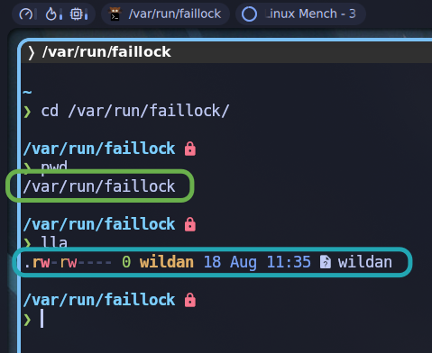
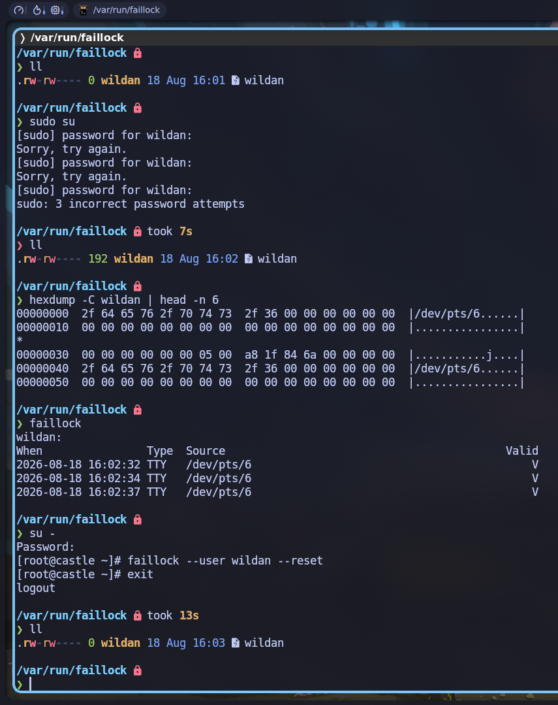

## About `faillock`

`faillock` adalah sebuah aplikasi yang dapat digunakan untuk menampilkan dan mengubah konten "**tally files**". `faillock` dapat menampilkan percobaan otentikasi yang gagal dari sebuah user maupun menghapus "**tally files**" dari sebuah atau semua akun.[^1] `faillock` juga merupakan sebuah _package_ bawaan dari sebuah _module_ bernama PAM (**_Pluggable Authentication Module_**), khususnya `pam_faillock.so`. Modul tersebut digunakan untuk mencatat (_record_) percobaan otentikasi akun yang gagal dan kemudian mengunci akun tersebut selama durasi tertentu. 

:::info[Tally Directory & Files]

**Tally Directory** adalah direktori atau folder yang digunakan oleh _module_ `pam_faillock.so` untuk menyimpan kegagalan otentikasi sebuah akun dan menguncinya di sebuah "**tally files**". _By default_, lokasi direktori ini berada di: `/var/run/faillock/`.

**Tally Files** adalah file di "**tally directory**" yang digunakan oleh _module_ yang sama (`pam_faillock.so`) untuk mencatat kegagalan otentikasi sebuah akun dan menguncinya. _By default_, lokasi file-nya ada di dalam "**tally directory**" dan biasanya memiliki nama file sesuai nama user: `/var/run/faillock/wildan`.



:::

Singkatnya, ketika kita salah memasukkan password user sebanyak 3x, _by default_, akun kita akan terkunci selama 10 menit (600 detik). Artinya, pada percobaan ke-empat, selama masih berada di rentang 10 menit tersebut, kita tidak bisa login meskipun password yang kita _input_-kan benar. Jadi, kita harus benar-benar menunggu 10 menit agar kita dapat login kembali dengan akun tersebut.

Nah, `faillock` hadir untuk mengatasi hal ini sehingga kita dapat me-_reset_ "_**countdown**_" tersebut sehingga tidak perlu menunggu 10 menit. Bahkan, untuk kemudahan kita di masa depan, kita juga dapat mengatur bagaimana _module_ `pam_faillock.so` merespon kesalahan otentikasi akun kita, misalnya:
- berapa percobaan otentikasi yang ditoleransi sebelum akun dikunci (_default_-nya kan 3x).  
- berapa lama waktu tunggu setelah akun terkunci (_countdown_) sebelum dapat meng-_input_-kan password kembali (_default_-nya 10 menit/600 detik).

Itu semua dapat dilakukan menggunakan `faillock`, dengan satu syarat:  
"**Kita punya akses ke akun root**."

## Installation

_By default_, `faillock` sudah ter-_install_ di Archlinux melalui module `pambase`-nya. Jadi, kita tidak perlu meng-_install_-nya lagi.

## Usage

Jika akun user kita terkunci karena salah meng-_input_-kan password sebanyak 3x, dan kita tidak mau menunggu 10 menit sebelum dapat login kembali ke akun tersebut, maka berikut adalah langkah-langkah penyelesaiannya dengan `faillock`:

1. Login ke akun root

```shell
su -

# atau
su root
```

2. Lihat akun yang akan di-"_recovery_"

```shell
faillock --user wildan

# atau dengan perintah `faillock` saja juga cukup
faillock
```

3. Reset 

```shell
faillock --user wildan --reset

# atau tanpa "--user wildan" jika hanya ada satu akun (satu tally file)
faillock --reset
```

Berikut adalah demonstrasinya:



Berikut adalah penjelasan tangkapan layar di atas:
- Mula-mula, saya memperlihatkan **file tally** user saya (wildan), masih belum ada isinya.  
- Kemudian, saya mencoba sengaja meng-_input_-kan password `sudo` yang salah.  
- Sekarang, **file tally**-nya sudah ada isinya.  
- Isi file itulah yang juga akan ditampilkan ketika kita mengetikkan perintah `faillock`.  
- Saya me-_reset_ catatan (_log_) gagal otentikasi `sudo` tadi.  
- **File tally** kembali jadi kosong. 

### Config

File konfigurasi `faillock` berada di `/etc/security/faillock.conf`.

```shell title="faillock.conf"
# Configuration for locking the user after multiple failed
# authentication attempts.
#
# The directory where the user files with the failure records are kept.
# The default is /var/run/faillock.
# dir = /var/run/faillock
#
# Will log the user name into the system log if the user is not found.
# Enabled if option is present.
# audit
#
# Don't print informative messages.
# Enabled if option is present.
# silent
#
# Don't log informative messages via syslog.
# Enabled if option is present.
# no_log_info
#
# Only track failed user authentications attempts for local users
# in /etc/passwd and ignore centralized (AD, IdM, LDAP, etc.) users.
# The `faillock` command will also no longer track user failed
# authentication attempts. Enabling this option will prevent a
# double-lockout scenario where a user is locked out locally and
# in the centralized mechanism.
# Enabled if option is present.
# local_users_only
#
# Deny access if the number of consecutive authentication failures
# for this user during the recent interval exceeds n tries.
# The default is 3.
# deny = 3
#
# The length of the interval during which the consecutive
# authentication failures must happen for the user account
# lock out is n seconds.
# The default is 900 (15 minutes).
# fail_interval = 900
#
# The access will be re-enabled after n seconds after the lock out.
# The value 0 has the same meaning as value `never` - the access
# will not be re-enabled without resetting the faillock
# entries by the `faillock` command.
# The default is 600 (10 minutes).
# unlock_time = 600
#
# Root account can become locked as well as regular accounts.
# Enabled if option is present.
# even_deny_root
#
# This option implies the `even_deny_root` option.
# Allow access after n seconds to root account after the
# account is locked. In case the option is not specified
# the value is the same as of the `unlock_time` option.
# root_unlock_time = 900
#
# If a group name is specified with this option, members
# of the group will be handled by this module the same as
# the root account (the options `even_deny_root` and
# `root_unlock_time` will apply to them).
# By default, the option is not set.
# admin_group = <admin_group_name>
```

Seperti terlihat, file konfigurasi `faillock` _by default_ memang bisa dikatakan belum ada isinya (karena isinya semua di-_comment_). 

:::note[faillock default config]

Karena isi file konfigurasi `faillock` (`faillock.conf`) kosong _by default_, mungkin ada yang bertanya, kemana `faillock` merujuk ketika menjalankan pengaturan-pengaturan default-nya? Ternyata, pengaturan-pengaturan default itu sudah di-**_hardcode_** di dalam _module_ `pam_faillock.so`.[^2] Jadi, meskipun file konfigurasinya (`/etc/security/faillock.conf`) masih kosong, `faillock` tetap dapat bekerja normal menggunakan pengaturan default dari _module_-nya.

:::

Ada beberapa hal yang sebetulnya dapat dikonfigurasi di file `faillock.conf` ini. Tapi, sekarang, kita hanya akan fokus ke 2 hal:
1. Batas jumlah toleransi salah input password.
2. Interval waktu tunggu (_countdown_) sebelum dapat meng-_input_-kan password lagi.

Untuk 2 keperluan itu, kita hanya perlu mengganti 2 variabel ini saja:

```shell title="faillock.conf"
# Mengatur batas jumlah toleransi salah input password ke 5
deny = 3

# Mengatur countdown ke 1 menit (60 detik)
unlock_time = 60
```

Segera setelah disimpan, perubahannya akan langsung terjadi tanpa perlu melakukan apapun. Sekarang, saya dapat meng-input-kan password salah sebanyak 5x dan waktu tunggu-nya juga berkurang jadi 1 menit (60 detik).

Berikut adalah video tutorial yang praktis dan mudah untuk diikuti (menurut saya):

<iframe width="100%" height="468"
  src="https://www.youtube.com/embed/JybV2EeYspc"
  title="Faillock usage simplified"
  frameborder="0" allowfullscreen>
</iframe>


[^1]: https://linux.die.net/man/8/faillock
[^2]: https://claude.ai