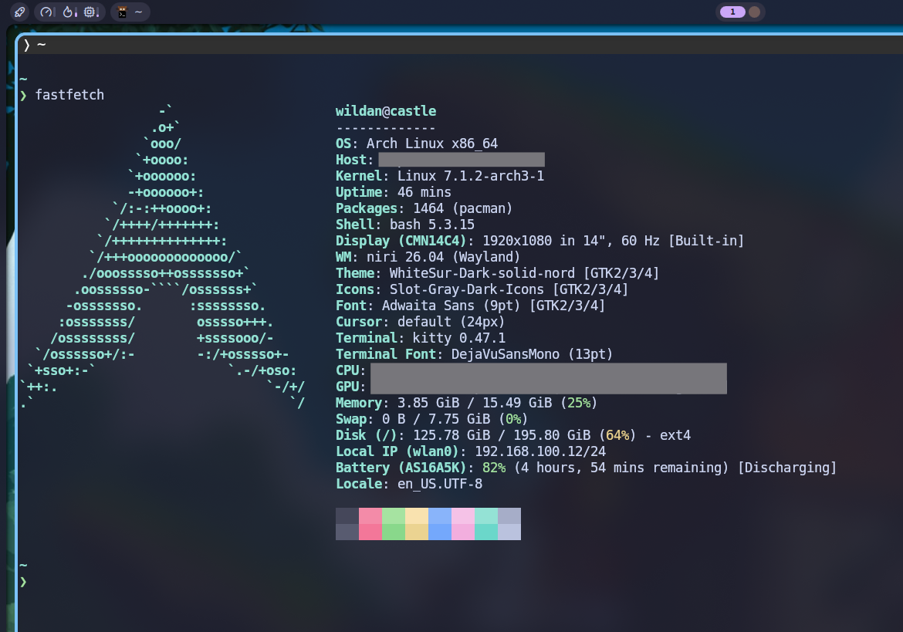
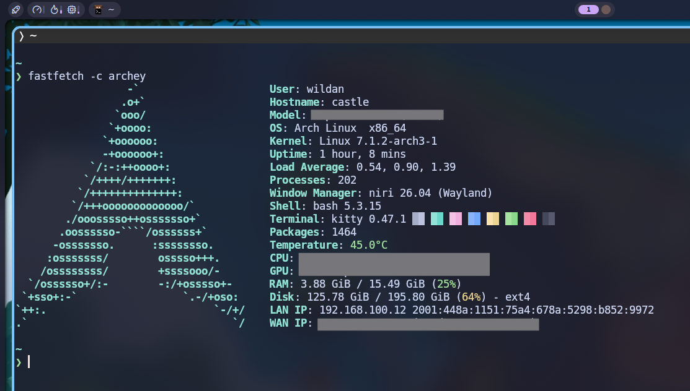
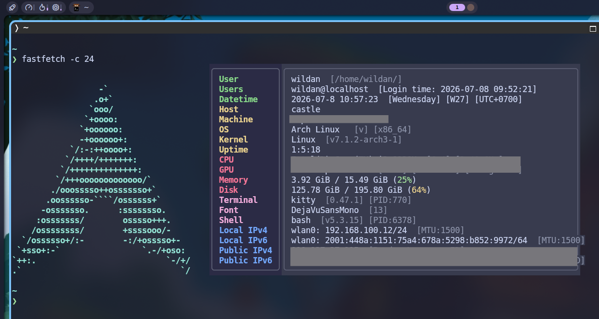
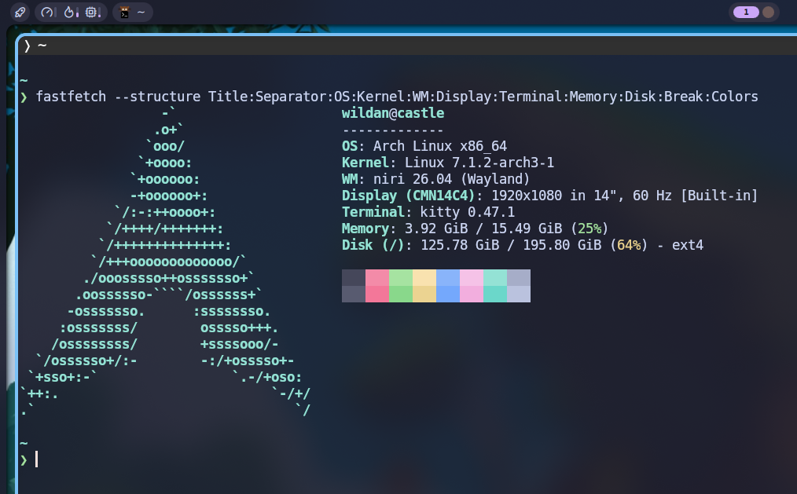

## About `fastfetch`

Salah satu CLI (_Command-Line Interface_) _tool_ yang paling sering digunakan, terutama di kalangan pengguna linux, adalah `neofetch`. `neofetch` adalah _software_ yang digunakan untuk menampilkan informasi sistem yang kita gunakan, mulai dari hardware hingga software.[^1] Akan tetapi, per 26 April 2024, _owner_ atau pemilik atau _developer_ `neofetch` menghentikan pengembangan software tersebut (saya sendiri tidak tahu alasannya kenapa). Akhirnya, banyak orang mencari alternatifnya. 

::github{repo="dylanaraps/neofetch"}

Akhirnya, muncullah `fastfetch`.

`fastfetch` sebetulnya identik dengan `neofetch`. Ia juga adalah sebuah _tool_ berbasis CLI untuk menampilkan informasi mengenai sistem yang kita gunakan, mulai dari hardware hingga software. Perbedaan utamanya, jika `neofetch` ditulis langsung menggunakan bash (shell script), maka `fastfetch` dibuat dengan menggunakan bahasa pemrograman C. Selain itu, `fastfetch` juga menyediakan template dan kemudahan kustomisasi output-nya.

::github{repo="fastfetch-cli/fastfetch"}

## Installation

Berikut adalah cara meng-_install_ `fastfetch` di beberapa sistem operasi UNIX/Linux:

|       Distro      |                  Command                |
|       ---         |                   ---                   |
| **Debian/Ubuntu** | **`sudo apt install -y fastfetch`**     |
| **Arch Linux**    | **`sudo pacman -Sy fastfetch`**         |
| **Fedora**        | **`sudo dnf install fastfetch`**        |
| **Opensuse**      | **`sudo zypper install fastfetch`**     |
| **FreeBSD**       | **`sudo pkg install fastfetch`**        |

:::note

**NixOS:**  
Masukkan baris berikut di file konfigurasi (`/etc/nixos/configuration.nix`):

```nix
  environment.systemPackages = [
    pkgs.fastfetch
  ];
```

Atau jika menggunakan `nix-shell`:

```shell
nix-shell -p fastfetch  
```

:::

## Usage

### Simple Usage

Cara menggunakannya sesederhana mengetikkan perintah berikut di terminal:

```shell
fastfetch
```



Atau tanpa logo:

```shell
fastfetch --logo none
```

### With Template

Kita juga bisa menggunakan template yang sudah disediakan. Biasanya, file konfigurasi template-nya akan tersimpan di `/usr/share../images/fastfetch/presets` dan `/usr/share../images/fastfetch/presets/examples`. File configurasi `fastfetch` berekstensi `.jsonc`. Berikut adalah file tree-nya:

```
/usr/share../images/fastfetch/presets
├── all.jsonc
├── archey.jsonc
├── ci.jsonc
├── neofetch.jsonc
├── palefetch.jsonc
├── screenfetch.jsonc
└── examples
    ├── 2.jsonc
    ├── 3.jsonc
    ├── 4.jsonc
    ├── 5.jsonc
    ├── 6.jsonc
    ├── 7.jsonc
    ├── 8.jsonc
    ├── 9.jsonc
    ├── 10.jsonc
    ├── 11.jsonc        
    ├── 12.jsonc
    ├── 13.jsonc
    ├── 14.jsonnc
    ├── 15.jsonc       
    ├── 16.jsonc
    ├── 17.jsonc
    ├── 18.jsonc
    ├── 19.jsonc
    ├── 20.jsonc
    ├── 21.jsonc
    ├── 22.jsonc
    ├── 23.jsonc
    ├── 24.jsonc
    ├── 25.jsonc
    ├── 26.jsonc
    ├── 27.jsonc
    ├── 28.jsonc
    ├── 29.jsonc
    ├── 30.jsonc
    ├── 31.jsonc
    └── 32.jsonc
```

Cara menggunakannya:

```shell
fastfetch -c archey
```



atau

```shell
fastfetch -c 24
```



### Custom Usage

Jika kita hanya ingin menampilkan informasi tertentu saja, kita juga bisa melakukannya. 

Caranya:
1. Tentukan informasi apa saja yang ingin ditampilkan.
2. Gunakan tambahan tag `--structure`.

#### 1. Choosing Modules

Untuk melihat daftar informasi yang dapat kita tampilkan dengan `fastfetch`, cari di:

```shell
fastfetch --list-modules
```

_Output_-nya:

:::info

Per artikel ini ditulis, setidaknya terdapat **75 modul** yang tersedia di `fastfetch`.

:::

```
1)  Battery       : Print battery information
2)  BIOS          : Print first-stage bootloader information (name, version, release date, etc.)
3)  Bluetooth     : List connected Bluetooth devices
4)  BluetoothRadio: List Bluetooth radios (supported versions, vendors, etc.)
5)  Board         : Print motherboard name and other information
6)  Bootmgr       : Print second-stage bootloader information (name, firmware, etc.)
7)  Break         : Print an empty line
8)  Brightness    : Print the current brightness level of your monitors
9)  Btrfs         : Print Linux BTRFS volumes
10) Camera        : Print available cameras
11) Chassis       : Print chassis type information (desktop, laptop, etc.)
12) Codec         : Print hardware video acceleration codec types (decode / encode)
13) Command       : Run custom shell scripts
14) Colors        : Display the terminal's 16-color palette
15) CPU           : Print CPU name, frequency, etc.
16) CPUCache      : Print CPU cache sizes
17) CPUUsage      : Print CPU usage. Collecting data takes some time
18) Cursor        : Print cursor style name
19) Custom        : Print a custom string, with or without key
20) DateTime      : Print the current date and time
21) DE            : Print desktop environment name
22) Display       : Print resolutions, refresh rates, etc
23) Disk          : Print partitions, space usage, file system, etc
24) DiskIO        : Print physical disk I/O throughput
25) DNS           : Print configured DNS servers
26) Editor        : Print information about the default editor ($VISUAL or $EDITOR)
27) Font          : Print system font names
28) Gamepad       : List connected gamepads
29) GPU           : Print GPU names, memory sizes, types, etc
30) Host          : Print your computer's product name
31) Icons         : Print icon style name
32) InitSystem    : Print init system (pid 1) name and version
33) Kernel        : Print system kernel version
34) Keyboard      : List connected keyboards
35) LM            : Print login manager (desktop manager) name and version
36) Loadavg       : Print system load averages
37) Locale        : Print system locale name
38) LocalIp       : List local IP addresses (IPv4 or IPv6), MAC addresses, etc
39) Logo          : Query built-in logo for JSON output
40) Media         : Print the name of the currently playing song
41) Memory        : Print system memory usage information
42) Monitor       : Same as Display module, but with a different default output format
43) Mouse         : List connected mice
44) NetIO         : Print network I/O throughput
45) OpenCL        : Print the highest OpenCL version supported by the GPU
46) OpenGL        : Print the highest OpenGL version supported by the GPU
47) OS            : Print the OS or Linux distribution name and version
48) Packages      : List installed package managers and count of installed packages
49) PhysicalDisk  : Print physical disk information
50) PhysicalMemory: Print system physical memory devices
51) Player        : Print the music player name that is currently active
52) PowerAdapter  : Print power adapter name and charging watts
53) Processes     : Print number of running processes
54) PublicIp      : Print your public IP address and related information
55) Separator     : Print a separator line
56) Shell         : Print the current shell name and version
57) Sound         : Print sound devices, volume levels, etc
58) Swap          : Print swap (paging file) space usage
59) Terminal      : Print the current terminal name and version
60) TerminalFont  : Print the font name and size used by the current terminal
61) TerminalSize  : Print the current terminal size
62) TerminalTheme : Print the current terminal theme (foreground and background colors)
63) Title         : Print the title, including your username and hostname
64) Theme         : Print the current desktop environment theme
65) TPM           : Print information about the Trusted Platform Module (TPM) security device
66) Uptime        : Print how long the system has been running
67) Users         : Print users who are currently logged in
68) Version       : Print the Fastfetch version and build information
69) Vulkan        : Print the highest Vulkan version supported by the GPU
70) Wallpaper     : Print the file path of the current wallpaper
71) Weather       : Print weather information
72) WM            : Print the window manager name and version
73) Wifi          : Print connected Wi-Fi info (SSID, connection and security protocol)
74) WMTheme       : Print the current window manager theme
75) Zpool         : Print ZFS storage pools
```

#### 2. Showing Modules

Misalnya, saya hanya ingin menampilkan informasi-informasi berikut saja:
- Judul (**Title**)  
- Garis pembatas (**Separator**)  
- Sistem operasi (**OS**)  
- Kernel (**Kernel**)  
- Window manager (**WM**)  
- Resolusi layar (**Display**)
- Terminal (**Terminal**)  
- RAM (**Memory**)  
- Hardisk/SSD (**Disk**)  
- Ruang kosong (**Break**)  
- Warna (**Colors**)  

Maka perintah yang digunakan:

```shell
fastfetch --structure Title:Separator:OS:Kernel:WM:Display:Terminal:Memory:Disk:Break:Colors
```



:::note

Meskipun tidak **_case-sensitive_** (artinya kita bisa saja menulis dengan huruf kecil semua: `fastfetch --structure title:separator:os:kernel`), tapi, titik dua-nya tidak boleh typo dan tidak boleh ada spasi diantaranya.

:::

Tentu saja masih banyak hal dan fitur lain `fastfetch` yang belum di-_cover_ pada artikel ini. Sila explorasi sendiri dengan melihat-lihat daftar bantuan ataupun `man` pages-nya.

```shell
fastfetch --help
man fastfetch
```

Sekian.  
Terima kasih sudah membaca.  
Sampai jumpa lagi di artikel saya yang lain!


[^1]: https://github.com/dylanaraps/neofetch
