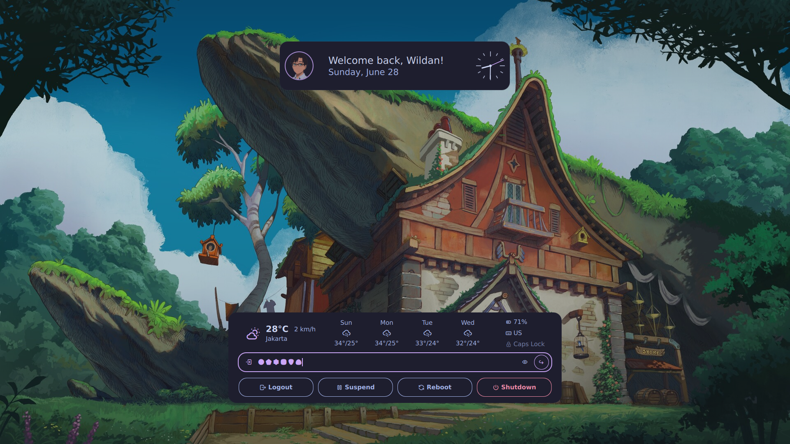
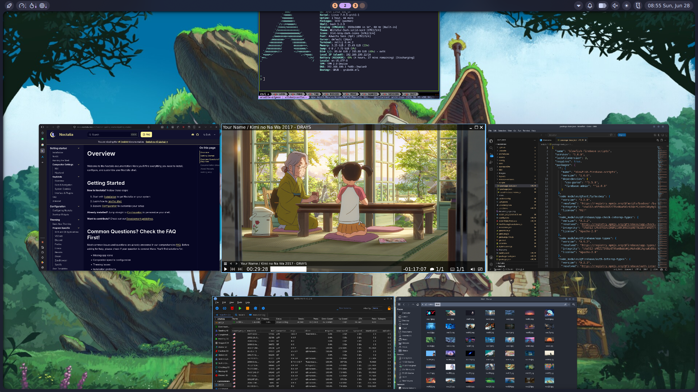
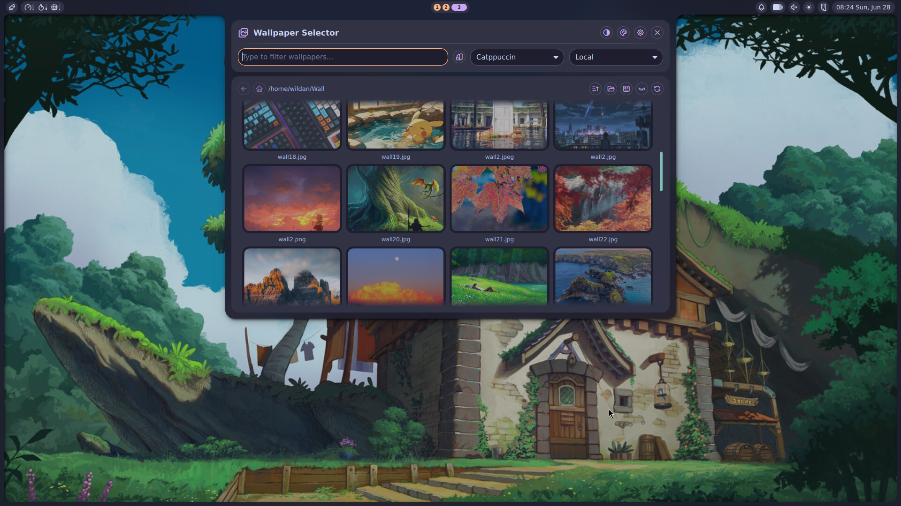
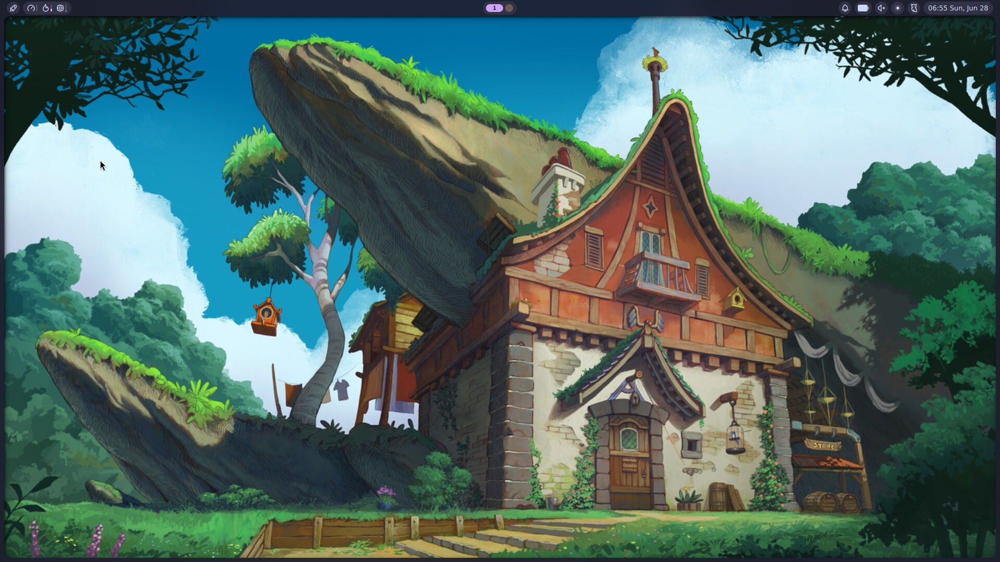

## Introduction

Beberapa kali saya menggunaan `ffmpeg` untuk keperluan praktis saya: membuat video _unboxing_ produk yang sudah saya beli di marketplace. Secara lebih spesifik, saya menggunakan `ffmpeg` terutama untuk meng-_compress_ ukuran file agar lebih kecil dan mempercepat durasinya (karena kolom video ulasan di marketplace memang membatasi ukuran dan durasi video). 

Terkadang, saya juga perlu mengganti format videonya (misalnya dari .mkv ke .mp4) agar tetap relevan untuk di-upload di kolom review di marketplace. Tapi, untuk mengganti format video ini, saya sudah pernah bahas di artikel sebelumnya:

[[/tech/convertvideoformat/]]

Nah, karena aktivitas ini (menggunakan `ffmpeg` untuk mengkompres dan mempercepat video) berulang, saya putuskan untuk membuat dokumentasi ini. Meskipun saya tahu banyak website dan AI (_artificial intelligence_) yang sudah saling terintegrasi untuk melakukan 2 aktivitas tersebut, saya tetap yakin memprosesnya di komputer lokal juga memiliki keunggulan tertentu, misalnya lebih hemat kuota internet. Sebab, satu file video yang hanya berdurasi tidak lebih dari 3 menit, bisa berukuran hingga 400-an MB! Lagipula, saya hampir 100% yakin, backend dari website-website dan AI pemrosesan video diluar sana juga pasti meggunakan _tool_ yang sama dengan yang saya pakai: `ffmpeg`, hehe.

:::warning

**DISCLAIMER!**

Artikel ini sepenuhnya merujuk pada [**Antrophic Claude**](https://claude.ai/), sebuah AI (_Artificial Intelligence_) yang sedang naik daun saat artikel ini ditulis.

:::

## Installation

Seperti biasa, tool yang kita perlukan hanyalah `ffmpeg` saja. Di beberapa distro populer seperti Debian/Ubuntu dan Archlinux, seharusnya `ffmpeg` sudah ter-_install by default_. Tapi, jika belum berikut adalah cara instalasinya.

Berikut adalah cara meng-_install_ `ffmpeg` di beberapa sistem operasi UNIX/Linux:

|       Distro      |                  Command          |
|       ---         |                   ---             |
| **Debian/Ubuntu** | **`sudo apt install -y ffmpeg`**     |
| **Arch Linux**    | **`sudo pacman -Sy ffmpeg`**         |
| **Fedora**        | **`sudo dnf install ffmpeg-free`**   |
| **Opensuse**      | **`sudo zypper install ffmpeg`**     |
| **FreeBSD**       | **`sudo pkg install ffmpeg`**        |

:::note

**NixOS:**  
Masukkan baris berikut di file konfigurasi (`/etc/nixos/configuration.nix`):

```nix
  environment.systemPackages = [
    pkgs.ffmpeg
  ];
```

Atau jika menggunakan `nix-shell`:

```shell
nix-shell -p ffmpeg
```

:::

## Use

Berikut adalah cara menggunakan `ffmpeg` untuk mengkompres dan mempercepat durasi video.[^1] 

Satu rumus penting yang perlu diingat adalah tentang **bitrate** video (kbps). Rumus ini penting, terutama jika kita punya target ukuran file yang spesifik. 

Rumus menghitung bitrate adalah sebagai berikut:

```shell
Bitrate (kbps) = (Target ukuran MB × 8 × 1024) ÷ Durasi (detik)
```

Misalnya, kita mau video 15 detik dengan ukuran maksimal 2 MB, maka:

```shell
(2 × 8 × 1024) ÷ 15 ≈ 1092 kbps
```

### Compressing

Beberapa langkah dan pilihan langkah perlu dilakukan untuk mendapatkan hasil yang kita inginkan. Di sini, saya akan kenalkan 2 opsi cara untuk mengkompres file video:
1. Cara instan.
2. Cara lebih presisi.

Tapi, sebelum ke sana, akan lebih baik jika kita sudah terlebih dahulu tahu perhitungan target bitrate video (dan audio jika diperlukan) nya. Cara menghitung target bitrate videonya:
1. Durasi asli video dalam detik.
2. Harapan ukuran target video x 8.
3. Hasil no.2 / hasil no. 1.
4. Hasil no.3 - audio (~128 kbps).
5. Itulah target video bitrate-nya.

Untuk praktiknya akan dijelaskan di kedua cara berikut.

#### 1. The Instant Way

Cara instan maksudnya, kita hanya perlu menuliskan satu baris perintah saja, dan hasilnya akan segera hadir, terlepas apakah ada bitrate yang hilang atau utuh. Intinya, jika kita mengutamakan kecepatan proses kompresi dibanding keakuratannya, cara ini adalah yang paling tepat.

Misalnya, saya punya file video berukuran 439 MB, dan ingin mengurangi ukuran file tersebut hingga ~90%.  

Berikut adalah perhitungan bitrate-nya:
- Durasi: 173 detik (2 menit 53 detik)
- Target ukuran: ~44 MB = 44 × 8 = 352 Mbit
- Target total bitrate: 352 ÷ 173 ≈ 2035 kbps
- Kurangi audio (~128 kbps): video bitrate ≈ 1900 kbps

Perintahnya:

```shell
ffmpeg -i input.mp4 -c:v libx264 -b:v 1900k -c:a aac -b:a 128k -movflags +faststart output.mp4
```

Penjelasan parameter:  
`-c:v libx264`: Codec video H.264 (_compatibility_ luas).  
`-b:v 1900k`: Target bitrate video.  
`-c:a aac`: Codec audio AAC.  
`-b:a 128k`: Bitrate audio 128 kbps.  
`-movflags +faststart`: Optimasi untuk _streaming_/_preview_ cepat.

#### 2. The Precise Way

Cara yang lebih presisi maksudnya, kita perlu menjalankan 2 baris perintah `ffmpeg` yang berbeda satu persatu (**_two pass encoding_**), agar bitrate file dalam keadaan utuh. Sederhananya, jika kita memprioritaskan keutuhan file dibandingkan kecepatan proses kompresinya, maka cara ini lebih sesuai.

Misalnya, saya punya file video berukuran 439 MB, dan ingin mengurangi ukuran file tersebut hingga ~90%.  

Berikut adalah perhitungan bitrate-nya:
- Durasi: 173 detik (2 menit 53 detik)
- Target ukuran: ~44 MB = 44 × 8 = 352 Mbit
- Target total bitrate: 352 ÷ 173 ≈ 2035 kbps
- Kurangi audio (~128 kbps): video bitrate ≈ 1900 kbps

Perintahnya:

```shell
# Perintah 1
ffmpeg -i input.mp4 -c:v libx264 -b:v 1900k -pass 1 -an -f null /dev/null

# Peritah 2
ffmpeg -i input.mp4 -c:v libx264 -b:v 1900k -pass 2 -c:a aac -b:a 128k -movflags +faststart output.mp4
```

Penjelasan parameter:  
`-c:v libx264`: Codec video H.264 (_compatibility_ luas).  
`-b:v 1900k`: Target bitrate video.  
`-c:a aac`: Codec audio AAC.  
`-b:a 128k`: Bitrate audio 128 kbps.  
`-movflags +faststart`: Optimasi untuk _streaming_/_preview_ cepat.  
`-pass 1 / -pass 2`: _Two-pass_ untuk akurasi ukuran lebih baik.

> **Notes:** 
>> Perintah 1 digunakan `ffmpeg` untuk "menonton" video dari awal sampai akhir tanpa menghasilkan output video. Tujuannya hanya untuk menganalisis konten (mana bagian yang kompleks, mana yang simpel), dan menyimpan hasilnya ke file log sementara.  
>> Perintah 2 digunakan `ffmpeg` untuk benar-benar mengkompres file video menggunakan data dari Perintah 1 untuk mendistribusikan bitrate secara cerdas. Artinya, bagian yang kompleks (banyak gerak) dapat bitrate lebih, bagian yang simpel (statis) dapat bitrate lebih sedikit, sehingga ukuran akhir lebih mendekati target.  

#### Without Audio

Jika kita hanya perlu video-nya saja tanpa audio (kita ingin agar audio video saat ini dibuang saat proses kompresi), maka berikut _update_ perintahnya:

**1. The Instant Way**

```shell
ffmpeg -i input.mp4 -c:v libx264 -b:v 2035k -an -movflags +faststart output.mp4
```

**2. The Precise Way**

```shell
# Perintah 1
ffmpeg -i input.mp4 -c:v libx264 -b:v 2035k -pass 1 -an -f null /dev/null

# Peritah 2
ffmpeg -i input.mp4 -c:v libx264 -b:v 2035k -pass 2 -an -movflags +faststart output.mp4
```

Perubahannya hanya 3:  
`-an`: buang audio (_audio none_).  
`-b:a 128k`: Bitrate audio tidak ada, dihapus.  
`-b:v 2035k`: Target bitrate video naik karena bitrate audio dihapus.  

### Speeding Up

Untuk mempercepat video (_timelapse effect_), kita dapat menggunakan filter `setpts`. Setidaknya, ada 2 pilihan cara untuk mempercepat durasi video:  
1. Cara asli.  
2. Sekaligus dengan kompres.  

Tapi, sebelum ke sana, setidaknya kita sudah melakukan perhitungan beberapa hal berikut:  
1. Durasi asli video dalam detik.  
2. Target durasi dalam detik.  
3. Faktor percepatan (durasi asli / target durasi).

Untuk praktiknya, kita akan lihat di penjelasan berikut ini.

#### 1. The Original Way

Cara asli maksudnya adalah kita hanya fokus untuk mempercepat durasi videonya saja tanpa mengkompres (lagi) videonya. Artinya, jika kita hanya ingin mempercepat videonya saja, cara ini adalah yang lebih sesuai untuk digunakan.

Misalnya, saya memiliki sebuah file video dengan spesifikasi berikut:  
- Durasi asli: 2 menit 53 detik (173 detik total).  
- Target durasi: 15 detik.  
- Faktor percepatan: 173 ÷ 15 ≈ 11.53x

Perintahnya:

```shell
ffmpeg -i input.mp4 -vf "setpts=PTS/11.53" -an -movflags +faststart output.mp4
```

Penjelasan parameter:  
`-vf "setpts=PTS/11.53"`: Membagi timestamp setiap frame dengan 11.53, sehingga video berjalan 11.53x lebih cepat. Semakin besar nilai `setpts`, semakin cepat videonya.  
`-an`: Tanpa audio (_audio none_).  
`-movflags +faststart`: Optimasi untuk _streaming_/_preview_ cepat.  

#### 2. With Compression

Cara ini memungkinkan kita mempercepat video sambil mengkompres ukuran filenya. Artinya, jika kita ingin agar ukuran file akhir dari proses ini juga sekaligus ikut terkompres (lagi), maka cara ini lebih sesuai.

Misalnya, saya memiliki sebuah file video dengan spesifikasi berikut:  
- Durasi asli: 2 menit 53 detik (173 detik total).  
- Target durasi: 15 detik.  
- Faktor percepatan: 173 ÷ 15 ≈ 11.53x
- Target ukuran file: 2 MB  
- Target total bitrate: (2 x 8 x 1024) / 15 ≈ 1092 kbps

Perintahnya:

```shell
ffmpeg -i input.mp4 -vf "setpts=PTS/11.53" -c:v libx264 -b:v 1092k -an -movflags +faststart output.mp4
```

Penjelasan parameter:  
`-vf "setpts=PTS/11.53"`: Membagi timestamp setiap frame dengan 11.53, sehingga video berjalan 11.53x lebih cepat. Semakin besar nilai `setpts`, semakin cepat videonya.  
`-an`: Tanpa audio (_audio none_).  
`-movflags +faststart`: Optimasi untuk _streaming_/_preview_ cepat.  
`-c:v libx264`: Codec video H.264 (_compatibility_ luas).  
`-b:v 1092`: Target bitrate video.

---

Artikel ini ditulis di [Archlinux](https://archlinux.org/) + [Niri](https://niri-wm.github.io/) + [Noctalia Shell](https://noctalia.dev/).

(**Click to Zoom in**).

[grid]


[/grid]

[grid]


[/grid]


[^1]: https://claude.ai/share/936a314e-a343-476e-8ea0-84842bbc5167