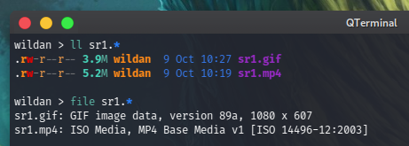

Terkadang, GIF punya kelebihan dibandingkan dengan file video, terutama dalam hal ukuran file. Dengan kualitas gambar yang hampir sama dengan video, file GIF bisa berukuran lebih kecil dari file video. Contohnya, saya punya sebuah file video rekaman layar 720p berdurasi 25 detik, dan satu file GIF yang merupakan hasil konversi video sebelumnya:


Berikut adalah langkah-langkah membuat meng-*convert* video (MP4) ke GIF[^1].

### Membuat palette
Palette yang dibuat nanti akan dijadikan sebagai dasar warna dalam GIF. Oleh karena itu, kita akan buat file palette ini dalam bentuk gambar (PNG). Untuk membuat palette, berikut perintah yang perlu diketikkan:

```bash
ffmpeg -i file_video.mp4 -vf palettegen palette_output.png
```

### Membuat gif
Untuk membuat GIF, kita akan tidak hanya menyertakan file video-nya saja, tapi juga file palette yang sebelumnya sudah dibuat. Berikut adalah perintah yang perlu diinputkan:

```bash
ffmpeg -i file_video.mp4 -i palette_output.png -filter_complex "fps=20,scale=1080:-1[x];[x][1:v]paletteuse" gif_output.gif
```
FPS dan scale-nya bisa kita sesuaikan dengan kualitas GIF yang kita inginkan. Saya set fps di 20 karena file video yang saya buat memang di 20 fps (jadi saya buat juga 20 supaya sama) dan scale-nya di 1080 untuk menjaga kualitas GIF-nya (karena memang ada tulisan kecil yang harus terbaca). Semakin bagus kualitas yang dipertahankan untuk membuat GIF, semakin lama juga proses konversi-nya, tentu, menyesuaikan dengan kualitas hardware komputer/laptop yang digunakan :)

[^1]: https://www.bannerbear.com/blog/how-to-make-a-gif-from-a-video-using-ffmpeg/

