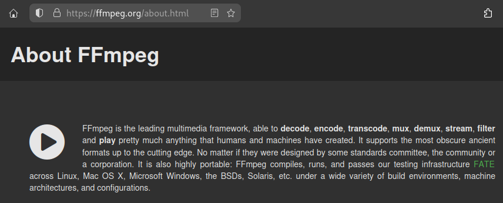
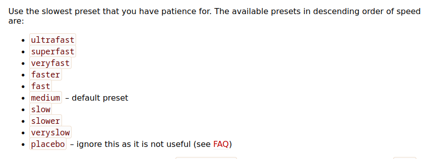

Kali ini, saya akan memberi tahu cara merekam layar desktop laptop atau komputer kita dengan **FFmpeg**. Apa itu **FFmpeg**? Penjelasan detail-nya tentu saja bisa didapatkan langsung dari website resminya di sini[^1].


Tapi, sederhananya, **FFmpeg** adalah *utility/tool/*aplikasi/*software* video dan audio *converter*. **FFmpeg** juga merupakan program yang berbaris *command line* sebagai *interface*-nya. Jadi, meskipun hanya digunakan lewat CLI, tapi *ffmpeg* punya banyak sekali power, salah satunya adalah merekam layar desktop kita.

Misalnya, dibandingkan beberapa aplikasi perekam layar lainnya (seperti OBS-Studio *walaupun sama-sama open source*), FFmpeg lebih praktis dan lebih kecil ukurannya.

## Instalasi
Debian/Ubuntu-based 
```bash
sudo apt install ffmpeg
```

Arch-based 
```bash
sudo pacman -S ffmpeg
```

Fedora-based
```bash
sudo dnf install ffmpeg
```

Atau kita bisa juga mengunduh *binary* ffmpeg dari situs resminya[^2] dan menginstallnya di komputer/laptop kita. 

## Me-*record* desktop dengan FFMPEG
Untuk merekam layar desktop, kita hanya perlu mengetikkan satu baris perintah berikut:

```bash
ffmpeg -video_size 1366x768 -framerate 40 -f x11grab -i $DISPLAY -c:v libx264rgb -preset ultrafast -c:a aac output.mp4
```

**Keterangan:**

**-video_size**: resolusi display yang akan direkam (1366x768 karena itulah resolusi layar saya)

**-framerate**: jumlah frame per detik yang akan digunakan 

**-f**: mengambil I untuk *video input* (kebetulan saya pake X *window system* (X11), jadi, *device input video*-nya adalah x11grab)

**-i**: input layar yang akan direkam (defaultnya adalah 0.0 atau via `env variable`=$DISPLAY yang artinya mengambil seluruh gambar layar)

**-c**: codecs (encoder & decoder) yang disediakan oleh ***libavcodec*** library[^4].

**-preset**: untuk menentukan kecepatan encoding terhadap rasio kompresi (semakin lambat presetnya-semakin bagus kompresinya, dan sebalinya.)[^3].


Jika kita ingin agar rekaman layar kita hanya video saja tanpa audio, maka kita dapat menggunakan perintah berikut:
```bash
ffmpeg -video_size 1024x768 -framerate 25 -f x11grab -i :0.0+100,200 output.mp4
```

Lebih lanjut: 
baca artikel resmi FFmpeg: **Capturing your Desktop / Screen Recording**[^5] 


[^1]: https://ffmpeg.org/about.html
[^2]: https://ffmpeg.org/download.html#build-windows
[^3]: https://trac.ffmpeg.org/wiki/Encode/H.264
[^4]: https://ffmpeg.org/ffmpeg-codecs.html#Description
[^5]: http://trac.ffmpeg.org/wiki/Capture/Desktop
