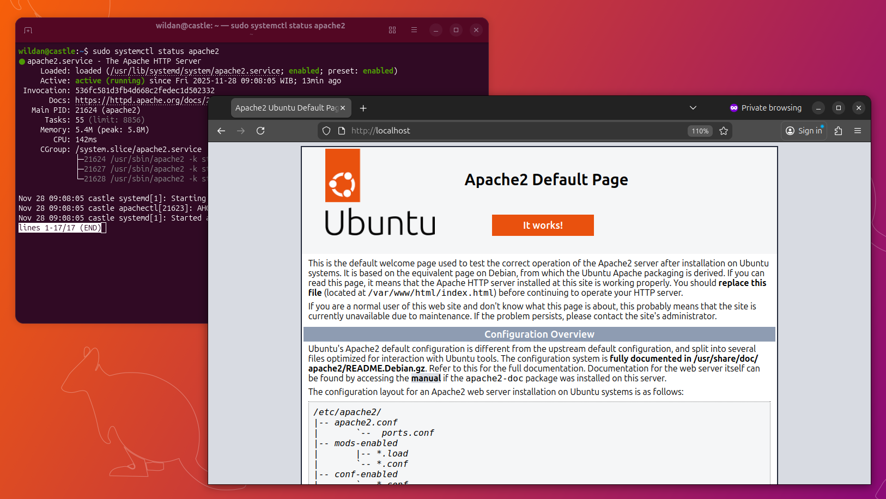
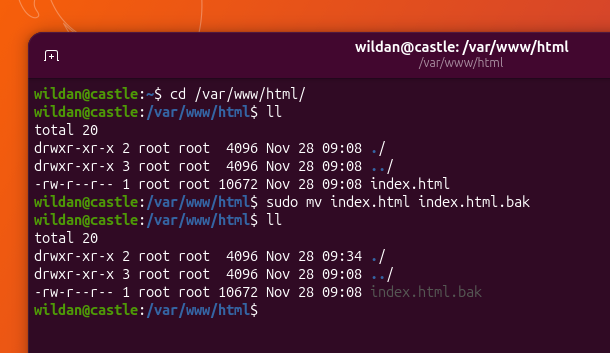
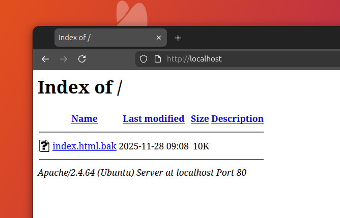
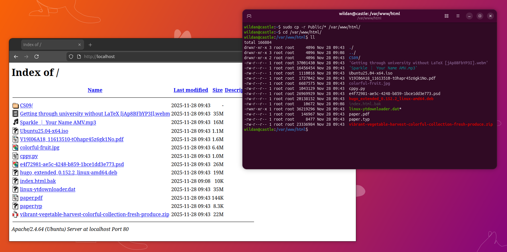
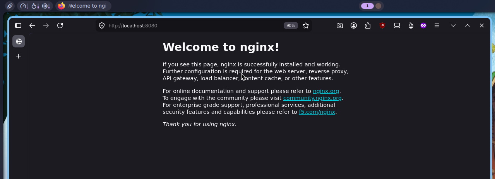
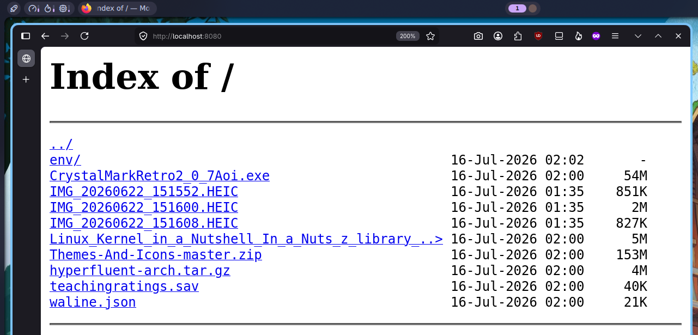
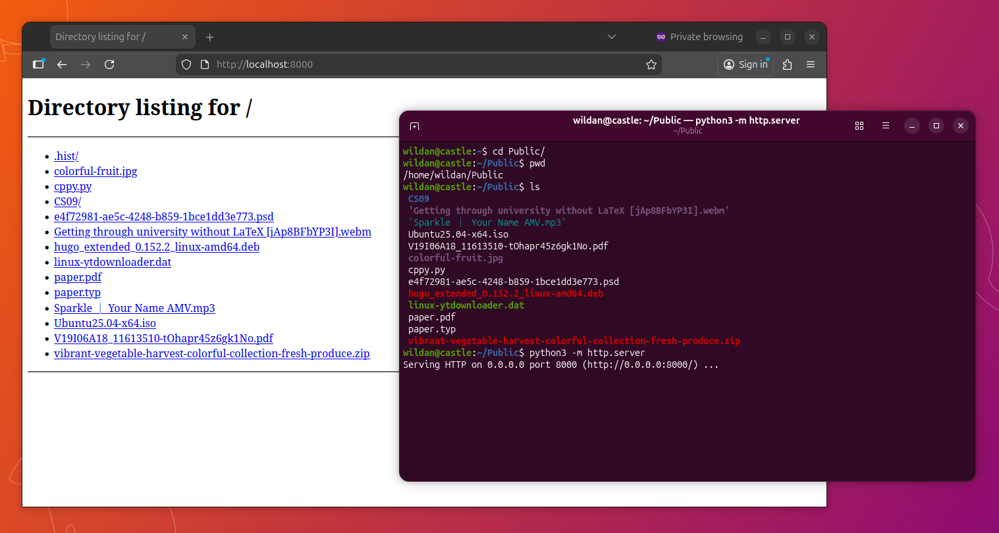
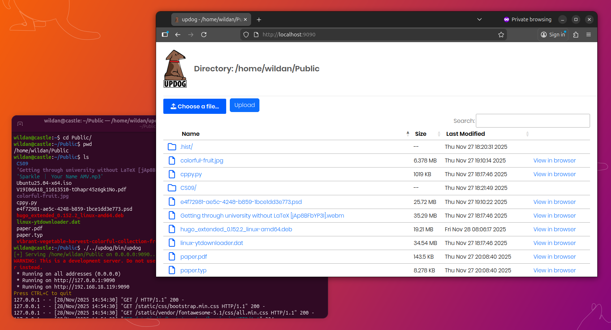
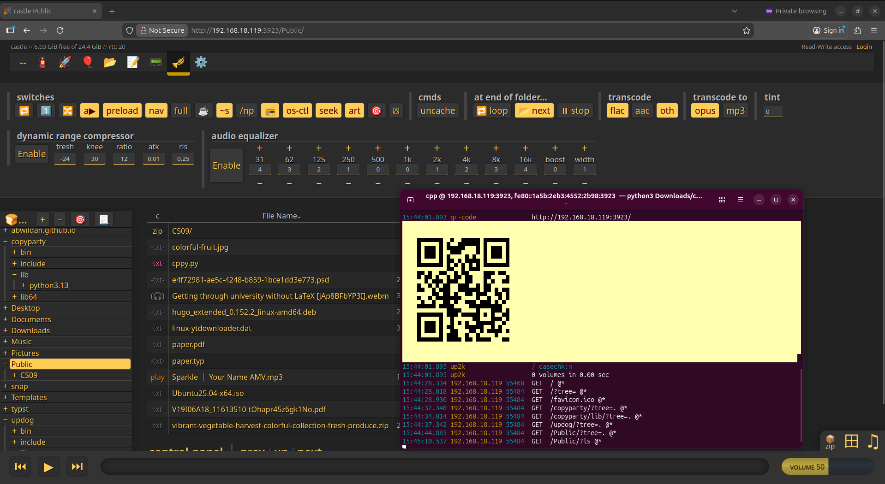
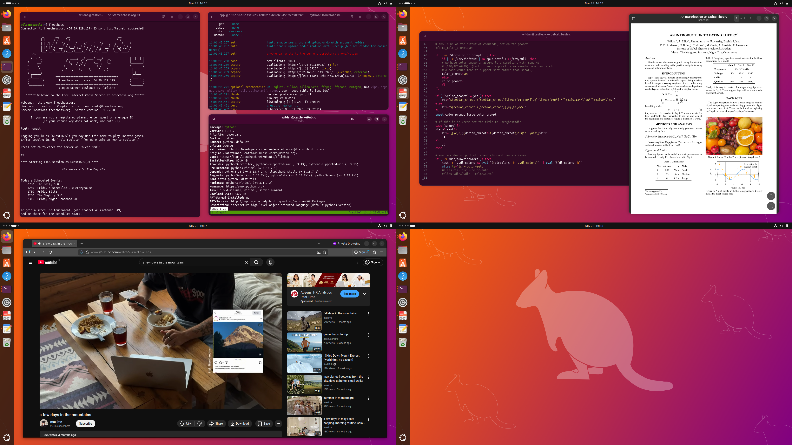

Beberapa pengalaman kecil saya (terutama sejak mengenal linux) pada akhirnya membawa urgensi pada file server atau web server. Misalnya, saya ingin men-_transfer_ file dari satu komputer ke komputer yang lain. Saya mencari tahu, apa cara yang paling efektif dan efisien untuk melakukan hal tersebut? Akhirnya, saya paham, web/file server adalah jawabannya. Tapi, sebelum lebih jauh, mari kita cari tahu, apa itu **"file server"** dan **"web server"**? Apakah keduanya sama atau berbeda? Jika berbeda, apa saja perbedaannya?

## A Definition

### Web Server

Secara sederhana, **Web server** adalah sebuah layanan di komputer yang menyajikan atau menyediakan halaman website yang dapat diakses oleh kita semua melalui web browser seperti firefox, google chrome, safari, microsoft edge, dan lainnya. Sebagai contoh, ketika kita mengunjungi situs-situs atau website-website seperti `https://www.detik.com`, `https://www.instagram.com`, `https://shopee.co.id`, `http://httpforever.com/`, dan website lainnya di browser, maka itulah beberapa contoh dari web server.[^1] 

Umumnya, web server dibagi menjadi 2: 
- "_static web server_": umumnya hanya menampilkan informasi saja.  
Contoh _static site_ adalah seperti blog ini.

- "_dynamic web server_": melibatkan _database_ untuk menyimpan data pengguna seperti _username_ dan _password_.  
`https://www.shopee.co.id` adalah contoh _dynamic site_, karena menggunakan database di belakangnya (kita mungkin tidak bisa lihat) untuk menyimpan data-data penting yang dibutuhkan oleh pengguna website tersebut.

### File Server

Sederhananya, **File Server** adalah sebuah layanan di komputer yang khusus ditujukan untuk menyajikan/menyediakan/membagikan file yang dapat diakses oleh orang lain (terutama 2 hal: **unduh** & **unggah**). File yang dibagikan dapat berupa apapun, mulai dari file dokumen, file gambar, file video, file aplikasi, dan lain-lain. Yang perlu diperhatikan, salah satu cara mengakses file server adalah melalui web server. Ada banyak cara atau protokol lain yang dapat digunakan untuk melakukan _file sharing_, tapi kita akan lebih fokus pada penggunaan web server untuk membagikan file.[^2]

Contoh website yang menyediakan layanan file server ini misalnya [Google Drive](https://www.drive.google.com), [Dropbox](https://www.dropbox.com), [OneDrive](https://www.onedrive.com), dan [Cloudinary](https://cloudinary.com/) yang juga sempat saya bahas di artikel yang lain.

[[cloudinary]]

> **Conclusion:**  
> Jadi, jelas, secara fungsi, mereka berdua berbeda, walaupun punya kemiripan di beberapa sisi. Perbedaannya, web server berfokus pada penyediaan konten berbasis web, sementara file server berfokus pada penyediaan dan pengelolaan file.

Nah, kali ini, saya akan membahas beberapa file server yang dapat digunakan.

## File Server Lists

Berikut adalah daftar file server yang saya tahu (dan pernah saya coba tentunya), berikut dengan cara _install_-nya dan fitur-fiturnya.

### 1. Apache2

[**Apache2**](https://httpd.apache.org/) sebetulnya adalah web browser yang dikembangkan oleh salah satu pengembang linux populer di dunia, [Debian](https://www.debian.org/index.html). Jangan salah, meskipun terdengar remeh (karena mungkin buatan _open-source_ / gratisan), web server ini digunakan di banyak perusahaan-perusahaan besar. Artinya, web server sederhana ini memiliki manfaat yang besar.

Meskipun peruntukannya adalah web server, apache2 ini dapat di-alih fungsi-kannya menjadi file server. Tapi, sebelum masuk ke sana, mari kita _install_ terlebih dahulu.

#### Installation

Berikut adalah cara meng-_install_ `apache2` di beberapa sistem operasi Linux:

|       Distro      |                  Command                           |
|       ---         |                   ---                              |
| **Debian/Ubuntu** | **`sudo apt install apache2`**                     |
| **Arch Linux**    | **`sudo pacman -Sy apache`**                       |
| **Fedora**        | **`sudo dnf install httpd`**                       |
| **Opensuse**      | **`sudo zypper install apache2`**                  |

:::note

**NixOS:**  
Masukkan baris berikut di file konfigurasi (`/etc/nixos/configuration.nix`):

```nix title="configuration.nix"
  environment.systemPackages = [
    pkgs.apacheHttpd
  ];
```

Atau jika menggunakan `nix-shell`:

```shell
nix-shell -p apacheHttpd
```

:::


#### How to use

Cara menggunakannya cukup sederhana, ketikkan perintah berikut di terminal untuk mengetahui statusnya:

```shell
sudo systemctl start apache2
```

Kalau ingin menghentikan _service_-nya, gunakan perintah:

```shell
sudo systemctl stop apache2
```

Kalau ingin melihat statusnya (apakah sedang berjalan atau tidak), gunakan perintah:
```shell
sudo systemctl status apache2
```

Untuk melihatnya di browser, kita dapat mengetikkan alamat berikut, `localhost:80`.



Seperti terlihat pada tangkapan layar, apache2 saya sudah berjalan (***running***). Terlihat seperti tampilan website pada umumnya, bukan? Tapi, kita bisa ubah fungsinya sebagai file server. 

Caranya, kita pergi ke direktori `/var/www/html`. Disana, kita bisa melihat ada file `index.html` yang berfungsi menampilkan halaman website tersebut. Agar web server ini bisa berfungsi sebagai file server, kita dapat menghapus / mengubah nama file tersebut ke nama yang berbeda, misalnya jadi `index.html.bak`. 

```shell
sudo mv index.html index.html.bak
```



Maka, tampilan halamannya akan berubah seperti berikut:



Sekarang, apache2 sudah dapat digunakan untuk melakukan _file sharing_. Caranya, file apapun yang ingin kalian bagikan dapat dipindahkan ke direktori `/var/www/html`. Nanti, komputer lain (di jaringan yang sama) akan dapat mengakses file-file tersebut dan mengunduhnya jika diperlukan. 




### 2. nginx

Mirip seperti apache2, [**nginx**](https://nginx.org/) (cara bacanya: "**engine x**") adalah program atau _software open source_ yang didesain untuk web server. Banyak perusahaan-perusahaan dan programmer-progammer yang menggunakan nginx karena itu dia juga dapat berfungsi sebagai banyak hal lain, seperti proxy. Kita juga dapat memanfaatkan layanan ini sebagai file server. Tapi, mari kita _install_ terlebih dahulu...

#### Installation

Sebagai variasi cara instalasi, saya akan install `nginx` dari docker. Berikut adalah cara untuk men-_download_ file image `nginx` dari docker: 

```shell
sudo docker pull nginx
```

Untuk memastikan docker `nginx` sudah berhasil di-_download_, kita bisa test dengan perintah berikut:

```shell
docker run -d --name nginx-web -p 8080:80 nginx
```

Kemudian buka di web browser `http://localhost:8080`. Pastikan muncul "**_welcome message_**" seperti ini:



> **Notes:** Lebih detail tentang docker:  
> [[docker]]

#### How to use

Sebelum menjalankan nginx, kita perlu membuat 2 hal:[^5]
1. Direktori/folder untuk dijadikan sebagai file server (yang menyimpan kumpulan file atau direktori-direktori yang ingin kita bagikan).
2. Direktori untuk menyimpan file konfigurasi `nginx`-nya.

Oke, mula-mula, kita buat dulu direktori file servernya:

```shell
mkdir -p ~/nginx-fileserver
```

Setelah direktori file servernya berhasil dibuat, kita bisa memindahkan/membuat file-file dan direktori/subdirektori yang akan kita bagikan dari sana.

Kemudian, kita buatkan juga direktori untuk menyimpan file konfigurasi sekaligus file konfigurasi `nginx` itu sendiri:

```shell
# membuat direktori untuk menyimpan file konfigurasi nginx
mkdir -p ~/nginx-fileserver-conf

# membuat file konfigurasi nginx
cat > ~/nginx-fileserver-conf/default.conf << 'EOF'
server {
    listen 80;
    server_name localhost;

    location / {
        root /usr/share/nginx/html;
        autoindex on;
        autoindex_exact_size off;
        autoindex_localtime on;
    }
}
EOF
```

Penjelasan opsi autoindex:

- `autoindex on` → aktifin directory listing  
- `autoindex_exact_size off` → ukuran file ditampilin dalam KB/MB (lebih gampang dibaca), bukan bytes persis  
- `autoindex_localtime on` → timestamp file pakai waktu lokal server, bukan GMT  

Dan kita bisa jalankan `nginx`-nya dengan perintah:

```shell
docker run -d --name nginx-fileserver \
  -p 8080:80 \
  -v ~/nginx-fileserver:/usr/share/nginx/html \
  -v ~/nginx-fileserver-conf/default.conf:/etc/nginx/conf.d/default.conf \
  nginx
```

Sekarang, nginx akan menampilkan daftar file dan subdirektori yang ada di dalam folder `~/nginx-fileserver` yang sudah kita buat sebelumnya:



### 3. Python Simple HTTP

Kita juga dapat membuat sebuah web server "mini" menggunakan [Python](https://www.python.org/). Python dalam konteks ini adalah bahasa pemrograman tingkat tinggi yang dibuat oleh Guido van Rossum pada akhir tahun 1980an.[^3] Disebut bahasa pemrograman tingkat tinggi karena _syntax_ atau aturan menulis-nya yang mudah dipahami oleh manusia. 

Saat ini, Python sudah banyak digunakan oleh hampir semua bidang teknologi, mulai dari web developer, data science & data analysis, machine learning, robotic, hingga artificial intelligence (AI). Bahkan, beberapa perusahaan besar seperti Google, Spotify, Netflix, dan Facebook juga diklaim menggunakan Python dalam proses pengembangan produk mereka. [^4]   

#### Installation

Yang perlu diperhatikan adalah bahwa versi Python yang akan saya jelaskan di sini adalah Python3, bukan Python2. Sebab, pengembangan Python2 sudah tidak dilanjutkan sehingga yang masih di-_maintain_ oleh developer (artinya masih _up-to-date_) adalah yang versi Python3.

Berikut adalah cara meng-_install_ `python` di beberapa sistem operasi Linux:

|       Distro      |                  Command                           |
|       ---         |                   ---                              |
| **Debian/Ubuntu** | **`sudo apt install python3-full`**                |
| **Arch Linux**    | **`sudo pacman -Sy python`**                       |
| **Opensuse**      | **`sudo zypper install python`**                   |

> Python tidak perlu di-_install_ di Fedora karena secara default sudah terpasang.

:::note

**NixOS:**  
Masukkan baris berikut di file konfigurasi (`/etc/nixos/configuration.nix`):

```nix title="configuration.nix"
  environment.systemPackages = [
    pkgs.python3Full
  ];
```

Atau jika menggunakan `nix-shell`:

```shell
nix-shell -p python3Full
```

:::

#### How to use

Cara menggunakannya sangat sederhana, (bahkan boleh dibilang lebih sederhana daripada men-_set up_ apache2. Kita hanya perlu mengetikkan satu baris perintah berikut di terminal, di direktori manapun yang ingin kita bagikan filenya:

```shell
python3 -m http.server
```

Maka, Python akan membuka port 8000 di localhost...



Ini lebih sederhana dan fleksibel dari apache2 karena kita tidak perlu memindahkan file ke satu lokasi tertentu agar bisa muncul dan diakses di web. Kita hanya perlu menghidupkan servernya dengan perintah tadi di direktori atau folder manapun yang kita inginkan. 

Untuk mematikan servernya, tinggal tekan `Ctrl+c` di keyboard.


### 4. Updog

[updog](https://github.com/sc0tfree/updog) adalah alternatif dari Python Simple Http Server sebelumnya. Beberapa fitur yang ditambahkan pada program ini adalah fitur keamanan, artinya, kita juga bisa mengaktifkan mode https (http secure) alih-alih http saja, sehingga pertukaran paket kita menjadi lebih aman karena terkenkripsi. 

::github{repo="sc0tfree/updog"}

#### Installation

:::note

**NixOS:**  
Masukkan baris berikut di file konfigurasi (`/etc/nixos/configuration.nix`):

```nix title="configuration.nix"
  environment.systemPackages = [
    pkgs.python3Full
  ];
```

Atau jika menggunakan `nix-shell`:

```shell
nix-shell -p python3Full
```

:::

Banyak distro yang tidak menyediakan paket updog langsung di repo-nya (jangan tanya saya alasannya, saya juga ndak tahu). Tapi, kita masih dapat memasang updog dengan cara lain, yaitu menggunakan Python3. Jadi, itulah satu-satunya syarat untuk dapat meng-_install_ updog. Nah, berhubung cara memasang Python3 sudah saya jelaskan di bagian sebelumnya, jadi mari kita lanjutkan.

:::warning

**Perhatikan!**

1. Python yang di-_install_ harus Python3, bukan versi Python2.  
2. Python yang di-_install_ harus Python3-full, bukan paket yang sebagian saja, agar paket `pip` juga ikut terpasang.

:::

Atau alternatif instalasi yang lain adalah dengan langsung mengambil file _**binary**_ dari repository github-nya langsung:   
https://github.com/sc0tfree/updog/releases/.

Berikut adalah langkah-langkah instalasi updog melalui `pip`.

1. Download paket `python3-full`.  
2. Buat environment python dengan perintah `python3 -m venv updog`.  
3. Aktivasi dengan perintah `python3 ./updog/bin/activate`.  
4. Unduh `updog` dengan `pip`, perintahnya: `./bin/pip install updog`.  

#### How to use

Mirip dengan Python Simple HTTP Server, kita juga dapat menghidupkan web server dengan updog dimanapun kita ingin file-file tersebut dapat dibagikan. Jadi, kita tidak perlu memindahkan file ke direktori atau folder tertentu terlebih dahulu. 

Perbedaannya, karena kita tadi meng-_install_ updog dengan `pip`, file _binary_ updog kita akan terunduh di direktori `/updog/bin/updog`. Oleh karena itu, kita harus merujuk ke _binary_ di lokasi atau direktori tersebut kapanpun kita memerlukan updog untuk berjalan. Misalnya, saya ada di direktori `~/Public` dan ingin mengaktifkan web/file server di sana semenetara direktori updog saya ada di home `~/updog`, maka perintah di terminalnya:

```shell
./../updog/bin/updog
```

Updog akan hidup dengan membuka port 9090 di localhost...



Seperti terlihat pada gambar di atas, 2 fitur unik lain updog dibanding ketiga web/file server sebelumnya adalah, fitur melihat file di browser tanpa harus mengunduhnya terlebih dahulu dan fitur upload. Artinya, kita tidak hanya dianggap sebagai "user pasif" yang hanya menerima/mengunduh file saja, tetapi juga dapat berkontribusi dengan memberikan file yang kita punya. 


### 5. Copyparty

Ini adalah file server favorit saya: [Copyparty](https://github.com/9001/copyparty). Copyparty adalah program _open source_ yang ditulis menggunakan bahasa Python, khusus ditujukan sebagai file server. File server ini menjadi favorit saya karena kemudahan pemakaiannya, mulai dari instalasinya hingga ke fitur-fitur yang kaya di dalamnya.

Beberapa fitur yang menarik adalah, file server ini tidak hanya memungkinkan kita sebagai pengguna untuk mengunduh file saja, tetapi juga mengunggah file. Mirip seperti di updog. Selain itu, kita juga bisa membuka file di browser tanpa mengunduhnya terlebih dahulu, lagi-lagi, mirip fitur di updog? Tidak semuanya, karena kita juga ternyata bisa membuka file audio dan video juga di sini, bahkan ada audio playernya! 

Keren?

Belum selesai. Kita juga bahkan bisa melakukan manajemen file di sini, seperti membuat file baru, mengganti nama file, menghapus file, dan memindahkan file dari satu direktori / folder ke folder lainnya. Copyparty juga bahkan memungkinkan kita melakukan semua itu dengan _shortcut-shortcut_ yang disediakan, jadi kita hanya perlu menyentuh keyboard saja! Masih banyak lagi fitur-fitur keren lainnya, seperti menampilkan progres _upload_/_download_, mengganti tema, menggunakan https, mengunduh banyak file dengan zip, dan lain-lain. 

Yang lebih keren, itu semua dapat dilakukan di sistem operasi apapun (Windows, Linux, MacOS, Android, etc) hanya dengan sebuah script python!

::github{repo="9001/copyparty"}

#### Instalasi 

Instalasi copyparty sangat mudah. Kita hanya perlu meng-_install_ python di komputer kita dan sebuah script sederhana yang dapat diambil dari repository official copyparty yang sudah saya lampirkan di atas, atau langsung di sini:

https://github.com/9001/copyparty/releases/latest/download/copyparty-sfx.py

:::note

**Notes:**

- Kita juga dapat melakukan instalasi copyparty dengan `pip`.  
- Beberapa paket mungkin diperlukan di beberapa distro. (Silakan merujuk ke repo-nya).

:::

#### How to use

Penggunaannya cukup mudah, kita jalankan saja script python tadi...

```shell
python3 copyparty-sfx.py
```

Kita akan disuguhkan _ip address_ berikut dengan port 3923 yang terbuka. Yang menarik, di terminal, kita juga akan diberikan qr code agar dapat lebih mudah diakses.



Kalian percaya dengan kekerenan copyparty ini? Kalau enggak, coba sendiri deh...
Dijamin langsung terkesan.

Atau bisa nonton penjelasan (official)-nya tentang fitur-fitur copyparty dengan lebih detail dan komprehensif di video Youtube ini:

<iframe width="100%" height="468"
  src="https://www.youtube.com/embed/15_-hgsX2V0"
  title="YouTube video player"
  frameborder="0" allowfullscreen>
</iframe>

---

Artikel ini ditulis di Ubuntu 25.10.




[^1]: https://developer.mozilla.org/en-US/docs/Learn_web_development/Howto/Web_mechanics/What_is_a_web_server
[^2]: https://www.zenarmor.com/docs/network-basics/what-is-file-server
[^3]: https://en.wikipedia.org/wiki/Python_(programming_language)
[^4]: https://www.rumahweb.com/journal/python-adalah/
[^5]: https://www.yanxurui.cc/posts/server/2017-03-21-NGINX-as-a-file-server/