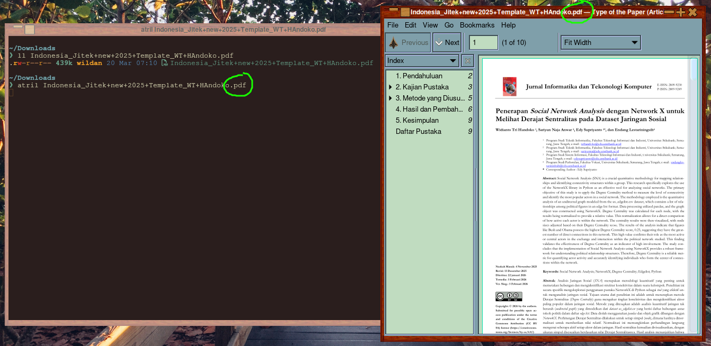
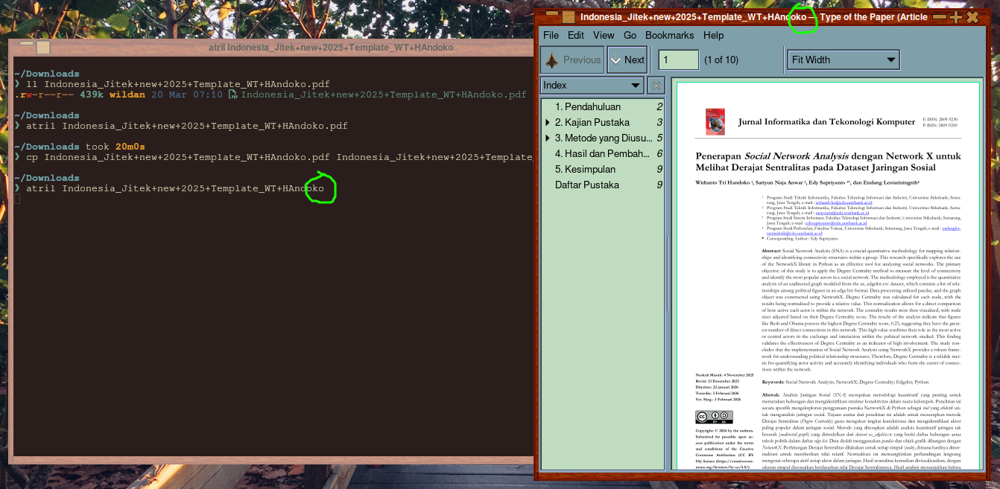
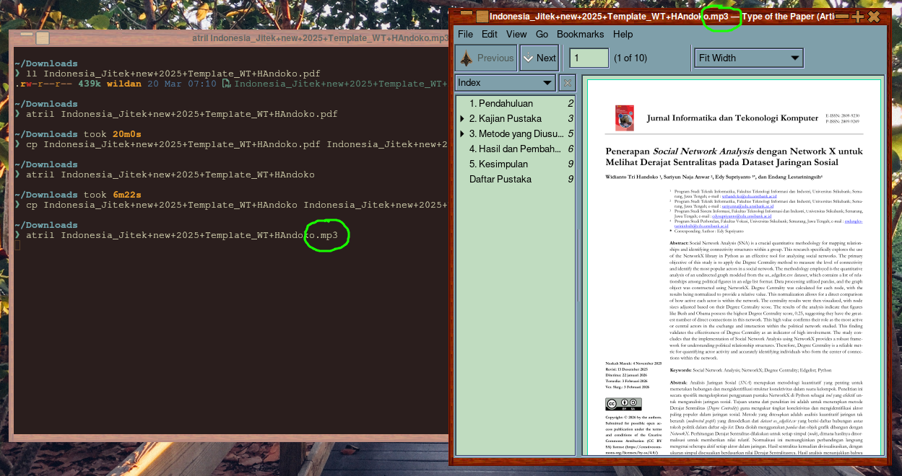
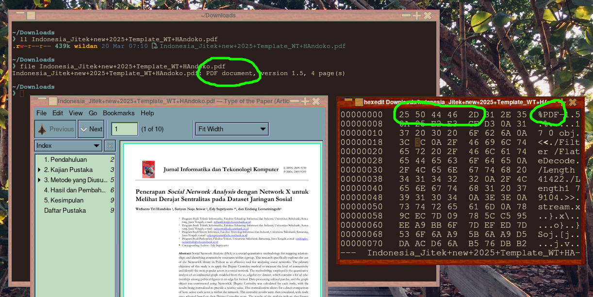
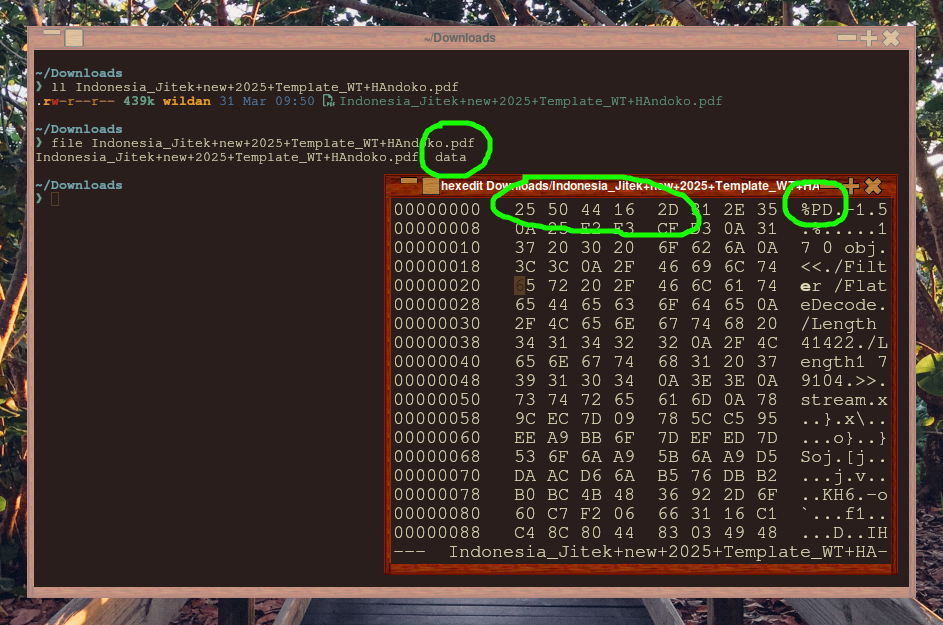

## Pre-Introduction

Pernahkah kalian bertanya-tanya, bagaimana sistem operasi komputer kalian mengidentifikasi jenis sebuah file? Bagaimana komputer kita tahu ini adalah file pdf, png, mp3, txt, atau yang lainnya? Apakah komputer mengenali jenis file hanya dari ekstensinya saja?

Nah, di artikel ini, saya akan coba bahas sedikit tentang _file signature_ dengan bahasa yang (semoga) mudah dipahami oleh orang awam.

## File Signature: Intro

Oke, sekarang, kita akan bahas sedikit tentang _file signature_ lebih dalam tentang file signature, mulai dari "definisi _file signature_" hingga "manipulasi _file signature"_.

### What is file signature?

_File signature_ atau yang umum juga dikenal sebagai **magic number** atau ***file header***, adalah sederet urutan byte tertentu dalam sebuah file yang ditujukan untuk memungkinkan program untuk mengenali jenis file tersebut tanpa harus bergantung pada ekstensinya.[^1] Jadi, dengan adanya _file signature_, program/software dapat tetap mengenali jenis suatu file, meskipun ekstensinya diubah atau dihapus. 

Sebagai contoh, saya akan membuka sebuah file pdf dengan 3 skenario:
1. file pdf yang **ber-ekstensi** ".pdf".
2. file pdf yang **tidak ber-ekstensi** ".pdf".
3. file pdf yang **ber-ekstensi lain** (".mp3").

Berikut adalah contoh ketika saya membuka file pdf yang ber-ekstensi pdf dengan _tool_ [**atril**](https://github.com/mate-desktop/atril):



Terlihat, file pdf dapat terbuka dengan baik.

Berikut adalah contoh ketika saya membuka file pdf yang tidak ber-ekstensi pdf dengan _tool_ yang sama, yaitu [**atril**](https://github.com/mate-desktop/atril):



Terlihat, file pdf juga dapat terbuka dengan baik.

Berikutnya, ini adalah contoh ketika saya membuka file pdf yang sudah saya ganti ekstensinya menjadi ekstensi file musik (".mp3"). Saya membukanya dengan _tool_ yang sama, yaitu [**atril**](https://github.com/mate-desktop/atril):



Terlihat, file pdf masih dapat terbuka dengan baik.

Dengan bukti tersebut, pahamlah kita bahwa meskipun tidak memiliki ekstensi sama sekali atau jika file ekstensinya sudah berubah, melalui _file signature_, sebuah program komputer (dalam contoh ini adalah [atril](https://github.com/mate-desktop/atril)) tetap dapat mengenali jenis file tersebut dan membukanya.

:::note  

> Lalu, bagaimana dengan sistem operasi Windows? 

Nah, sayang sekali, sampai hari ini, sepertinya memang Windows masih "ingin berbeda" dari Linux sehingga Windows sangat bergantung pada ekstensi sebuah file untuk mengenali jenis filenya. Artinya, kalau ekstensinya sudah berubah atau hilang, maka Windows akan membaca jenis file tersebut sesuai ekstensinya atau tidak bisa membacanya sama sekali (jika tidak ada ekstensi).

:::

### What is benefits of file signature?

Berikut adalah beberapa manfaat dari _file signature_:[^1]

1. Mengidentifikasi jenis file.

Meskipun ekstensi file adalah cara yang paling populer digunakan untuk mengidentifikasi jenis file, tapi, _file signature_ dapat melakukannya dengan lebih akurat.

2. Memverifikasi integritas file.

Integritas file, sebagai salah satu komponen dalam konsep CIA (_Confidentiality, Integrity, Availability_) di Cyber Security, berperan penting untuk memastikan file tersebut utuh sebagaimana mestinya dan tidak diubah oleh hacker.

3. Mencegah malware.

Para hacker jahat sering menyamarkan file yang mengandung virus. Dengan adanya _file signature_, antivirus dapat mendeteksinya dan mencegah file tersebut untuk dieksekusi.

4. Meningkatkan efisiensi.

Sistem operasi dapat menganalisis _file signature_ dan membantu memilihkan _software_ yang sesuai untuk membuka file tersebut.

5. Memastikan kompatibilitas.

_File signature_ juga berfungsi untuk membantu software dalam menentukan apakah suatu file cocok atau sesuai dengan perangkat, sistem operasi, atau arsitektur tertentu.

## File Signature: Advanced

Di bagian "Advanced" ini, kita akan belajar hal-hal teknis, seperti cara melihat atau mengetahui _file signature_ dan memanipulasinya (mengganti/menghapus).

### How to find file signature?

> **Linux only.**

Ada banyak cara untuk mengetahui _file signature_ sebuah file. 

Tapi, perlu diketahui terlebih dahulu, _file signature_ adalah bit yang umumnya terletak di bagian awal sebuah file. Ukurannya berkisar antara 2-4 bit. Jadi, misalnya, sebuah file dengan tipe pdf memiliki _file signature_: 25 50 44 46 2D.

Sebetulnya, cara yang paling umum untuk melihat _file signature_ adalah dengan membuka file terkait dengan program hex editor. Beberapa tools yang dapat digunakan untuk melihat _file signature_:
1. [hexedit](https://archlinux.org/packages/extra/x86_64/hexedit/) (CLI-based).

```shell
sudo pacman -Sy hexedit
```

2. [hexyl](https://archlinux.org/packages/extra/x86_64/hexyl/) (CLI-based).

```shell
sudo pacman -Sy hexyl
```

3. [dhex](https://archlinux.org/packages/extra/x86_64/dhex/) (CLI-based).

```shell
sudo pacman -Sy dhex
```

4. [bless](https://aur.archlinux.org/packages/bless) (GUI-based).

```shell
yay -Sy bless
```

5. [okteta](https://archlinux.org/packages/extra/x86_64/okteta/) (GUI-based).

```shell
sudo pacman -Sy okteta
```

Daftar _file signature_: [**FileSignature.org**](https://filesignature.org/)

### How to manipulate file signature?

Kalau kita sudah dapat membuka sebuah file dengan program hex editor, seperti yang sudah saya sertakan di atas, artinya kita sudah bisa mengubah _file signature_ file tersebut. Tapi, harus disadari juga bahwa mengubah _file signature_ sama dengan membuat komputer atau sistem operasi bisa salah baca jenis file.

Sebagai ilustrasi, sebuah file pdf dengan _file signature_:

`25 50 44 46 2D`

kemudian diubah sedikit menjadi:

`21 50 44 46 2D`

akan tidak bisa dibaca lagi sebagai file pdf.

Kita akan lihat buktinya langsung melalui contoh berikut:

Berikut ini adalah file pdf dengan _file signature_ yang masih normal:


Berikut ini adalah file pdf yang sama, tapi sudah saya ganti _file signature_-nya:


Sekian.


[^1]: https://nordvpn.com/cybersecurity/glossary/file-signature/