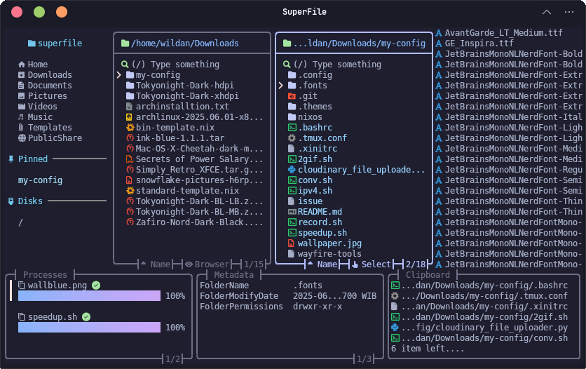
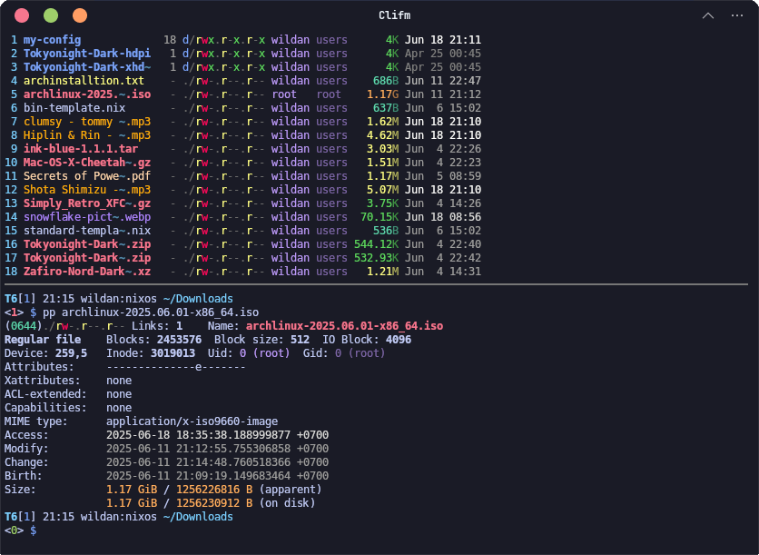
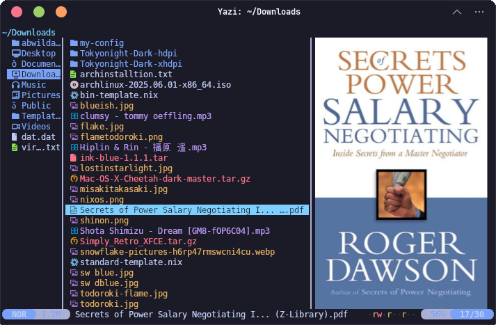
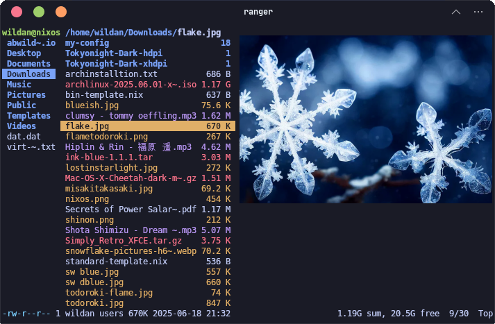
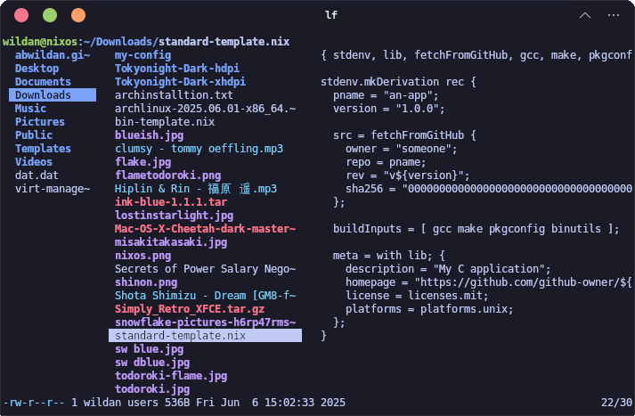
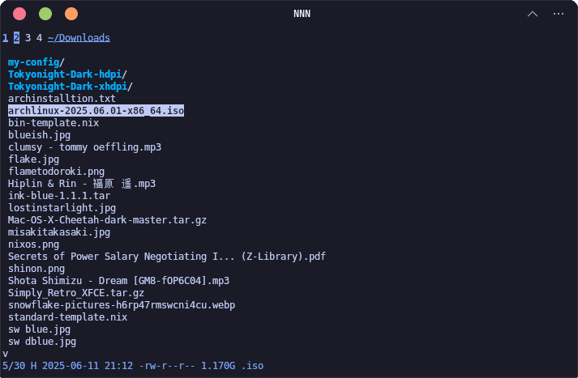
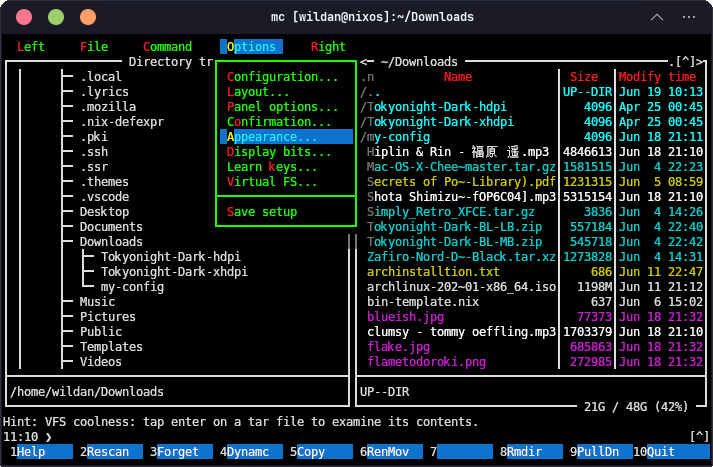

## Introduction

Kita mungkin sudah (sangat) familiar dengan istilah _file manager_ atau _file explorer_ berbasis GUI (_Graphical User Interface_) yang memang mudah ditemukan di sistem operasi populer, seperti Windows, Mac, Android, Apple, bahkan Linux sekalipun. Tapi, pernahkah kalian menggunakan atau melihat _file manager_ berbasis terminal? 

File manager berbasis terminal artinya kita tidak memerlukan _interface_ grafis (GUI) untuk mengelola file dan direktori (folder) yang ada di komputer kita. Memang, CLI _file manager_ umumnya terkenal di kalangan programmer, hacker, linux user, server admin, dan yang sebangsanya. Intinya, para [**power user**](https://en.wikipedia.org/wiki/Power_user).

Nah, di artikel ini, kita akan melihat-lihat 5 _file manager_ berbasis terminal, berikut dengan perbandingannya. Nah, agar _fair_ perbandingannya, mari kita lihat semua _file manager_ berbasis terminal tersebut berdasarkan 2 standard penggunaan dasar:

1. Menampilkan isi file (text/bahasa pemrograman, gambar, dan dokumen).
2. Manajemen file & direktori (edit, copy-paste, membuat/menghapus/mengubah file/folder baru)

Kita mulai...

### 1. SuperFile



Berikut adalah _repository_ Github-nya:



#### Installation

Berikut adalah cara memasangnya di masing-masing distro Linux:

Debian/Ubuntu, Archlinux, Fedora, OpenSuse, etc:

```shell
bash -c "$(curl -sLo- https://superfile.netlify.app/install.sh)"
```

:::note

**NixOS:**  
Masukkan baris berikut di file konfigurasi (`/etc/nixos/configuration.nix`):

```nix
  environment.systemPackages = [
    pkgs.superfile
  ];
```

Atau jika menggunakan `nix-shell`:

```shell
nix-shell -p superfile
```

:::

#### Checklists

Berikut adalah hasil _benchmarking_-nya:

| No        |   Criteria                                |   Checklist   |
| :---:     |   :---                                    |  :---:        | 
| **1.**    | **Menampilkan Isi File (_Preview_)**      |               |
|           | File Teks (.txt, .py, .nix, etc)          | ✅            |
|           | File Gambar (.png, .jpg, .gif, etc)       | ❌            |
|           | File Dokumen (.pdf, .docx, etc)           | ❌            |
| **2.**    | **Manajemen File & Direktori**            |               |
|           | Edit file                                 | ✅            |
|           | Copy-paste                                | ✅            |
|           | Membuat/Menghapus/Mengubah Nama           | ✅            |

#### Pros and Cons

Berikut adalah **kelebihan** SuperFile:

1. _Interface_ (tampilan) yang modern & informatif.
2. _Keybinding_ (_shortcut_) yang mudah diingat dan dipahami.

Berikut adalah **kekurangan** SuperFile:

1. Belum mampu membaca file gambar & file dokumen.
2. Belum tersedia di repositori distro Linux populer.

### 2. Clifm



Berikut adalah _repository_ Github-nya:

::github{repo="leo-arch/clifm"}

#### Installation

Berikut adalah cara memasangnya di masing-masing distro Linux:

|       Distro      |                  Command                                   |
|       ---         |                   ---                                      |
| **Arch Linux**    | **`yay -Sy clifm`**                                        |
| **Opensuse**      | **`sudo zypper install clifm`**                            |
| **Fedora**        | **`sudo dnf install clifm`**                               |

> Untuk **Debian/Ubuntu** belum ada paketnya di repository official, jadi harus meng-install-nya via Github.
>
> ```shell
> git clone https://github.com/leo-arch/clifm.git
> cd clifm
> sudo make install
> ```

:::note

**NixOS:**  
Masukkan baris berikut di file konfigurasi (`/etc/nixos/configuration.nix`):

```nix
  environment.systemPackages = [
    pkgs.clifm
  ];
```

Atau jika menggunakan `nix-shell`:

```shell
nix-shell -p clifm
```

:::

#### Checklists

Berikut adalah hasil _benchmarking_-nya:

| No        |   Criteria                                |   Checklist   |
| :---:     |   :---                                    |  :---:        | 
| **1.**    | **Menampilkan Isi File (_Preview_)**      |               |
|           | File Teks (.txt, .py, .nix, etc)          | ❌            |
|           | File Gambar (.png, .jpg, .gif, etc)       | ❌            |
|           | File Dokumen (.pdf, .docx, etc)           | ❌            |
| **2.**    | **Manajemen File & Direktori**            |               |
|           | Edit file                                 | ✅            |
|           | Copy-paste                                | ✅            |
|           | Membuat/Menghapus/Mengubah Nama           | ✅            |

#### Pros and Cons

Berikut adalah **kelebihan** Clifm:

1. _Interface_ (tampilan) yang unik.

Berikut adalah **kekurangan** Clifm:

1. Tidak ada fitur untuk menampilkan isi file.
2. Belum tersedia di repositori distro Debian/Ubuntu.
3. _Keybinding_ (_shortcut_) yang tidak familiar.

### 3. Yazi



Berikut adalah _repository_ Github-nya:

::github{repo="sxyazi/yazi"}

#### Installation

Berikut adalah cara memasangnya di masing-masing distro Linux:

|       Distro      |                  Command                                   |
|       ---         |                   ---                                      |
| **Arch Linux**    | **`sudo pacman -Sy yazi`**                                 |
| **Opensuse**      | **`sudo zypper install yazi`**                             |

> Untuk **Debian/Ubuntu** & **Fedora** belum ada paketnya di repository official, jadi harus meng-install-nya via Github atau via [**Snap**](https://snapcraft.io/yazi).

:::note

**NixOS:**  
Masukkan baris berikut di file konfigurasi (`/etc/nixos/configuration.nix`):

```nix
  environment.systemPackages = [
    pkgs.yazi
  ];
```

Atau jika menggunakan `nix-shell`:

```shell
nix-shell -p yazi
```

:::

#### Checklists

Berikut adalah hasil _benchmarking_-nya:

| No        |   Criteria                                |   Checklist   |
| :---:     |   :---                                    |  :---:        | 
| **1.**    | **Menampilkan Isi File (_Preview_)**      |               |
|           | File Teks (.txt, .py, .nix, etc)          | ✅            |
|           | File Gambar (.png, .jpg, .gif, etc)       | ✅            |
|           | File Dokumen (.pdf, .docx, etc)           | ✅ pdf        |
| **2.**    | **Manajemen File & Direktori**            |               |
|           | Edit file                                 | ✅            |
|           | Copy-paste                                | ✅            |
|           | Membuat/Menghapus/Mengubah Nama           | ✅            |

#### Pros and Cons

Berikut adalah **kelebihan** Yazi:

1. _Interface_ (tampilan) yang sederhana dan mudah dipahami.
2. _Keybinding_ (_shortcut_) yang juga mudah diingat.
3. Dapat menampilkan banyak tipe file.

Berikut adalah **kekurangan** Yazi:

1. Belum tersedia di repositori distro Debian/Ubuntu & Fedora.

:::note

Ada 2 terminal _file manager_ lagi yang sebetulnya mirip **`yazi`** secara tampilan, yaitu `ranger` & `lf`. Jadi, karena mirip, saya hanya akan mencantumkan gambarnya saja di sini:

|         **`ranger`**                      |         **`lf`**                    |
| :---:                                     | :---:                               |
|   |     |


:::

### 4. NNN



Berikut adalah _repository_ Github-nya:

::github{repo="jarun/nnn"}

#### Installation

Berikut adalah cara memasangnya di masing-masing distro Linux:

|       Distro      |                  Command                           |
|       ---         |                   ---                              |
| **Debian/Ubuntu** | **`sudo apt install nnn`**                         |
| **Arch Linux**    | **`sudo pacman -Sy nnn`**                          |
| **Opensuse**      | **`sudo zypper install nnn`**                      |
| **Fedora**        | **`sudo dnf install nnn`**     			               |

:::note

**NixOS:**  
Masukkan baris berikut di file konfigurasi (`/etc/nixos/configuration.nix`):

```nix
  environment.systemPackages = [
    pkgs.nnn
  ];
```

Atau jika menggunakan `nix-shell`:

```shell
nix-shell -p nnn
```

:::

#### Checklists

Berikut adalah hasil _benchmarking_-nya:

| No        |   Criteria                                |   Checklist   |
| :---:     |   :---                                    |  :---:        | 
| **1.**    | **Menampilkan Isi File (_Preview_)**      |               |
|           | File Teks (.txt, .py, .nix, etc)          | ❌            |
|           | File Gambar (.png, .jpg, .gif, etc)       | ❌            |
|           | File Dokumen (.pdf, .docx, etc)           | ❌            |
| **2.**    | **Manajemen File & Direktori**            |               |
|           | Edit file                                 | ✅            |
|           | Copy-paste                                | ✅            |
|           | Membuat/Menghapus/Mengubah Nama           | ✅            |

#### Pros and Cons

Berikut adalah **kelebihan** NNN:

1. _Interface_ (tampilan) yang sederhana.
2. Punya banyak plugin, bahkan bisa dikonfigurasi dengan file editor seperti `vim`.

Berikut adalah **kekurangan** NNN:

1. _Interface_ (tampilan) yang sangat sederhana, mirip **`clifm`**, namun lebih sederhana lagi.
2. _Keybinding_ (_shortcut_) yang tidak familiar.
3. Perlu konfigurasi manual agar lebih estetik dan _functional_.

### 5. MC



Berikut adalah _repository_ Github-nya:

::github{repo="MidnightCommander/mc"}

#### Installation

Berikut adalah cara memasangnya di masing-masing distro Linux:

|       Distro      |                  Command                           |
|       ---         |                   ---                              |
| **Debian/Ubuntu** | **`sudo apt install mc`**                          |
| **Arch Linux**    | **`sudo pacman -Sy mc`**                           |
| **Fedora**        | **`sudo dnf install mc`**     			               |

> OpenSuse belum memiliki paket `mc` di repositorinya, jadi, bisa di-install via [**Snap**](https://snapcraft.io/mc-pasman).


:::note

**NixOS:**  
Masukkan baris berikut di file konfigurasi (`/etc/nixos/configuration.nix`):

```nix
  environment.systemPackages = [
    pkgs.mc
  ];
```

Atau jika menggunakan `nix-shell`:

```shell
nix-shell -p mc
```

:::

#### Checklists

Berikut adalah hasil _benchmarking_-nya:

| No        |   Criteria                                |   Checklist   |
| :---:     |   :---                                    |  :---:        | 
| **1.**    | **Menampilkan Isi File (_Preview_)**      |               |
|           | File Teks (.txt, .py, .nix, etc)          | ✅            |
|           | File Gambar (.png, .jpg, .gif, etc)       | ❌            |
|           | File Dokumen (.pdf, .docx, etc)           | ❌            |
| **2.**    | **Manajemen File & Direktori**            |               |
|           | Edit file                                 | ✅            |
|           | Copy-paste                                | ✅            |
|           | Membuat/Menghapus/Mengubah Nama           | ✅            |

#### Pros and Cons

Berikut adalah **kelebihan** Midnight Commander:

1. _Interface_ (tampilan) yang semi [retro](https://www.merriam-webster.com/dictionary/retro), tapi familiar.
2. Punya banyak tema warna.
3. Banyak opsi dan konfigurasi.
4. _Keybinding_ (_shortcut_) yang mudah diingat.

Berikut adalah **kekurangan** Midnight Commander:

1. Belum tersedia di semua distro Linux (OpenSuse terutama).
2. Tidak dapat menampilkan (_preview_) file gambar dan dokumen.

Pertanyaanya, **"Mana terminal file manager yang paling baik (bagus)?"**  
Jawabannya, **"Yang paling sesuai dengan kebutuhan masing-masing."**

😁😆😅😎

Sekian.  
Semoga bermanfaat.


