import ChessCom from '../../../components/chess/ChessCom.astro';

:::warning[Disclaimer]

Sebagian konten artikel ini "diisi dengan informasi dari AI (Claude & Gemini)".

:::

## Appetizer

### Chit-chat

Tepat tanggal 20 Juli 2026, ketika saya sedang "iseng" melihat-lihat _template_ website [Astro](https://astro.build/), saya "terkesiap" dengan sebuah tema yang _eye-catching_, [Firefly](https://docs-firefly.cuteleaf.cn/en/). Besoknya, saya langsung mencobanya sendiri. Tidak memerlukan waktu yang lama setelah percobaan singkat itu sampai saya akhirnya memutuskan untuk migrasi blog.

---

-- Flashback.

Sudah sangat lama rasanya sejak pertama kali saya memulai _blogging_. Tahun 2023 adalah kali pertama saya mencoba membuat blog menggunakan _static site generator_ (SSG) bernama [Hugo](https://gohugo.io/). Sebagai _blogger_ pemula, tentu banyak pilihan _platform_ untuk memulai menulis artikel. Tapi, diantara banyak opsi tersebut, saya memutuskan Hugo pada saat itu karena setidaknya 2 hal: praktis (simpel & cepat) serta punya banyak pilihan tema. Rasanya tentu senang sekali karena bisa punya "ruang personal" di internet untuk berbagi tulisan (secara anonim). Artikel yang banyak saya tulis di awal _blogging_ adalah tentang hugo itu sendiri.

Berikut adalah artikel yang pertama saya tulis:

[[/tech/hugo-ing/]]

Selama perjalanan panjang itu, saya pun sudah mencoba berganti-ganti tema (_template_) sebagai cara untuk membuat pembaca (kalau ada yang baca, hehe) dan tentunya saya sendiri lebih betah berlama-lama di blog tersebut. Saya pernah pasang tema [Papermod](https://themes.gohugo.io/themes/hugo-papermod/), [Kayal](https://mnjm.github.io/kayal/), hingga yang terakhir adalah [Blowfish](https://blowfish.page/). Menurut saya, Blowfish adalah tema paling modern sekaligus paling mudah digunakan untuk Hugo. Saya bilang "modern" bukan hanya tampilan dan fiturnya yang keren, tapi juga karena _developer_-nya, [Nuna Curacao](https://n9o.xyz/about/), membangun komunitas untuk para pengguna _template_-nya.   

Kalau berkenan, sila kunjungi "pengguna Blowfish" di sini: https://blowfish.page/users/

-- Flashback berakhir.

--- 

Setelah (hampir) tiga tahun berlalu, saya akhirnya "dipertemukan" dengan web _framework_ dan tema "baru" yang sejujurnya, bisa memenuhi beberapa harapan fitur yang tidak bisa saya temukan di Hugo (setidaknya di 3 tema _template_ yang pernah saya coba), yaitu **Astro** dan **Firefly**. Fitur-fitur yang saya sebutkan tadi tentu akan saya jelaskan nanti. 

:::info[Disclaimer!]

Perlu diketahui, saya bukan seorang _programmer_. Saya tidak punya riwayat pendidikan ataupun pengalaman berkarir sebagai pembuat _software_ atau semacamnya. Saya hanya orang biasa yang "kebetulan" menggemari Linux dan menulis blog.

Jadi, selama 3 tahun kebelakang, tentu saya belajar banyak hal, terutama dalam dunia _blogging_ ini. Mulai dari membedakan jenis-jenis website (_static site_ & _dynamic site_/_site with database_), cara website bekerja, markdown _syntax_, server _hosting_, domain, dan masih banyak lagi.

Apakah itu semua spesial? Tergantung, untuk seorang _software developer_ profesional, tentu apa yang saya lakukan hanyalah titik kecil. Tapi, untuk orang awam seperti saya, saya merasa sangat bersyukur sekali. 😄 

:::

### About Astro

[Astro](https://astro.build/) adalah web framework berbasis Javascript yang diciptakan untuk membuat website yang cepat untuk berbagai kebutuhan, seperti blog, portofolio, dan situs _e-commerce_.[^1] Klaimnya, Astro ini sudah digunakan oleh perusahaan-perusahaan besar di dunia, seperti Google, Microsoft, OpenAI, Proton, Porsche, The Guardian, Cloudflare, dan yang lain. Sebetulnya, banyak fitur-fitur Astro, tapi saya rasa saya tidak akan membahasnya di sini. Jadi, sila baca-baca dan cari tahu sendiri ya. Saya sediakan website _official_ dan Github repo-nya di bawah.

Website Astro: https://astro.build

[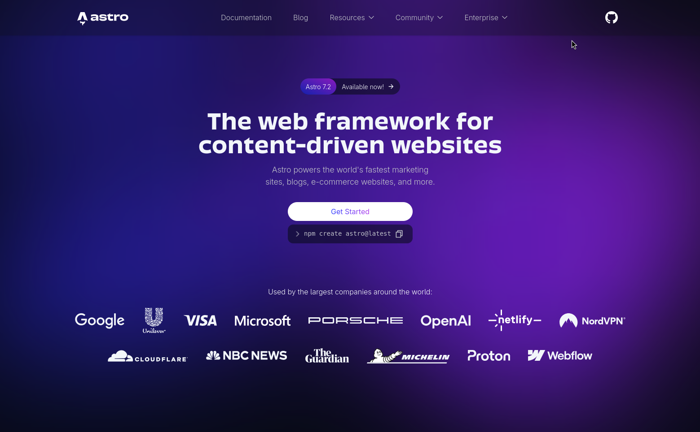]( https://astro.build)

Official Github _repository_-nya dapat dilihat di sini:

::github{repo="withastro/astro"}

### About Firefly

[Firefly](https://firefly.cuteleaf.cn/) adalah tema atau _template_ _static site_ yang dibuat dengan fondasi dari Astro. Well, sebetulnya, tidak 100% begitu, sih. Sebab, Firefly adalah tema yang dikembangkan dari "_**fork**_" tema yang sebelumnya sudah ada, yaitu [Fuwari](https://fuwari.vercel.app/). Dibandingkan dengan Firefly, Fuwari terlihat lebih sederhana. Selain itu, saat artikel ini ditulis, pengembangannya juga sudah terlihat melambat. Mungkin itu juga alasan mengapa akhirnya Firefly muncul, sebagai "_refresher_" dari tema Fuwari ini.

Berikut adalah struktur project "Firefly":[^5]

```
Firefly/
├── src/
│   ├── config/          # Configuration files
│   ├── components/      # Components
│   ├── content/         # Content (posts, pages)
│   ├── layouts/         # Layout templates
│   ├── pages/           # Page routes
│   └── types/           # Type definitions
├── public/              # Static assets
└── astro.config.mjs     # Astro configuration
```

Semua file konfigurasi **Firefly** ada di `src/config`:[^6]

| Config File | Description | Docs |
|---|---|---|
| `siteConfig.ts` | Site basic configuration | [Site Config](https://docs-firefly.cuteleaf.cn/en/guide/site.html) |
| `dynamicConfig.ts` | Moments page configuration | [Moments](https://docs-firefly.cuteleaf.cn/en/guide/dynamic.html) |
| `navBarConfig.ts` | Navbar configuration | [Navbar](https://docs-firefly.cuteleaf.cn/en/guide/navbar.html) |
| `sidebarConfig.ts` | Sidebar layout configuration | [Sidebar](https://docs-firefly.cuteleaf.cn/en/guide/sidebar.html) |
| `profileConfig.ts` | Profile configuration | [Profile](https://docs-firefly.cuteleaf.cn/en/guide/profile.html) |
| `backgroundWallpaper.ts` | Background wallpaper configuration | [Wallpaper](https://docs-firefly.cuteleaf.cn/en/guide/wallpaper.html) |
| `commentConfig.ts` | Comment system configuration | [Comment](https://docs-firefly.cuteleaf.cn/en/guide/comment.html) |
| `musicConfig.ts` | Music player configuration | [Music Player](https://docs-firefly.cuteleaf.cn/en/guide/music.html) |
| `fontConfig.ts` | Font configuration | [Font](https://docs-firefly.cuteleaf.cn/en/guide/font.html) |
| `coverImageConfig.ts` | Cover image configuration | [Cover Image](https://docs-firefly.cuteleaf.cn/en/guide/cover-image.html) |
| `expressiveCodeConfig.ts` | Code block configuration | [Code Block](https://docs-firefly.cuteleaf.cn/en/guide/code-block.html) |
| `effectsConfig.ts` | Effects configuration | [Effects](https://docs-firefly.cuteleaf.cn/en/guide/effects.html) |
| `announcementConfig.ts` | Announcement configuration | [Announcement](https://docs-firefly.cuteleaf.cn/en/guide/announcement.html) |
| `footerConfig.ts` | Footer configuration | [Footer](https://docs-firefly.cuteleaf.cn/en/guide/footer.html) |
| `licenseConfig.ts` | License configuration | [License](https://docs-firefly.cuteleaf.cn/en/guide/license.html) |
| `friendsConfig.ts` | Friends links configuration | [Friends](https://docs-firefly.cuteleaf.cn/en/guide/friends.html) |
| `sponsorConfig.ts` | Sponsor configuration | [Sponsor](https://docs-firefly.cuteleaf.cn/en/guide/sponsor.html) |
| `analyticsConfig.ts` | Analytics configuration | [Site Config](https://docs-firefly.cuteleaf.cn/en/guide/site.html#analytics) |
| `galleryConfig.ts` | Gallery configuration | [Gallery](https://docs-firefly.cuteleaf.cn/en/guide/gallery.html) |
| `mermaidConfig.ts` | Mermaid diagram configuration | [Mermaid](https://docs-firefly.cuteleaf.cn/en/guide/mermaid.html) |
| `plantumlConfig.ts` | PlantUML diagram configuration | [PlantUML](https://docs-firefly.cuteleaf.cn/en/guide/plantuml.html) |
| `pioConfig.ts` | Live2D/Spine model configuration | [Live2D/Spine](https://docs-firefly.cuteleaf.cn/en/guide/pio.html) |

> Tema Firefly ini saya temukan ketika sedang _scrolling_ tema di web Astro:  
> https://astro.build/themes/

Coba bandingkan sendiri _homepage_ dari kedua website ini:

[grid]
[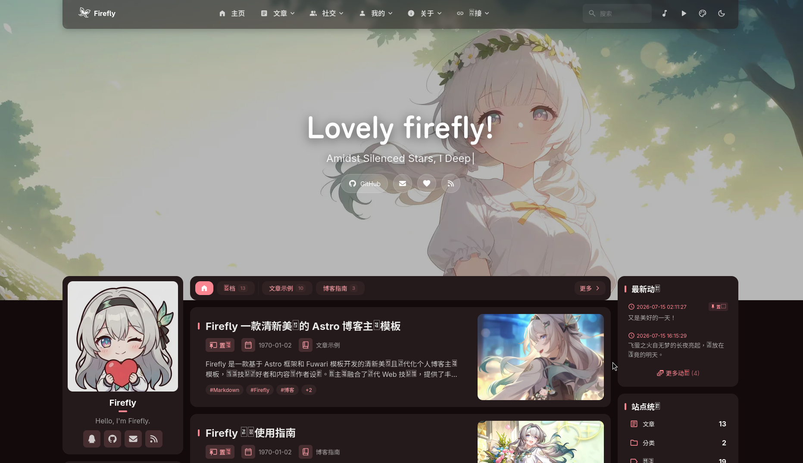](https://firefly.cuteleaf.cn/)
[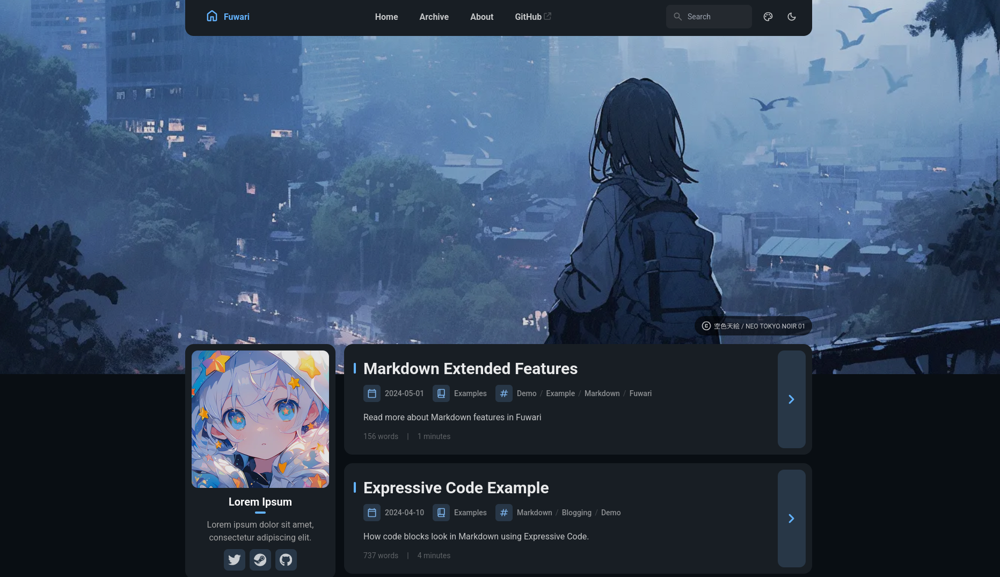](https://fuwari.vercel.app/)
[/grid]

Berikut adalah repo Github [Firefly](https://github.com/CuteLeaf/Firefly) dan [Fuwari](https://github.com/saicaca/fuwari):

::github{repo="CuteLeaf/Firefly"}

::github{repo="saicaca/fuwari"}

Halaman dokumentasi Firefly: https://docs-firefly.cuteleaf.cn/en/

:::note

Jangan khawatir, meskipun website demo-nya menggunakan bahasa dan domain China, web dokumentasi Firefly menggunakan bahasa Inggris. Selain itu, jangan takut juga untuk berinteraksi dengan _developer_-nya, [Xiaye](https://blog.cuteleaf.cn/) di [Issue Github](github.com/CuteLeaf/Firefly/issues)-nya, terutama jika mengalami kendala, mengajukan fitur, atau melaporkan bug, menggunakan bahasa Inggris tidak mengapa, setidaknya itu yang saya alami. 

:::

## Main Course

Nah, di bagian "**Main Course**" ini, saya mau membahas beberapa fitur default dari _template_ Firefly ini. Tentu nanti akan ada sedikit perbandingan juga dengan Hugo dan Blowfish, supaya lebih jelas alasan mengapa saya bermigrasi dari sana ke tema ini.

Beberapa fitur favorit saya itu misalnya:

### 1. Markdown & MDX

Meskipun saya bisa menulis markdown, baik di Hugo (dan Blowfish sebagai temanya) maupun di Astro (dan Firefly sebagai temanya), tapi ada satu kelebihan di Astro, yaitu **MDX**. Apa itu MDX?

Kalau markdown adalah sebuah _markup language_[^2] yang ringan untuk membuat format dokumen (membuat judul, menebalkan huruf, memiringkan huruf, dst) menggunakan simbol teks biasa seperti _hashtag_ (#), kurung siku ([]), dan lain sebagainya.[^3] Biasanya, file markdown digunakan di file `README.md` di github dan tentu saja sebagai file artikel di website-website statis seperti Hugo dan blog ini. 

Maka, MDX adalah markdown yang dikombinasikan dengan JSX. Artinya, saya bisa menggunakan JSX di dalam konten artikel markdown saya. Tentu saja kedua format file tersebut berbeda (Markdown & MDX). Bahkan, bisa terlihat jelas bedanya hanya dari _extension_ file-nya. Kalau file markdown biasa akan ber-ekstensi `.md`, misalnya `linuxNixOS.md`, sementara file MDX akan memiliki extensi `.mdx`, misalnya `linuxNixOS.mdx`.

:::info[About JSX]

JSX adalah singkatan dari JavaScript XML, sebuah _syntax extension_ yang memungkinkan kita menulis file berformat seperti HTML di dalam file JavaScript.[^4]

:::

Berikut adalah perbandingan _side-by-side_ antara MD dan MDX:

| Aspek | Markdown | MDX |
|---|---|---|
| Definisi | Bahasa markup ringan untuk teks terformat | Superset Markdown yang mendukung komponen JSX |
| Ekstensi file | `.md` | `.mdx` |
| Sintaks dasar | Heading, list, bold, italic, link, dll. | Sama seperti Markdown, plus sintaks JSX |
| Komponen interaktif | Tidak didukung | Bisa menyisipkan komponen React langsung |
| Import/Export JS | Tidak bisa | Bisa (`import`, `export`) |
| Butuh build tool | Tidak, bisa dirender di mana saja | Ya, butuh compiler (misal `@mdx-js/mdx`, Next.js, Astro, dll.) |
| Kompleksitas | Sederhana, mudah dipelajari | Lebih kompleks, perlu paham JS/JSX |
| Penggunaan umum | README, dokumentasi sederhana, blog statis | Dokumentasi teknis interaktif, blog dengan komponen dinamis |
| Portabilitas | Sangat portabel, dukungan luas di banyak platform | Terbatas pada environment yang mendukung MDX |
| Contoh isi | `# Judul\n\nIni **teks tebal**.` | `# Judul\n\n<CustomChart data={data} />` |
| Ekosistem | Didukung hampir semua platform (GitHub, GitLab, dll.) | Umum di ekosistem React/Next.js/Gatsby/Astro |

> Tabel di atas di-_generate_ oleh [**Antrophic Claude**](https://claude.ai/).

Fitur ini sangat bermanfaat terutama jika ingin membuat "fitur tambahan" di artikel markdown kita. Misalnya, pada kasus saya, saya membuat _embedded code_ untuk Chesscom, yang mana tidak bisa ditulis langsung di file markdown, sehingga saya perlu membuat komponennya terlebih dahulu (`ChessCom.astro`), baru kemudian di-_import_ di dalam file MDX saya.

Berikut adalah contoh artikel saya yang menggunakan MDX:

[[chess/checkmate1]]

:::tip[How to use MDX]

Berikut adalah file `ChessCom.astro`-nya:

```js title=ChessCom.astro
---
interface Props {
  id: string;
  url: string;
}
const { id, url } = Astro.props;
---

<div style="text-align: center;">
  <iframe
    id={id}
    allowtransparency="true"
    frameborder="0"
    style="width:100%;border:none;"
    src={url}
  ></iframe>
</div>

<script define:vars={{ id }}>
  window.addEventListener("message", (e) => {
    if (e.data && e.data.id === id) {
      const el = document.getElementById(id);
      if (el) {
        el.style.height = `${e.data.frameHeight + 30}px`;
      }
    }
  });
</script>
```

Dan berikut adalah cara meng-_import_-nya artikel `checkmate1.mdx` tersebut:

```md title=checkmate1.md
import ChessCom from '../../../components/chess/ChessCom.astro';

<ChessCom id="13242082" url="//www.chess.com/emboard?id=13242082"/>
```

Hasilnya:

<ChessCom id="13242082" url="//www.chess.com/emboard?id=13242082"/>

:::

> Sebetulnya, ada fitur "_**shortcode**_" di Hugo + Blowfish. Tapi, saya rasa, dengan MDX, semua menjadi lebih fleksibel dan lebih ringan.

### 2. Locked Article

Jika saya ingin suatu artikel hanya dapat dibaca oleh saya sendiri (dan beberapa orang pilihan), saya bisa mengunci artikel tersebut dengan password. Dengan demikian, hanya saya (dan beberapa orang pilihan yang tahu password tersebut) sajalah yang dapat membaca atau membukanya.

Contohnya, berikut adalah artikel _**private**_ saya:

[[tech/hugo-advanced]]

[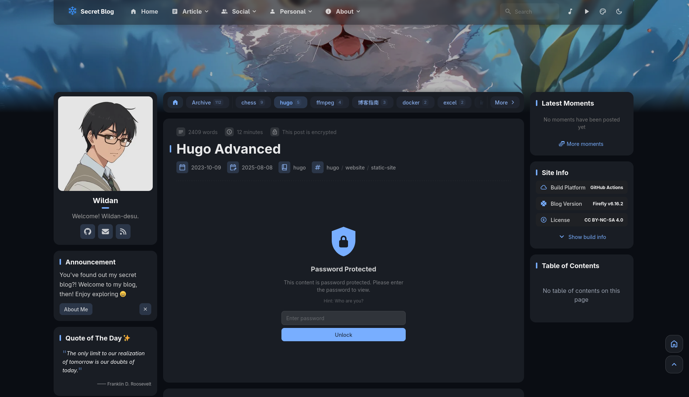](https://secretblog.my.id/posts/tech/hugo-advanced/)

Dan fitur ini mudah sekali digunakan, sesimpel menambahkan sebuah _frontmatter_ password di file markdown / MDX-nya. Misalnya,

```md {9-10}
---
title: "Article Title"
published: 2023-10-09T15:22:46+07:00
draft: false
description: "The description for this article."
image: "cover.png"
tags: ["website", "static", "astro", "firefly"]
category: "hugo"
password: "SUPERsecretP@ss123"
passwordHint: "Your most secure password"
---
```

:::warning

Tentu fitur ini tidak terlalu berguna jika "_source code_" artikelnya terbuka. Misalnya, jika artikel ini di-_hosting_ di Github dan alamat Github-nya juga terlampir di website ini, maka kita bisa membaca isi artikelnya dengan langsung membuka _source code_-nya di Github tersebut. Jika ingin benar-benar private, pastikan _source code_-nya tidak disebar.

:::

### 3. Gallery

Dengan adanya fitur **gallery** ini, saya bisa memamerkan gambar-gambar favorit saya di internet melalui blog ini. _Well_, sebetulnya, di Blowfish juga ada fitur ini, tapi, yang membuat Firefly unggul adalah, sekali lagi, fitur "**_locked_**"-nya. Artinya, jika kita ingin mem-_private_ foto-foto di sebuah _gallery_ tertentu, kita bisa menambahkan password di pengaturan _gallery_-nya.   

Sila berkunjung ke Gallery blog ini, saya punya 2 gallery di sana (walaupun dua-duanya di-_private_ sih, hehe).

[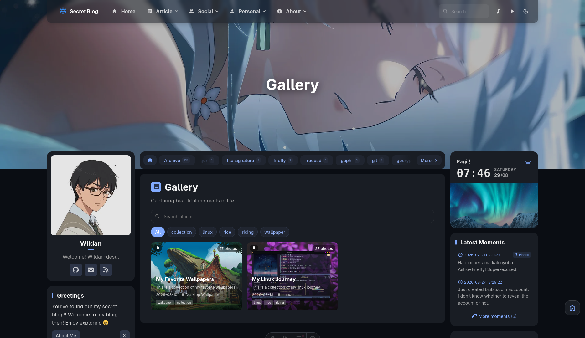](https://secretblog.my.id/gallery/)

### 4. Widget

Widget adalah "blok-blok" tambahan yang ada di sisi kiri dan kanan utama website. Jadi, bagian-bagian seperti "Profile", "Annoucement", "Site Statistics", "Calendar", dan lainnya itu adalah Widget.

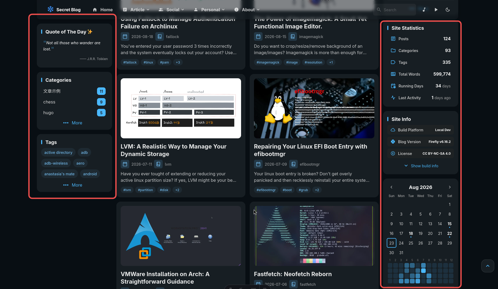

Semua widget ini bisa diatur untuk muncul atau tidak. Saya sendiri menyembunyikan widget "Music", padahal _by default_ ada (tampil). Tapi, karena saya merasa fitur Music ini sudah ada di top bar, maka saya _hide_ saja widget-nya.

Me-non-aktifkan-nya pun sesimpel mengganti parameter `showInSidebar` ke `false` di `musicConfig.ts`:

```ts {6} title=musicConfig.ts
import type { MusicPlayerConfig } from "../types/musicConfig";

export const musicPlayerConfig: MusicPlayerConfig = {
	showInNavbar: true,

	showInSidebar: false,
```

:::info[Custom Widget]

Tidak semua widget yang ada di blog ini adalah asli bawaan Firefly. Saya sudah menambahkan 3 widget custom: **QOTD (_Quote of The Day_)**, **Greeting**, dan **Weather Forecast**. Mungkin, tutorial membuat custom widget akan saya buatkan di artikel terpisah.

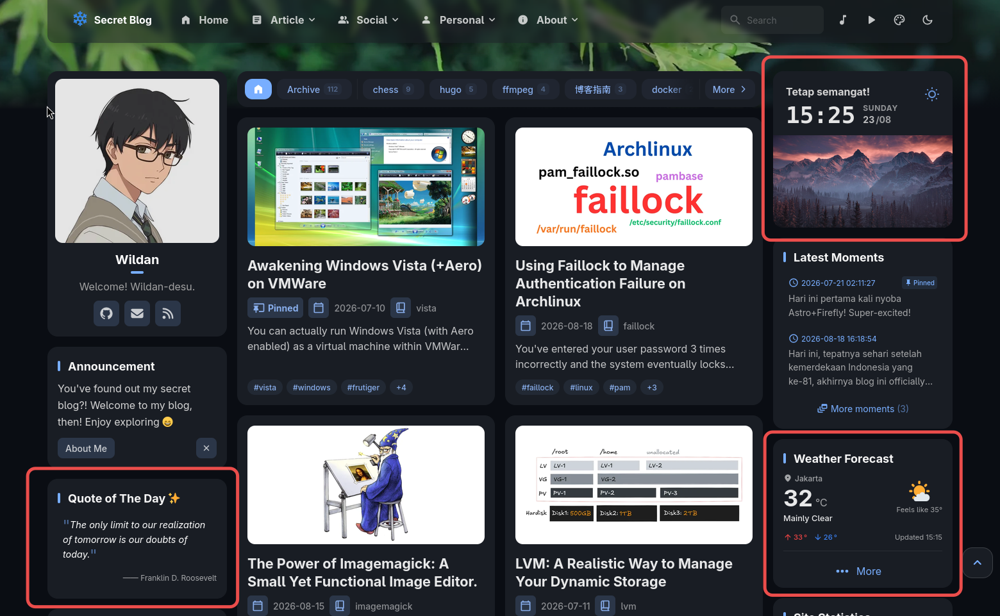

:::

Apakah widget-widget ini penting? _Well_, sebetulnya, ini "selera" saja. Dulu, ketika masih pertama kali belajar soal website dan _blogging_, saya hanya mengincar tampilan yang bersih. Itulah kenapa saya memilih Papermod sebagai tema awal untuk blog Hugo saya dulu. Tapi, semakin kesini, saya "mendambakan" blog yang informatif dan "gak pelit". Maksud "gak pelit" adalah, terkadang, ketika membuka sebuah blog atau website, halaman utama dan bahkan halaman artikelnya hanya berisi di bagian tengah saja, sementara samping kanan dan kirinya kosong. Nah, saya pikir, ruangan kosong itu akan lebih bagus jika bisa diisi oleh informasi-informasi ringan seperti widget-widget yang ada di Firefly ini.  

### 5. Moments/Dynamic

Dynamic itu seperti catatan kecil atau diary. Fitur ini sudah saya inginkan sejak mulai nge-blog dulu. Tapi, sejak saat itu, baru di tema Firefly ini saya menemukannya. Catatan ini saya perlukan sekadar untuk "memberikan _update_" tentang saya pribadi sebagai penulis blog kepada pengunjung blog. Sebab, terkadang, mungkin karena kesibukan dunia nyata, saya belum sempat membuat artikel baru. Tapi, dengan adanya fitur **Dynamic** ini, saya bisa berkabar.

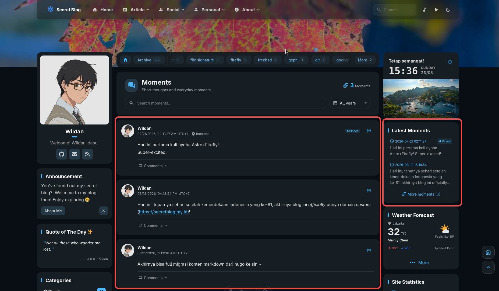

Seperti terlihat pada tangakapan layar di atas, "Dynamic" memang punya halaman sendiri. Tapi, kita juga bisa memunculkannya sebagai Widget.

### 6. Friends

Kita juga bisa berjejaring dengan para blogger di seluruh dunia. Caranya sesimpel bertukar informasi tautan website (blog) masing-masing. Jadi, ketika menambahkan alamat website orang lain, kita juga terlebih dahulu (seharusnya) sudah memberikan informasi alamat website kita ke dia. 

[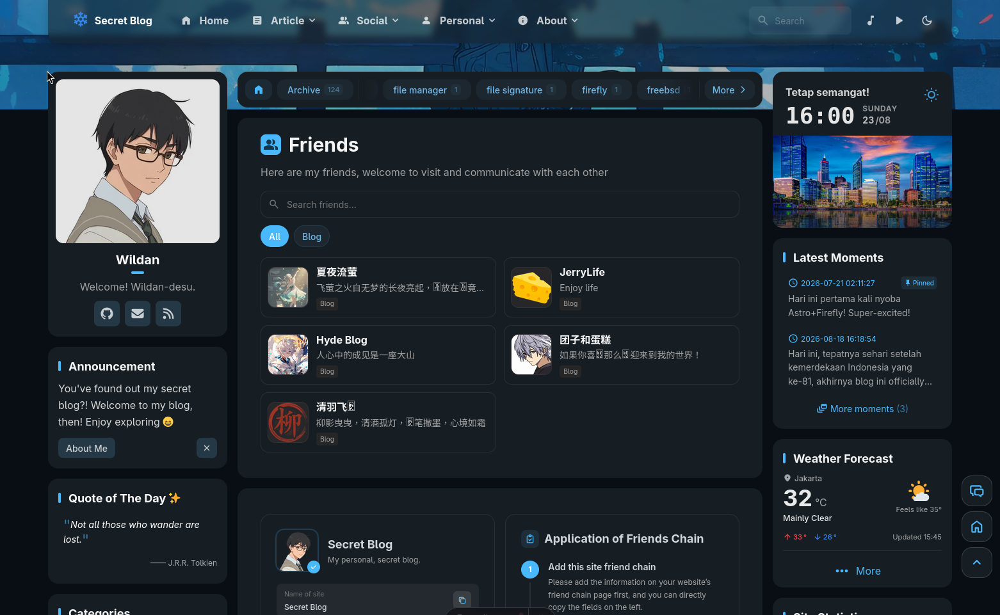](https://secretblog.my.id/friends/)

Sejauh ini, saya baru berteman dengan para blogger China. Mereka, harus saya akui, keren-keren blognya. 🤩 Mereka adalah teman-teman online saya di blog ini. Kalau kalian mengunjungi blog mereka, saya bisa pastikan, di daftar "Friends"-nya, pasti ada blog saya ini juga.

### 7. Settings

Sebagai orang yang mudah jenuh, saya sangat mengapresiasi adanya "**Website Settings**" yang praktis seperti ini. Di sini, saya bisa mengganti aksen warna blog saya, mengatur background Wallpaper, bahkan hingga menambahkan _effect_ bunga sakura seperti pada gambar berikut:

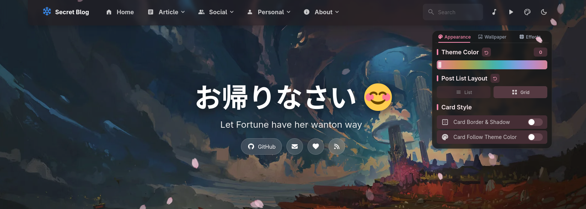

Berikut adalah 3 dari 4 mode background Wallpaper:

[grid]
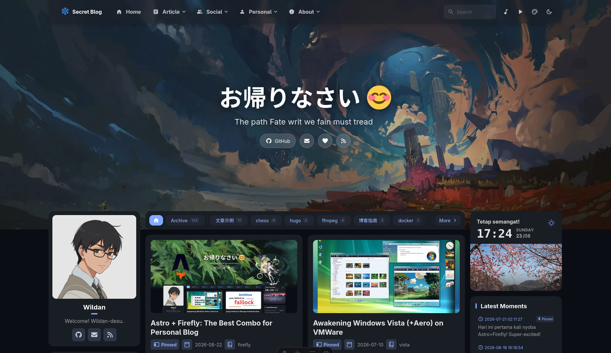
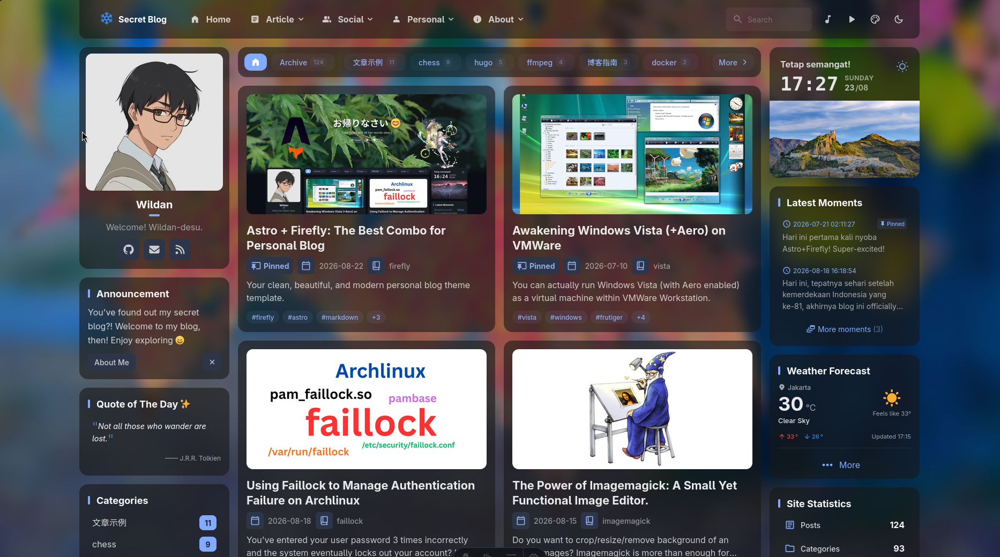
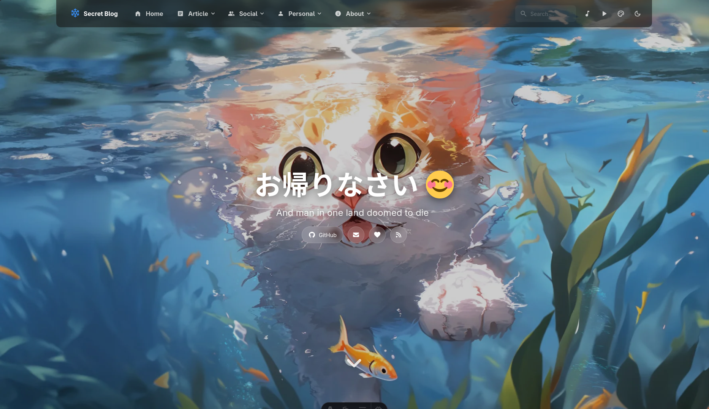
[/grid]

Mode ke-4 apa? Mode ke-4 adalah tanpa Wallpaper. Jadi, kalau kalian ingin tampilan blognya lebih sederhana, bisa pilih mode ke-4 tersebut.

## Dessert

Beberapa fitur lain juga tentu ada. Tapi, tidak saya bahas karena saya pikir cukup standard (setidaknya berdasarkan pengamatan subjektif saya) di banyak blog. Misalnya seperti fitur "Light & Dark Mode" dan fitur "Komentar".

Sampai sini, saya merasa sangat bersyukur sekali karena sudah bisa bertemu dengan "_template_ blog impian" yang saya cari-cari selama ini. Firefly selain bisa memenuhi semua ekspektasi saya pribadi, juga bisa memberikan tampilan yang estetik. Mari kita lihat 3 tahun ke depan, apakah saya betah dengan tema Firefly ini, atau mungkin saya akan berubah lagi dan berpindah haluan.

Terima kasih sudah membaca.  
Sampai jumpa di artikel saya yang lain!


[^1]: https://astro.build/
[^2]: https://en.wikipedia.org/wiki/Markup_language
[^3]: https://en.wikipedia.org/wiki/Markdown
[^4]: https://medium.com/@urza.p/jsx-deep-dive-what-it-really-is-and-how-it-works-c1b32ef2e682
[^5]: https://docs-firefly.cuteleaf.cn/en/guide/getting-started.html#project-structure
[^6]: https://docs-firefly.cuteleaf.cn/en/guide/getting-started.html#configuration-overview
