Halo!
Kali ini kita akan belajar tentang penggunaan salah satu *software* yang biasa digunakan untuk melakukan analisis data pada ilmu-ilmu
sosial, khususnya pada diskusi atau kajian mengenai *Social Network Analysis* (SNA). Secara sederhana, SNA adalah sebuah metode untuk mengidentifikasi aktor (*node*) dan relasinya (*edge*) dalam suatu jaringan.

Pada topik Gephi kali ini, saya akan menjelaskan analisis terhadap 4 jenis sentralitas aktor[^1], yaitu:
1. *Degree Centrality*
2. *Betweeness Centrality*
3. *Closeness Centrality*
4. *Eigenvector Centrality*

Berikut adalah perbedaan singkat mengenai keempat jenis *centrality* tersebut.

| *Centrality*  |  Definisi  |
| ------- | ------- |
| *Degree Centrality*  |  Popularitas suatu aktor atau jumlah relasi dari dan ke aktor lainnya  |
| *Closeness Centrality*  |  Kedekatan suatu aktor dengan aktor lainnya  |
| *Betweeness Centrality*  |  Jumlah nilai perantara suatu aktor dalam jaringan  |
| *Eigenvector Centrality*  | Aktor yang memiliki relasi dengan aktor lainnya yang juga penting |

Namun, sebelum itu, kita akan terlebih dahulu belajar *crawling* data dari *sosial network digital platform* seperti Twitter/X, Youtube, dan Facebook. Namun, karena *crawling* data dari Twitter/X berbayar dan Facebook belum pernah saya coba, jadi, kita akan meng-*crawl* data dari Youtube saja. Setelah itu, kita juga akan mempelajari langkah-langkah melakukan ***import*** data hasil *crawling* tadi ke aplikasi Gephi.

## Crawling Data dari Youtube
Langkah pertama yang perlu kita lakukan ketika akan melakukan *crawling* data dari Youtube adalah menentukan satu video yang akan kita analisis dengan Gephi. Karena kita akan menganalisis *social networks* dari komen-komen yang terdapat pada satu video Youtube tersebut, maka saya sarankan untuk mencari video dengan komen yang banyak untuk memaksimalkan pemahaman. Dalam hal ini, saya akan mengambil video dari kanal KOMPASTV yang berjudul **Panas! Prabowo Jawab Anies: Anda Tidak Pantas Bicara Etika Karena Tak Beri Contoh Etika** dengan jumlah komentar sebanyak **16,112** sebagai berikut:

<iframe width="100%" height="468"
  src="https://www.youtube.com/embed/GQX-Sp3hOf0"
  title="YouTube video player"
  frameborder="0" allowfullscreen>
</iframe>

Kedua, sebetulnya, terdapat beberapa *tools* yang dapat kita gunakan untuk mendapatkan data dari Youtube. Akan tetapi, ada satu website yang sangat memudahkan kita untuk meng-*crawl* komentar-komentar Youtube tanpa harus ribet (login, dsb), nama websitenya adalah **[Youtube Data Tools](https://ytdt.digitalmethods.net/mod_video_comments.php)**. Penampakannya adalah sebagai berikut:
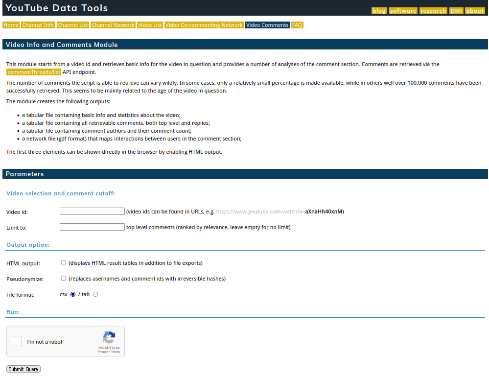

Ketiga, agar dapat meng-*crawl* 16000-an komentar yang ada pada video tersebut, kita hanya perlu meng-*copy*-*paste* id video tersebut ke kolom "Video id" di website Youtube Data Tools. Jika kita lihat pada link video tersebut, kita akan tahu bahwa id video tersebut terletak setelah karakter sama dengan (=), yaitu GQX-Sp3hOf0. Setelah di-*paste*, memastikan *check box* "I'm not robot" diceklis, dan meng-klik tombol "submit", kita tinggal menunggu proses crawling selesai.
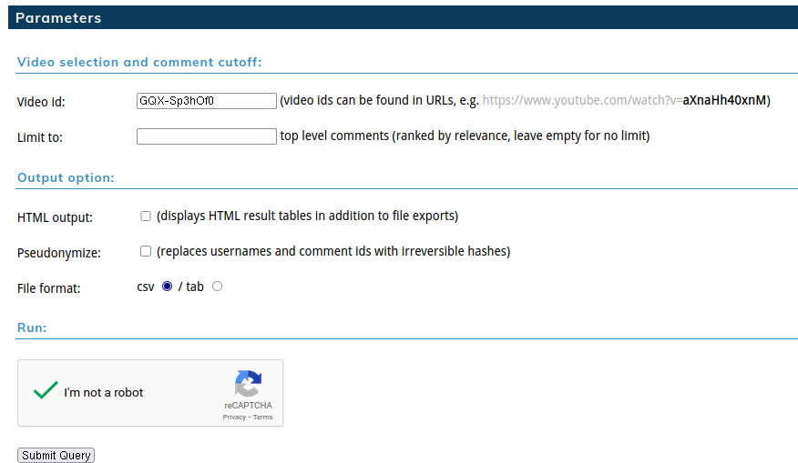

Keempat, setelah proses crawling selesai, website tersebut akan memberikan dua pilihan format file yang dapat kita unduh, yaitu file csv dan gdf. Kita akan mengunduh file gdf karena file tersebut yang paling sesuai untuk dibuka di aplikasi gephi.
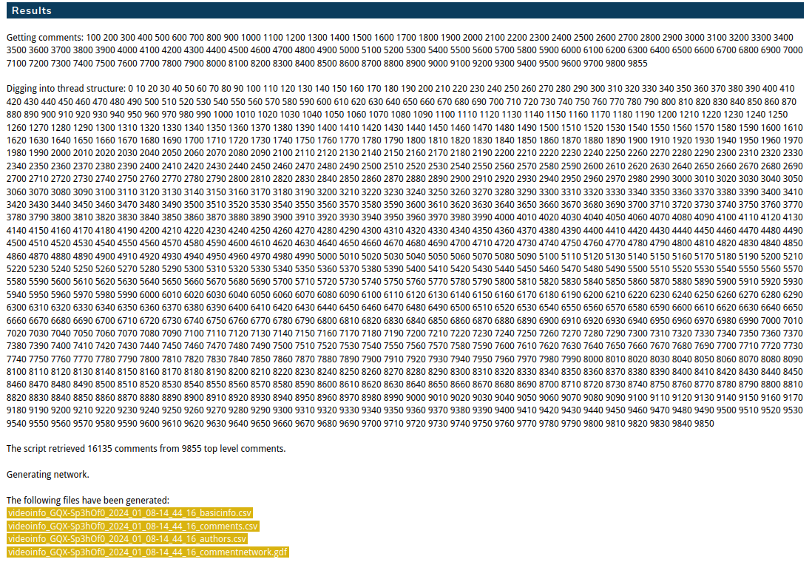

## Import Data ke Gephi
Untuk meng-*import* file gdf tadi ke gephi, kita tinggal pilih menu **File** -> **Open**, cari file gdf yang sudah didownload tadi, dan klik "Open".
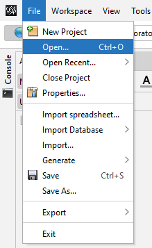
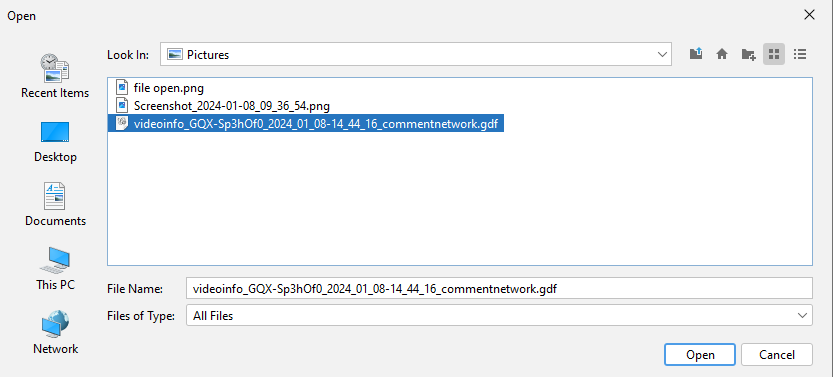

Kemudian, nanti akan muncul opsi untuk memilih jenis relasi yang akan digunakan. Secara umum, ada dua jenis relasi dalam jaringan, yaitu *directed* dan *undirected*. Relasi *directed* berarti relasi yang memiliki arah hubungan. Artinya, relasi *directed* memperhatikan siapa yang berperan sebagai pengirim pesan dan siapa yang berperan sebagai penerima pesan. Sementara itu, relasi *undirected* berarti relasi yang tidak berarah. Artinya, baik pengirim pesan dan penerima pesan dianggap setara sehingga relasi ini tidak melihat arah hubungan[^2] .

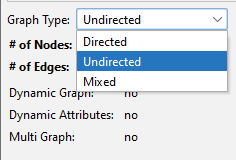

Dalam tutorial Gephi kali ini, saya akan menggunakan jenis relasi *undirected*. Selanjutnya, klik "OK".

Untuk menghitung nilai sentralitas setiap aktor, Gephi menyediakan fitur otomatis yang tersedia dalam bagian "Statistics". Untuk membuka sub-window "Statistics" tersebut, klik menu "Window" -> "Statistics".
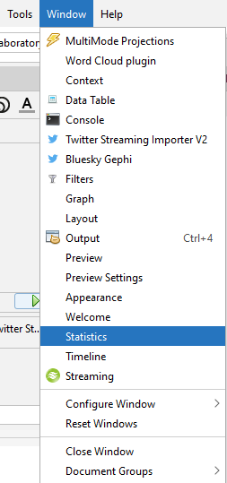

Kemudian akan muncul jendela "Statistic" yang didalamnya terdapat tombol-tombol untuk menghitung beberapa hal yang dibutuhkan, diantaranya adalah sentralitas para aktor. 

## Layouting dengan Algoritma Yifan Hu

Sebelum saya akan lebih jauh menghitung keempat sentralitas aktor tersebut, kita akan buat visualisasi jaringan dengan layout Yifan Hu. Jika window "Layout" belum tampak, kita dapat memanggilnya dari menu "Windows" -> "Layout".
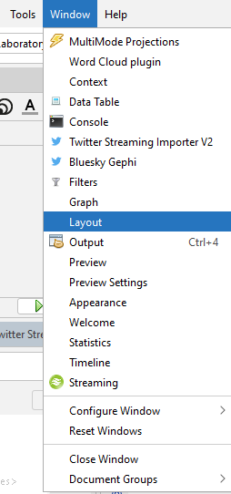

Selanjutnya, kita dapat mengaktifkan layout Yifan Hu dengan nilai *optimal distance* 60. Kemudian klik "Run".
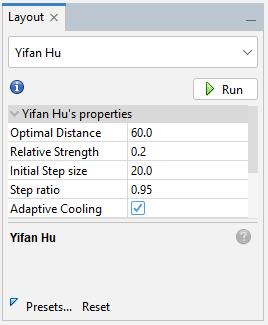

Maka, visualisasi jaringan akan tampil dalam bentuk berikut:
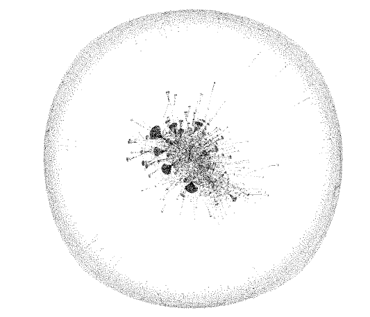

### 1. Degree Centrality
Untuk mengitung *degree centrality*, klik pada bagian "Average Degree" pada window "Statistics".
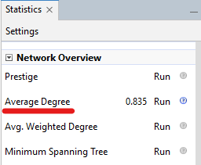

Setelah perhitungan selesai, akan muncul window HTML Report yang menggambarkan distribusi degree pada jaringan ini.
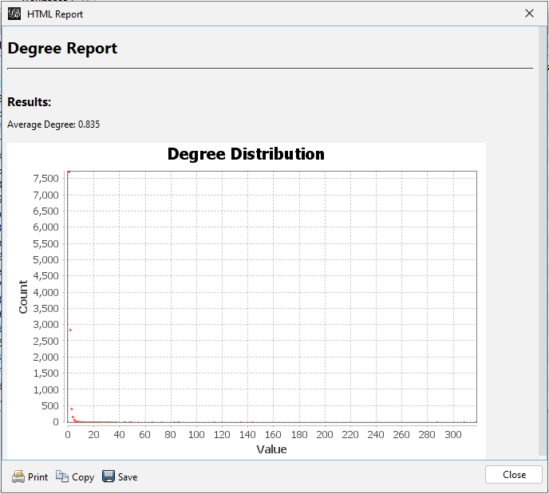

Secara spesifik, kita dapat melihat siapa akun atau aktor yang memiliki nilai degree centrality paling tinggi dengan melihat datanya pada menu "Data Laboratory".

Berikut adalah top 5 aktor yang memiliki nilai degree centrality paling tinggi, yaitu aktor dengan username akun Youtube **@sudirmantowsan1743**, **@TamSar-yj3mn**, **@user-df4ms3ji2v**, **@rezaelmaris3822**, **@Ainal_Yakin**, dan **@MuhammadIhsan-pd8gp**.
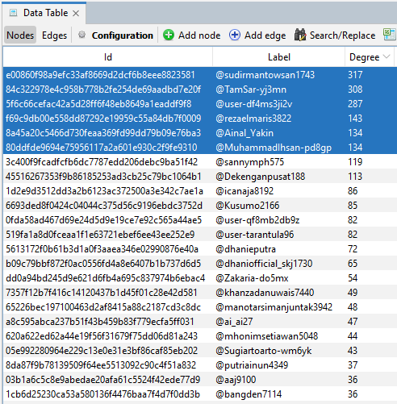

Yang menarik, kita juga dapat menonjolkan username kelima aktor tersebut pada visualisasi yang sudah dibuat sebelumnya dengan algoritma Yifan Hu. Sebelum itu, kita perlu kembali ke sub-menu "Overview". 

#### Nodes Size
Untuk men-setting *degree centrality* pada visualisasi tadi, kita dapat membuka window "Appearance" dari menu "Windows".
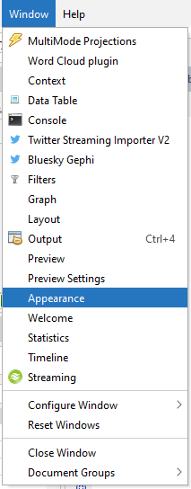

Kita akan pilih icon "Size" untuk "Nodes" dengan opsi "Degree" untuk ditampilkan berdasarkan "Ranking"-nya. 
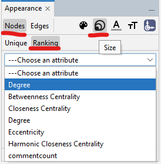

Minimal size di 15 dan maksimal size di 100. Klik "Apply".
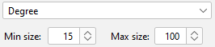

#### Nodes Color
Berikutnya, kita akan beri warna pada kelima aktor tertinggi tersebut. Caranya masih sama, di menu "Nodes", pilih icon "Color" dan set "Degree" pada bagian "Partition".
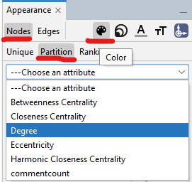

Pertama, kita akan warnai semua aktor menjadi warna abu-abu.
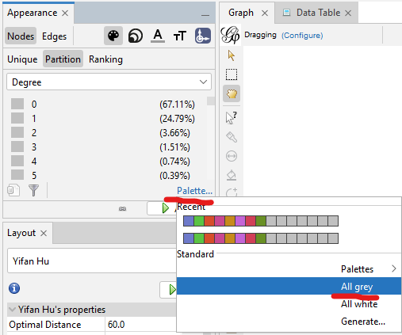

Kemudian, kita akan pilih lima aktor dengan nilai *degree centrality *paling tinggi dengan warna merah-kuning-hijau-biru-ungu.
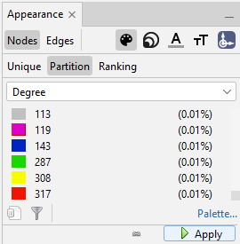

Pada visualisasi, akan tampil kelima node atau aktor tersebut dari urutan warna merah-kuning-hijau-biru-ungu, sementara aktor lainnya akan berwarna abu-abu.
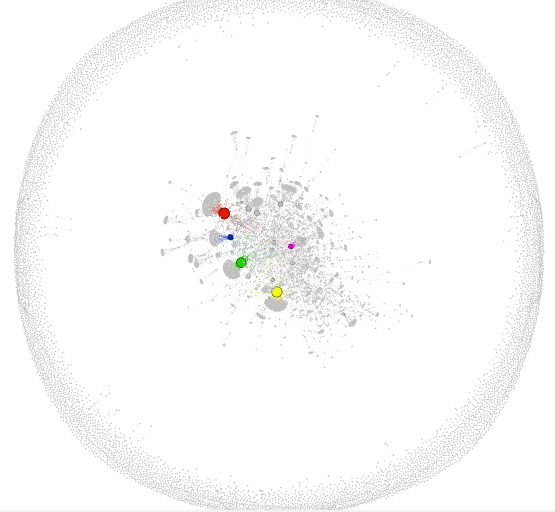

Namun, username dari masing-masing aktor tersebut masih belum tampak. Sebelum kita menampilkan label username setiap aktor, kita akan terlebih dahulu men-setting warna labelnya terlebih dahulu. Langkah-langkahnya mirip seperti langkah-langkah men-setting nodes atau aktor tadi. 

#### Label Size
Pertama, masih di window "Appearance", kita atur terlebih dahulu size labelnya.
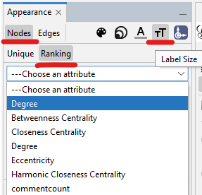

Sesuaikan ukuran labelnya di minimal 1 dan maksimal 12.
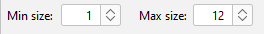

#### Label Color
Kemudian kita atur warnanya.
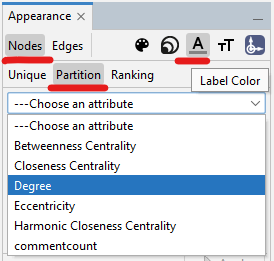

Untuk memunculkan label dari setiap nodes, kita dapat memunculkannya dengan meng-klik icon "T" yang berwarna hitam di bagian bawah.
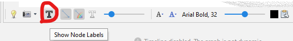

Dan kita berhasil membuat visualisasinya lebih spesifik dengan menonjolkan lima aktor yang memiliki nilai *degree centrality* paling besar!
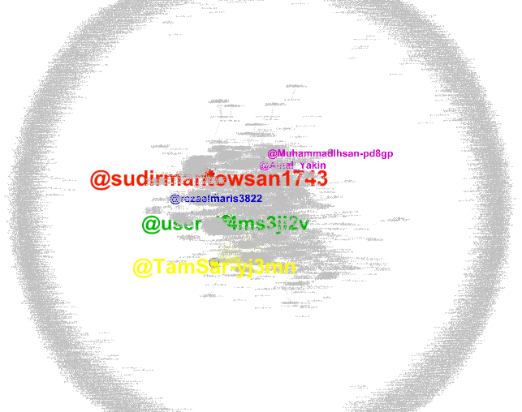

### 2. Closeness Centrality
Untuk mengitung *closeness* dan *betweeness centrality*, klik pada bagian "Avg. Path Length" pada window "Statistics". Kemudian akan muncul sebuah window, kita hanya perlu menceklis "Normalize Centralities in [0,1]". Selanjutnya, klik "OK". Setelah beberapa detik proses pengukuran, akan tampil window "HTML Report" seperti di *degree centrality* tadi, untuk menunjukkan distribusi *degree* pada jaringan ini.

Berdasarkan tabel di bawah ini, kita dapat mengetahui bahwa ada lebih dari 20 aktor yang memiliki nilai *closeness centrality* sama dengan 1 (nilai maksimal). Sebetulnya, jika lihat data aslinya, ada lebih dari 100 aktor yang memiliki skor *closeness centrality* sama dengan 1.
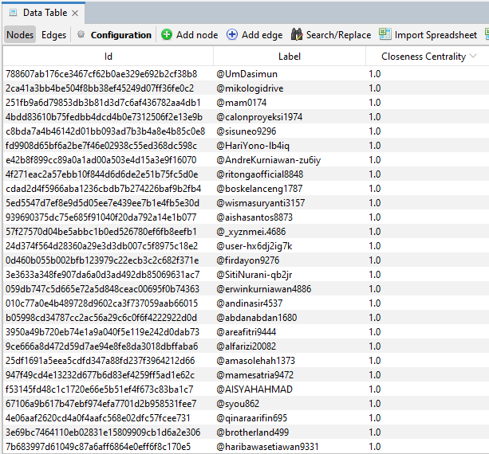

Berikut ini adalah visualisasi dari aktor-aktor top pada *closeness centrality* di jaringan ini.
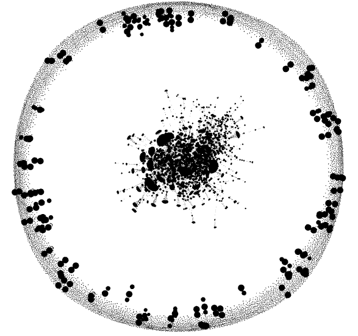

### 3. Betweeness Centrality
Berikut ini adalah tabel tabel data aktor-aktor yang memiliki nilai *betweeness centrality* tertinggi.
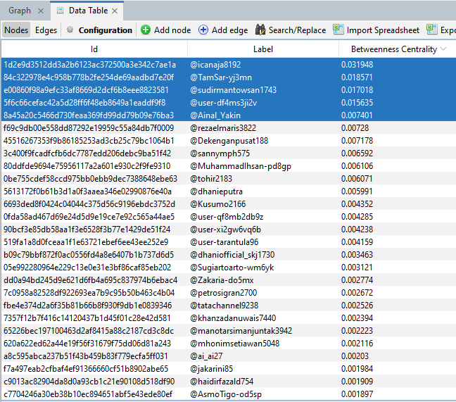

Berikut ini adalah visualisasi dari 5 aktor top *betweeness centrality*.

#### Nodes Size
Atur ukuran nodes untuk *betweeness centrality*.
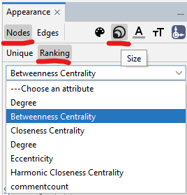
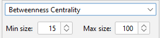
Klik "Apply".

#### Nodes Color
Atur warna nodes pada *betweeness centrality*.
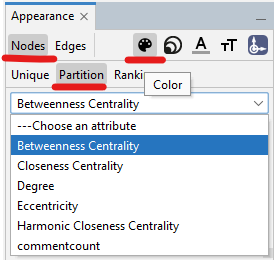

Ubah semua node berwarna abu-abu.
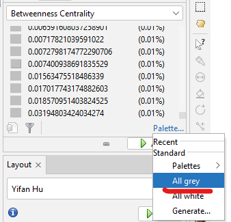

Warnai top 5 aktor dengan warna berbeda, berurut dari yang terbesar ke terkecil (merah-kuning-hijau-biru-ungu).
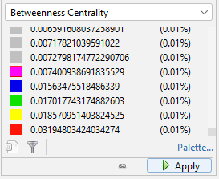

Klik "Apply". Berikut adalah visualisasi sementaranya.
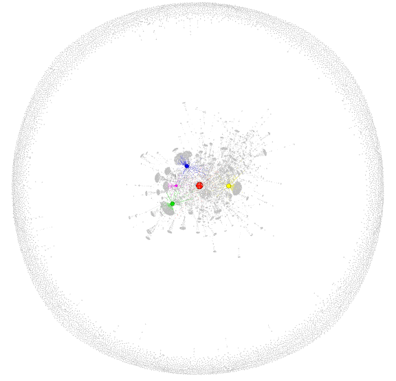

#### Label Size
Atur ukuran label untuk *betweeness centrality*.
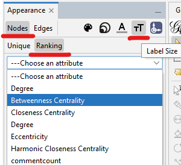
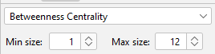

#### Label Color
Atur warna untuk label aktor pada *betweeness centrality*.
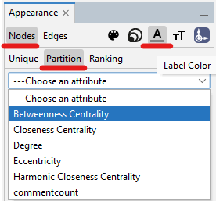
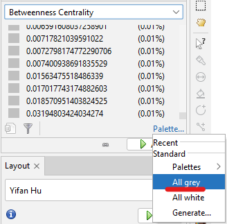

Klik "Apply". Berikut adalah hasil visualisasi dari *betweeness centrality*-nya.
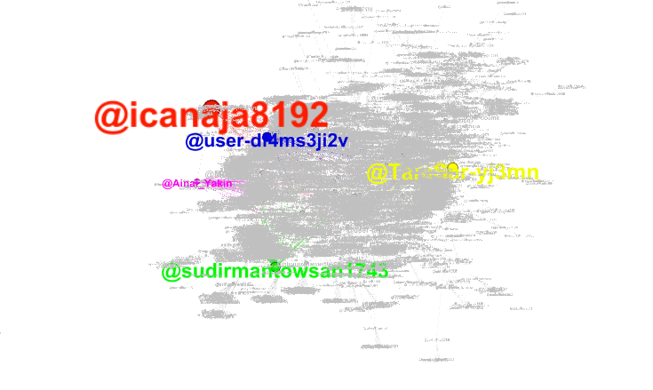

### 4. Eigenvector Centrality
Untuk menghitung *eigenvector centrality*, kita hanya perlu klik "Run" pada bagian "Eigenvector Centrality" di sub menu "Node Overview".
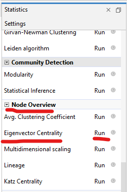

Nanti akan muncul window seperti di bawah ini, biarkan default, klik "Ok".
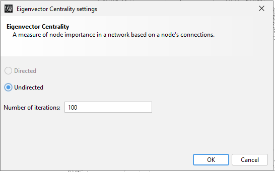

Setelah selesai, kita dapat melihat hasil perhitungannya pada tabel di "Data Laboratory".
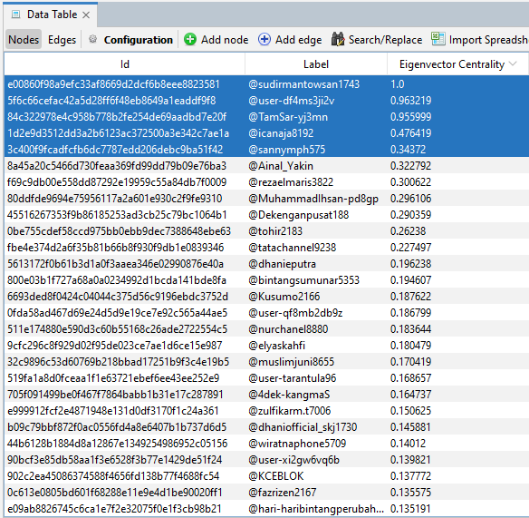

Berdasarkan tabel tersebut, kita dapat mengetahui bahwa aktor dengan nilai *eigenvector centrality* tertinggi adalah aktor dengan nama akun @sudirmantowsan1743 dengan skor 1, kemudian disusul @user-df4ms3ji2v dengan skor 0.96, @TamSar-yj3mn 0.95, @icanaja8192 dengan skor 0.47, dan @sannymph575 dengan skor 0.34. 

Sekarang, kita akan mengimplementasikannya dalam format visual.

#### Nodes Size
Atur ukuran nodenya dengan setting 15 untuk aktor dengan nilai *eigenvector centrality* terkecil dan 100 untuk skor terbesar. 
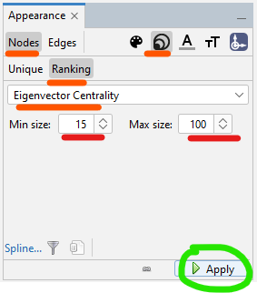

#### Nodes Color
Atur warna untuk 5 node dengan nilai *eigenvector centrality* tertinggi (merah-kuning-hijau-biru-ungu). Jangan lupa, ubah warna node aktor lainnya menjadi abu-abu.
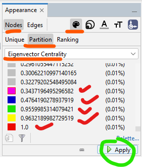

Berikut adalah hasil visualisasinya!
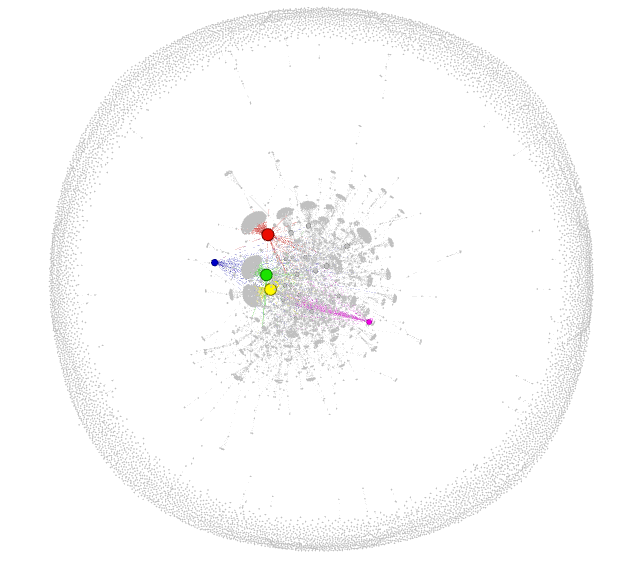

#### Label Size
Atur ukuran label setiap aktor.
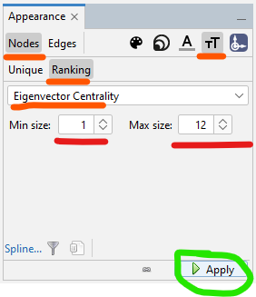

#### Label Color
Atur warna untuk label sesuai dengan urutan nilai *eigenvector centrality*-nya (merah-kuning-hijau-biru). Jangan lupa ubah juga warna label aktor lainnya menjadi abu-abu.
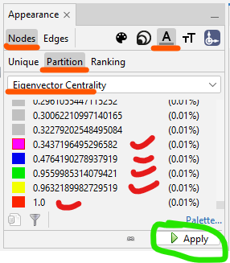

Berikut adalah hasil visualisasinya!
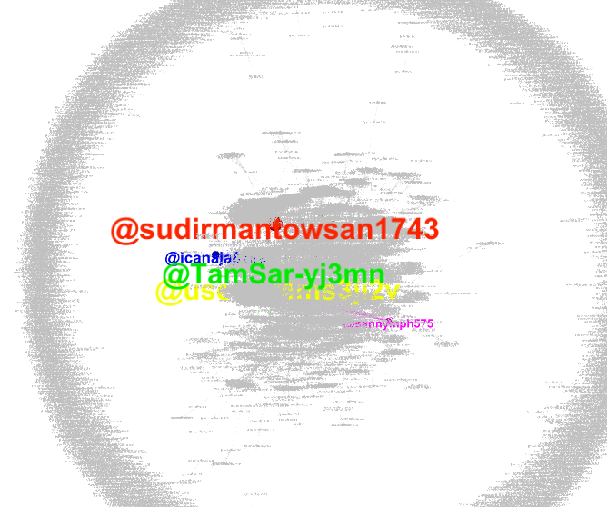

[^1]: https://putrialutfi.medium.com/gephi-social-network-visualization-fdf87ca5188a
[^2]: http://jurnal.unpad.ac.id/kajian-jurnalisme/article/view/33458
