## What is Git?

Sebagai _blogger_ yang meng-_hosting_ file dan tulisannya di Github, saya tentu saja sudah dipastikan menggunakan Git. Bahkan, artikel pertama saya pada blog ini jelas sekali langsung membahas tentang pembuatan blog dengan [Hugo](https://gohugo.io/) sebagai "_website generator_"-nya dan [Github](https://github.com/) sebagai "server _hosting_"-nya.



### Git Definition

Jadi, apa itu "Git"?

Merujuk ke website official-nya, `git` dijelaskan sebagai berikut:[^1]

> "Git is a free and open source distributed version control system designed to handle everything from small to very large projects with speed and efficiency."

Jadi, jelas bahwa `git` adalah **"_distributed version control system_" (dVCS)** yang bersifat _open source_. `git` sendiri dikembangkan oleh [**Linus Torvalds**](https://github.com/torvalds) (yang juga merupakan penemu Linux) pada tahun 2005 dan hari ini dilanjutkan oleh Junio Hamano.[^2] Secara umum, `git` digunakan untuk mencatat perubahan yang terjadi pada file dalam _software project_. Kata "_distributed_" pada dVCS menjelaskan bahwa setiap orang yang terlibat pada suatu proyek yang sama akan memiliki dan melihat salinan lengkap catatan tersebut dari _database_ `git`.[^3] 

### Installation

Berikut adalah cara meng-_install_ `git` di beberapa sistem operasi Linux:

|       Distro      |                  Command                           |
|       ---         |                   ---                              |
| **Debian/Ubuntu** | **`sudo apt install git`**                         |
| **Arch Linux**    | **`sudo pacman -Sy git`**                          |
| **Fedora**        | **`sudo dnf install git`**                         |
| **Opensuse**      | **`sudo zypper install git`**                      |

:::note

**NixOS:**  
Masukkan baris berikut di file konfigurasi (`/etc/nixos/configuration.nix`):

```nix
  environment.systemPackages = [
    pkgs.git
  ];
```

Atau jika menggunakan `nix-shell`:

```shell
nix-shell -p git
```

:::

### Its Functionality

Apa fungsi `git`?

Sebagai _version control system_ atau VCS, berikut adalah beberapa fungsi utama `git`:[^3]

**1. Pencatatan Perubahan.** `git` mencatat setiap perubahan pada file dalam suatu proyek, sehingga kita dapat melihat "apa" yang berubah, "siapa" yang mengubah, dan "kapan" diubah.

**2. Kolaborasi Tim.** Dengan adanya `git`, proses pengembangan _software_ yang memerlukan kolaborasi banyak orang menjadi lebih mudah dilakukan, tanpa perlu khawatir pada konflik kode. 

**3. Manajemen Versi.** git juga menyimpan versi proyek kita. Artinya, jika kita ingin kembali ke versi sebelumnya (misalnya karena di versi sekarang ada masalah), itu dapat dilakukan.

**4. Penyimpanan Terdistribusi.** Seperti yang dijelaskan pada bagian definisi, `git` memungkinkan setiap anggota untuk memiliki salinan lengkap proyek.   

**5. Branching & Merging.** Pembuatan "branch" dapat dilakukan (misalnya jika ada penambahan fitur baru atau terdapat _bug_) dengan `git`. Branch tersebut kemudian digabungkan kembali ke cabang utama (main branch) setelah selesai. 

### How does Git Work?

Bagaimana cara kerja `git`?

Berikut adalah diagram alur kerja `git`:[^4]

[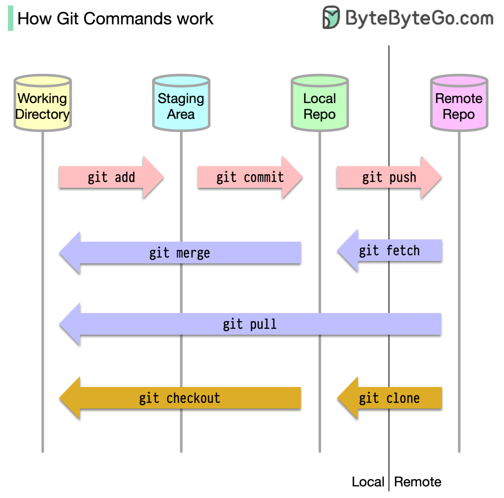](https://bytebytego.com/guides/how-does-git-work/)

Kita bahas satu persatu...

Seperti terlihat pada gambar, secara umum, wilayah `git` dibagi menjadi 2: **remote** & **local**. 
1. "Remote repository" adalah server yang meng-_hosting_ atau menyimpan file-file proyek kita di _remote server_, seperti  Github,  Gitlab, dan  BitBucket.
2. "Local computer" adalah komputer atau laptop yang kita gunakan untuk mengelola file-file tersebut sebelum disimpan ke _remote repository_. Pada bagian ini, `git` membagi 3 wilayah lagi, yaitu **working directory**, **staging area**, dan **local repository** ini sendiri.    
- "Working directory" adalah area dimana kita dapat meng-_edit_ file kita.  
- "Staging area" adalah sebuah area sementara (_temporary location_) sebelum di-_commit_ & masih memungkinkan perubahan.  
- "Local repository" adalah area penyimpanan permanen dari file-file yang telah di-_commit_, juga sebagai area git untuk menyimpan riwayat perubahan proyek, dan area dimana file-file siap di-_push_ ke _remote server_.

:::info

Kita juga melihat beberapa perintah `git` yang ada dalam setiap proses pada gambar tersebut.  
Berikut adalah perintah-perintah ketika kita 

- `git add`: menyimpan file yang sudah selesai diedit ke "staging area".  
- `git commit`: memindahkan file dari "staging area" ke "local repository".  
- `git push`: menyimpan file ke remote server, seperti Github.  

Kemudian, ada 3 perintah lainnya: 

- `git fetch`: menarik perubahan dari "remote repository" ke "local repo".  
- `git merge`: menggabungkan perubahan yang sudah ditarik ke file yang kita miliki di "working directory".  
- `git pull`: gabungan dari kedua perintah di atas.  

Dan ada 2 perintah lainnya:

- `git clone`: meng-_clone_ mengambil suatu repo dari server hosting.  
- `git checkout`: pindah branch, pindah ke titik tertentu di history, etc.

:::

Kita akan melihat implementasi dari `git` sambil melihat workflow di atas secara langsung di bagian berikutnya.[^5]

### Practical Git on Github

Sekarang, kita akan coba lihat implementasi langsung dari _workflow_ dan perintah-perintah `git` tersebut. Pada tutorial ini, saya akan menggunakan **"Github"** sebagai server untuk meng-_hosting_ file-filenya. Jika kalian ingin mempraktekkannya juga, tentu saja bisa, dengan beberapa persyaratan berikut:

1. Memiliki akun Github.
2. Sudah mengaktifkan koneksi via SSH ke Github.
3. Sudah membuat sebuah repository khusus untuk latihan.

Ketiga syarat di atas adalah modal dasar untuk dapat mengikuti latihan atau toturial implementasi `git` ini, sebab, ketiga hal tersebut tidak akan dibahas dalam artikel ini.

#### 1. `git clone`

Sekarang, saya akan mempraktikkan perintah dasar `git` tersebut, yaitu:

- `git clone`

Perhatikan bahwa saya sudah memiliki sebuah _repository_ di Github bernama "git-test", yang hanya berisi sebuah file markdown bernama README.md.

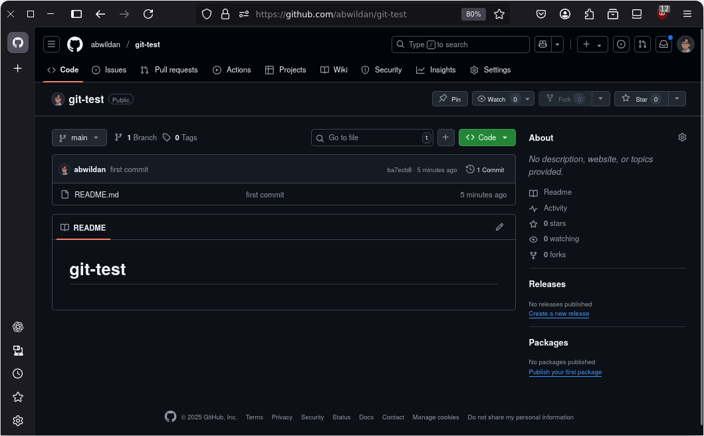

Saya akan meng-_clone_ "remote repository" dari Github tersebut ke "local computer" saya, dengan perintah berikut di terminal:

```shell
git clone git@github.com:abwildan/git-test.git
```

:::note

**Keterangan:**

`git@github.com:abwildan/git-test.git` adalah alamat repository "git-test" saya di github untuk keperluan akses via SSH (Secure Shell). Kalian bisa mendapatkan alamat repo kalian sendiri di bagian **"code"** pada menu **"SSH"**.

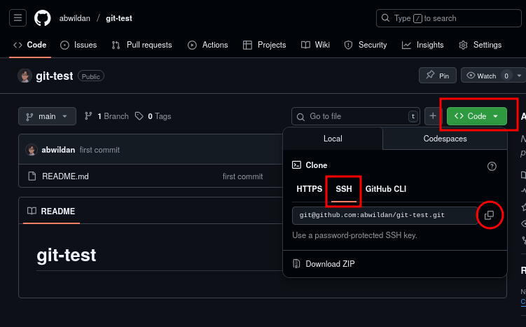

:::

Kita akan melihat, sekarang, _repository_ tersebut sudah berada di komputer kita.

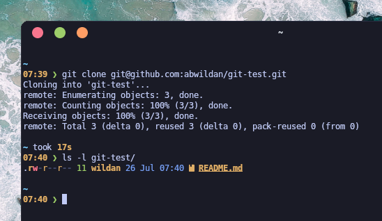

Seperti terlihat pada tangkapan layar di atas, kita sudah memiliki _repository_ (folder/direktori) bernama "git-test" di dalam komputer, dengan isi file yang sama, yaitu "README.md".

Jadi, jelas, bahwa fungsi perintah `git clone` adalah untuk meng-`clone` _repository_ dari remote server seperti Github ke komputer lokal kita. Atau bahasa umumnya kurang lebih sama dengan "men-_download_ folder dari Github ke komputer kita".

#### 2. `git add`, `git commit`, `git push`

Sekarang, kita akan belajar 3 perintah berikutnya, yaitu:

- `git add`  
- `git commit`   
- `git push`  

Perhatikan alur perintah pada gambar berikut ini:

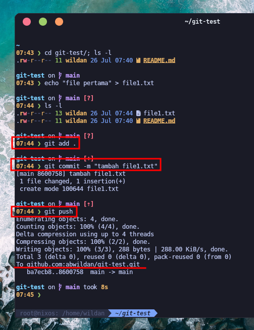

```shell
git add .
```

```shell
git commit -m "tambah file1.txt"
```

```shell
git push
```

:::note

**Keterangan:**

Tempat-tempat seperti **staging area**, **local repository**, dan **remote repository** mungkin memang tidak kasat mata, tapi dalam manajemen file oleh `git`, hal tersebut ada di "balik layar". 

1. `git add .`: menambahkan semua file / perubahan baru yang ada di working directory ke **staging area**.  
2. `git commit -m "tambah file1.txt"`: memindahkan file ke **local repository** dan memberikan pesan _commit_-nya.  
3. `git push`: mendorong (meng-_upload_) perubahan yang ada di local repo dan sudah di-_commit_ ke **remote repository** di Github.

:::

Seperti kita lihat pada gambar, perintah `git add` digunakan untuk menambahkan file baru ("file1.txt") ke **staging area**, kemudian, perintah `git commit` digunakan untuk memindahkan "file1.txt" dari staging area ke **local repository**, dan perintah `git push` digunakan untuk meng-_upload_-nya ke **remote repository** di remote server (Github).

Kita juga dapat memastikan bahwa "file1.txt" ada di _repository_ "git-test" di Github dengan melihatnya langsung.

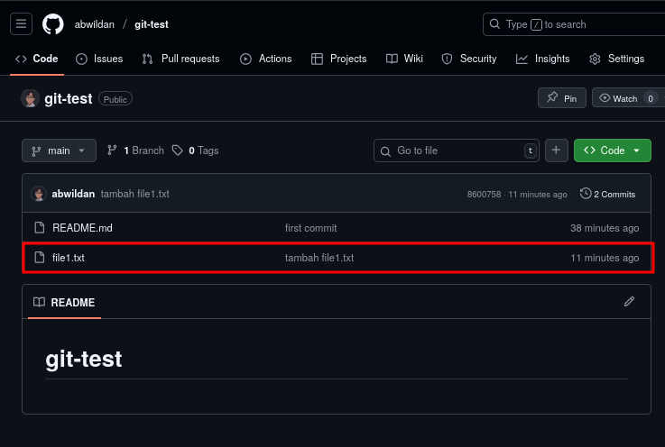

#### 3. `git fetch`, `git merge`, `git pull`

Dua perintah berikutnya adalah:

- `git fetch`  
- `git merge`

Seperti sudah dijelaskan pada bagian "konsep" sebelumnya, `git fetch` digunakan untuk menarik perubahan dari remote repository (dalam konteks ini Github) ke **local repository**, sementara `git merge` digunakan untuk menggabungkan perubahan yang sudah di local repository ke **working directory**. 

Perlu diperhatikan bahwa kita memerlukan `git merge` agar perubahan-perubahan dari remote repository tersebut dapat kita edit, sebab perintah `git fetch` hanya menarik perubahan-perubahannya saja dan menyimpannya ke local repository, dimana di sana adalah area penyimpanan permanen yang file-file atau perubahan-perubahannya sudah tidak dapat diubah lagi. Kita akan coba lihat dan buktikan di praktik di bawah.

Untuk membuat simulasi ini, anggap bahwa di remote repository, ada penambahan file baru bernama file2.txt, namun, di local computer, kita belum memiliki file ini sehingga kita perlu menariknya terlebih dahulu.

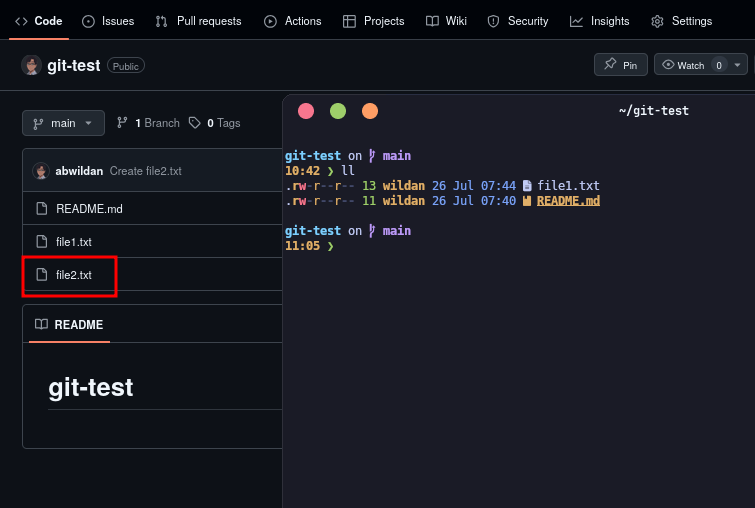

Sekarang, untuk menarik perubahannya, gunakan perintah:

```shell
git fetch
```

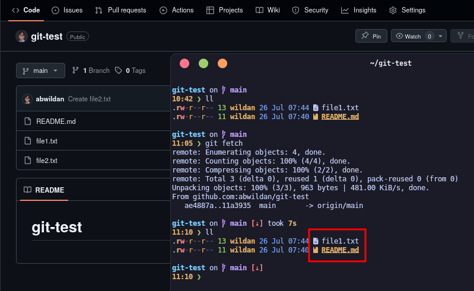

Seperti terlihat, "file2.txt" berhasil di-fetch, tapi masih belum muncul di working directory. Itu artinya, "file2.txt" belum di-merge sehingga belum bisa di-edit atau diubah-ubah. Gunakan perintah berikut untuk me-merge:

```shell
git merge
```

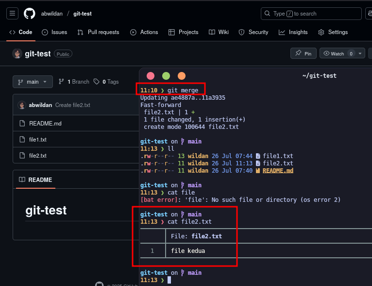

Seperti terlihat pada gambar, sekarang, "file2.txt" sudah berada di **working directory** dan siap untuk di-edit atau dimodifikasi.

- `git pull`  

`git pull` adalah gabungan antara `git fetch` dan `git merge`, sehingga jika kita ingin agar semua perubahan di remote repository yang ditarik ke local computer bisa langsung di-edit, kita dapat menggunakan perintah ini:

```shell
git pull
```

Perhatikan gambar berikut:

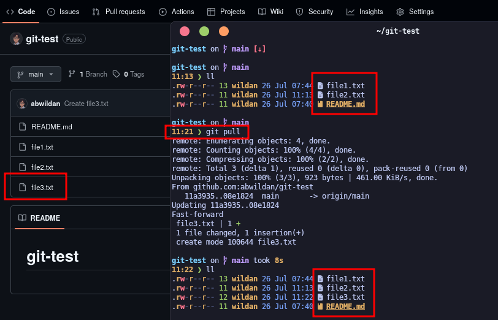

Seperti terlihat pada tangkapan layar di atas, perintah git pull mengambil perubahan (file3.txt) dari remote repository (Github) langsung ke working directory tanpa harus mampir di local repository terlebih dahulu, sehingga "file3.txt" dapat langsung di-edit.

#### 4. `git branch`, `git checkout`

Selanjutnya, kita akan belajar 2 perintah `git` lainnya, yaitu:

- `git branch`  
- `git checkout`  

`git checkout` seperti yang sudah dideskripsikan di bagian "konsep" di atas, biasanya digunakan untuk berganti branch. Oleh karena itu, saya menyandingkannya dengan perintah `git branch` yang digunakan untuk melihat branch yang ada. `git branch` memang belum di bahas pada bagian "konsep" sebelumnya, tapi tidak mengapa saya bahas di sini, karena memang terkait dengan penggunaan `git checkout`...

Untuk melihat branch apa saja yang tersedia, ada 3 perintah `git branch` yang dapat digunakan, yaitu:

```shell
git branch -l
```

```shell
git branch -r
```

```shell
git branch -a
```

:::note

**Keterangan:**

1. `git branch -l`: digunakan untuk melihat branch yang ada di local computer.  
2. `git branch -r`: digunakan untuk melihat branch yang ada di remote repository.
3. `git branch -a`: digunakan untuk melihat semua branch, baik di local computer maupun di remote repository.

:::

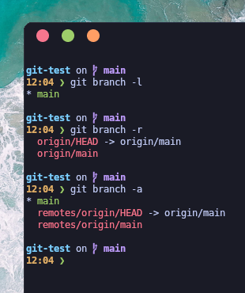

Seperti terlihat, saat ini, di local computer saya, hanya ada 1 branch, yaitu branch "main" dan ada 2 branch di remote repository.

Jika kita ingin membuat branch baru di local computer, kita dapat menggunakan perintah:

```shell
git branch <nama-branch>
```

Kemudian, untuk pindah ke branch yang baru:

```shell
git switch <nama-branch>
```

Atau dengan `git checkout` yang lebih cepat karena setelah membuatkan branch baru, kita juga otomatis akan berpindah ke branch yang baru tersebut, perintahnya:

```shell
git checkout -b <nama-branch>
```

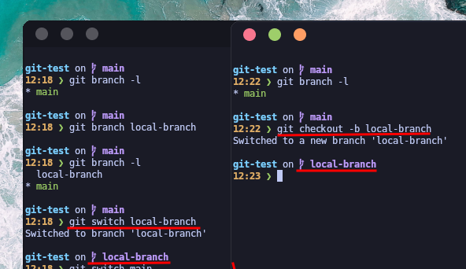

Jika kita ingin agar branch tersebut juga ada di remote repository (Github), gunakan perintah:

```shell
git push -u origin <nama-branch>
```

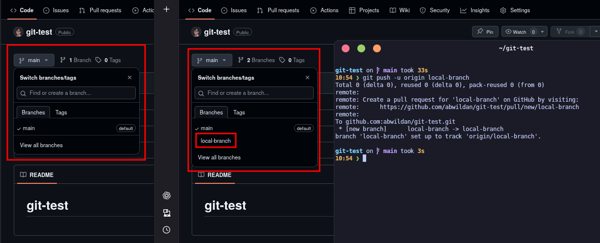

Menghapus branch juga semudah membuatnya, tergantung branch local atau remote yang ingin dihapus.

Berikut adalah perintah untuk menghapus branch local:

```shell
git branch -d <nama-branch>
```

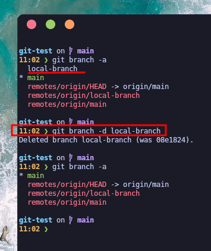

Berikut adalah perintah untuk menghapus branch remote:

```shell
git push origin --delete <nama-branch>
```

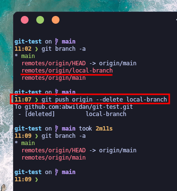

#### 5. `git status`

`git status` adalah perintah yang sederhana, tapi cukup informatif. Dengan perintah ini, kita dapat mengetahui apakah ada perubahan di direktori/folder proyek `git` kita. Bahkan perpindahan file dari "working directory" ke "staging area", misalnya, juga dapat dilihat via:

```shell
git status
```

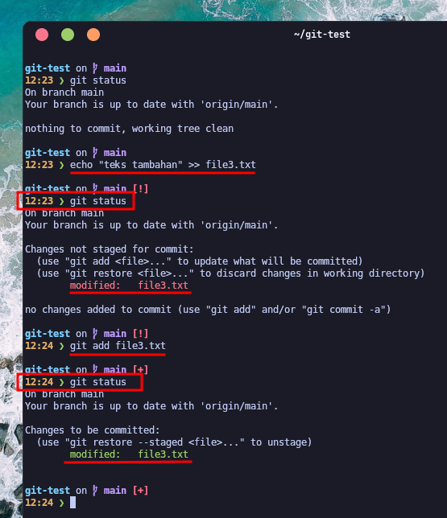

Seperti terlihat pada gambar, setelah saya menambahkan "teks tambahan" ke "file3.txt", `git status` mendeteksi adanya perubahan tersebut. Begitupula ketika saya menambahkan "file3.txt" ke "staging area", `git status` juga mendeteksi perubahan tersebut.


## What is Lazygit?

Baiklah, sekarang, kita akan berpindah ke `lazygit`. Pertanyaan awalnya selalu tentang "apa", "apa itu `lazygit`"? Sederhana sekali, `lazygit` adalah **"a simple terminal UI for git commands"**. Ya, jadi, bisa dibilang, `lazygit` adalah program _open source_ berbasis terminal yang dirancang sebagai UI alias _user interface_ dari perintah-perintah `git` yang baru saja kita pelajari di atas.

Repository-nya dapat ditemukan di Github:


::github{repo="jesseduffield/lazygit"}

Atau website official `lazygit` di: https://lazygit.dev/

Apa tujuan dibuatnya `lazygit`? Apa bedanya `lazygit` dengan `git` biasa?

Secara fungsi, sebetulnya sama. Bedanya, `lazygit` dibuat untuk lebih memudahkan para pengguna `git` dalam menggunakan `git`, sebab, mereka tidak perlu lagi menuliskan perintah-perintah (yang banyak tersebut) berulang kali sehingga proses pengelolaan file via `git` menjadi lebih efisien. 

Kenapa bisa lebih efisien? Karena lazygit tidak mengharuskan penggunanya "menghafal" perintah-perintah git, tapi cukup hanya dengan beberapa _shortcut_ (atau _keybinding_) saja, maka berbagai perintah `git` tersebut dapat dieksekusi dengan cepat (tentu juga harus diimbangi dengan pemahaman pada konsep `git`.)

### Installation

Berikut adalah cara meng-_install_ `lazygit` di beberapa sistem operasi Linux:

|       Distro      |                  Command                           |
|       ---         |                   ---                              |
| **Debian/Ubuntu** | **`sudo apt install lazygit`**                         |
| **Arch Linux**    | **`sudo pacman -Sy lazygit`**                          |
| **Fedora**        | **`sudo dnf install lazygit`**                         |
| **Opensuse**      | **`sudo zypper install lazygit`**                      |

:::note

**NixOS:**  
Masukkan baris berikut di file konfigurasi (`/etc/nixos/configuration.nix`):

```nix
  environment.systemPackages = [
    pkgs.lazygit
  ];
```

Atau jika menggunakan `nix-shell`:

```shell
nix-shell -p lazygit
```

:::

### `lazygit` UI

Mari kita lihat langsung tampilannya:

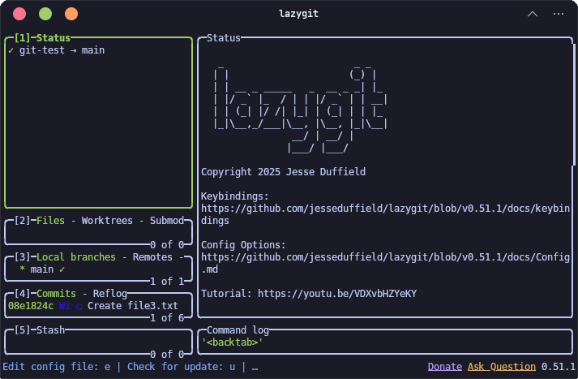

Seperti terlihat, ada 7 area di sana:

1. Area nomor 1: menampilkan informasi posisi _repository_ kita saat ini.
2. Area nomor 2: menampilkan informasi tentang perubahan file-file.
3. Area nomor 3: menampilkan informasi tentang local branch.
4. Area nomor 4: menampilkan informasi tentang _commit_ yang pernah dilakukan.
5. Area nomor 5: menampilkan informasi tentang _stash_ yang pernah dilakukan.
6. Area utama (yang paling besar): menampilkan informasi dari branch, file, commit, dan stash.
7. Area log (di bawah area utama): menampilkan informasi tentang log.

Kita akan melihat langsung cara menggunakan `lazygit` di bawah ini.

### How to Use It?

Tutorial `lazygit` sebetulnya sudah disediakan langsung oleh pembuat `lazygit` langsung, **Jesse Duffield** di Youtube:

<iframe width="100%" height="468"
  src="https://www.youtube.com/embed/CPLdltN7wgE"
  title="How to Install Windows Vista + Aero on VMWare"
  frameborder="0" allowfullscreen>
</iframe>

Hanya saja, mungkin terlalu kompleks. Lagipula, bisa jadi tidak semua fitur dan _shortcut_ (atau _keybinding_)-nya kalian perlukan saat ini. Semua tergantung keperluan. Tapi, mari saya buat lebih sederhana. Saya hanya akan mempraktikkan cara menggunakan `lazygit` berdasarkan apa yang memang sudah biasa saya lakukan.

_So, let's get into it_...

> **Sebagai catatan**, `lazygit` sampai versi terbaru yang saya gunakan hari ini, belum bisa melakukan _cloning_ repo (`git clone`). 

#### 1. `git add`, `git commit`, `git push`

Langsung saja, karena operasi git di `lazygit` akan lebih banyak menggunakan _shortcut_ (alias _keybinding_) daripada mengetikkan perintah, berikut adalah keybinding untuk `git add`, `git commit`, dan `git push`. [^6]

|     Keybinding        |     Deskripsi     |
|:---:                  |:---:              |
| <<Space>>             | `git add`         |
| c                     | `git commit`      |
| P                     | git push          |

> **Perhatikan!** Case-sensitive!

<video width="100%" controls autoplay loop muted>
  <source src="../images/git/vid1.mp4" type="video/mp4">
</video>

Perhatikan bahwa ketika file masih di "working directory", status file-nya berwarna merah, begitu masuk "staging area", berubah jadi hijau, dan kalau sudah di-_commit_, maka statusnya akan hilang dari sub-tab ke-2, dan jika sudah berhasil di-_push_ ke "remote repository", maka status di sub-tab ke-3 juga akan kembali menjadi ceklis.

Perhatikan juga bahwa ketika sedang proses _push_ ke "remote repository", status di sub-tab ke-3 juga akan memberikan indikasi sedang melakukan _push_.

Kita juga bisa melihat _history_ _commit_-nya di sub-tab ke-4.

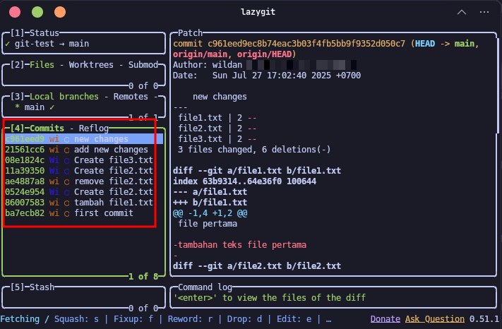

#### 2. `git pull`

Untuk menarik atau mengambil perubahan yang terjadi di "remote server" dan menggabungkannya langsung ke "working directory", _keybinding_-nya adalah sebagai berikut:

|     Keybinding        |     Deskripsi     |
|:---:                  |:---:              |
| p                     | `git pull`        |

> **Perhatikan!** Case-sensitive!

<video width="100%" controls autoplay loop muted>
  <source src="../images/git/vid2.mp4" type="video/mp4">
</video>

Perhatikan bahwa ketika sedang proses _pull_ dari "remote repository" ke "working directory", status di sub-tab ke-3 juga akan memberikan indikasi sedang melakukan _pull_.

#### 3. `git branch`

Kita juga bisa melihat branch (terutama local branch) apa saja yang terdapat di proyek `git` kita di sub-tab ke-3.

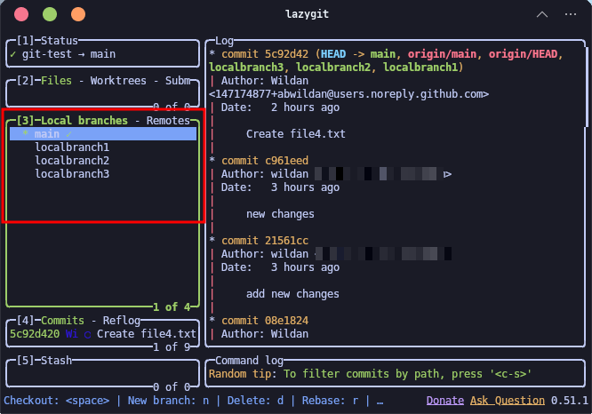

Seperti terlihat, selain branch "main", kita juga punya "localbranch1", "localbranch2", dan "localbranch3".

#### 4. `git status`

`git status` adalah yang paling mudah dilihat, karena sebetulnya langsung tampak di bagian utama `lazygit` (area yang paling besar).

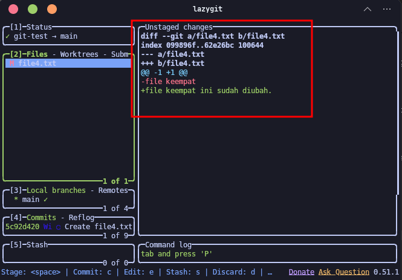

Seperti terlihat, jika ada perubahan, maka area utama `lazygit` akan memberikan informasi perubahan tersebut, sama seperti `git status`. Bahkan, lebih detail karena menampilkan juga perubahan apa yang ditambahkan/dikurangi.


[^1]: https://git-scm.com/
[^2]: https://www.w3schools.com../images/git/git_intro.asp?remote=github
[^3]: https://www.codepolitan.com/blog/apa-itu-git-panduan-lengkap-untuk-pemula-pengertian-fungsi-dan-cara-kerjanya/
[^4]: https://bytebytego.com/guides/how-does-git-work/
[^5]: https://dev.to/nopenoshishi/understanding-git-through-images-4an1
[^6]: https://bandithijo.dev/blog/lazygit-terminal-user-interface-untuk-git
