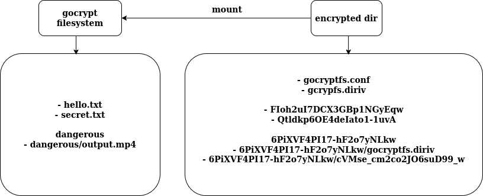
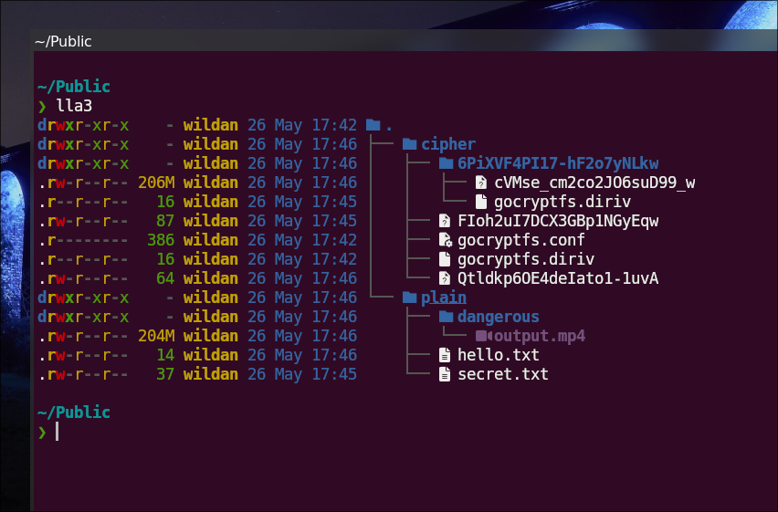
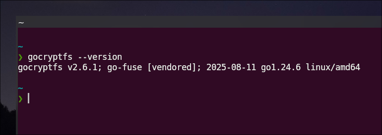
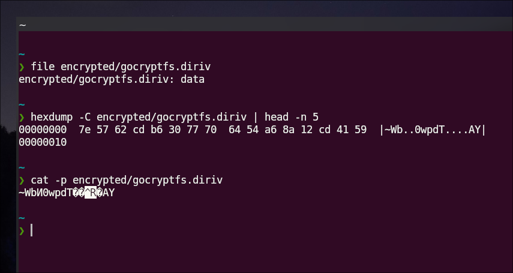
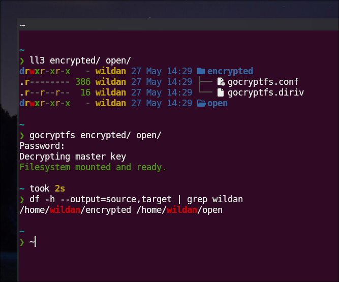
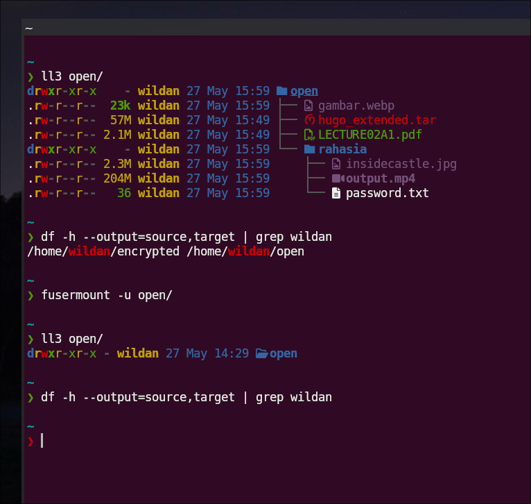
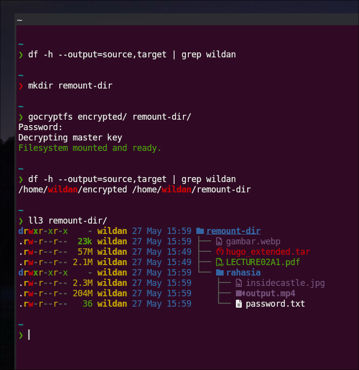
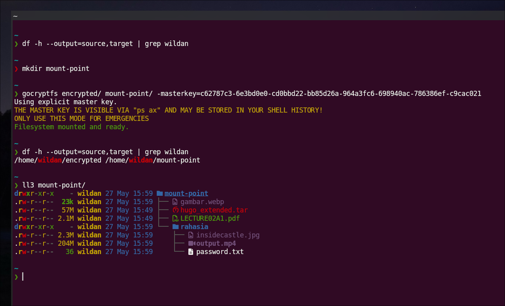
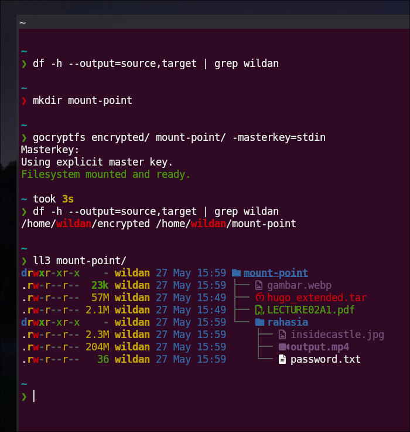

## Preambul

Beberapa saat lalu, saya membayangkan untuk punya alat digital yang dapat mengenkripsi file dan folder saya di komputer. Kemudian, saya coba cari di Google untuk memenuhi rasa penasaran tersebut. Ternyata, terdapat beberapa tools yang dapat saya gunakan untuk keperluan tersebut, salah satunya adalah `gocryptfs`.

`gocryptfs` adalah tool enkripsi berbasis file yang ditulis dengan bahasa pemrograman [Go](https://go.dev/)[^1]. Berbeda dengan `cryptsetup` yang digunakan untuk mengenkripsi drive atau partisi, `gocryptfs` adalah _tool_ yang dapat digunakan untuk mengenkripsi filesystem biasa di userspace ([FUSE](https://www.kernel.org/doc/html/next/filesystems/fuse.html)) yang juga dapat di-_mount_ (_mountable_). Artinya, tool ini sangat cocok digunakan untuk mengenkripsi file-file yang ada di dalam folder manapun, baik di hardisk/SSD, di USB stick (_flashdrive_/_flashdisk_), bahkan remote filesystem seperti Dropbox.

> Saya sempat menulis cara menggunakan `cryptsetup` untuk meng-enkripsi drive atau partisi:
>  

Berikut adalah website resmi `gocryptfs` dan repository Github-nya:

Website: https://nuetzlich.net/gocryptfs/

::github{repo="rfjakob/gocryptfs"}

### `gocryptfs` vs Other Tools

Berikut adalah perbedaan utama antara `cryptsetup` dengan `gocryptfs`[^2]: 

| Fitur                   | cryptsetup/LUKS | gocryptfs            |
| ----------------------- | --------------- | -------------------- |
| Level                   | Block device    | File/folder          |
| Encrypt seluruh disk    | Ya              | Tidak                |
| Encrypt folder tertentu | Kurang cocok    | Sangat cocok         |
| Cocok untuk cloud sync  | Tidak           | Ya                   |
| Metadata tersembunyi    | Sangat baik     | Sebagian             |
| Bisa boot OS            | Ya              | Tidak                |
| Performa                | Lebih cepat     | Sedikit lebih lambat |
| Teknologi               | dm-crypt kernel | FUSE userspace       |

:::info

Untuk perbandingan lebih lanjut, bisa merujuk ke tautan berikut:  
https://wiki.archlinux.org/title/Data-at-rest_encryption#Comparison_table

:::

Selain itu, `gocryptfs` sendiri sudah membuat perbandingan dengan beberapa _tools_ enkripsi lainnya:[^3]

| Category                | gocryptfs v1.7                                                                  | encfs v1.9.5                         | ecryptfs v4.19.0                     | cryptomator v1.4.6    | securefs v0.8.3       | CryFS v0.10.0                        |
| ----------------------- | ------------------------------------------------------------------------------- | ------------------------------------ | ------------------------------------ | --------------------- | --------------------- | ------------------------------------ |
| First release           | 2015                                                                            | 2003                                 | 2006                                 | 2014                  | 2015                  | 2015                                 |
| Language                | Go                                                                              | C++                                  | C                                    | Java                  | C++                   | C++                                  |
| License                 | MIT                                                                             | LGPLv3 / GPLv3                       | GPLv2                                | GPLv3                 | MIT                   | LGPLv3                               |
| Development hotspot     | Austria                                                                         | USA                                  | USA (RedHat)                         | Germany               | China                 | Germany                              |
| Lifecycle               | Active                                                                          | Maintenance                          | Active                               | Active                | Active                | Active                               |
| File interface          | FUSE                                                                            | FUSE                                 | In-kernel filesystem                 | FUSE/WebDAV           | FUSE                  | FUSE                                 |
| Platforms               | Linux, MacOS, 3rd-party Windows port cppcryptfs, 3rd-party Android port DroidFS | Linux, MacOS, 3rd-party Windows port | Linux                                | Linux, MacOS, Windows | Linux, MacOS, Windows | Linux, MacOS, Windows (experimental) |
| User interface          | CLI, 3rd-party GUI (SiriKali)                                                   | CLI, 3rd-party GUI                   | Integrated in login process          | GUI, 3rd-party CLI    | CLI, 3rd-party GUI    | CLI, 3rd-party GUI (SiriKali)        |
| Reverse Mode            | Yes (since v1.1, read-only)                                                     | Yes (limited write support)          | No                                   | No                    | No                    | No                                   |
| Documentation available | Yes                                                                          | Yes                               | No                                | Yes                | Yes                | Yes                               |
| Password hashing        | scrypt                                                                          | PBKDF2                               | (none, implemented in external tool) | scrypt                | PBKDF2                | scrypt                               |


### How It Works

Kira-kira, beginilah diagram kerja `gocryptfs` dari sudut pandang penggunanya:



Bentuk nyatanya di komputer saya:



Kira-kira, beginilah cara kerjanya:[^5]

1. Ketika pertama kali menginisialisasi _encrypted directory_ (direktori terenkripsi), kita akan diminta memasukkan password.
2. Setelah berhasil meng-_input_-kan password, kita akan mendapatkan **master key** (berisi 64 digit karakter angka dan huruf random) alias KEK (_Key Encryption Key_).
3. `gocryptfs` akan men-_generate_ 2 file penting di dalam _encrypted directory_ yang barusan kita inisialisasi:
- `gocryptfs.conf`: berisi encrypted master key, salt (untuk password _hashing_), parameter [scrypt](https://en.wikipedia.org/wiki/Scrypt), dan beberapa hal lain.
- `gocryptfs.diriv`: file binary yang digunakan untuk mendekripsi nama file di satu direktori. Oleh karena itu, file ini akan ada di setiap sub-direktori di dalam _encrypted directory_.

Oleh karena itu, ke-empat hal tersebut (password, **master key**/KEK, `gocryptfs.conf`, dan `gocryptfs.diriv`) sangat penting sehingga harus dipastikan tidak hilang atau lupa. 

Jika kita lupa password, file dan direktori masih dapat dideskripsi dengan **master key**/KEK, tapi jika **master key** juga hilang, maka file dan direktori tidak dapat didekripsi. File `gocryptfs.conf` juga penting karena menyimpan informasi mengenai metadata utama filesystem. Jika itu hilang, secara praktis, sudah hampir mustahil untuk _recovery_-nya, meskipun kita ingat password dan **master key**. `gocryptfs.diriv` diperlukan untuk mendekripsi nama file, jadi, kehilangan file tersebut berarti kita tidak dapat mendekripsi nama file yang ada di direktori tersebut. 

## Installation

Berikut adalah cara instalasinya di beberapa distro linux:[^4]

|       Distro      |                  Command                    |
|       ---         |                   ---                       |
| **Debian/Ubuntu** | **`sudo apt install -y gocryptfs`**         |
| **Arch Linux**    | **`sudo pacman -Sy gocryptfs`**             |
| **Fedora**        | **`sudo dnf install gocryptfs`**            |
| **Opensuse**      | **`sudo zypper install gocryptfs`**         |

:::note

**NixOS:**  
Masukkan baris berikut di file konfigurasi (`/etc/nixos/configuration.nix`):

```nix
  environment.systemPackages = [
    pkgs.gocryptfs
  ];
```

Atau jika menggunakan `nix-shell`:

```shell
nix-shell -p gocryptfs
```

:::

Untuk memastikan gocryptfs sudah ter-install, kita bisa cek versinya dengan perintah:

```shell
gocryptfs --version
```



## Usage

Berikut adalah cara menggunakannya:

### 1. Create dirs

Buat 2 direktori utama:
1. Direktori untuk menyimpan file normal
2. Direktori untuk menyimpan file yang terenkripsi

```shell
mkdir encrypted open
```

### 2. Initialize dir

Inisialisasi direktori yang sudah ditentukan untuk menyimpan file yang terenkripsi.

```shell
gocryptfs -init encrypted
```


:::note

**Reminder!**

Setelah selesai menginisialisasi direktori, kita akan diminta untuk meng-_input_-kan password. Setelah itu, `gocryptfs` juga akan men-_generate_ **master key** (seperti "private key" dalam konsep _asymmetric encryption_). Pastikan kita menyimpan **master key** tersebut, karena **master key** tersebut tidak akan dapat didapatkan lagi dan akan berguna untuk membuka file dan direktori terenkripsi kita, terutama jika kita lupa password.

:::

Perhatikan bahwa, di dalam direktori yang sudah kita inisialisasi (`encrypted/`), ter-generate 2 file: 
- `gocrptfs.conf`
- `goctypfs.diriv`

Berikut adalah isi file `gocryptfs.conf`:

```json title="gocryptfs.conf"
{
    "Creator": "gocryptfs v2.6.1",
    "EncryptedKey": "9ajKdvNPrr6+mqCxzGSWgGAF3zYT5Yn4FIJ/pmvprkMt3crLrKeG3Ktsk0FwMJRLjEtjjaH694l4nGObtUWh6Q==",
    "ScryptObject": {
        "Salt": "TFhGHlNzjrH1xvn82VsxuAzlGh20AZDFYb20EA4dvHw=",
        "N": 65536,
        "R": 8,
        "P": 1,
        "KeyLen": 32
    },
    "Version": 2,
    "FeatureFlags": [
        "HKDF",
        "GCMIV128",
        "DirIV",
        "EMENames",
        "LongNames",
        "Raw64"
    ]
}
```

Adapun file `gocryptfs.diriv` sendiri adalah file _binary_:



### 3. Mounting 

Berikutnya, kita perlu me-_mounting_ direktori yang sudah diinisialisasi tadi (`encrypted/`) ke direktori filesystem (`open/`):

```shell
gocryptfs encrypted/ open/
```

Nanti kita akan diminta memasukkan password yang sudah kita buat sebelumnya, tinggal di-_input_-kan saja.



### 4. Adding files

Sekarang, kita sudah bisa menambahkan file dan direktori di dalam direktori `open/`.

:::note

**Perhatikan!**

Direktori yang kita isi dengan file atau sub-direktori yang ingin dienkripsi adalah direktori yang tidak kita inisialisasi ya. Intinya, direktori yang di dalamnya ada 2 file "spesial" tadi, tidak perlu kita apa-apakan. Jadi, yang diisi/dihapus/diubah adalah direktori yang bebas kedua file "spesial" tersebut (dalam hal ini adalah direktori `open/`).

:::

Berikut demonstrasi menambahkan dan menghapus file dan direktori/folder.

<iframe
  src="https://player.cloudinary.com/embed/?cloud_name=dpvtbnqf7&public_id=vid1_ytdjig"
  width="640"
  height="360" 
  style="height: auto; width: 100%; aspect-ratio: 640 / 360;"
  allow="autoplay; fullscreen; encrypted-media; picture-in-picture"
  allowfullscreen
  frameborder="0"
></iframe>

Perhatikan!  

File dan direktori/folder yang kita tambahkan ke direktori `open/` akan otomatis terenkripsi di file `encrypted/`, tidak hanya isi filenya saja yang dienkripsi, tetapi juga nama filenya. Selain itu, ketika kita menambahkan sub-direktori/sub-folder di direktori `open/`, maka direktori `encrypted/` juga akan otomatis men-_generate_ file **`.diriv`** di dalamnya.

### 5. Umounting

Jika sudah selesai, kita bisa meng-`umount` direktori filesystem tersebut (`open/`) dengan perintah:

```shell
fusermount -u open
```



Karena direktori `open/` hanya digunakan sebagai "mount point" untuk `encrypted/`, maka ketika sudah di-`umount`, direktori tersebut akan kembali seperti semula (kosong). Bahkan, kita dapat menghapusnya juga. 

Yang tersisa hanyalah direktori `encrypted/` yang semua file dan sub-direktorinya sudah terenkripsi, baik isinya maupun namanya. Tidak ada orang yang bisa mengetahui isi file-file tersebut (bahkan nama asli file-file-nya juga), kecuali mereka tau password-nya.

### 6. Re-mounting

Sama seperti proses _mounting_ sebelumnya, kita hanya perlu sebuah direktori kosong sebagai "mount point". Kemudian, untuk me-mounting, kita gunakan perintah yang sama.

```shell
mkdir newdir
gocryptfs encrypted/ newdir/
```



### 7. Master Key

Jika kita lupa password, maka selagi masih memiliki **master key**, masih ada jalan untuk mendekripsi direktori dan file-file tersebut. Oleh karena itu, **master key** perlu dijaga dengan baik, sebab, jika kita lupa password dan **master key**-nya juga hilang, maka tamatlah riwayat kita, karena file-file dan direktori terenkripsi itu sudah tidak ada harapan lagi untuk bisa didekripsi. 

Berikut adalah cara membuka (mendekripsi) menggunakan **master key**:

```shell
gocryptfs encrypted <mountpoint_dir> -masterkey=<64 digit master key> 
```



Tapi, jika kita langsung meng-_input_-kan **master key**-nya langsung seperti itu, maka **master key** tersebut bisa saja dibaca via `ps ax` dan tersimpan di history shell. Oleh karena itu, ada cara yang lebih aman dan _private_ untuk meng-input-kan **master key**, yaitu via **`stdin`** sebagai berikut: 

```shell
gocryptfs encrypted <mountpoint_dir> -masterkey=stdin
```

Kemudian, nanti akan ada prompt yang meminta _input_ **master key**, tinggal di-_input_-kan.



Demikian.  
Terima kasih sudah mampir.  
Boleh tinggalkan komentar jika ada saran dan kritik ya!


[^1]: https://nuetzlich.net../images/gocryptfs/
[^2]: https://chatgpt.com
[^3]: https://nuetzlich.net../images/gocryptfs/comparison/
[^4]: https://nuetzlich.net../images/gocryptfs/quickstart/
[^5]: https://nuetzlich.net../images/gocryptfs/forward_mode_crypto/