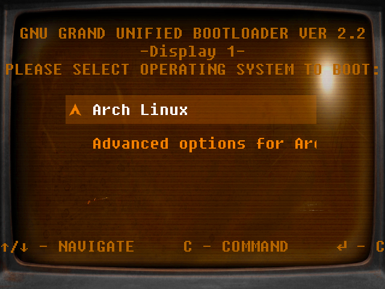
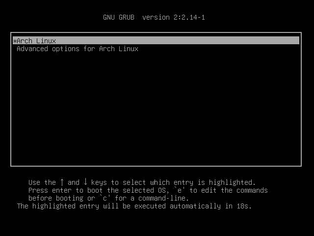

## What are you, GRUB?

**GRUB (_Grand Unified Bootloader_)** pada dasarnya adalah sebuah bootloader.[^1] _Bootloader_ adalah sebuah program atau _software_ kecil yang akan dijalankan ketika komputer kita dihidupkan. Program tersebut bertanggung jawab untuk memulai [kernel](https://wiki.archlinux.org/title/Kernel) dari sistem operasi kita. Sederhananya, GRUB adalah program pertama yang muncul untuk menampilkan daftar sistem operasi yang dapat kita pilih.[^2] Oleh karena itu, GRUB sangat penting, sebab, tanpa GRUB, kita tidak bisa me-_load_ sistem operasi.

Saat artikel ini dibuat, GRUB yang terpasang di [ArchLinux](https://archlinux.org/) saya adalah GRUB versi 2. Ini adalah versi terbaru GRUB. Untuk mengecek versi GRUB di sistem operasi linux kita, gunakan perintah:

```shell
grub-install --version
```

Sebagai gambaran, berikut adalah default GRUB archlinux:


> **Note:**
> Jika ada sistem operasi lain yang ter-_install_, maka juga akan muncul di menu GRUB ini.

Nah, di artikel ini, saya akan berbagi 3 hal yang dapat kita lakukan pada bagian konfigurasi GRUB di ArchLinux, yaitu mengganti tema, mengubah timeout, dan menampilkan sistem sistem operasi lain.

Sebelum mulai, kita hanya perlu tahu satu hal, yaitu bahwa kita hanya akan "mengutak-atik" satu file konfigurasi saja untuk melakukan ketiganya di:

```shell
/etc/default/grub
```

## 1. GRUB's Theme

Tema default GRUB ArchLinux adalah seperti _screenshot_ yang saya bagikan sebelumnya. Berlatar belakang warna hitam polos dengan kotak putih yang ada di dalamnya. Kita dapat mengganti tampilan tema GRUB tersebut dengan cara:

1. Cari tema yang ingin kita pasang di Internet.  
- [**Github - Gorgeous GRUB**](https://github.com/Jacksaur/Gorgeous-GRUB)  
- [**Opendesktop - GRUB Themes**](https://www.opendesktop.org/browse?cat=109&page=1&ord=top)  
2. Download & extract file tema-nya ke direktori `/usr/share../images/grub/themes`.
3. Edit file konfigurasi GRUB, _uncomment_ serta isi parameter "**GRUB_THEME**" dengan file **`theme.txt`** yang terdapat di direktori `/usr/share../images/grub/themes/nama-tema/` sebelumnya.

Kemudian, jalankan perintah berikut untuk men-_generate_ ulang file konfigurasi GRUB-nya.

```shell
sudo grub-mkconfig -o /boot../images/grub/grub.cfg
```

Berikut adalah tema GRUB yang berhasil saya pasang di VM (_Virtual Machine_) ArchLinux saya:



> Maklum, tampilan tidak bagus karena ArchLinux dijalankan di VM.

## 2. Timeout

Selain mengganti tema, kita juga bisa mengkonfigurasi durasi ***timeout***-nya. Secara default, timeout tampilan GRUB di ArchLinux adalah 5 detik. Jika kita ingin mempercepat atau memperlambatnya, caranya:

1. Edit file konfigurasi GRUB dan ganti parameter "**GRUB_TIMEOUT**" dengan jumlah detik yang kita inginkan.

Kemudian, jalankan perintah berikut untuk men-_generate_ ulang file konfigurasi GRUB-nya.

```shell
sudo grub-mkconfig -o /boot../images/grub/grub.cfg
```

Perhatikan di bagian bawah, timeout GRUB di ArchLinux saya sudah diganti ke 20 detik:



## 3. OS-Prober

**OS-Prober** adalah salah satu parameter yang dapat kita aktifkan agar sistem operasi linux kita (dalam konteks saya sekarang adalah ArchLinux) dapat mendeteksi dan menampilkan sistem operasi lain (misalya Windows) yang juga ter-install di komputer kita. Secara default, parameter ini dinon-aktifkan. Oleh karena itu, jika kita ingin mengaktifkan fitur ini, caranya:

1. Edit file konfigurasi GRUB, _uncomment_, dan ganti parameter "**GRUB_DISABLE_OS_PROBER**" dengan **`true`**.

Kemudian, jalankan perintah berikut untuk men-_generate_ ulang file konfigurasi GRUB-nya.

```shell
sudo grub-mkconfig -o /boot../images/grub/grub.cfg
```

Setelah me-_restart_ komputer, kita akan melihat sistem operasi lain tersebut di menu GRUB.

> Saya tidak bisa menampilkannya di sini karena satu dan lain hal. Harap maklum. 🙏

## 4. Kernel Message

Kita bisa mengaktifkan atau mematikan fitur **Boot Kernel Message**, yaitu fitur yang menampilkan proses boot kernel di layar.

Untuk mengaktifkannya/menon-aktifkannya (men-_silent_ sehingga boot message tidak tampil di layar), kita hanya perlu meng-_uncomment_ baris berikut:

```shell
GRUB_CMDLINE_LINUX_DEFAULT="" # untuk menampilkan semua boot message pada normal mode
GRUB_CMDLINE_LINUX="" # untuk menampilkan smeua boot message pada recovery mode

GRUB_CMDLINE_LINUX_DEFAULT="log-level=3 quiet" # untuk meng-hide sebagian besar boot message pada normal mode, kecuali level error penting.
GRUB_CMDLINE_LINUX_DEFAULT="quiet" # untuk meng-hide semua boot message pada normal mode
```

Kemudian, jalankan perintah berikut untuk men-_generate_ ulang file konfigurasi GRUB-nya.

```shell
sudo grub-mkconfig -o /boot../images/grub/grub.cfg
```

Demikian.  
Semoga bermanfaat.

Terima kasih...


[^1]: https://wiki.archlinux.org/title/GRUB
[^2]: https://thamizhelango.medium.com/grub-the-grand-unified-bootloader-a-deep-dive-into-linuxs-boot-manager-ab8330821184


