# Mengkonfigurasi Hugo (Advanced)
Setelah berhasil membuat website Hugo dan men-*deploy*-nya ke Github, kali ini saya akan memberi beberapa tips yang sedikit banyak dapat memberi kemudahan dan nilai estetika pada website Hugo tersebut.

### Tips 1: Mengganti format file konfigurasi
*By default*, format file konfigurasi Hugo tersimpan dalam format **TOML** (.toml). Tapi, Hugo sendiri menyediakan 2 opsi format lain yang dapat kita gunakan, yaitu **YAML/YML** (.yaml) dan **JSON** (.json)[^1]. 

Untuk alasan *humanisme* (kemudahan dan kenyamanan dipandang dan dibaca), maka kita akan mengganti format file konfigurasi Hugo dari **TOML** ke **YAML/YML**. Alasan saya tersebut juga didukung oleh pernyataan pembuat tema ***Papermod*** di Github-nya[^2].
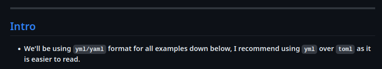

Caranya, kita dapat mengunjungi website pengkonversi TOML ke YAML, misalnya saya menggunakan website "**[convert simple](https://www.convertsimple.com/convert-toml-to-yaml/)**" ini. Tinggal *copy-paste* kode yang ada di file konfigurasi Hugo (***hugo.toml***) ke website tersebut.
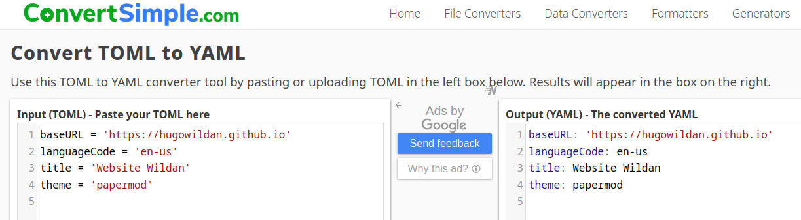

Jangan lupa ganti nama filenya juga dari hugo.toml ke ***hugo.yaml***.
```bash
mv hugo.toml hugo.yaml
```

Setelah itu, kita harus memberi tahu Hugo kalau file konfigurasi kita sudah berubah formatnya dengan mengetikkan perintah berikut:
```bash
hugo --config hugo.yaml
```

### Tips 2: Mengganti mode *Home Page* sesuai selera
***Papermod*** menyediakan tiga mode sebagai tampilan *Home Page* website Hugo kita[^2].

1. Regular Mode (Default-mode)
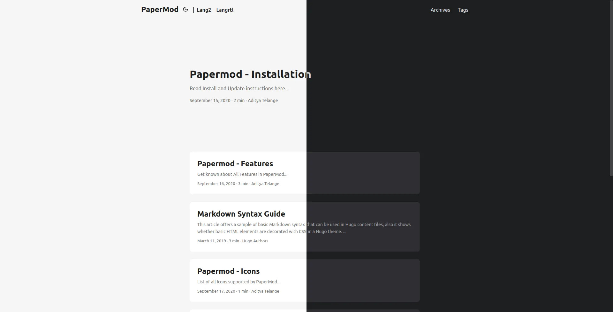

2. Home-Info Mode
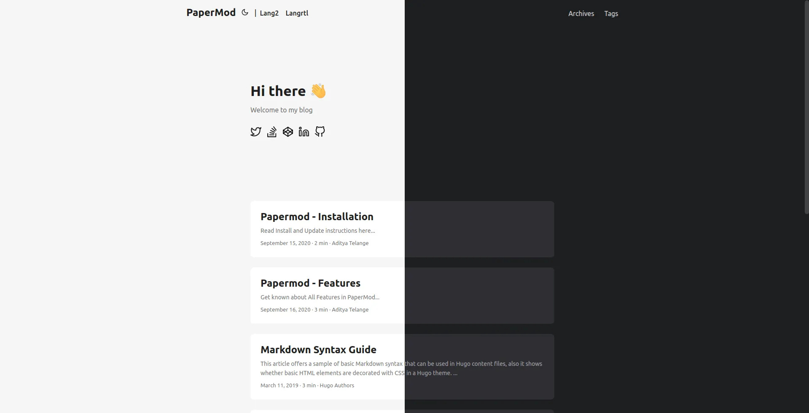

Untuk mengganti mode ke **Home-Info Mode**, kita dapat menambahkan baris kode berikut ke file konfigurasi (*hugo.yaml*):

```yaml title="hugo.yaml"
params:
    homeInfoParams:
        Title: Hi there wave
        Content: Can be Info, links, about...

    socialIcons: # optional
        - name: "<platform>"
            url: "<link>"
        - name: "<platform 2>"
            url: "<link2>"
```

3. Profile Mode
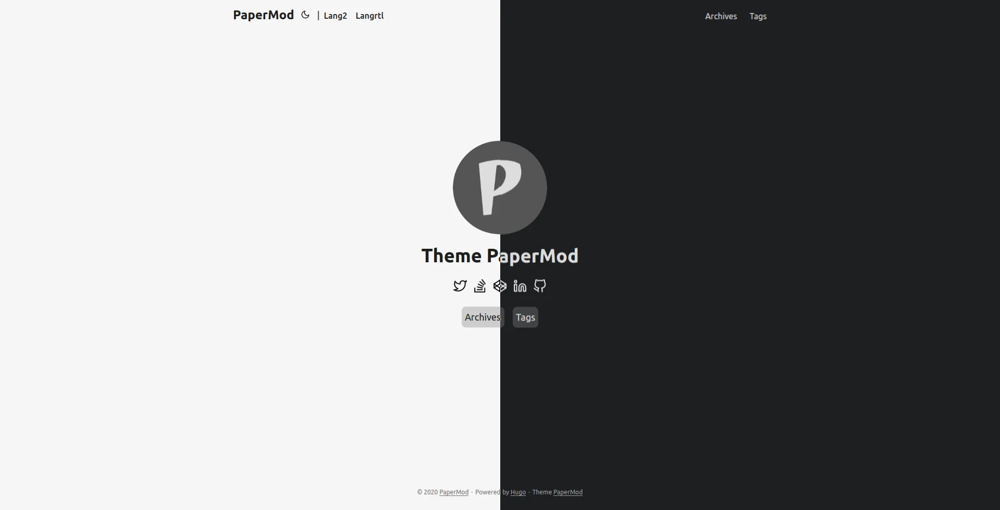

Untuk mengganti mode ke **Profile Mode**, kita dapat menambahkan baris kode berikut ke file konfigurasi (*hugo.yaml*):

```yaml title="hugo.yaml"
params:
    profileMode:
        enabled: true
        title: "<Title>" # optional default will be site title
        subtitle: "This is subtitle"
        imageUrl: "<image link>" # optional
        imageTitle: "<title of image as alt>" # optional
        imageWidth: 120 # custom size
        imageHeight: 120 # custom size
        buttons:
            - name: Archive
            url: "/archive"
            - name: Github
            url: "https://github.com/"

    socialIcons: # optional
        - name: "<platform>"
            url: "<link>"
        - name: "<platform 2>"
            url: "<link2>"
```

### Tips 3: Menambahkan gambar pada postingan konten 
Untuk menambahkan "*post cover image*" seperti gambar di bawah ini:
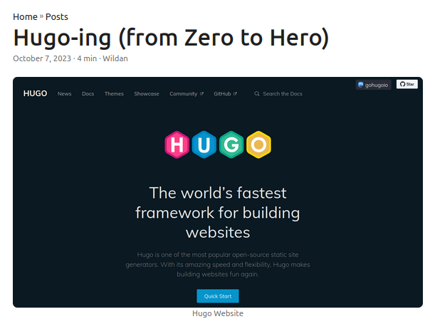

kita dapat menambahkan baris kode berikut di file konfigurasi (*hugo.yaml*):

```yaml title="hugo.yaml"
cover:
    image: "<image path/url>"
    # can also paste direct link from external site
    # ex. https://i.ibb.co/K0HVPBd/paper-mod-profilemode.png
    alt: "<alt text>"
    caption: "<text>"
    relative: false # To use relative path for cover image, used in hugo Page-bundles
```

Kita juga dapat menambahkan pengaturan pada gambar tersebut dalam hal responsivitas dan *link-to-full-size* dengan menambahkan baris kode berikut:

```yaml
params:
    cover:
        responsiveImages: true # To reduce generation time and size of the site, you can disable this feature using
        linkFullImages: true # To enable hyperlinks to the full image size on post pages
```

### Tips 4: Menambahkan fitur *Reading Time*.
Untuk menampilkan fitur *reading time*, tambahkan baris kode berikut:  
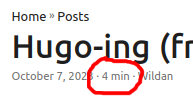

```yaml
Params:
    ShowReadingTime: true # Displays Reading Time (the estimated time, in minutes, it takes to read the content.)
```

### Tips 5: Menambahkan fitur daftar isi
Untuk menampilkan fitur daftar isi (*Table of Content*), tambahkan baris kode berikut:
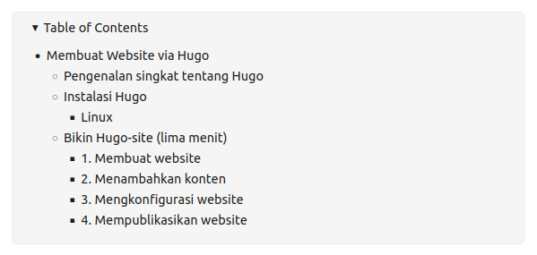

```yaml
ShowToc: true # To show ToC add following to page-variables
TocOpen: true # To keep Toc Open by default on a post add following to page-variables:
```

### Tips 6: Menambahkan fitur tombol *Share Post*
Untuk menampilkan fitur tombol *Share Post*, tambahkan baris kode berikut:
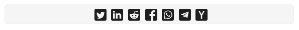

```yaml
params:
    ShowShareButtons: true # Displays Share Buttons at Bottom of each post
```

### Tips 7: Menambahkan fitur *Post Suggestion*
Untuk menampilkan fitur *Post-Suggestion*, tambahkan baris kode berikut:
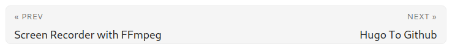

```yaml
params:
    ShowPostNavLinks: true # Adds a Previous / Next post suggestion under a single post
```

### Tips 8: Menambahkan fitur *copy* button di ***codeblock***
Untuk menampilkan fitur *copy* di ***codeblock***, tambahkan baris kode berikut:
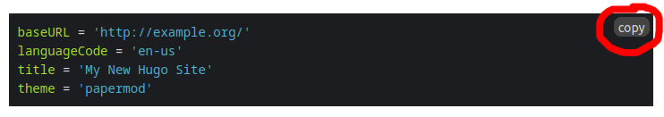

```yaml
params:
    ShowCodeCopyButtons: true # Adds a copy button in code block to copy the code it contains
```

### Tips 9: Menambahkan fitur *Author* di postingan
Untuk menampilkan fitur *Author* di postingan, tambahkan baris kode berikut:
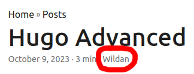

```yaml
params:
  author: "Wildan" # Add author
```

### Tips 10: Menambahkan fitur menu-menu (*categories, tags, archives*)
Untuk menampilkan fitur menu di postingan, tambahkan baris kode berikut:
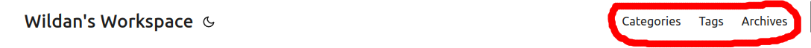

```yaml
menu:
  main:
    - identifier: categories
      name: Categories
      url: /categories/
      weight: 10
    - identifier: tags
      name: Tags
      url: /tags/
      weight: 20
    - identifier: archives
      name: Archives
      url: /archives/
      weight: 30
```

### Tips 11: Menambahkan menu Search

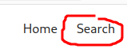
Untuk menampilkan fitur menu *Search* seperti gambar di atas setidaknya ada 3 hal yang perlu diperhatikan[^3]:

1. Menambahkan konfig **JSON** di file konfigurasi (kebetulan di saya nama filenya `hugo.yaml`)

```yaml
outputs:
  home:
    - HTML
    - RSS
    - JSON 
```

2. Membuat file baru di bawah folder atau direktori `/content/`, bernama `search.md`.

```shell
.
├── config.yml
├── content/
│   ├── search.md   <--- Bikin file search.md di sini
│   └── posts/
├── static/
└── themes/
    └── papermod/
```
Isi file `search.md`-nya adalah seperti ini:
```yaml title="search.md"
---
title: "Search"
layout: "search"
summary: "search"
placeholder: "ini text yang ada di dalam box search-nya"
---
```

3. Memastikan sudah menambahkan *identifier* & *url* di file konfigurasi `hugo.yaml` atau `config.yaml`.

```yaml
menu:
  main:
    - identifier: home
      name: Home
      url: /
    - identifier: search
      name: Search
      url: /search/  <--- Tambahkan ini
```

### Tips 12: Menambahkan kutipan postingan dari media sosial 

Di sini, saya akan membagikan cara menambahkan kutipan postingan dari Twitter (X), Instagram, dan Youtube[^4].

#### Twitter (X)
Misalnya, untuk menampilkan link twitter berikut:

`https://twitter.com/CrazyCatsDogs/status/1769982684799873341`	

Kita dapat membuat ***shortcode*** berikut:
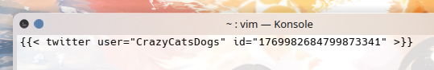

Hasilnya, seperti ini:


#### Instagram
Untuk menampilkan postingan Instagram dari link berikut:

`https://instagram.com/p/C3YR1iHoeuh`

Kita dapat membuat ***shortcode*** berikut:
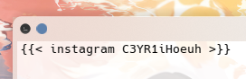

Hasilnya, seperti ini:


#### Youtube
Untuk menampilkan sebuah video Youtube dari link berikut:

`https://www.youtube.com/watch?v=YOs4ntiUq1o`

Kita dapat membuat ***shortcode*** berikut:
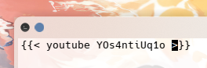

Hasilnya, seperti ini:


### Tips 13: Menambahkan caption pada gambar
Untuk menambahkan caption pada gambar, kita bisa melampirkan caption yang kita inginkan setelah path gambar seperti pada baris kode berikut[^5]:
```markdown

```
Caption-nya memang tidak muncul di bawah atau di atas gambar pada postingan kita, tapi muncul ketika di-["hover"](https://www.merriam-webster.com/dictionary/hover) alias ketika kita mengarahkan mouse atau pointer mouse kita ke gambar. Untuk membuktikannya, kalian bisa meng-hover gambar berikut:


Apakah muncul caption ***"These kitten are so cute!"***-nya? 🫶🏻🥹❤️‍🩹 🤗

### Tips 14: Mengatur Urutan Menu
Jika susunan menu dibiarkan default di file konfigurasi hugo (`hugo.yaml`), maka urutan menu yang tampil di website akan menyesuaikan dengan urutan alphabet/abjad yang ada pada kolom `name:`. Tapi, kalau kita ingin agar urutan tersebut disesuaikan dengan selera kita, maka kita bisa menambahkan baris `weight:{angka}` sehingga urutan menu yang tampil di website akan menyesuaikan urutan angka pada kolom **weight** tersebut[^6]:

Misalnya, berikut adalah pengaturan menu pada file `hugo.yaml` milik saya yang sudah disesuaikan urutannya dengan nomor:

```yaml title="hugo.yaml"
menu:
  main:
    - identifier: home
      name: Home
      url: /
      weight: 1 # <-- untuk mengatur urutan tampil pertama di menu
    - identifier: search
      name: Search
      url: /search/
      weight: 3 # <-- untuk mengatur urutan tampil ketiga di menu
    - identifier: tutorial
      name: Tutorial
      url: /post/
      weight: 2 # <-- untuk mengatur urutan tampil kedua di menu
```

### Tips 15: Menampilkan File PDF 

Kita bisa menampilkan isi sebuah file PDF pada website Hugo kita dengan melampirkan ***`shortcode`***. Pertama, kita harus membuat sebuah file html di `themes/{papermod}/layouts/shortcodes`, misalnya saya beri nama **pdf.html** yang isinya adalah sebagai berikut[^7]:
```html
<iframe src="{{ .Get 0 }}" width="100%" height="700px"></iframe>
```

Ukuran *layout* file pdf yang tampil di website bisa disesuaikan pada bagian **width** dan **height** pada **pdf.html** tersebut. Selanjutnya, kita bisa menambahkan ***`shortcode`*** berikut di halaman markdown kita:

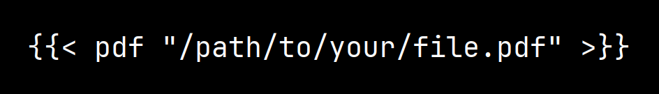

Hasilnya seperti ini:


<iframe 
  src="public/assets/pdf/hugo-advanced/teachlikefinland.pdf" 
  width="100%" 
  height="800px"
  style="border: none;">
</iframe>

Jangan lupa, sebelum di-push ke github, kita perlu menghapus folder `.git` di direktori papermod sebagai tema website kita, supaya file **pdf.html** kita yang tadi bisa ikut terupload dalam folder tema papermod di github.

```shell
rm -rf themes/papermod/.git`
```

Atau cara yang lebih aman, kita bisa menghapus seluruh folder tema papermod, kemudian mengunduhnya kembali, jangan lupa menghapus folder `.git`-nya. baru kemudian membuat baru file **pdf.html** di folder ***`shortcode`***.

```shell
rm -rf themes/papermod/
git clone https://github.com/adityatelange/hugo-PaperMod.git themes/papermod
rm -rf themes/papermod/.git
touch /themes/papermod/layouts/shortcodes/pdf.html
echo "<iframe src="{{ .Get 0 }}" width="100%" height="700px"></iframe>" > pdf.html
```

### Tips 16: Menampilkan Nomor Baris pada Codeblock
Kita juga bisa menampilkan nomor baris yang terdapat pada codeblock, seperti ini:

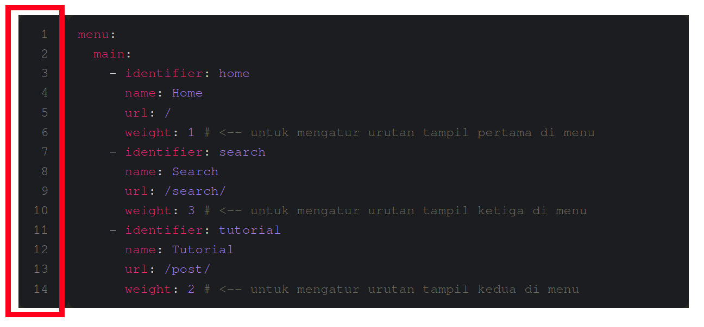

dengan cara memasukkan baris kode berikut ke file konfigurasi hugo kita (punya saya namanya **`hugo.yaml`**):

```yaml
markup:
  highlight:
    lineNos: true
```

### Tips 17: Mengatur Layout Tabel

Kita bisa men-*setting* layout tabel sehingga nanti rata kanan-kiri-nya bisa disesuaikan, seperti berikut:

```shell
|  Nomor   |        Nama        |         Alamat          |
|:--------:|-------------------:|:------------------------|  <-- Perhatikan posisi titik duanya
|    1     | Asep Gunawan       | Jl. Mangga 2, Bandung   |
|    2     | Bambang Susanto    | Jl. Haji 9, Jakarta     |
|    3     | Cyntia Maharani    | Jl. Kemanamana 1, Bali  |
```

Berikut adalah alignment setiap kolom dari potongan kode di atas:
- kolom **Nomor**: rata tengah
- kolom **Nama**: rata kanan
- kolom **Alamat**: rata kiri

Hasilnya, sepert ini:

|  Nomor   |        Nama        |         Alamat          |
|:--------:|-------------------:|:------------------------| 
|    1     | Asep Gunawan       | Jl. Mangga 2, Bandung   |
|    2     | Bambang Susanto    | Jl. Haji 9, Jakarta     |
|    3     | Cyntia Maharani    | Jl. Kemanamana 1, Bali  |

### Tips 18: Meng-*highlight* Teks Penting

Kita bisa meng-highlight teks penting dengan menggunakan *tag* `<mark> </mark>`. Misalnya, saya akan meng-highlight kata **"elang"** pada kalimat "Saya adalah seekot elang".

```shell
Saya adalah seekor </mark> elang </mark>.
```

Hasilnya:

Saya adalah seekor <mark> elang </mark>.

### Tips 19: Menambahkan *shortcode* catur

Bagi mayoritas orang, mungkin shortcode catur tidak terlalu penting. Tapi, karena saya menggunakan ini untuk keperluan blog ini, jadi saya *share* saja. Di markdown, kita bisa melampirkan *real-time* papan catur (setidaknya begitu saya menyebutnya).[^8] Untuk bisa melampirkan papan catur tersebut, minimal kita hanya perlu 2 langkah:

1. Membuat file html baru di direktori `themes/nama-temanya/layouts/shortcodes/`, dalam hal ini file-nya saya beri nama misalnya `chess.html`. Berikut adalah isi file-nya:

```shell
<div style="text-align: center;">
  <iframe id="{{ .Get "id" }}" allowtransparency="true" frameborder="0" scrolling="false" style="width:100%;height:465px;border:none;" src="{{ .Get "url" }}"></iframe><script>window.addEventListener("message",e=>{e['data']&&"{{ .Get "id" }}"===e['data']['id']&&document.getElementById(`${e['data']['id']}`)&&(document.getElementById(`${e['data']['id']}`).style.height=`${e['data']['frameHeight']+30}px`)});</script>
</div>
```

2. Tambahkan *shortcode* berikut di file markdown kalian:

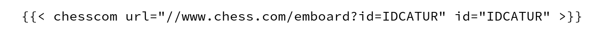

Hasilnya:



> **Notes!**  
> ID catur tersebut dapat diperoleh di bagisn ***"embed"*** ketika kita klik tombol share (khusus di Chess.com).  
> 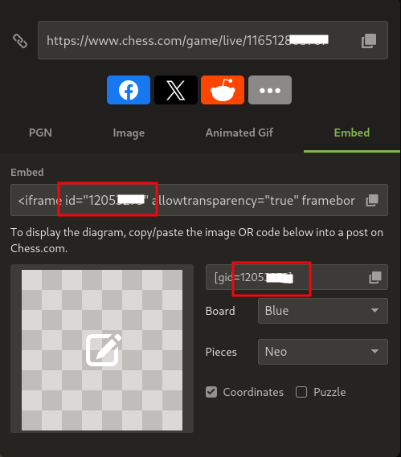

### Tips 20: Menambahkan video

Karena Hugo per artikel ini ditulis belum support video *attachment*, jadi, saya menggunakan html tag untuk menampilkan video di website:

```html
<video width="100%" controls autoplay loop muted>
  <source src="/path/to/video.mp4" type="video/mp4">
</video>
```

> Keterangan:  
> 1. <mark> controls</mark> : Menampilkan tombol kontrol, seperti play, audio, fullscreen.
> 2. <mark> autoplay</mark> : Langsung menjalankan video ketika membuka website tanpa perlu interaksi dari user.
> 3. <mark> loop</mark> : Langsung kembali memutar ulang video ketika sudah berakhir.
> 4. <mark> muted</mark> : Me-non-aktifkan suara.

Hasilnya, kira-kira seperti ini:

<iframe
  src="https://player.cloudinary.com/embed/?cloud_name=dpvtbnqf7&public_id=l2l_dwslv4"
  width="640"
  height="360" 
  style="height: auto; width: 100%; aspect-ratio: 640 / 360;"
  allow="autoplay; fullscreen; encrypted-media; picture-in-picture"
  allowfullscreen
  frameborder="0"
></iframe>

### Tips 21: Menambahkan music

#### Spotify



Kita bisa menambahkan lagu, playlist, atau album dari Spotify.  
Saya demokan salah satunya di sini, kita akan menambahkan sebuah playlist.

Langkah-langkahnya:
1. Login ke Spotify.
2. Cari lagu/playlist/album yang ingin di-_embed_.
3. Klik **titik tiga** -> klik **Share** -> pilih **Embed track/album/playlist**. 
4. Akan muncul pop-up window, klik **Copy**.
5. _Paste_-kan code yang sudah di-_copy_ tadi ke halaman website.

> Sebelum meng-_copy_ kode html-nya, kita bisa menyesuaikan warna dan ukuran track/album/playlist yang akan ditampilkan di website kita. Kita juga bisa melihat kode html-nya dengan men-ceklis "Show code".

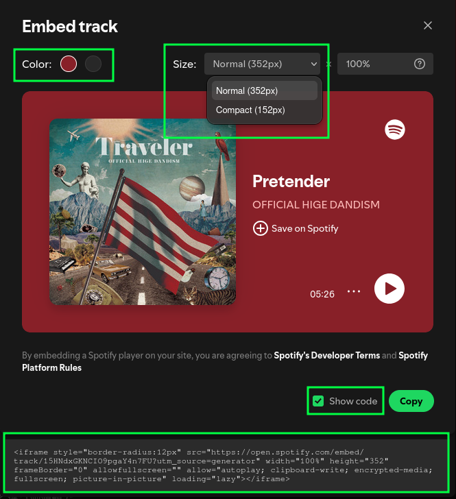

Contoh jika saya menggunakan preset berikut:
- Warna **Hitam**
- Ukuran **Compact**

<iframe style="border-radius:12px" src="https://open.spotify.com/embed/track/15HNdxGKNCIO9pgaY4n7FU?utm_source=generator&theme=0" width="100%" height="152" frameBorder="0" allowfullscreen="" allow="autoplay; clipboard-write; encrypted-media; fullscreen; picture-in-picture" loading="lazy"></iframe>

Bum!


Track/playlist/album yang di-_embed_ dari Spotify hanya akan berupa _preview_ saja alias tidak akan bisa diputar penuh.


#### Soundcloud


Kita juga bisa menambahkan lagu/album/playlist dari Soundcloud.  
Saya akan menambahkan album.

Berikut adalah langkah-langkahnya:
1. Buka halaman website Soundcloud (tidak perlu login).
2. Cari lagu/album/playlist yang ingin di-_embed_.
3. Klik **icon Share** di lagu/album/playlist yang sudah dipilih.
4. Pilih menu window **Embed**.
5. Copy **code**-nya.

> Sebelum meng-_copy_ kode html-nya, kita bisa menyesuaikan mode tampilan yang disediakan, biasanya bervariasi 2-3 pilihan. Kita juga bisa melakukan penyesuaian lain seperti mengganti tone warna, _automatic play_, dan opsi-opsi lainnya seperti yang terlihat pada tangkapan layar berikut:

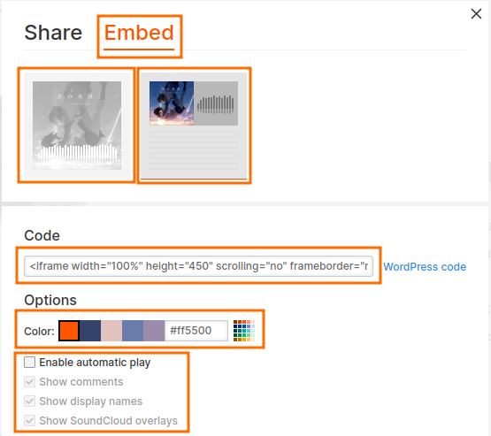

Contoh jika saya menggunakan mode tampilan kedua:

<iframe width="100%" height="570" scrolling="no" frameborder="no" allow="autoplay" src="https://w.soundcloud.com/player/?url=https%3A//api.soundcloud.com/playlists/304060230&color=%23ff5500&auto_play=false&hide_related=false&show_comments=true&show_user=true&show_reposts=false&show_teaser=true"></iframe><div style="font-size: 10px; color: #cccccc;line-break: anywhere;word-break: normal;overflow: hidden;white-space: nowrap;text-overflow: ellipsis; font-family: Interstate,Lucida Grande,Lucida Sans Unicode,Lucida Sans,Garuda,Verdana,Tahoma,sans-serif;font-weight: 100;"><a href="https://soundcloud.com/justafoolishh" title="ＮＶＭ" target="_blank" style="color: #cccccc; text-decoration: none;">ＮＶＭ</a> · <a href="https://soundcloud.com/justafoolishh/sets/kimi-no-na-wa" title="Kimi no Na wa." target="_blank" style="color: #cccccc; text-decoration: none;">Kimi no Na wa.</a></div>

:::note
Kita selalu bisa mengubah ukuran tinggi dan lebar music player-nya, baik Spotify maupun Soundcloud, dari variabel **height** dan **width** di kode html-nya.
:::

### Tips 22: Menambahkan kolom komentar

Kali ini, kita akan belajar menambahkan kolom komentar yang akan muncul di setiap artikel. Berikut adalah beberapa _prerequisites_-nya:
- Hugo menggunakan konfigurasi tema [blowfish](https://blowfish.page/).
- Template kolom komentar menggunakan [waline](https://waline.js.org/).

:::note

Sebetulnya, ada banyak metode untuk membuat kolom komentar. Bahkan, kita dapat membuat kolom komentar dengan Github. Tapi, ada 2 alasan yang membuat saya lebih tertarik dengan [**waline**](https://waline.js.org/):

1. Tidak harus *login* untuk berkomentar.
2. Punya fitur *reaction* yang keren.

Saya juga harus berterima kasih ke salah satu "hugo-er" asal China yang dari blog-nya lah saya terinspirasi untuk membuat kolom komentar dengan [**waline**](https://waline.js.org/):

**Karlukle:** https://www.karlukle.site/ 

:::

Berikut adalah tutorialnya:[^9]

#### LeanCloud (Database)
1. [Login](https://console.leancloud.app/login) atau [register](https://console.leancloud.app/register) ke LeanCloud jika belum memiliki akun.
2. Click tombol **"Create App"**.  
- Buat "App name" sesuai selera.  
- Pilih **"Developer"** di bagian "App price plan".  
3. Masuk ke aplikasinya, pindah ke bagian **"Settings"** > **"App keys"**. Kemudian, perhatikan 3 bagian utama di sana:
- **`AppID`**  
- **`AppKey`**  
- **`MasterKey`**

#### Vercel (Server)
1. Klik tombol **"Deploy"** berikut:  


Deploy 


2. Kemudian login (disarankan menggunakan akun Github).  
3. Bikin nama untuk _project_ Vercel-nya kemudian klik **"Create"**. Vercel akan membuat repositori baru berdasarkan _template_ Waline. Tunggu sebentar.  
4. Setelah selesai, klik **"Go to Dashboard"**.  
5. Pindah ke menu **"Settings"** > **"Environment Variables"**.
6. Kita perlu membuat 3 environment variabel baru di sini, berikut adalah ***key*** & ***value***-nya
- **LEAN_ID** = diisikan **AppID** dari LeanCloud.  
- **LEAN_KEY** = diisikan **AppKey** dari LeanCloud.  
- **LEAN_MASTER_KEY** = diisikan **MasterKey** dari LeanCloud.
7. Setelah di-**"Save"**, kita perlu **"Redeploy"**. Tunggu beberapa saat.
8. Jika sudah selesai, kita akan di-_redirect_ ke halaman "Overview". Untuk melihat aplikasi kolom komentarnya, kita bisa klik **"Visit"**.
9. Link tersebut adalah alamat untuk server aplikasi kolom komentar kita.  

Contoh punya saya:

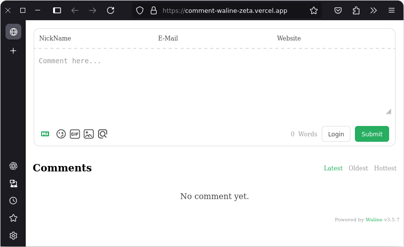

#### Import ke HTML (Client)
1. Buat file `comments.html` di direktori konfigurasi Hugo kalian:

```shell
cd mywebsite # masuk ke direktori website
cd layouts/partials
touch comments.html
```

2. Berikut adalah konten file `comments.html`:

```html title="comments.html"
<head>
  <!-- ... -->
  <link
    rel="stylesheet"
    href="https://unpkg.com/@waline/client@v3/dist/waline.css"
  />
</head>
<body>
  <!-- ... -->
  <div id="waline"></div>
  <script type="module">
    import { init } from 'https://unpkg.com/@waline/client@v3/dist/waline.js';

    init({
      el: '#waline',
      serverURL: 'https://your-domain.vercel.app', // Diganti dengan alamat (link) server kolom komentar yang sudah dibuat tadi
      lang: 'en',
    });
  </script>
</body>
```

3. Perhatikan! Kita perlu mengganti bagian **"serverURL"** di script HTML tersebut.  
4. Selesai! Kolom komentar sudah berhasil dibuat untuk website Hugo kita!

#### Manajemen komentar
1. Setelah _deployment_ selesai, kita perlu mengunjungi `<serverURL>/ui/register` untuk registrasi. Orang pertama yang registrasi akan dianggap sebagai admin.  
2. Setelah _login_, kita dapat mengakses _dashboard_ manajemen komentar. Tiga hal utama yang dapat kita lakukan di sini:  
- Mengedit komentar  
- Menandai komentar
- Menghapus komentar
3. Pengguna lain juga dapat melakukan registrasi via kolom komentar. 
4. Silakan berikan komentar "Paham" di kolom komentar di bawah jika kalian sudah berhasil membuat kolom komentar ini!   

### Tips 23: Menambahkan icon SVG baru 

Penambahan _icon_ berekstensi .svg memang terlihat sederhana. Tapi, bagaimana jika yang saya maksud adalah file .svg yang bisa beradaptasi dengan tema delap (_dark theme_) dan tema terang (_light theme_). Tentu akan jadi sedikit menantang, terutama bila kita belum tahu caranya. Nah, untuk itulah bagian ini didedikasikan...

Untuk membuat _icon_ .svg bisa mengikuti tema website, artinya kalau di tema terang (_light theme_), _icon_ akan berwarna gelap/hitam, sementara kalau di tema gelap (_dark theme_), _icon_ akan berwarna terang/putih, berikut adalah langkah-langkahnya:

1. Cari _icon_ .svg di internet (bisa di [svgrepo](https://svgrepo.com), [freeicons](https://freeicons.io), [freesvgicons](https://freesvgicons.com) dan masih banyak lagi)
2. Masukkan atau unduh ke direktori "`asset/icons`" di direktori utama.
3. Edit file .svg tersebut (di internet bisa menggunakan website [svgviewer](https://www.svgviewer.dev/) dan [editsvgcode](https://editsvgcode.com)) & pastikan bagian `fill="currentColor"`. Pastikan tanda petik dua pada currentColor harus disematkan!
4. Unduh lagi file .svg baru tersebut dan kita bisa menghapus file lama yang belum teredit.
5. Selesai.

Berikut adalah ilustrasi ketika saya meng-edit file .svg "archlinux" di website [svgviewer](https://www.svgviewer.dev/) supaya bisa adaptif dengan tema website:
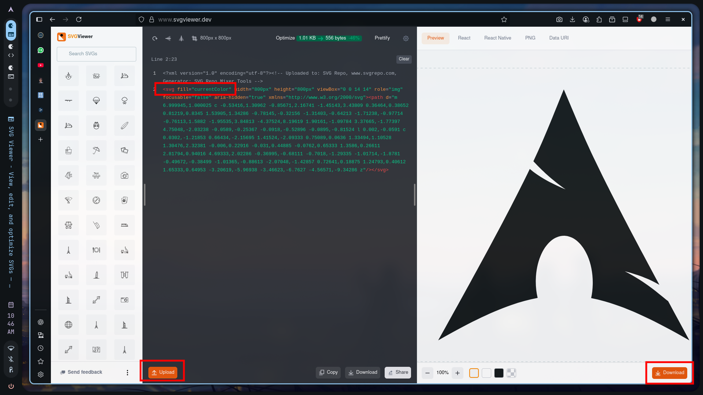


Kalau sudah selesai, jangan lupa commit ke repo lokal dan push ke Github:

```shell
ssh-agent bash
ssh-add ./ssh/ssh-config-file

git status
git add .
git commit -m "change configuration"
git push
```

Baca-baca tentang Markdown dari bukunya Matt Cone yang berjudul **"The Markdown Guide"** di sini:



[^1]: https://gohugo.io/getting-started/configuration/
[^2]: https://github.com/adityatelange/hugo-PaperMod/wiki/Features#profile-mode
[^3]: https://adityatelange.github.io/hugo-PaperMod/posts/papermod/papermod-features/#search-page
[^4]: https://gohugo.io/content-management/shortcodes/
[^5]: https://sebastiandedeyne.com/captioned-images-with-markdown-render-hooks-in-hugo/
[^6]: https://chatgpt.com/c/ba64752f-c7a0-438c-9a1b-d11efa9aaa05
[^7]: https://chatgpt.com/c/35c0c015-e708-42f4-9319-ef7992479132
[^8]: https://www.ragchess.com/how-to-embed-a-your-own-chess-puzzle-into-your-website/
[^9]: https://waline.js.org/en/guide/get-started/
