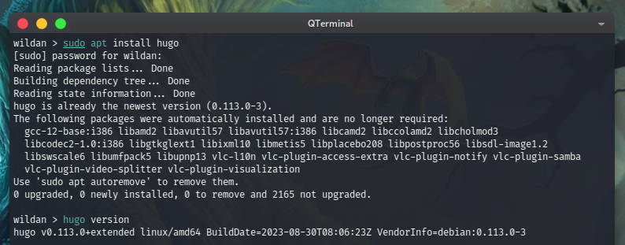
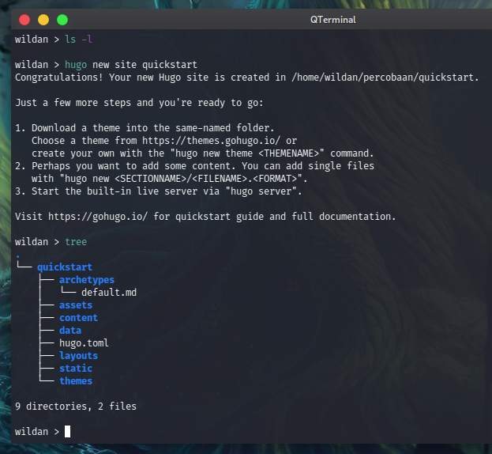
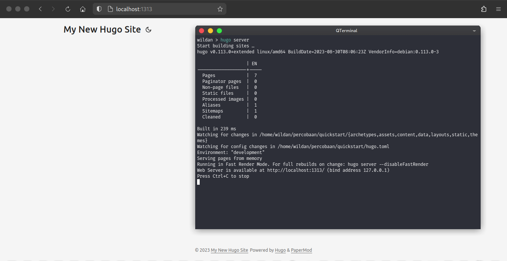
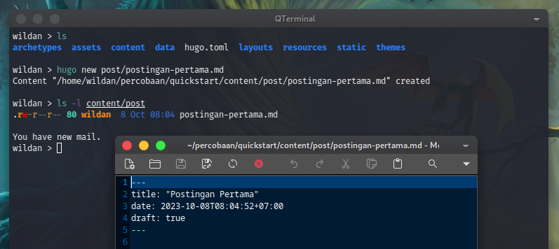
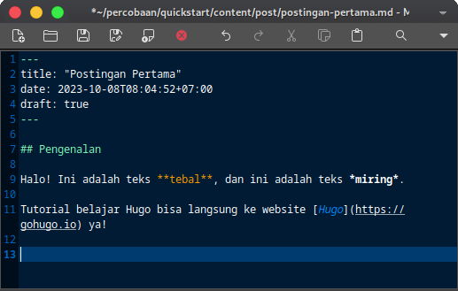
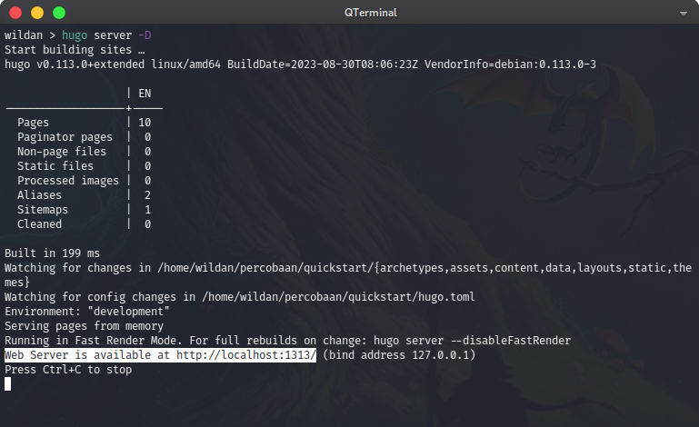
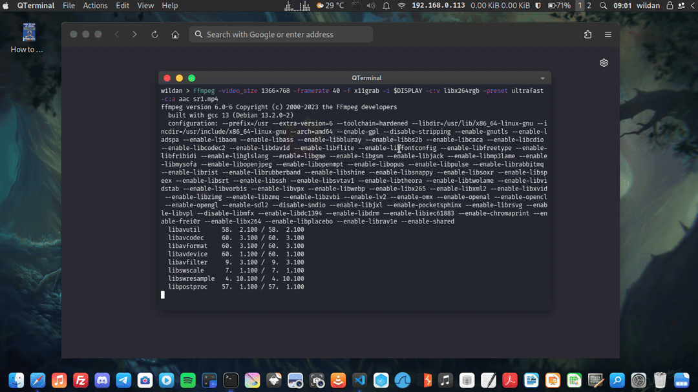
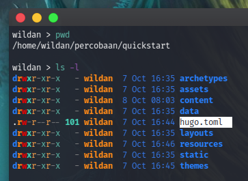
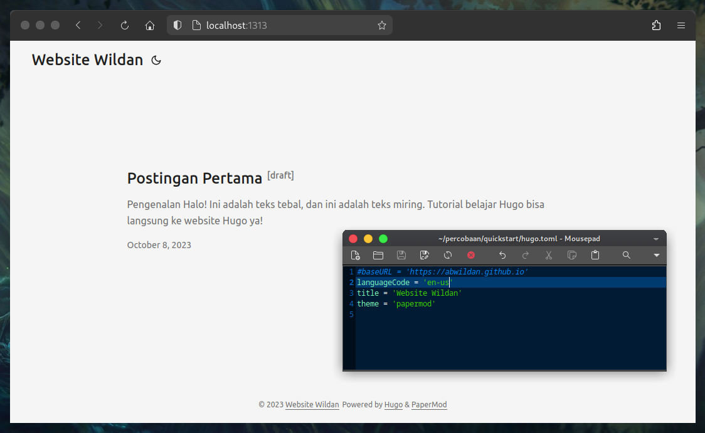
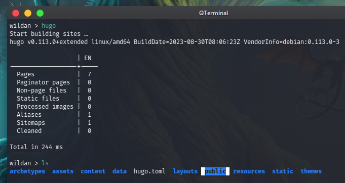

# Membuat Website via Hugo
## Pengenalan singkat tentang Hugo
Hugo adalah *framework* yang memungkinkan setiap orang untuk membuat dan mengelola website mereka. 

> Secara teknis, Hugo adalah *static site generator*. [^1] 

Secara umum, website dibagi 2: *dynamic & static site* dan itu disesuaikan dengan kebutuhan atau tujuan dibuatnya website tersebut. Tapi, umumnya, *static site* memang banyak digunakan sebagai:
- *Personal blog posts*
- *Documentasi pages*
- *Portofolio pages, dan lain sebagainya.* 

## Instalasi Hugo
Hugo dapat diinstal di sistem operasi apapun, Windows, Mac, atau Linux dapat menginstall Hugo. Tapi, kali ini, karena saya menggunakan Linux sebagai sistem operasi dasar, maka saya hanya akan membatasi instalasi Hugo di Linux saja. 

### Linux
Untuk instalasi Hugo di Linux, kita hanya perlu mengetikkan beberapa perintah di terminal sebagai berikut:

Debian/Ubuntu-based 
```
sudo apt install hugo 
```

Fedora-based 
```
sudo dnf install hugo 
```

Arch-based 
```
sudo pacman -S install hugo 
```

Untuk distro Linux lainnya yang non-Debian/Arch/Fedora-based, tinggal menyesuaikan dengan *package manager* yang ada di distro tersebut. Yang jelas, yang harus dipastikan adalah bahwa program Hugo yang akan diinstal tersebut tersedia di *official repository* masing-masing distro. 

Setelah proses instalasi selesai, kita dapat memastikan program Hugo sudah terinstall di sistem kita dengan melihat berapa versi Hugo tersebut, melalui perintah berikut:

```
hugo version
```

Kebetulan di laptop saya, versi yang terinstall adalah Hugo v0.113.0.


## Bikin Hugo-site (lima menit)
Tutorial ini akan terbagi menjadi 4 bagian, yaitu Membuat website,menambahkan konten, mengkonfigurasi website, mempublikasikan website[^2]. 

> **Sebagai prasyarat keberhasilan**, versi Hugo yang terinstall harus yang *extended edition*, v0.112.0 atau yang terbaru.

Kita akan banyak menggunakan perintah atau *command* via terminal untuk mengoperasikan Hugo. Pengetahuan tentang *basic **git*** juga diperlukan.

### 1. Membuat website
Secara sederhana, hanya 6 perintah yang diperlukan untuk menciptakan website Hugo sebagai berikut:

```bash
hugo new site quickstart
cd quickstart
git init
git submodule add https://github.com/adityatelange/hugo-PaperMod.git themes/papermod
echo "theme = 'papermod'" >> hugo.toml
hugo server
```
Berikut adalah penjelasan baris perbaris dari kumpulan perintah tersebut:

```bash
hugo new site quickstart
```
digunakan untuk membuat struktur direktori (*directory structure*) website kita yang tersimpan dalam folder/direktory quickstart.


```bash
cd quickstart
```
masuk ke direktori quickstart yang baru saja dibuat.

```bash
git init
```
menginisialisasi direktori quickstart sebagai direktori git.

```bash
git submodule add https://github.com/adityatelange/hugo-PaperMod.git themes/papermod
```
mengkloning tema papermod ke direktori themes, dan menambahkannya sebagai *git submodule* di project kita.

```bash
echo "theme = 'papermod'" >> hugo.toml
```
menambahkan tema papermod di file konfigurasi website, hugo.toml.

```bash
hugo server
```
memulai Hugo development server. *Default server*-nya ada di localhost port 1313. Tekan Ctrl+c untuk menyetop *development server*-nya.

Tampilan website Hugo yang baru saja kita buat dengan tema papermod:



### 2. Menambahkan konten
Untuk menambahkan page baru untuk website Hugo, kita dapat mengetikkan perintah berikut:

```bash
hugo new post/postingan-pertama.md
```
Hugo akan membuat file baru bernama **postingan-pertama.md** di direktori content/post. Buka file tersebut.


Yang perlu diperhatikan adalah *value* dari draft adalah ``true``. Secara default, Hugo tidak mem-*publish* konten yang masih berbentuk draft ketika kita mem-*build* website-nya nanti.Jadi, jika kita ingin konten tersebut terpublikasikan, kita hanya perlu mengganti *value draft* tadi ke ``false``.

Berikutnya, silakan tambahkan isi postingan tersebut dengan [*syntax* markdown](https://www.markdownguide.org/cheat-sheet/). Misalnya, saya akan tambahkan 

```
## Pengenalan

Halo! Ini adalah teks **tebal**, dan ini adalah teks *miring*.

Tutorial belajar Hugo bisa langsung ke website [Hugo](https://gohugo.io) ya!
```


Simpan filenya, kemudian kita dapat memulai server development Hugo-nya dengan perintah berikut (terutama untuk menampilkan file yang masih berupa draft):

```bash
hugo server --buildDraft
hugo server -D
```



### 3. Mengkonfigurasi website
Untuk mengkonfigurasi website, kita dapat membuka file konfigurasi (hugo.toml) di direktory 'root' proyek Hugo kita.


```toml
baseURL = 'http://example.org/'
languageCode = 'en-us'
title = 'My New Hugo Site'
theme = 'papermod'
```
Kita dapat mengubah *value* baseURL ke alamat URL dimana kita akan meng-*hosting* website Hugo kita. Misalnya, saya akan mengganti *value* baseURL-nya ke 'https://abwildan.github.io/' karena nanti saya akan mem-publikasikan website hugo ini di Github. Tapi, untuk sementara, karena kita belum akan mempublikasikan website kita ke manapun, jadi, kita akan meng-*comment* variabel baseURL ini.

Begitu juga dengan variabel title, kita dapat mengganti *value*-nya dengan apapun karena itu yang akan menjadi judul website kita dan tampil di pojok kiri atas website. Misalnya, saya akan ganti judul website-nya dengan 'Website Wildan'.

Untuk melihat perubahan yang sudah dibuat, silakan di-save, dan jalankan perintah seperti sebelumnya:
```bash
hugo server -D
```
Maka, semua perubahan tadi akan tampak sebagai berikut:
```
#baseURL = 'https://abwildan.github.io'
languageCode = 'en-us'
title = 'Website Wildan'
theme = 'papermod'
```


### 4. Mempublikasikan website
Ketika kita memublikasikan website, Hugo akan membuat seluruh situs statis di direktori **public** di root proyek, termasuk file HTML, dan aset seperti gambar, berkas CSS, dan berkas JavaScript.

Ketika memublikasikan website, biasanya kita tidak ingin menyertakan konten draft. Jadi, yang akan di-*publish* adalah konten yang tidak berstatus draft. Perintahnya sederhana.
```bash
hugo
```


[^1]: https://gohugo.io/about/what-is-hugo/
[^2]: https://gohugo.io/getting-started/quick-start/
