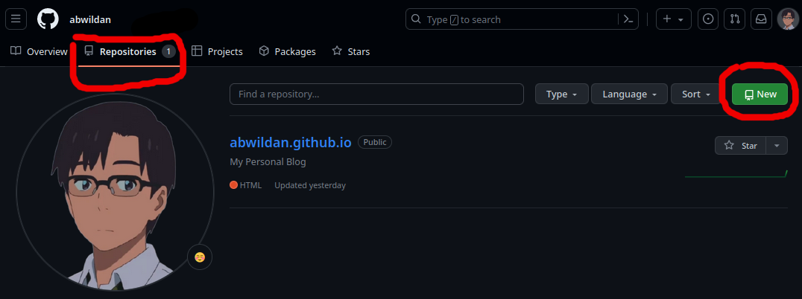
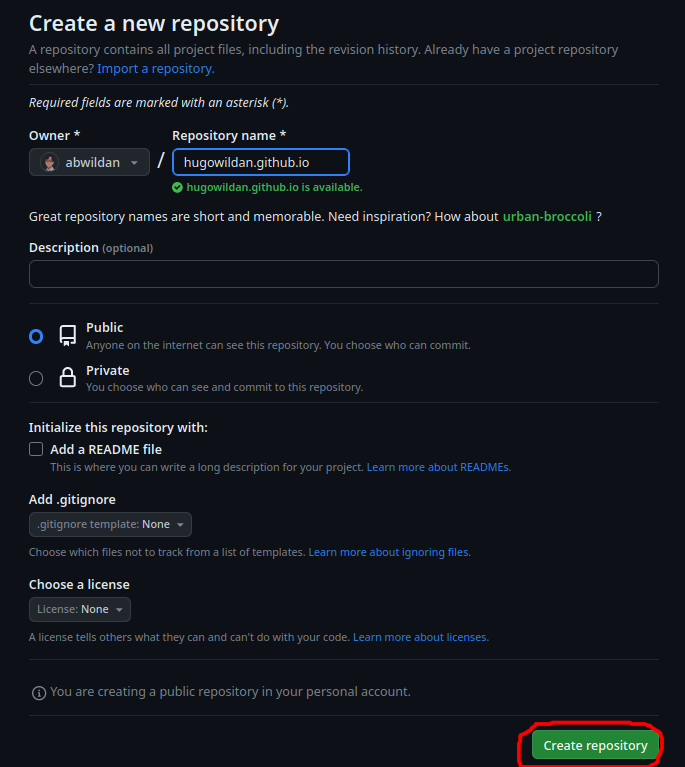
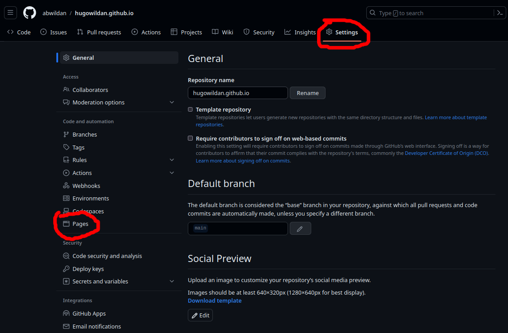
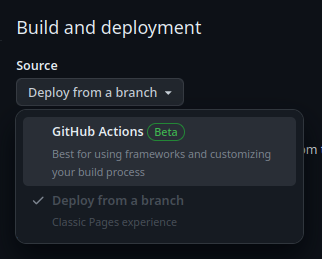
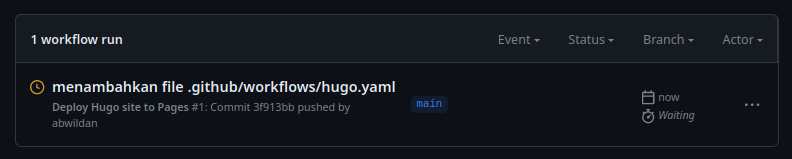
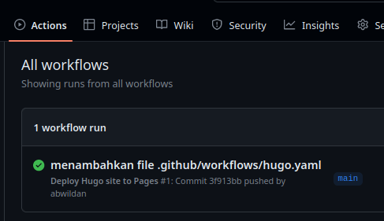
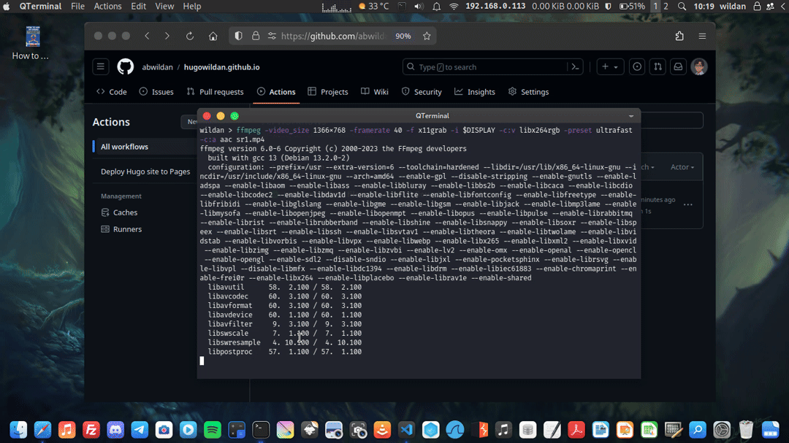

# Meng-Hosting di Github
Di tulisan ini, saya akan menunjukkan cara hosting *static-site* Hugo yang sudah dibuat sebelumnya ke Github. Jadi, sebelum lanjut membaca tutorial ini, ada 3 persyaratan yang harus sudah dipenuhi:
1. Punya akun Github (kalau belum punya silakan buat dulu).
2. Komputer/laptop-nya sudah terinstall git (kalau belum silakan install).
3. Sudah membuat website Hugo sebelumnya (kalau belum, silakan buat dulu, tutorialnya bisa mengikuti tulisan saya sebelumnya).

Saya akan menunjukkan 10 langkah dalam mem-*publish* atau meng-*hosting* *static-site* Hugo kita ke Github[^1]. Berikut langkah-langkahnya:

### Langkah 1: 
Buat sebuah repositori baru di Github.
Di Tab "Repository" -> Klik "**New**".


Misanya, saya akan namakan repositori baru saya dengan "githubwildan.github.io". Kemudian klik "**Create Repository**".


### Langkah 2: 
Push repositori lokal kita ke Github.
> Jangan lupa, kalau mau konten post kita tampil, kita terlebih dahulu harus merubah *value* "draft" post-nya dari ``true`` ke ``false``.

Pastikan kita di folder root direktori proyek Hugo kita. Kemudian, ketikkan perintah berikut:
```bash
git status
git add .
git commit -m "commit pertama ke github"
git branch -M main
git remote add origin git@github.com:abwildan/hugowildan.github.io.git
git push -u origin main
```

### Langkah 3:
Kita ke halaman Github repo. Kemudian dari main menu, kita klik menuju ke "**Setting**" -> "**Pages**". 


### Langkah 4:
Ganti "Source" di bagian "Build and deployment" ke "**Github Action**".


### Langkah 5: 
Buat file kosong baru di lokal repositori kita.
```bash
mkdir -p .github/workflows
touch .github/workflows/hugo.yaml
```

### Langkah 6:
Copy-paste kode YAML berikut ke file hugo.yaml yang sudah dibuat sebelumnya. Kita dapat menyesuaikan nama *branch* dan versi Hugo-nya.

```yaml title="hugo.yaml"
# Sample workflow for building and deploying a Hugo site to GitHub Pages
name: Deploy Hugo site to Pages

on:
  # Runs on pushes targeting the default branch
  push:
    branches:
      - main

  # Allows you to run this workflow manually from the Actions tab
  workflow_dispatch:

# Sets permissions of the GITHUB_TOKEN to allow deployment to GitHub Pages
permissions:
  contents: read
  pages: write
  id-token: write

# Allow only one concurrent deployment, skipping runs queued between the run in-progress and latest queued.
# However, do NOT cancel in-progress runs as we want to allow these production deployments to complete.
concurrency:
  group: "pages"
  cancel-in-progress: false

# Default to bash
defaults:
  run:
    shell: bash

jobs:
  # Build job
  build:
    runs-on: ubuntu-latest
    env:
      HUGO_VERSION: 0.115.4
    steps:
      - name: Install Hugo CLI
        run: |
          wget -O ${{ runner.temp }}/hugo.deb https://github.com/gohugoio/hugo/releases/download/v${HUGO_VERSION}/hugo_extended_${HUGO_VERSION}_linux-amd64.deb \
          && sudo dpkg -i ${{ runner.temp }}/hugo.deb          
      - name: Install Dart Sass
        run: sudo snap install dart-sass
      - name: Checkout
        uses: actions/checkout@v3
        with:
          submodules: recursive
          fetch-depth: 0
      - name: Setup Pages
        id: pages
        uses: actions/configure-pages@v3
      - name: Install Node.js dependencies
        run: "[[ -f package-lock.json || -f npm-shrinkwrap.json ]] && npm ci || true"
      - name: Build with Hugo
        env:
          # For maximum backward compatibility with Hugo modules
          HUGO_ENVIRONMENT: production
          HUGO_ENV: production
        run: |
          hugo \
            --gc \
            --minify \
            --baseURL "${{ steps.pages.outputs.base_url }}/"          
      - name: Upload artifact
        uses: actions/upload-pages-artifact@v1
        with:
          path: ./public

  # Deployment job
  deploy:
    environment:
      name: github-pages
      url: ${{ steps.deployment.outputs.page_url }}
    runs-on: ubuntu-latest
    needs: build
    steps:
      - name: Deploy to GitHub Pages
        id: deployment
        uses: actions/deploy-pages@v2
```

### Langkah 7:
*Commit* perubahan barusan ke repo lokal dan jangan lupa juga *push* ke Github.
```bash
git status
git add .
git commit -m "menambahkan file .github/workflows/hugo.yaml"
git push
```

### Langkah 8: 
Di tab "**Actions**", kita akan melihat seperti ini:


### Langkah 9:
Kalau Github sudah selesai mem-*build* dan men-*deploy* website kita, warna indikator statusnya akan berubah menjadi hijau seperti ini:


### Langkah 10:
Kita dapat melihat *live* website Hugo kita sudah ter-*hosting* di Github di link "https://abwildan.github.io/hugowildan.github.io/". Artinya, siapapun sekarang bisa mengunjungi website kita!


Selanjutnya, kapanpun kita mem-*push* perubahan dari repositori lokal, Github akan nge-*rebuild* website kita dan men-*deploy* perubahan-perubahannya.


[^1]: https://gohugo.io/hosting-and-deployment/hosting-on-github/
