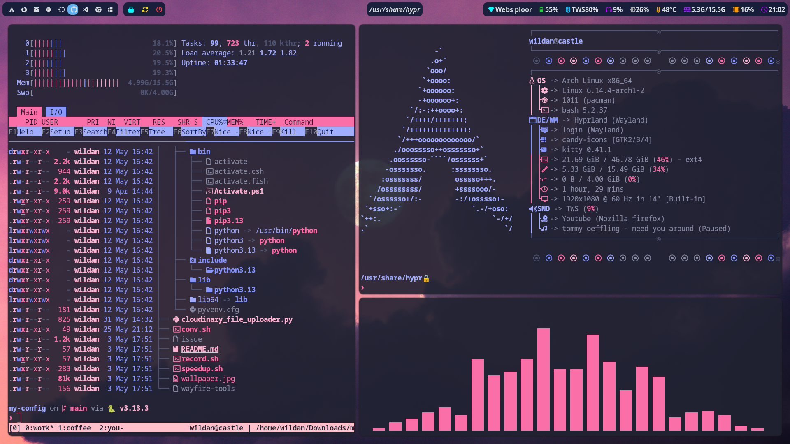
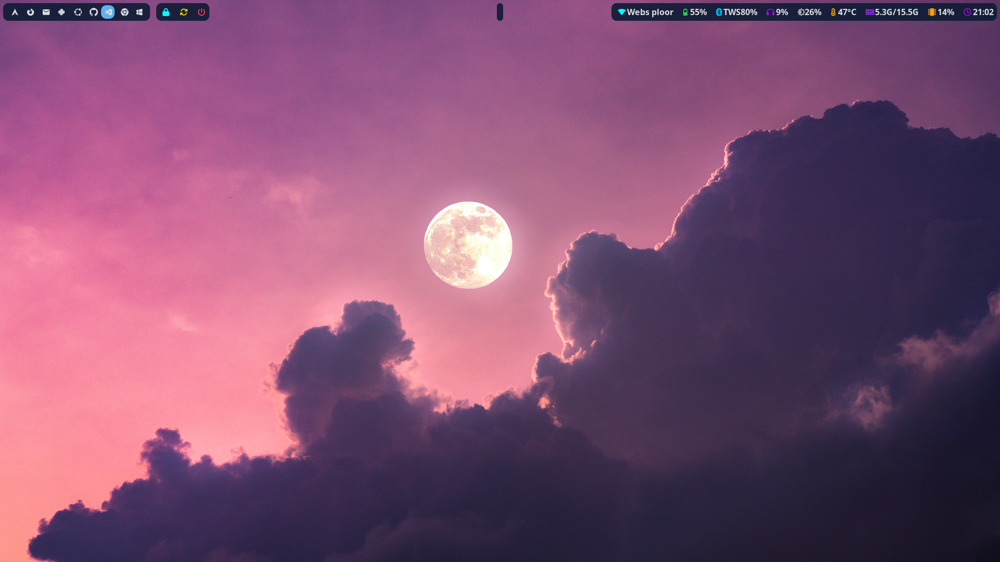

Pernah dengar Hyprland?  
Iya, **"Hyprland"**, bukan Hyperland...

[Hyprland](https://wiki.archlinux.org/title/Hyprland) adalah <u> Dekstop Environment (DE) </u> yang mengusung konsep <u> Dynamic Tiling Window Manager </u> yang ditulis dengan bahasa C++. Salah satu yang membuat Hyprland digadang-gadang sebagai DE "futuristik" adalah karena menggunakan <u> wayland </u> sebagai <u> display server protocol (compositor) </u>-nya.[^1]

:::note[Tentang DE, WM, dan Display Server]

1. **Desktop Environment (DE):** _desktop environment_ (DE) adalah sebuah sistem _Graphical User Interface_ (GUI) yang terdiri dari kumpulan program tertentu (WM, File Manager, Panel, App Launcher, etc) sehingga memudahkan interaksi antara kita (_user_) dengan komputer. Beberapa contoh DE linux yang populer diantaranya ada [KDE Plasma](https://kde.org/id/plasma-desktop/), [GNOME](https://www.gnome.org/), [XFCE](https://www.xfce.org/), [MATE](https://mate-desktop.org/id/), [Cosmic](https://system76.com/cosmic/), dan masih banyak lagi.  

2. **Window Manager (WM):** _window manager_ adalah sebuah sistem atau pengaturan yang mengelola penempatan dan tampilan dari "window" yang terdapat di _Graphical User Interface_ (GUI). WM biasanya juga sudah ada di dalam DE, atau bisa juga berdiri sendiri tanpa DE (_standalone_). Secara umum, ada 3 jenis WM:  
***a. Stacking (floating)***: Windows dapat ditumpuk satu dengan lainnya.  
***b. Tiling***: Windows tidak dapat ditumpuk sehingga tersusun bersebelahan.  
***c. Dynamic***: Windows fleksibel, bisa dibuat ***stacking (floating)*** dan juga ***tiling***.

3. **Display Server:** _display server_ adalah inti dari sistem grafis (GUI di Linux). Ia bertugas untuk mengelola interaksi antara kita (_user_) dengan aplikasi yang berbasis GUI. Itu artinya, tanpa _display server_, kita tidak dapat menjalankan DE & WM dan hanya dapat berinteraksi via CLI di mode [tty](https://wiki.archlinux.org/title/Linux_console). Dua jenis _display server_ yang populer digunakan saat ini:  
***a. X11***: sudah lama ada (sejak 1980-an), kompleks, relatif lebih lambat, _compositing_ (efek visual) terpisah, tapi kompatibilitasnya dengan _software_ luas.  
***b. Wayland***:  baru ada (sekitar 2010-an), sederhana, relatif lebih cepat & responsif, _compositing_ bawaan, tapi kompatibilitasnya masih belum banyak didukung karena sedang transisi.

Referensi:
- https://wiki.archlinux.org/title/Desktop_environment
- https://wiki.archlinux.org/title/Window_manager
- https://wiki.archlinux.org/title/Wayland

:::

## Instalasi

> Sebelum melakukan instalasi Hprland, saya sarankan di laptop atau komputer kalian sudah ter-_install_ DE yang lebih "stabil" terlebih dahulu, seperti KDE Plasma, GNOME, atau Xfce agar tidak perlu meng-_install_ paket-paket penting lain seperti File Manager, Terminal, etc.

|       Distro      |                  Command                                                      |
|       ---         |                   ---                                                         |
| **Debian/Ubuntu** | **`sudo apt install hyprland kitty wofi waybar waypaper swww`**               |
| **Arch Linux**    | **`yay -Sy hyprland kitty wofi waybar waypaper swww`**                        |
| **Opensuse**      | **`sudo zypper in hyprland kitty wofi waybar waypaper swww`**                 |
| **Fedora**        | **`sudo dnf install hyprland kitty wofi waybar waypaper swww`**      		    |

Fyi, paket **`hyprland`** di Debian sudah _outdated_. Jadi, disarankan untuk meng-_install_ Hyprland secara manual.
Berikut tutorialnya:  
https://wiki.hyprland.org/Getting-Started/Installation/#manual-manual-build

:::note

**Catatan:**

1. **`kitty`** adalah terminal default yang disarankan oleh Hyprland.
2. **`wofi`** adalah _application launcer_. 
3. **`waybar`** adalah panel yang berfungsi sebagai status bar.
3. **`waypaper`** adalah _tools_ untuk mengganti _wallpaper_.
4. **`swww`** adalah _wallpaper engine_. Salah satu fungsinya adalah untuk menambahkan efek visualisasi ketika _wallpaper_ berganti.

:::

Btw, saya pernah menulis tentang konfigurasi **`kitty`** juga di sini:



## Configuration

File konfigurasi **`hyprland`** tersimpan di:  

```shell
~/.config/hypr/hyprland.conf
```

```shell title="hyprland.conf"

# #######################################################################################
# AUTOGENERATED HYPRLAND CONFIG.
# PLEASE USE THE CONFIG PROVIDED IN THE GIT REPO /examples/hyprland.conf AND EDIT IT,
# OR EDIT THIS ONE ACCORDING TO THE WIKI INSTRUCTIONS.
# #######################################################################################

# autogenerated = 1 # remove this line to remove the warning

# This is an example Hyprland config file.
# Refer to the wiki for more information.
# https://wiki.hyprland.org/Configuring/

# Please note not all available settings / options are set here.
# For a full list, see the wiki

# You can split this configuration into multiple files
# Create your files separately and then link them to this file like this:
# source = ~/.config/hypr/myColors.conf


################
### MONITORS ###
################

# See https://wiki.hyprland.org/Configuring/Monitors/
monitor=,preferred,auto,auto

monitor = eDP-1, 1920x1080@60, 0x0, 1
#monitor = eDP-1, 1366x768@60, 0x0, 1

###################
### MY PROGRAMS ###
###################

# See https://wiki.hyprland.org/Configuring/Keywords/

# Set programs that you use
$terminal = kitty
$fileManager = dolphin
$menu = wofi --show drun


#################
### AUTOSTART ###
#################

# Autostart necessary processes (like notifications daemons, status bars, etc.)
# Or execute your favorite apps at launch like this:

# exec-once = $terminal
# exec-once = nm-applet &
# exec-once = waybar & hyprpaper

exec-once = waybar
#exec-once = waypaper --wallpaper /home/wildan/Pictures/pexels-kaboompics-5815.jpg
exec-once = waypaper --restore

#############################
### ENVIRONMENT VARIABLES ###
#############################

# See https://wiki.hyprland.org/Configuring/Environment-variables/

env = XCURSOR_SIZE,24
env = HYPRCURSOR_SIZE,24


###################
### PERMISSIONS ###
###################

# See https://wiki.hyprland.org/Configuring/Permissions/
# Please note permission changes here require a Hyprland restart and are not applied on-the-fly
# for security reasons

# ecosystem {
#   enforce_permissions = 1
# }

# permission = /usr/(bin|local/bin)/grim, screencopy, allow
# permission = /usr/(lib|libexec|lib64)/xdg-desktop-portal-hyprland, screencopy, allow
# permission = /usr/(bin|local/bin)/hyprpm, plugin, allow


#####################
### LOOK AND FEEL ###
#####################

# Refer to https://wiki.hyprland.org/Configuring/Variables/

# https://wiki.hyprland.org/Configuring/Variables/#general
general {
    gaps_in = 5
    gaps_out = 20

    border_size = 2

    # https://wiki.hyprland.org/Configuring/Variables/#variable-types for info about colors
    col.active_border = rgba(33ccffee) rgba(00ff99ee) 45deg
    col.inactive_border = rgba(595959aa)

    # Set to true enable resizing windows by clicking and dragging on borders and gaps
    resize_on_border = false

    # Please see https://wiki.hyprland.org/Configuring/Tearing/ before you turn this on
    allow_tearing = false

    layout = dwindle
}

# https://wiki.hyprland.org/Configuring/Variables/#decoration
decoration {
    rounding = 10
    rounding_power = 2

    # Change transparency of focused and unfocused windows
    active_opacity = 1.0
    inactive_opacity = 1.0

    shadow {
        enabled = true
        range = 4
        render_power = 3
        color = rgba(1a1a1aee)
    }

    # https://wiki.hyprland.org/Configuring/Variables/#blur
    blur {
        enabled = true
        size = 3
        passes = 1

        vibrancy = 0.1696
    }
}

# https://wiki.hyprland.org/Configuring/Variables/#animations
animations {
    enabled = yes, please :)

    # Default animations, see https://wiki.hyprland.org/Configuring/Animations/ for more

    bezier = easeOutQuint,0.23,1,0.32,1
    bezier = easeInOutCubic,0.65,0.05,0.36,1
    bezier = linear,0,0,1,1
    bezier = almostLinear,0.5,0.5,0.75,1.0
    bezier = quick,0.15,0,0.1,1

    animation = global, 1, 10, default
    animation = border, 1, 5.39, easeOutQuint
    animation = windows, 1, 4.79, easeOutQuint
    animation = windowsIn, 1, 4.1, easeOutQuint, popin 87%
    animation = windowsOut, 1, 1.49, linear, popin 87%
    animation = fadeIn, 1, 1.73, almostLinear
    animation = fadeOut, 1, 1.46, almostLinear
    animation = fade, 1, 3.03, quick
    animation = layers, 1, 3.81, easeOutQuint
    animation = layersIn, 1, 4, easeOutQuint, fade
    animation = layersOut, 1, 1.5, linear, fade
    animation = fadeLayersIn, 1, 1.79, almostLinear
    animation = fadeLayersOut, 1, 1.39, almostLinear
    animation = workspaces, 1, 1.94, almostLinear, fade
    animation = workspacesIn, 1, 1.21, almostLinear, fade
    animation = workspacesOut, 1, 1.94, almostLinear, fade
}

# Ref https://wiki.hyprland.org/Configuring/Workspace-Rules/
# "Smart gaps" / "No gaps when only"
# uncomment all if you wish to use that.
# workspace = w[tv1], gapsout:0, gapsin:0
# workspace = f[1], gapsout:0, gapsin:0
# windowrule = bordersize 0, floating:0, onworkspace:w[tv1]
# windowrule = rounding 0, floating:0, onworkspace:w[tv1]
# windowrule = bordersize 0, floating:0, onworkspace:f[1]
# windowrule = rounding 0, floating:0, onworkspace:f[1]

# See https://wiki.hyprland.org/Configuring/Dwindle-Layout/ for more
dwindle {
    pseudotile = true # Master switch for pseudotiling. Enabling is bound to mainMod + P in the keybinds section below
    preserve_split = true # You probably want this
}

# See https://wiki.hyprland.org/Configuring/Master-Layout/ for more
master {
    new_status = master
}

# https://wiki.hyprland.org/Configuring/Variables/#misc
misc {
    force_default_wallpaper = -1 # Set to 0 or 1 to disable the anime mascot wallpapers
    disable_hyprland_logo = false # If true disables the random hyprland logo / anime girl background. :(
}


#############
### INPUT ###
#############

# https://wiki.hyprland.org/Configuring/Variables/#input
input {
    kb_layout = us
    kb_variant =
    kb_model =
    kb_options =
    kb_rules =

    follow_mouse = 1

    sensitivity = 0 # -1.0 - 1.0, 0 means no modification.

    touchpad {
        natural_scroll = false
    }
}

# https://wiki.hyprland.org/Configuring/Variables/#gestures
gestures {
    workspace_swipe = true
}

# Example per-device config
# See https://wiki.hyprland.org/Configuring/Keywords/#per-device-input-configs for more
device {
    name = epic-mouse-v1
    sensitivity = -0.5
}


###################
### KEYBINDINGS ###
###################

# See https://wiki.hyprland.org/Configuring/Keywords/
$mainMod = SUPER # Sets "Windows" key as main modifier

# Example binds, see https://wiki.hyprland.org/Configuring/Binds/ for more
bind = $mainMod, Q, exec, $terminal
bind = $mainMod, C, killactive,
bind = $mainMod, M, exit,
bind = $mainMod, E, exec, $fileManager
bind = $mainMod, V, togglefloating,
bind = $mainMod, R, exec, $menu
bind = $mainMod, P, pseudo, # dwindle
bind = $mainMod, J, togglesplit, # dwindle
bind = $mainMod, F, exec, $menu

# Move focus with mainMod + arrow keys
bind = $mainMod, left, movefocus, l
bind = $mainMod, right, movefocus, r
bind = $mainMod, up, movefocus, u
bind = $mainMod, down, movefocus, d

# Switch workspaces with mainMod + [0-9]
bind = $mainMod, 1, workspace, 1
bind = $mainMod, 2, workspace, 2
bind = $mainMod, 3, workspace, 3
bind = $mainMod, 4, workspace, 4
bind = $mainMod, 5, workspace, 5
bind = $mainMod, 6, workspace, 6
bind = $mainMod, 7, workspace, 7
bind = $mainMod, 8, workspace, 8
bind = $mainMod, 9, workspace, 9
bind = $mainMod, 0, workspace, 10

# Move active window to a workspace with mainMod + SHIFT + [0-9]
bind = $mainMod SHIFT, 1, movetoworkspace, 1
bind = $mainMod SHIFT, 2, movetoworkspace, 2
bind = $mainMod SHIFT, 3, movetoworkspace, 3
bind = $mainMod SHIFT, 4, movetoworkspace, 4
bind = $mainMod SHIFT, 5, movetoworkspace, 5
bind = $mainMod SHIFT, 6, movetoworkspace, 6
bind = $mainMod SHIFT, 7, movetoworkspace, 7
bind = $mainMod SHIFT, 8, movetoworkspace, 8
bind = $mainMod SHIFT, 9, movetoworkspace, 9
bind = $mainMod SHIFT, 0, movetoworkspace, 10

# Example special workspace (scratchpad)
bind = $mainMod, S, togglespecialworkspace, magic
bind = $mainMod SHIFT, S, movetoworkspace, special:magic

# Scroll through existing workspaces with mainMod + scroll
bind = $mainMod, mouse_down, workspace, e+1
bind = $mainMod, mouse_up, workspace, e-1

# Move/resize windows with mainMod + LMB/RMB and dragging
bindm = $mainMod, mouse:272, movewindow
bindm = $mainMod, mouse:273, resizewindow

# Laptop multimedia keys for volume and LCD brightness
bindel = ,XF86AudioRaiseVolume, exec, wpctl set-volume -l 1 @DEFAULT_AUDIO_SINK@ 5%+
bindel = ,XF86AudioLowerVolume, exec, wpctl set-volume @DEFAULT_AUDIO_SINK@ 5%-
bindel = ,XF86AudioMute, exec, wpctl set-mute @DEFAULT_AUDIO_SINK@ toggle
bindel = ,XF86AudioMicMute, exec, wpctl set-mute @DEFAULT_AUDIO_SOURCE@ toggle
bindel = ,XF86MonBrightnessUp, exec, brightnessctl -e4 -n2 set 5%+
bindel = ,XF86MonBrightnessDown, exec, brightnessctl -e4 -n2 set 5%-

# Requires playerctl
bindl = , XF86AudioNext, exec, playerctl next
bindl = , XF86AudioPause, exec, playerctl play-pause
bindl = , XF86AudioPlay, exec, playerctl play-pause
bindl = , XF86AudioPrev, exec, playerctl previous

##############################
### WINDOWS AND WORKSPACES ###
##############################

# See https://wiki.hyprland.org/Configuring/Window-Rules/ for more
# See https://wiki.hyprland.org/Configuring/Workspace-Rules/ for workspace rules

# Example windowrule
# windowrule = float,class:^(kitty)$,title:^(kitty)$

# Ignore maximize requests from apps. You'll probably like this.
windowrule = suppressevent maximize, class:.*

# Fix some dragging issues with XWayland
windowrule = nofocus,class:^$,title:^$,xwayland:1,floating:1,fullscreen:0,pinned:0

```

File konfigurasi **`waypaper`** tersimpan di:  

```shell
~/.config/waypaper/config.ini
```

```ini title="config.ini"
[Settings]
language = en
folder = ~/Pictures
monitors = All
wallpaper = ~/Pictures/leaves.jpg
show_path_in_tooltip = True
backend = swww
fill = fill
sort = name
color = #ffffff
subfolders = False
all_subfolders = False
show_hidden = False
show_gifs_only = False
zen_mode = False
post_command = 
number_of_columns = 3
swww_transition_type = outer
swww_transition_step = 90
swww_transition_angle = 0
swww_transition_duration = 2
swww_transition_fps = 60
mpvpaper_sound = False
mpvpaper_options = 
use_xdg_state = False
```

File konfigurasi **`waybar`** tersimpan di:  

```shell
~/.config/waybar/config.jsonc
```

File config ini "nyolong" dari repo berikut:

::github{repo="woioeow/hyprland-dotfiles"}

```jsonc title="config.jsonc"
{
  "layer": "top",
  "position": "top",
  "height": 32,
  "spacing": 0,
  "modules-left": [
    "hyprland/workspaces",
    "tray",
    "custom/lock",
    "custom/reboot",
    "custom/power"
  ],
  "modules-center": ["hyprland/window"],
  "modules-right": [
    "network",
    "battery",
    "bluetooth",
    "pulseaudio",
    "backlight",
    "custom/temperature",
    "memory",
    "cpu",
    "clock"
  ],
  "hyprland/workspaces": {
    "disable-scroll": false,
    "all-outputs": true,
    "format": "{icon}",
    "on-click": "activate",
    "persistent-workspaces": {
    "*":[1,2,3,4,5,6,7,8,9]
    },
    "format-icons": {
      "1": "󰣇",
      "2": "󰈹",
      "3": "󰇮",
      "4": "",
      "5": "",
      "6": "",
      "7": "",
      "8": "",
      "9": "󰖳",
      "default": ""
    }
  },
  "custom/lock": {
  "format": "<span color='#00FFFF'>  </span>",
  "on-click": "hyprlock",
  "tooltip": true,
  "tooltip-format": "锁屏"
  },
  "custom/reboot": {
    "format": "<span color='#FFD700'>  </span>",
    "on-click": "systemctl reboot",
    "tooltip": true,
    "tooltip-format": "重启"
  },
  "custom/power": {
    "format": "<span color='#FF4040'>  </span>",
    "on-click": "systemctl poweroff",
    "tooltip": true,
    "tooltip-format": "关机"
  },
  "network": {
    "format-wifi": "<span color='#00FFFF'> 󰤨 </span> {essid} ",
    "format-ethernet": "<span color='#7FFF00'> </span>Wired ",
    "tooltip-format": "<span color='#FF1493'> 󰅧 </span>{bandwidthUpBytes}  <span color='#00BFFF'> 󰅢 </span>{bandwidthDownBytes}",
    "format-linked": "<span color='#FFA500'> 󱘖 </span>{ifname} (No IP) ",
    "format-disconnected": "<span color='#FF4040'>  </span>Disconnected ",
    "format-alt": "<span color='#00FFFF'> 󰤨 </span>{signalStrength}% ",
    "interval": 1
  },
  "battery": {
    "states": {
      "warning": 30,
      "critical": 15
    },
    "format": "<span color='#28CD41'> {icon} </span>{capacity}% ",
    "format-charging": " 󱐋{capacity}%",
	  "interval": 1,
    "format-icons": ["󰂎", "󰁼", "󰁿", "󰂁", "󰁹"],
    "tooltip": true
  },
  "pulseaudio": {
    "format": "<span color='#00FF7F'>{icon}</span> {volume}% ",
    "format-muted": "<span color='#FF4040'> 󰖁 </span>0% ",
    "format-icons": {
      "headphone": "<span color='#BF00FF'>  </span>",
      "hands-free": "<span color='#BF00FF'>  </span>",
      "headset": "<span color='#BF00FF'>  </span>",
      "phone": "<span color='#00FFFF'>  </span>",
      "portable": "<span color='#00FFFF'>  </span>",
      "car": "<span color='#FFA500'>  </span>",
      "default": [
        "<span color='#808080'>  </span>",
        "<span color='#FFFF66'>  </span>",
        "<span color='#00FF7F'>  </span>"
      ]
    },
    "on-click-right": "pavucontrol -t 3",
    "on-click": "pactl -- set-sink-mute 0 toggle",
    "tooltip": true,
    "tooltip-format": "当前系统声音: {volume}%"
  },
  "custom/temperature": {
    "exec": "sensors | awk '/^Package id 0:/ {print int($4)}'",
    "format": "<span color='#FFA500'> </span> {}°C ",
    "interval": 5,
    "tooltip": true,
    "tooltip-format": "当前 CPU 温度: {}°C"
  },
  "memory": {
    "format": "<span color='#8A2BE2'>  </span> {used:0.1f}G/{total:0.1f}G ",
    "tooltip": true,
    "tooltip-format": "当前内存占比: {used:0.2f}G/{total:0.2f}G"
  },
  "cpu": {
    "format": "<span color='#FF9F0A'>  </span> {usage}% ",
    "tooltip": true
  },
  "clock": {
    "interval": 1,
    "timezone": "Asia/Jakarta",
    "format": "<span color='#BF00FF'>  </span> {:%H:%M} ",
    "tooltip": true,
    "tooltip-format": "{:L%Y 年 %m 月 %d 日, %A}"
  },
  "tray": {
    "icon-size": 17,
    "spacing": 6
  },
  "backlight": {
    "device": "intel_backlight",
    "format": "<span color='#FFD700'>{icon}</span>{percent}% ",
    "tooltip": true,
    "tooltip-format": "当前屏幕亮度: {percent}%",
    "format-icons": [
      "<span color='#696969'> 󰃞 </span>",  // 暗 - 深灰
      "<span color='#A9A9A9'> 󰃝 </span>",  // 中 - 灰
      "<span color='#FFFF66'> 󰃟 </span>",  // 亮 - 柠檬黄
      "<span color='#FFD700'> 󰃠 </span>"   // 最亮 - 金色
    ]
  },
  "bluetooth": {
    "format": "<span color='#00BFFF'>  </span>{status} ",
    "format-connected": "<span color='#00BFFF'>  </span>{device_alias} ",
    "format-connected-battery": "<span color='#00BFFF'>  </span>{device_alias}{device_battery_percentage}% ",
    "tooltip-format": "{controller_alias}\t{controller_address}\n\n{num_connections} connected",
    "tooltip-format-connected": "{controller_alias}\t{controller_address}\n\n{num_connections} connected\n\n{device_enumerate}",
    "tooltip-format-enumerate-connected": "{device_alias}\t{device_address}",
    "tooltip-format-enumerate-connected-battery": "{device_alias}\t{device_address}\t{device_battery_percentage}%"
  }
}

```

:::note

**Catatan:**

Tidak seperti **`hyprland`** dan **`waypaper`**, file konfigurasi **`waybar`** tidak otomatis ada setelah instalasi sehingga harus dibuat manual terlebih dahulu:

```shell
mkdir ~/.config/waybar
touch ~/.config/waybar/config.jsonc
```

:::

Saat pertama kali masuk ke _session_ Hyprland, kita tidak akan melihat apapun selain _wallpaper_ bawaan Hyprland. Jadi, ada beberapa hal yang perlu kita konfigurasi agar Hyprland kita menjadi lebih baik, secara fungsional maupun estetis.

Oleh karena itu, kita perlu tahu setidaknya 2 **keybind** penting:

**`Super + Q`**: Membuka terminal (`kitty`)  
**`Super + C`**: Menutup jendela aplikasi aktif  
**`Super + F`**: Membuka _application launcher_ (`wofi`)

### Monitor resolution

Kita perlu mengganti / menyesuaikan resolusi monitor dengan resolusi bawaan Hyprland.  
Caranya mudah, kita hanya perlu mengganti baris berikut di konfigurasi Hyprland (**`~/.config/hypr/hyprland.conf`**):

```shell
monitor = name, resolution, position, scale
```

Contohnya: 

```shell
monitor = DP-1, 1920x1080@144, 0x0, 1
```

Ini artinya, kita akan mengganti resolusi monitor dengan nama "DP-1" ke 1920x1080 dengan 144 Hz, mulai di titik 0x0 dari kiri, dengan skala 1 (_unscaled_).[^2]

Untuk mengetahui informasi tentang monitor:

```shell
hyprctl monitors
```

### Waybar activation

Untuk mengaktifkan waybar agar muncul seetiap kali masuk ke sesi Hyprland, kita perlu menambahkan baris berikut di file konfigurasi Hyprland (**`~/.config/hypr/hyprland.conf`**):

```shell
exec-once = waybar
```

Untuk mengkonfigursi `waybar`, kalian bisa langsung "mengotak-atiknya" di **`~/.config/waybar/config.jsonc`**, atau melihat (memakai) file konfigurasi orang lain di internet. Saya tidak akan membahasnya lebih jauh di sini.

### Wallpaper settings

Untuk mengganti _wallpaper_, kita dapat menjalankan **`waypaper`** dan langsung menggantinya dari aplikasi GUI yang muncul tersebut:

```shell
waypaper
```

Kita juga bisa mengganti pengaturannya via file konfigurasi langsung di `~/.config/waypaper/config.ini`.

### Keybindings

Beberapa _keybindings_ (_shortcut_) juga dapat diganti sesuai dengan preferensi masing-masing di bagian **"#Keybindings"** di dalam file konfigurasi Hyprland (**`~/.config/hypr/hyprland.conf`**).

---

Artikel ini ditulis dengan DE Hyprland (Archlinux, btw):

[grid]


[/grid]


[^1]: https://wiki.archlinux.org/title/Hyprland
[^2]: https://wiki.hyprland.org/Configuring/Monitors/


