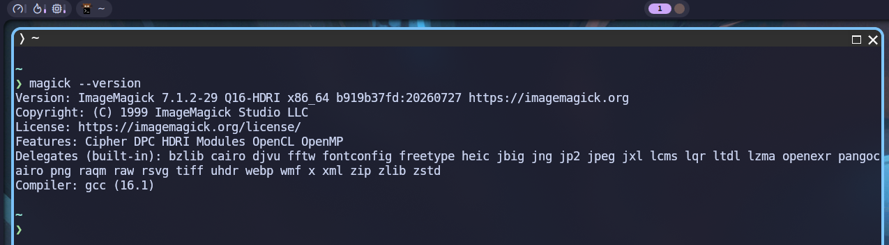
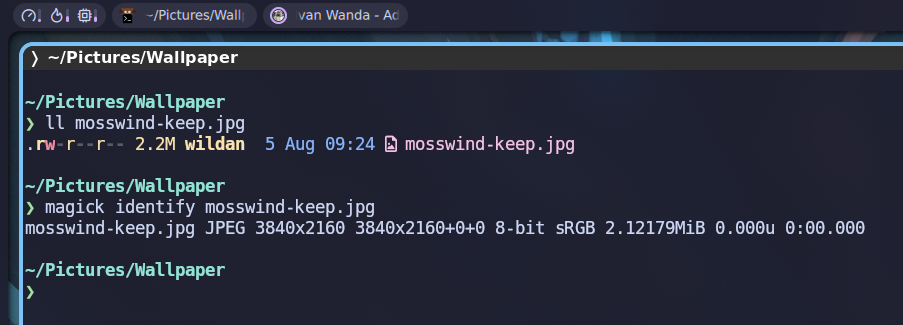
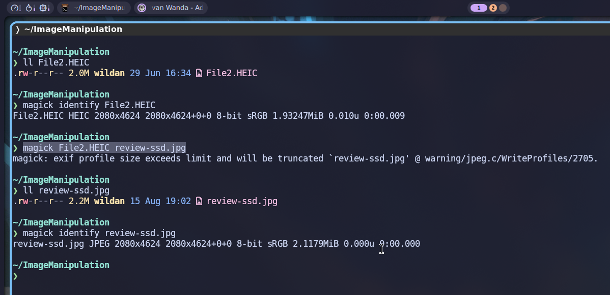
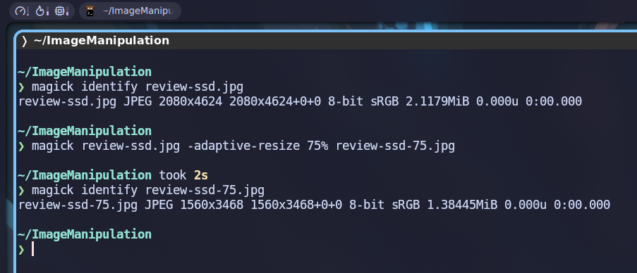
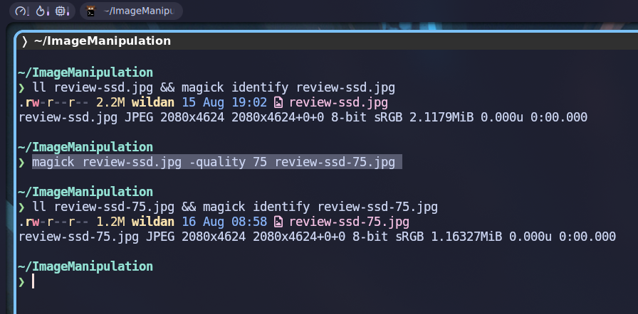
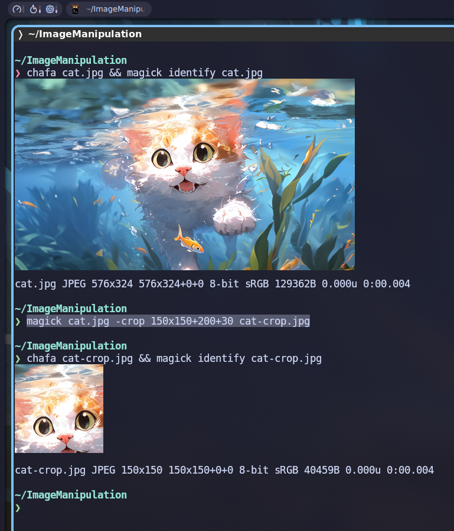
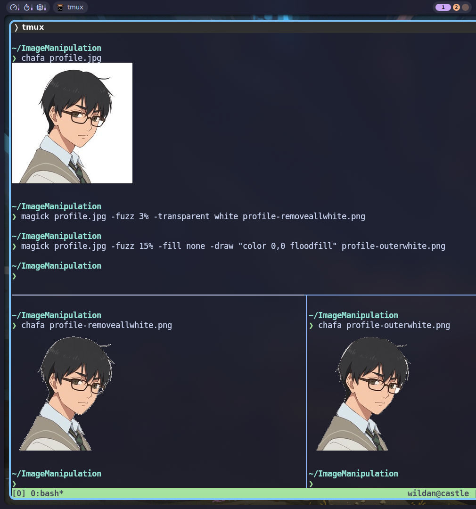

## Opening

### Introduction

Saya sebetulnya sudah pernah membahas `imagemagick` di artikel yang lain. Tapi, saat itu, `imagemagick` hanya dibahas sebagai salah satu _tool_ untuk melakukan konversi format file gambar. Nah, di artikel ini, saya akan bahas lebih jauh kegunaan dari `imagemagick` secara lebih mendalam. 

> Sebagai informasi saja, `imagemagick `adalah _software_ berbasis CLI (_Command Line Interface_).

:::info

Berikut adalah artikel yang saya maksud:

[[/tech/imgconvert/]]

:::

### What is `imagemagick`?

`imagemagick` adalah sebuah _software_ gratis dan [open source](https://opensource.com/resources/what-open-source) yang digunakan untuk meng-edit dan memanipulasi gambar digital. _Tool_ ini dapat digunakan untuk membuat (_create_), mengedit (_edit_), menyusun (_compose_), atau mengkonversi (_convert_) **gambar bitmap**, serta mendukung berbagai jenis format file, seperti JPEG, PNG, GIF, TIFF, dan ULTRA HDR.[^1]

Per-artikel ini ditulis, versi `imagemagick` yang terbaru adalah `7.1.2-29`:



:::info[Tentang Gambar Bitmap]

Karena tadi saya menyebutkan "gambat bitmap", maka rasanya saya perlu juga memberi sedikit informasi tentang apa itu "gambar bitmap". 

Gambar bitmap atau gambar raster adalah gambar yang dibentuk berdasarkan susunan piksel warna yang ditampilkan pada layar monitor, kertas, atau media tampilan lainnya.[^2] Beberapa contoh format file gambar bitmap misalnya GIF, JPEG, BMP, dan PNG.

[](https://id.wikipedia.org/wiki/Gambar_bitmap#/media/Berkas:Rgb-raster-image.svg)

:::

## Methods

### Installation

Berikut adalah cara meng-_install_ `imagemagick` di beberapa sistem operasi UNIX/Linux:

::: code-group labels=[Debian/Ubuntu, Archlinux, OpenSUSE, Fedora, FreeBSD]

```shell
sudo apt install imagemagick
```

```shell
sudo pacman -Sy imagemagick
```

```shell
sudo zypper install imagemagick
```

```shell
sudo dnf install imagemagick
```

```shell
sudo pkg install imagemagick
```

:::

:::note[NixOS]

Masukkan baris berikut di file konfigurasi (`/etc/nixos/configuration.nix`):

```nix
  environment.systemPackages = [
    pkgs.imagemagick
  ];
```

Atau jika menggunakan `nix-shell`:

```shell
nix-shell -p imagemagick
```

:::

`imagemagick` juga dapat dijumpai di website resminya: https://imagemagick.org/#gsc.tab=0

Atau di repo Github official-nya:

::github{repo="ImageMagick/ImageMagick/"}


### Image Manipulation

:::tip

Saya sarankan untuk menggunakan (meng-_install_) `imagemagick` versi terbaru (7.x) agar dapat menggunakan perintah yang juga terbaru. Sebab, untuk versi lama (6.x) perintah utamanya sedikit berbeda. Selain itu, kita juga bisa menggunakan perintah tersendiri jika ingin melakukan manipulasi banyak gambar sekaligus. 

Berikut adalah perbandingan perintah utama `imagemagick` untuk manipulasi satu gambar dan banyak gambar:

::: code-group labels=[Single, Batch]

```shell
# versi baru (7.x)
magick

# versi lama (6.x)
convert
```

```shell
mogrify
```

:::

:::

#### Identify

Untuk mengidentifikasi format dan karakteristik sebuah file gambar:

```shell
magick identify <nama_file>
```

Akan muncul beberapa informasi terkait gambar tersebut, seperti:
1. nama file
2. format file
3. resolusi
4. jumlah bit
5. ukuran file
6. dll

Contoh:



#### 1. Convert

Untuk meng-_convert_ file dari satu format ke format lain, gunakan perintah:[^3]

```shell
magick <input_file> <output_file>
```



#### 2. Resize

**a) Change aspec ratio**

Untuk me-_resize_ resolusi gambar:[^4]

```shell
magick <input_file> -resize [LEBAR]X[TINGGI]! <output_file> 
```

:::note 

Tanda seru **(!)** pada resolusi ([LEBAR]X[TINGGI]) diperlukan untuk "memaksa" `imagemagick` agar benar-benar merubah resolusinya sesuai permintaan. Kita bisa saj me-_resize_ tanpa tanda seru, tapi biasanya imagemagick akan berusaha menjaga aspek rasio gambar aslinya sehingga resolusi gambar tidak benar benar berubah.

:::


**b) Maintain aspec ratio**

Atau kita juga bisa mengecilkan resolusi berdasarkan persen-an, tanpa mengubah aspek rasionya:

```shell
magick <input_file> -adaptive-resize 75% <output_file>
```



#### 3. Reduce

Untuk mengurangi ukuran file gambar:

```shell
magick <input_file> -quality 75 <output_file>
```

:::info[Quality range]

**Quality** bervariasi dari 1-100. 1 Artinya kompresi sangat tinggi, tapi kualitas sangat rendah. Sebaliknya, 100 berarti kompresi sangat rendah, tapi kualitas tinggi.

:::



:::note[Resize vs Reduce]

Berbeda dengan **_resize_**, dengan **_reduce_**, kita hanya mengurangi ukuran file dengan "membuang" beberapa bit-nya tanpa mengecilkan resolusi gambarnya.

:::

#### 4. Crop

Untuk memotong gambar:

```shell
magick <input_file> -crop [LEBAR]x[TINGGI]+[X]+[Y]
```

:::note

1. `[LEBAR]x[TINGGI]`: Ukuran area gambar yang ingin diambil.
2. `+[X]+[Y]`: Koordinat titik awal pemotongan (dimulai dari pojok kiri atas gambar, `+0+0`)

:::



#### 5. Remove Background

Untuk menghapus warna latar belakang dan membuatnya jadi transparan (lejas):

```shell
magick <input_file> -fuzz 10% -transparent white <output_file.png>
```

:::note

1. `-fuzz 10%`: mengatur toleransi warna. Tingkatkan kalau warna _background_-nya punya gradien atau bayangan.
2. `-transparent white`: mengkonversi semua warna terkait (putih) ke transparan (lejas).
3. `output_file.png`: Kita ubah ke png agar transparansi berhasil.

:::

Kalau kita hanya ingin menghapus warna _background_ di luar subjek:

```shell
magick <input_file> -fuzz 15% -fill none -draw "color 0,0 floodfill" <output_file.png>
```

:::note

1. `-draw "color 0,0 floodfill"`: menginisiasi transparansi dari koordinat `0,0`.
2. `-fill none`: meminta `imagemagick` untuk mengisi _background_ dengan transparansi.
3. `output_file.png`: Kita ubah ke png agar transparansi berhasil.

:::



Ada banyak lagi fitur-fitur yang memungkinkan kita melakukan manipulasi gambar dengan `imagemagick`. Kalian dapat melihat daftar kemampuan `imagemagick` di sini:

https://usage.imagemagick.org/


[^1]: https://imagemagick.org/#gsc.tab=0
[^2]: https://id.wikipedia.org/wiki/Gambar_bitmap
[^3]: https://usage.imagemagick.org/basics/
[^4]: https://contactsunny.medium.com/a-few-basic-but-powerful-imagemagick-commands-b5809b0a1076

