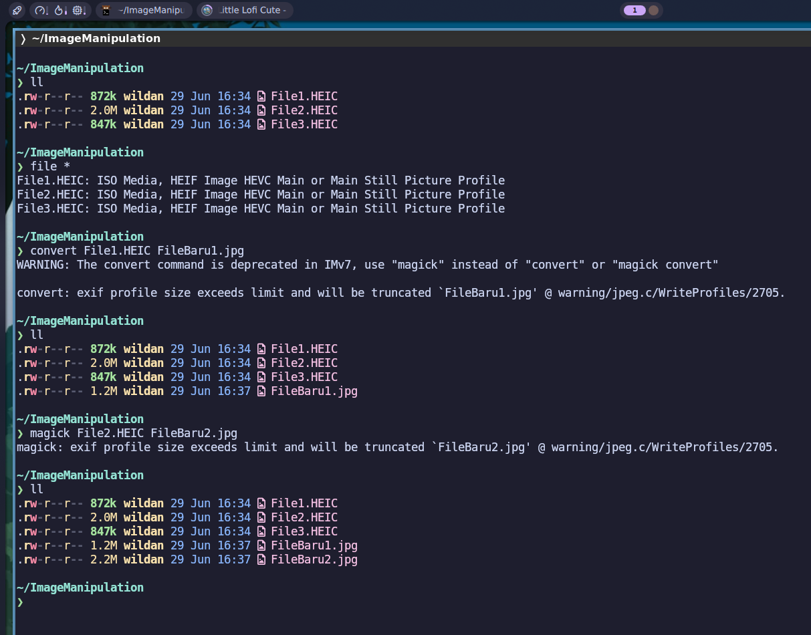
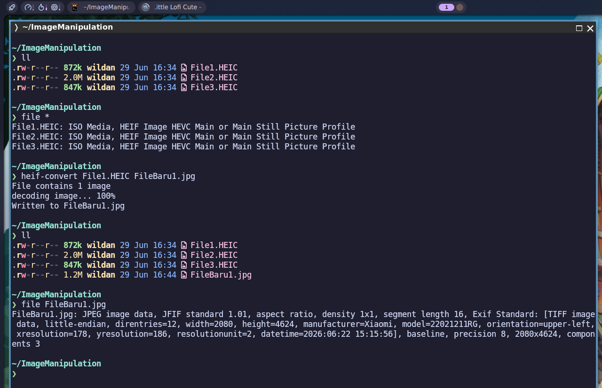
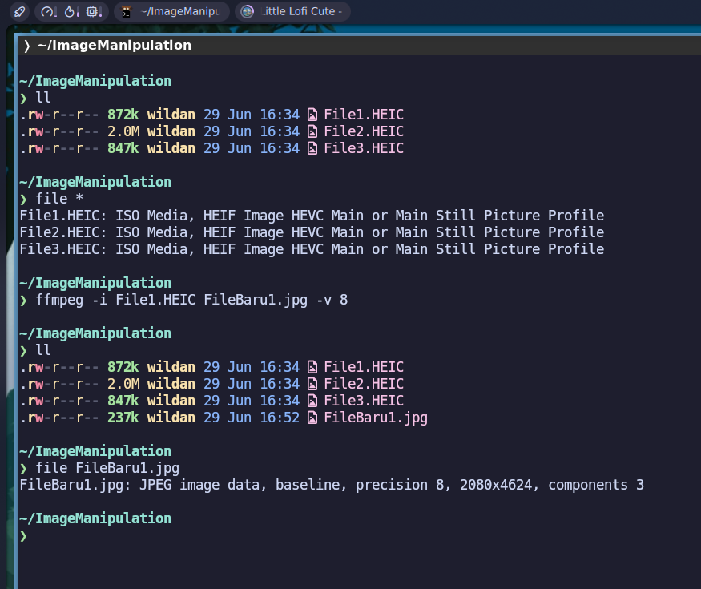
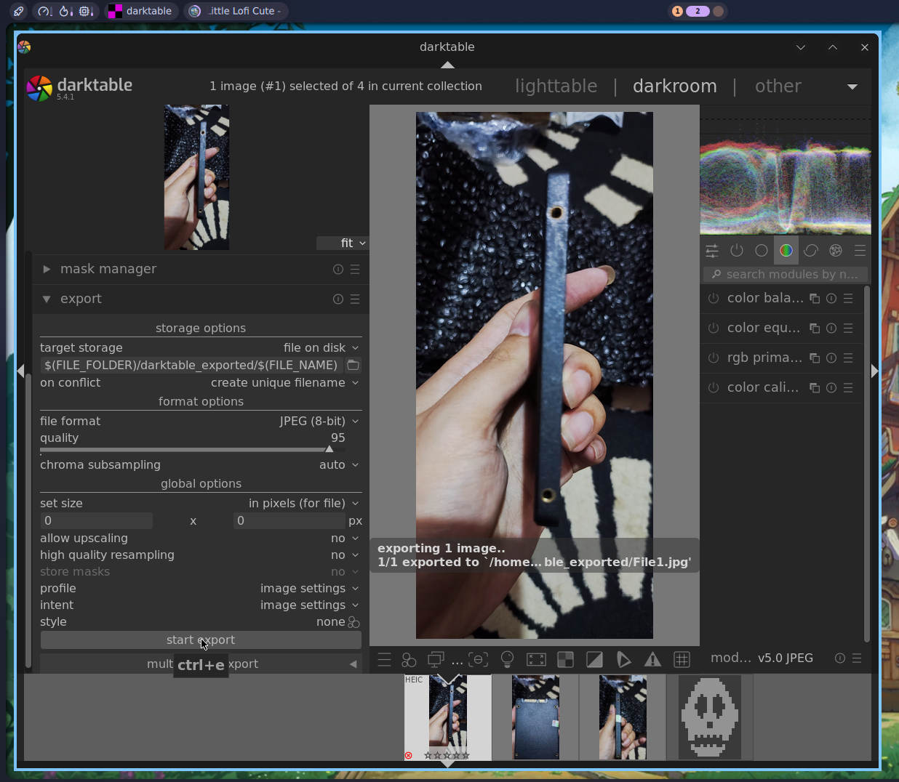

## Preface

Mengapa saya (perlu) membuat artikel ini? Selain karena ini adalah blog saya (jadi suka-suka saya mau menulis tentang apa), alasan utamanya adalah karena saya terkadang menemukan foto atau gambar dengan format yang tidak / belum di-_support_ di banyak tempat. Akibatnya, sebelum dapat meng-_upload_ atau membuka file berekstensi "aneh" tersebut, saya seringkali terpaksa harus mengubahnya terlebih dahulu ke format yang lebih familiar, seperti JPG/JPEG/PNG. Sebut saja format gambar anomali itu `.HEIC`/`.HEIF`, yang sebetulnya lumrah dijumpai di ekosistem buah-buahan (Apple).

Nah, supaya saya tidak perlu terlalu repot mencari _tools_ _open source_ untuk menjinakkan format file tersebut, saya akan dokumentasikan saja beberapa hasil pencarian (dan juga penggunaan) _tools_ yang sudah saya buktikan sangat ampuh dan efektif. Tujuan tersiernya adalah agar (semoga) juga bisa bermanfaat lebih banyak untuk kalian, para pembaca yang budiman.

> **Notes:**
>> Untuk kalian yang berpikir, "kenapa tidak di-rename saja dari .HEIC/.HEIF ke format yang diinginkan? Misalnya **Gambar.heic** ke **Gambar.jpg**?" Saya beritahu, format file dan ekstensi file adalah dua hal yang berbeda. Memang, di Windows, sebuah file dibaca dari ekstensinya saja (itulah kenapa Windows aneh), sementara di Linux, file dibaca dari format file atau **file signature** yang tersimpan di metadatanya.
>>
>> Agar lebih jelas, boleh baca-baca artikel saya berikut ini:
>>
>> [[filesig]]

:::warning

**DISCLAIMER!**

Artikel ini sepenuhnya merujuk pada [**Antrophic Claude**](https://claude.ai/), sebuah AI (_Artificial Intelligence_) yang sedang naik daun saat artikel ini ditulis.

:::

## Installation

5 _tools_ yang akan dibahas pada artikel ini:[^1]
1. `imagemagick`: CLI _tool_ serbaguna yang mendukung ratusan format gambar.
2. `libheif`/`heif-convert`: Library khusus untuk format HEIC/HEIF. 
3. `ffmpeg`: Lebih banyak digunakan untuk video, tapi gambar juga bisa.
4. `darktable` (GUI).
5. `rawtherapee` (GUI).

Berikut adalah cara meng-_install_ `imagemagick`, `libheif`, `ffmpeg`, dan `darktable`, serta `rawtherapee`. di beberapa sistem operasi UNIX/Linux:

|       Distro      |                  Command          |
|       ---         |                   ---             |
| **Debian/Ubuntu** | **`sudo apt install imagemagick libheif-dev ffmpeg darktable rawtherapee`**     |
| **Arch Linux**    | **`sudo pacman -Sy imagemagick libheif ffmpeg darktable rawtherapee`**         |
| **Fedora**        | **`sudo dnf install imagemagick libheif ffmpeg-free darktable rawtherapee`**   |
| **Opensuse**      | **`sudo zypper install imagemagick libheif ffmpeg darktable rawtherapee`**     |
| **FreeBSD**       | **`sudo pkg install imagemagick libheif ffmpeg darktable rawtherapee`**        |

:::note

**NixOS:**  
Masukkan baris berikut di file konfigurasi (`/etc/nixos/configuration.nix`):

```nix
  environment.systemPackages = [
    pkgs.imagemagick
    pkgs.libheif
    pkgs.ffmpeg
    pkgs.darktable
    pkgs.rawtherapee
  ];
```

Atau jika menggunakan `nix-shell`:

```shell
nix-shell -p imagemagick libheif ffmpeg darktable rawtherapee
```

:::

## Usage

Demonstrasi penggunaan kelima _tools_ tersebut.

### 1. `imagemagick`

::github{repo="imagemagick/imagemagick"}

Kita dapat langsung mengkonversi file melalui terminal, karena `imagemagick` adalah aplikasi berbasis CLI (_Command Line Interface_).

```shell
# Perintah lama 
convert File1.HEIC FileBaru1.jpg

# Perintah baru
magick File1.HEIC FileBaru1.jpg
```



### 2. `libheif`

::github{repo="strukturag/libheif"}

Sebagai library, `libheif` atau `libheif-dev` memang dibuat khusus untuk menangani file .HEIC/.HEIF. Sama seperti `imagemagick`, _tool_ ini berbasis CLI. 

```shell
heif-convert File1.HEIC FileBaru.jpg
```



### 3. `ffmpeg`

::github{repo="ffmpeg/ffmpeg"}

Ya! Kalian gak salah lihat. Ini adalah `ffmpeg` sebuah program pamungkas di urusan video yang rupanya juga bisa meng-`handle` file gambar. `ffmpeg` adalah aplikasi berbasis CLI juga, seperti dua _tools_ sebelumnya.

```shell
ffmpeg -i File1.HEIC FileBaru1.jpg -v 8
```

Keterangan:  
`-v 8`: jangan tampilkan log apapun (mode senyap).



### 4. `darktable`

::github{repo="darktable-org/darktable"}

Sedikit berbeda dengan ketiga _tools_ sebelumnya, `darktable` adalah software berbasis GUI (_Graphical User Interface_) sehingga lebih _user-friendly_ untuk pemula maupun profesional.



### 5. `rawtherapee`

::github{repo="RawTherapee/RawTherapee"}

`rawtherapee` adalah _tool_ GUI lain lain (yang juga _open source_) yang dapat kita gunakan untuk melakukan manipulasi format file gambar, terutama jika kita ingin mengkonversinya dari format .HEIC/.HEIF.

:::note

Menyusul.

:::

Terima kasih sudah mampir!


[^1]: https://claude.ai/share/51069e71-cecb-40b3-9f9c-d98c57731abb


